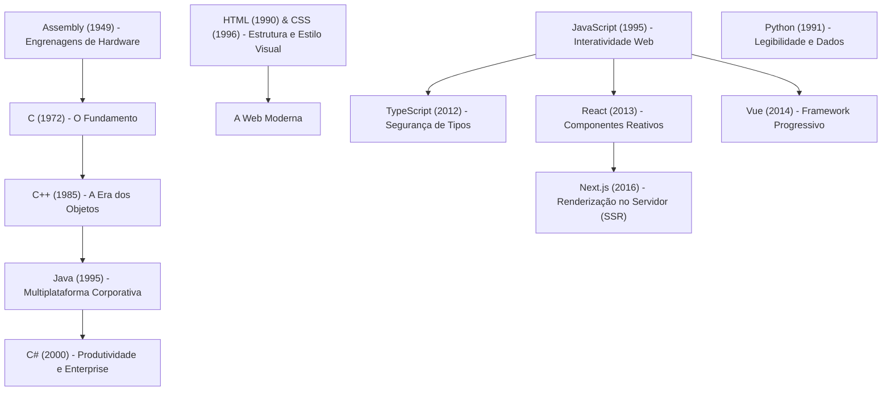

# A evolução da programação: a grande árvore genealógica da tecnologia

Para entender o ecossistema de desenvolvimento moderno, precisamos enxergar a programação como uma evolução contínua de ferramentas. Cada tecnologia surgiu para resolver uma limitação ou simplificar o trabalho da geração anterior, de forma muito parecida com a evolução das ferramentas de design (da pintura em tela para o Photoshop, e deste para o Figma).

---

## O mapa da evolução da programação

---

## 1 - Assembly: as engrenagens de hardware (1949)
*   **O que resolveu:** Antes do Assembly, programar significava alterar fisicamente cabos e chaves de computadores gigantescos ou escrever cartões perfurados em código binário puro (zeros e uns). O Assembly traduziu os comandos de máquina para palavras abreviadas legíveis por humanos (como `ADD` ou `MOV`).
*   **Analogia de Design:** É como construir uma tela de interface manipulando diretamente a voltagem física e a matriz de luz de cada pixel individual do monitor.

## 2 - c: o grande fundador (1972)
*   **O que resolveu:** O Assembly era extremamente trabalhoso e funcionava apenas para um modelo específico de processador. C surgiu como uma linguagem universal de alto nível, permitindo escrever códigos muito mais abstratos e fáceis de ler, que podiam ser compilados para rodar em qualquer computador.
*   **Analogia de Design:** É o equivalente a criar um software de desenho vetorial no computador, automatizando a tarefa de renderizar curvas e formas matemáticas em vez de pintar pixel por pixel à mão.

## 3 - C++: a era dos objetos (1985)
*   **O que resolveu:** Com o crescimento dos sistemas (como softwares de texto e jogos), organizar milhares de linhas de código linear em C ficou inviável. C++ introduziu a Programação Orientada a [[javascript/02-funcoes-e-objetos/03-Objetos\|Objetos]] ([[javascript/06-arquitetura-e-avancado/01-Programação orientada a objetos\|POO]]), permitindo agrupar características e ações dentro de "[[javascript/02-funcoes-e-objetos/03-Objetos\|Objetos]]" reutilizáveis.
*   **Analogia de Design:** É o momento em que os softwares de design começaram a permitir que você criasse Componentes (gabaritos reutilizáveis) em vez de desenhar elementos idênticos soltos na tela repetidas vezes.

## 4 - HTML (1990) & CSS (1996): a fachada visual da web
*   **O que resolveram:** O HTML surgiu para estruturar documentos de texto com links navegáveis (hipertexto) no navegador. O CSS surgiu logo em seguida para separar a estrutura do design visual, permitindo alterar fontes, cores e alinhamentos de uma página inteira em um arquivo separado.
*   **Analogia de Design:** O HTML é a estrutura de camadas e caixas de texto invisíveis do Figma; o CSS é o preenchimento (Fill), bordas (Stroke), efeitos de sombra e propriedades de Auto Layout que embelezam essa estrutura.

## 5 - Python: a simplicidade e os dados (1991)
*   **O que resolveu:** Linguagens como C++ exigiam regras de escrita extremamente complexas, cheias de chaves, parênteses e gerenciamentos de memória complicados. Guido van Rossum criou o [[python/Introdução ao Python\|Python]] com o objetivo de ter uma linguagem limpa, focada em legibilidade, que parece escrita em inglês comum.
*   **Analogia de Design:** É como desenhar interfaces usando um grid ultra simplificado e limpo: você foca puramente no alinhamento e no conteúdo, sem precisar configurar propriedades ocultas complexas.

## 6 - Java: multiplataforma corporativa (1995)
*   **O que resolveu:** Antes do Java, um programa compilado para Windows não rodava em computadores Mac ou Linux sem ser reescrito. Java trouxe o lema "Escreva uma vez, rode em qualquer lugar" através da Máquina Virtual Java (JVM), que traduzia o código para qualquer sistema operacional em tempo real.
*   **Analogia de Design:** É como exportar um arquivo em formato PDF vetorial universal: você sabe que ele será aberto e visualizado exatamente da mesma forma em qualquer computador, celular ou tablet.

## 7 - JavaScript: a vida na web (1995)
*   **O que resolveu:** Páginas web eram estáticas. O [[javascript/Introdução ao JavaScript\|JavaScript]] foi criado às pressas em 10 dias por Brendan Eich para dar vida aos sites diretamente no navegador, permitindo criar interações simples (como modais, menus suspensos ou validação de formulários).
*   *Nota Histórica:* O nome [[javascript/Introdução ao JavaScript\|JavaScript]] foi uma jogada de marketing para pegar carona na fama do Java da época, embora as linguagens funcionem de formas totalmente diferentes.
*   **Analogia de Design:** É a chegada da ferramenta de Prototipagem ativa. O layout estático ganha transições, cliques, estados de hover e animações.

## 8 - C#: a produtividade corporativa da microsoft (2000)
*   **O que resolveu:** Para competir com o Java e evitar as falhas de segurança de memória comuns no C++, a Microsoft criou o C#. Ele foi desenhado para ser o ápice da produtividade para criar softwares corporativos gigantes com segurança robusta e alto desempenho.
*   **Analogia de Design:** É como trabalhar dentro do pacote Adobe completo: um ambiente corporativo ultra profissional, integrado, rígido em suas especificações e seguro para grandes projetos de escala internacional.

## 9 - TypeScript: o design system rígido (2012)
*   **O que resolveu:** O [[javascript/Introdução ao JavaScript\|JavaScript]] cresceu tanto que passou a gerenciar sistemas inteiros de escala industrial. A ausência de regras rígidas de tipagem causava bugs frequentes de lógica. O [[javascript/06-arquitetura-e-avancado/08-TypeScript introdução\|TypeScript]] adicionou Tipagem Estática sobre o [[javascript/Introdução ao JavaScript\|JavaScript]].
*   **Analogia de Design:** É a criação de um **Design System rigoroso**. Você não pode simplesmente arrastar qualquer botão e aplicar qualquer cor à mão livre: o software bloqueia a ação e te força a usar as propriedades e variantes exatas permitidas pelo sistema.

## 10 - React (2013) & Vue (2014): os componentes reativos
*   **O que resolveram:** Atualizar o HTML de forma manual através do [[javascript/Introdução ao JavaScript\|JavaScript]] tradicional ([[javascript/04-dom-e-browser/01-DOM\|DOM]]) se tornou muito lento para aplicativos complexos como feeds de redes sociais. [[react/Introdução ao React\|React]] (do Facebook) e Vue surgiram trazendo a arquitetura baseada em Componentes Reativos que se atualizam automaticamente em lote conforme os dados mudam.
*   **Analogia de Design:** É o motor de componentes masters e instâncias do Figma. Em vez de abrir 50 telas para alterar a foto do avatar do usuário, você altera o componente master ou atualiza a variável global de imagem, e o sistema atualiza todas as instâncias instantaneamente na tela.

## 11 - Next.js: o servidor inteligente (2016)
*   **O que resolveu:** Aplicativos [[react/Introdução ao React\|React]] comuns demoram alguns segundos carregando uma tela branca para o usuário final enquanto montam a interface no navegador (Client-Side Rendering), o que é terrível para indexação em mecanismos de busca (SEO). O Next.js trouxe o **Server-Side Rendering (SSR)**, entregando as páginas já prontas direto do servidor para o navegador.
*   **Analogia de Design:** Em vez de enviar o arquivo de projeto bruto do Figma aberto com todas as camadas dinâmicas para o navegador do cliente renderizar na hora, o Next.js exporta as telas estáticas em arquivos leves pré-montados para exibição imediata, ativando as ações interativas de fundo logo em seguida.

---

## Resumo da árvore genealógica da programação

*   **Linguagens de Máquina e Sistema (Assembly, C, C++):** Focadas no controle máximo do hardware e velocidade.
*   **Linguagens Corporativas e Multiplataforma (Java, C#):** Focadas na segurança, portabilidade e organização empresarial.
*   **Linguagens e Estruturas Web (HTML, CSS, JS, TS, [[react/Introdução ao React\|React]], Vue, Next.js):** Focadas em dinamismo, interfaces ricas em componentes, otimização de renderização e interatividade com o usuário.
