```mermaid
flowchart LR
    classDef core fill:#24141c,stroke:#ffb6c1,stroke-width:2.2px;
    classDef component fill:#1e2229,stroke:#475569,stroke-width:1.5px;
    classDef warning fill:#2d1f06,stroke:#f59e0b,stroke-width:2px;

    subgraph MERGE["Merge Tradicional (Preserva ramos)"]
        M1["Commit A"]:::component --> M2["Commit B"]:::component
        M1 --> F1["Feature 1"]:::core
        F1 --> F2["Feature 2"]:::core
        M2 --> MM["Commit de Merge"]:::warning
        F2 --> MM
    end

    subgraph REBASE["Rebase (Histórico Linear)"]
        R1["Commit A"]:::component --> R2["Commit B"]:::component
        R2 --> RF1["Feature 1'"]:::core
        RF1 --> RF2["Feature 2'"]:::core
    end
```

# Guia exaustivo de comandos Git e prevenção de riscos

O **[[git/01-fundamentos/Git|Git]]** é um sistema distribuído de controle de versão projetado para rastrear o histórico de arquivos em código e design, registrar marcos de evolução e permitir colaboração simultânea sem perda de trabalho.

> **Contexto:** Guia exaustivo e operacional de comandos Git para o dia a dia e cenários avançados. Apresenta desde os fluxos fundamentais até manipulações profundas da árvore de objetos (`commit`, `tree`, `blob`), destacando explicitamente comandos com risco de perda de dados ou que não realizam versionamento permanente.

---

## 1. O modelo mental do Git (Feynman)

Para dominar qualquer comando do Git sem decorar fórmulas cegas, você precisa visualizar as **quatro zonas de trabalho** por onde seus arquivos transitam:

```mermaid
flowchart TD
    classDef core fill:#24141c,stroke:#ffb6c1,stroke-width:2.2px;
    classDef component fill:#1e2229,stroke:#475569,stroke-width:1.5px;
    classDef data fill:#0d291e,stroke:#10b981,stroke-width:1.8px;
    classDef warning fill:#2d1f06,stroke:#f59e0b,stroke-width:2px;
    classDef external fill:#14161a,stroke:#64748b,stroke-width:1.5px,stroke-dasharray:4 3;

    A["1. Diretório de trabalho<br>(Working Directory)<br>Seus arquivos na pasta"]:::component
    B["2. Área de preparação<br>(Staging / Index)<br>A bancada de fotos"]:::core
    C["3. Repositório local<br>(Local Repository .git)<br>O cofre no seu disco"]:::data
    D["4. Repositório remoto<br>(Remote / GitHub)<br>O backup na nuvem"]:::external
    E["Área de espera temporária<br>(Git Stash)<br>A gaveta de rascunhos"]:::warning

    A -->|"git add"| B
    B -->|"git commit"| C
    C -->|"git push"| D
    D -->|"git fetch / pull"| A
    A -->|"git stash"| E
    E -->|"git stash pop"| A
```



### A analogia da sessão fotográfica (Figma / Estúdio de Design)

1. **Diretório de trabalho (*Working directory*):** É a sua mesa de trabalho bagunçada no Figma ou no editor de código. Os arquivos estão sendo editados livremente, mas nada está protegido ou salvo no histórico ainda.
2. **Área de preparação (*Staging Area / Index*):** É a bancada de um estúdio fotográfico. Você escolhe quais alterações específicas quer colocar sob as luzes da câmera (`git add`). O que não estiver na bancada não entra no retrato.
3. **Repositório local (*Local Repository / .git*):** É o álbum de fotos impresso e trancado no cofre da sua casa (`git commit`). O snapshot foi registrado de forma imutável com um identificador criptográfico único (hash SHA-1).
4. **Repositório remoto (*Remote / GitHub*):** É a galeria em nuvem (`git push`). O cofre local é sincronizado com servidores externos para que colegas de equipe acessem e você tenha redundância geográfica de backup.
5. **A gaveta temporária (*Git Stash*):** É uma gaveta de rascunhos. Você precisa pausar um trabalho incompleto para consertar um bug urgente sem criar um commit bagunçado.

---

## 2. Mapa de severidade e comandos perigosos

Nem todo comando Git é seguro. No Git existem operações puramente de **leitura**, operações de **adição e gravação cumulativa** (onde nada se perde) e operações **destrutivas** (onde arquivos e alterações não commitadas são eliminados permanentemente do disco).

| Nível de risco | Característica operacional | Exemplo de comandos | Ação recomendada |
| :--- | :--- | :--- | :--- |
| **Verde (Seguro)** | Leitura, inspeção ou gravação cumulativa que cria novos nós na árvore. | `git status`, `git log`, `git diff`, `git add`, `git commit` | Uso livre e contínuo. |
| **Amarelo (Atenção)** | Modifica o ponteiro do branch ou afeta o histórico local sem apagar código imediatamente. | `git reset --soft`, `git checkout <branch>`, `git stash`, `git merge` | Verificar `git status` antes de rodar. |
| **Vermelho (Destrutivo / Crítico)** | Descarta alterações não commitadas ou reescreve histórico remoto de forma irreversível. | `git reset --hard`, `git clean -fd`, `git restore .`, `git push --force` | Jamais rodar com alterações pendentes não salvas no stash ou commit. |

> [!CAUTION] Alerta: comandos que não fazem versionamento e causam perda definitiva
> * `git restore .` e `git checkout -- <arquivo>`: descartam todas as modificações no diretório de trabalho desde o último commit. **O que não foi commitado ou colocado em stash é perdido para sempre**.
> * `git clean -fd`: remove arquivos novos não rastreados (*untracked*) e pastas inteiras do disco. Não vão para a lixeira do sistema operacional.
> * `git reset --hard HEAD~1`: retrocede o ponteiro e descarta tanto o commit quanto todas as alterações de código associadas a ele na sua máquina.
> * `git push --force` (`-f`): sobrescreve o histórico do servidor remoto com o seu branch local. Se um colega tiver enviado commits anteriores a você, o Git apagará o trabalho dele da nuvem.

---

## 3. Comandos de configuração e identidade

Antes de iniciar qualquer versionamento, configure a assinatura do autor que acompanhará cada commit:

```bash
# Configuração global de identidade (gravada em ~/.gitconfig)
git config --global user.name "Seu Nome"
git config --global user.email "seu.email@exemplo.com"

# Definir o nome padrão do branch principal como main
git config --global init.defaultBranch main

# Configurar quebras de linha para evitar conflitos multiplataforma (Mac/Linux vs Windows)
git config --global core.autocrlf input     # Mac e Linux
# git config --global core.autocrlf true    # Windows

# Listar todas as configurações ativas com origem do arquivo
git config --list --show-origin
```

---

## 4. Inicialização e conexão de repositórios

```bash
# Inicia um novo repositório Git local dentro da pasta atual
git init

# Clona um repositório remoto completo com todo o histórico e branches
git clone https://github.com/usuario/repositorio.git

# Clona em uma pasta com nome customizado
git clone https://github.com/usuario/repositorio.git nome-da-pasta

# Clonagem superficial (apenas o último commit, ideal para downloads rápidos de repositórios gigantes)
git clone --depth 1 https://github.com/usuario/repositorio.git

# Exibe os repositórios remotos configurados e suas URLs de fetch e push
git remote -v

# Conecta o repositório local a um repositório remoto (ex: GitHub)
git remote add origin https://github.com/usuario/repositorio.git

# Renomeia um remote existente
git remote rename origin upstream

# Altera a URL de um repositório remoto
git remote set-url origin https://github.com/novo-usuario/repositorio.git

# Remove o vínculo com um remote
git remote remove origin
```

---

## 5. Inspeção de estado e histórico

Comandos seguros de somente leitura para auditar o que está acontecendo:

```bash
# Mostra o estado dos arquivos (modificados, em staging, não rastreados)
git status

# Status compacto e objetivo (ideal para terminais rápidos)
git status -s

# Histórico completo de commits com autor, data e mensagens
git log

# Histórico formatado em uma única linha compacta por commit
git log --oneline

# Histórico visual desenhando grafo ASCII das ramificações e merges
git log --graph --oneline --all --decorate

# Exibe os últimos N commits com resumo das estatísticas de linhas alteradas
git log -n 5 --stat

# Mostra o histórico de alterações que afetaram uma função ou arquivo específico
git log -p caminho/do/arquivo.js

# Compara as alterações do diretório de trabalho contra a área de preparação (staging)
git diff

# Compara o que já está na área de preparação (staging) contra o último commit
git diff --staged

# Compara as diferenças entre dois commits ou branches específicos
git diff main feature/nova-tela

# Exibe os detalhes, metadados e diff de um commit específico
git show <hash-do-commit>
```

---

## 6. O ciclo de vida do commit (preparação e gravação)

```bash
# Adiciona um arquivo específico à área de preparação (staging)
git add caminho/do/arquivo.js

# Adiciona todos os arquivos modificados, novos e deletados na raiz
git add .

# Adiciona interativamente por partes/pedaços (hunks), permitindo escolher linha por linha
git add -p

# Grava o commit com mensagem explicativa
git commit -m "feat: implementar autenticação com token JWT"

# Atalho para adicionar arquivos já rastreados e commitar no mesmo comando (NÃO adiciona arquivos novos)
git commit -am "fix: corrigir alinhamento de card"

# Adiciona alterações pendentes ao commit imediatamente anterior sem criar novo nó no log
# (Útil para corrigir pequenos esquecimentos e erros de digitação na mensagem)
git commit --amend -m "feat: implementar autenticação JWT e validação de sessão"

# Cria um commit vazio (útil para disparar pipelines de CI/CD ou marcar marcos)
git commit --allow-empty -m "chore: disparar novo build no deploy"
```

> [!WARNING] Atenção ao `git commit --amend`
> Nunca utilize `git commit --amend` em commits que já foram enviados (`push`) para um repositório compartilhado com outros desenvolvedores, pois ele altera o hash do commit e reescreve o histórico.

---

## 7. Ramificação, fluxo de trabalho e alternância (`branch` e `switch`)

```bash
# Lista todos os branches locais
git branch

# Lista todos os branches locais e remotos
git branch -a

# Cria um novo branch a partir do ponto atual
git branch feature/filtro-pesquisa

# Renomeia o branch atual
git branch -m novo-nome-do-branch

# Deleta um branch local que já foi mergeado com segurança
git branch -d feature/filtro-pesquisa

# Força a exclusão de um branch local mesmo que ele possua commits não mergeados
# (Cuidado: alterações desse branch podem ser perdidas se não houver referência ativa)
git branch -D feature/experimento-falho

# Deleta um branch remoto no GitHub
git push origin --delete feature/filtro-pesquisa

# Alterna para um branch existente (sintaxe moderna recomendada)
git switch feature/filtro-pesquisa

# Cria e alterna imediatamente para o novo branch
git switch -c feature/nova-interface

# Comando legado para alternar ou criar branch
git checkout -b feature/nova-interface
```

---

## 8. Integração de código (`merge`, `rebase` e `cherry-pick`)

```bash
# 1. MERGE: funde o branch especificado no branch em que você está atualmente
# Cria um commit de mesclagem mantendo o histórico de ramificação real
git switch main
git merge feature/filtro-pesquisa

# Força a criação de um commit de merge mesmo em situações de fast-forward
git merge --no-ff feature/filtro-pesquisa

# Aborta um merge em caso de conflitos insolúveis, voltando ao estado anterior
git merge --abort

# 2. REBASE: reaplica seus commits no topo da ponta atual de outro branch
# Cria um histórico linear limpo, sem commits extras de merge
git switch feature/filtro-pesquisa
git rebase main

# Continua o processo de rebase após resolver os conflitos manualmente
git rebase --continue

# Aborta o rebase e volta ao estado anterior
git rebase --abort

# Rebase interativo para reorganizar, fundir (squash) ou renomear os últimos 3 commits
git rebase -i HEAD~3

# 3. CHERRY-PICK: copia um commit isolado de qualquer branch e o aplica no branch atual
git cherry-pick <hash-do-commit>
```



---

## 9. Sincronização com repositórios remotos

```bash
# Baixa todos os branches e objetos do remoto para seu cache local SEM alterar seus arquivos de trabalho
git fetch origin

# Baixa metadados e remove referências locais de branches que já foram apagados no remoto
git fetch --prune

# Baixa e funde as alterações do branch remoto no seu branch atual (combina fetch + merge)
git pull origin main

# Baixa as alterações do remoto aplicando rebase em vez de merge (mantém seu branch linear)
git pull --rebase origin main

# Envia seus commits locais para o servidor remoto
git push origin main

# Envia o branch atual definindo o rastreamento automático upstream (-u) para pulls futuros rápidos
git push -u origin feature/nova-interface

# Envia tags criadas localmente para o remoto
git push origin --tags

# ATENÇÃO CRÍTICA: Força o push sobrescrevendo o repositório remoto
# NUNCA use em branches compartilhados (main/develop)
git push --force

# Alternativa mais segura ao push forçado: só sobrescreve se ninguém tiver enviado commits depois de você
git push --force-with-lease
```

---

## 10. Desfazendo alterações, reversão e recuperação

Esta é a área onde mais ocorrem dúvidas e erros acidentais. Escolha o comando exato de acordo com a sua intenção:

```bash
# 1. RETIRAR ARQUIVOS DA ÁREA DE PREPARAÇÃO (STAGING) SEM PERDER CÓDIGO
# Tira o arquivo da bancada fotográfica e o mantém editado na sua mesa de trabalho
git restore --staged caminho/do/arquivo.js
# Forma equivalente com reset:
git reset HEAD caminho/do/arquivo.js

# 2. DESCARTAR MODIFICAÇÕES NO DIRETÓRIO DE TRABALHO (DESTRUTIVO)
# Restaura o arquivo para a versão exata do último commit (descarta edições não salvas)
git restore caminho/do/arquivo.js
# Restaura TODOS os arquivos modificados da pasta atual (CUIDADO: perde edições)
git restore .

# 3. REVERSÃO SEGURA VIA NOVO COMMIT (RECOMENDADO PARA TRABALHO EM EQUIPE)
# Gera um NOVO commit que faz exatamente o inverso das mudanças do commit indicado
git revert <hash-do-commit>

# 4. RESET LOCAL (VOLTANDO O PONTEIRO NO TEMPO)
# Soft: move o ponteiro para trás, mas MANTÉM todas as suas alterações em staging
git reset --soft HEAD~1

# Mixed (padrão): move o ponteiro e mantém as alterações no seu disco, fora de staging
git reset HEAD~1

# Hard (DESTRUTIVO TOTAL): move o ponteiro e APAGA todas as alterações da sua máquina
# O código modificado que não foi commitado é eliminado permanentemente
git reset --hard HEAD~1

# 5. O SALVA-VIDAS DO GIT (REFLOG)
# O diário secreto do Git: registra cada movimento do ponteiro HEAD no seu computador,
# permitindo recuperar até mesmo commits perdidos após um reset --hard acidental
git reflog

# Recuperando um commit após reset acidental:
git reset --hard HEAD@{2}
```

---

## 11. O guarda-volumes temporário (`git stash`)

Quando você está no meio de um desenvolvimento e precisa urgentemente alternar de branch sem commitar código incompleto:

```bash
# Guarda todas as alterações rastreadas modificadas na gaveta de rascunhos
git stash

# Guarda alterações com uma mensagem descritiva para identificação fácil
git stash save "wip: filtros de tabela quase prontos"

# Guarda também arquivos novos não rastreados (-u / --include-untracked)
git stash -u

# Lista todos os rascunhos guardados na gaveta
git stash list

# Restaura o último rascunho da gaveta e o remove da pilha
git stash pop

# Aplica o último rascunho mantendo uma cópia salva na gaveta
git stash apply

# Aplica um rascunho específico da lista
git stash apply stash@{2}

# Descarta o rascunho mais recente sem aplicar
git stash drop

# Limpa toda a gaveta de rascunhos
git stash clear
```

---

## 12. Limpeza de arquivos não rastreados (`git clean`)

```bash
# Simulação segura: lista quais arquivos seriam deletados sem apagar nada
git clean -n

# Remove permanentemente todos os arquivos não rastreados do disco (DESTRUTIVO)
git clean -f

# Remove arquivos não rastreados e também diretórios inteiros não rastreados (-d)
git clean -fd

# Remove inclusive arquivos ignorados pelo .gitignore (ex: build, dist, .DS_Store)
git clean -fdx
```

---

## 13. Tags e versionamento semântico

```bash
# Lista todas as tags/versões existentes
git tag

# Cria uma tag leve no commit atual
git tag v1.0.0

# Cria uma tag anotada oficial com mensagem, autor e data (recomendada para releases)
git tag -a v1.0.0 -m "release: versão inicial de produção 1.0.0"

# Cria uma tag associada a um commit passado específico
git tag -a v0.9.0 <hash-do-commit> -m "release: versão beta"

# Exibe os dados e metadados de uma tag específica
git show v1.0.0

# Deleta uma tag local
git tag -d v1.0.0

# Deleta uma tag remota no servidor
git push origin --delete v1.0.0
```

---

## 14. Diagnóstico de bugs e autoria (`blame` e `bisect`)

```bash
# Mostra quem alterou cada linha de um arquivo, em qual commit e em qual data
git blame caminho/do/arquivo.js

# Exibe o blame restringindo a um intervalo específico de linhas
git blame -L 40,80 caminho/do/arquivo.js

# BUSCA BINÁRIA DE BUGS (BISECT)
# Localiza automaticamente qual commit introduziu um erro no projeto
git bisect start

# Informa que a versão atual está quebrada
git bisect bad

# Informa um commit ou tag anterior onde você sabia que tudo funcionava perfeitamente
git bisect good v1.0.0

# O Git navega automaticamente no meio do histórico para você testar. Você responde:
git bisect good   # se este commit estiver funcionando
git bisect bad    # se este commit já apresentar o bug

# Finaliza a sessão de bisect e retorna ao seu branch de origem
git bisect reset
```

---

## 15. Tabela comparativa e guia de prevenção de erros

| Objetivo pretendido | Comando seguro e recomendado | Comando que requer cautela | Risco de perda permanente? |
| :--- | :--- | :--- | :--- |
| **Pausar trabalho temporário** | `git stash -u` | `git reset --hard` | Sim, se usar reset. Stash preserva tudo. |
| **Desfazer o último commit** | `git reset --soft HEAD~1` | `git reset --hard HEAD~1` | Com `--hard`, sim. Com `--soft`, zero perda. |
| **Desfazer commit já enviado ao GitHub** | `git revert <hash>` | `git reset HEAD~1 && git push -f` | O push forçado quebra o repositório dos colegas. |
| **Limpar arquivos novos/lixo de build** | `git clean -n` (simular primeiro) | `git clean -fd` | Sim, remove do disco sem passar pela lixeira. |
| **Atualizar branch com novidades da equipe** | `git pull --rebase origin main` | `git reset --hard origin/main` | O reset hard sobrescreve seu trabalho local não enviado. |
| **Descartar alterações de um arquivo** | Salvar cópia manual ou `git stash` | `git restore <arquivo>` | Sim, não há lixeira para alterações não commitadas. |

---

## Resumo para memorizar

* **Comandos cumulativos não apagam dados:** `git add`, `git commit`, `git stash` e `git branch` apenas acrescentam dados à árvore de objetos do Git.
* **Comandos com flags `--hard`, `-f`, `-D` e `clean` são destrutivos:** sempre execute um `git status` e verifique se há trabalho pendente antes de acioná-los.
* **O `reflog` é a rede de segurança:** se você rodou acidentalmente um `git reset --hard` e perdeu commits locais, consulte `git reflog` para encontrar o hash anterior e restaurá-lo com segurança.
* **Em branches remotos compartilhados:** prefira `git revert` em vez de `git reset` seguido de `git push --force`.
