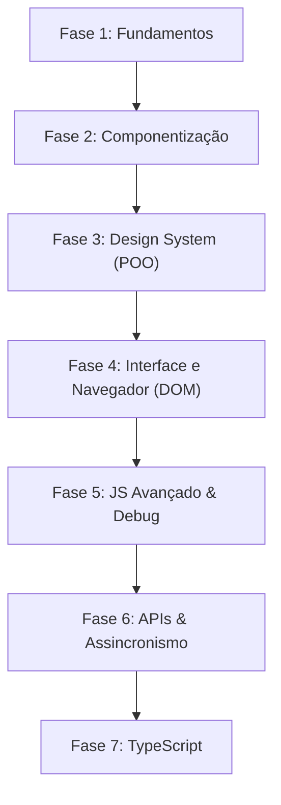

# Guia de estudos de JavaScript - trilha Feynman para designers

Este guia organiza todas as notas do seu vault em uma **sequência lógica de leitura**, permitindo que você aprenda [[javascript/Introdução ao JavaScript\|JavaScript]] passo a passo usando analogias visuais baseadas no Figma e na sua mentalidade de Designer.

---

## Mapa de leitura

---

## Sequência de leitura das notas

### Fase 1: os fundamentos primitivos (o "Figma básico")
Nesta fase, você vai aprender a guardar informações e entender como o computador faz cálculos e toma decisões.
* [[javascript/Introdução ao JavaScript|Introdução ao JavaScript]] - A visão geral do que é a linguagem.
* [[javascript/01-fundamentos/01-Var, let e const|Var, Let e Const]] - Como funcionam os "estilos de cores/textos" do código para reutilizar valores.
* [[javascript/01-fundamentos/02-Console.log|Console.log]] - A telemetria do seu código (painel de instrumentos).
* [[javascript/01-fundamentos/03-Tipos de dados|Tipos de dados]] - Os inputs permitidos (Strings, Numbers, Booleanos, Symbols).
* [[javascript/03-manipulacao/01-Template strings|Template Strings]] - A criação de textos dinâmicos de maneira simples (como Text Variables).
* [[javascript/01-fundamentos/04-Operadores e operações|Operadores e Operações]] - Fazendo contas de layout e testes lógicos (se A for verdade, faça B).
* [[javascript/01-fundamentos/05-Condicionais (if-else)|Condicionais (If-Else)]] - A tomada de decisões no código (regras condicionais de receitas).
* [[javascript/01-fundamentos/06-Switch|Switch]]- O desvio de fluxo em canais de triagem (braços mecânicos e desvios).
* [[javascript/01-fundamentos/07-Truthy e falsy|Truthy e Falsy]] - A triagem burocrática dos valores equivalentes a verdadeiro e falso.
* [[javascript/01-fundamentos/08-Hoisting|Hoisting]] - Como a ordem de leitura do [[javascript/Introdução ao JavaScript\|JavaScript]] funciona.

---

### Fase 2: componentização básica (criando elementos reutilizáveis)
Começando a agrupar propriedades e a automatizar comportamentos e modificações de dados.
* [[javascript/02-funcoes-e-objetos/01-Funções|Funções]] - Suas ações interativas (o motor das suas interações).
* [[javascript/02-funcoes-e-objetos/02-Arrow functions|Arrow Functions]] - A escrita moderna e simplificada (o freelancer terceirizado).
* [[javascript/02-funcoes-e-objetos/03-Objetos|Objetos]] - A ficha de especificações (propriedades) de um componente.
* [[javascript/03-manipulacao/02-Arrays e métodos de array|Arrays e métodos de array]] - Como alterar propriedades de vários itens de uma vez (Map e Filter).

---

### Fase 3: organização avançada (o design system - poo)
Como organizar o código usando o paradigma mais forte do desenvolvimento, baseado em modelos e instâncias de componentes.
* [[javascript/02-funcoes-e-objetos/06-Funções construtoras|Funções Construtoras]] - A maneira clássica de criar moldes de [[javascript/02-funcoes-e-objetos/03-Objetos\|Objetos]].
* [[javascript/02-funcoes-e-objetos/09-Classes|Classes]] - O equivalente moderno aos Componentes Master no Figma.
* [[javascript/02-funcoes-e-objetos/10-Get e set|Get e Set]] - Controlando e travando propriedades de componentes.
* [[javascript/06-arquitetura-e-avancado/01-Programação orientada a objetos|Programação orientada a objetos]] - O ecossistema completo e seus 4 pilares explicados.

---

### Fase 4: o navegador e interatividade (tornando o protótipo vivo)
Hora de conectar a lógica do [[javascript/Introdução ao JavaScript\|JavaScript]] com elementos visuais da tela de um site real.
* [[javascript/04-dom-e-browser/01-DOM|DOM]] - A árvore de camadas (Layers panel) da sua interface web.
* [[javascript/04-dom-e-browser/03-O objeto window|O objeto window]] - O complexo de janelas do navegador (métodos e escopo global).
* [[javascript/06-arquitetura-e-avancado/02-Node.js|Node.js]] - A anatomia de cada camada individual do site.
* [[javascript/04-dom-e-browser/04-Eventos|Eventos]] - Triggers de prototipagem (On Click, On Hover) capturados por Event Listeners.
* [[javascript/04-dom-e-browser/05-O console do navegador|O console do navegador]] - A central de comando em tempo real para executar código e alterar páginas ao vivo.
* [[javascript/04-dom-e-browser/06-Animações com scroll|Animações com Scroll]] - Efeitos visuais disparados pelo movimento de rolagem da página (como Intersection Observer e Parallax).

---

### Fase 5: js avançado & resolução de problemas
Como o [[javascript/06-arquitetura-e-avancado/03-Escopo e closures\|Escopo e Closures]] protege as variáveis, atalhos de código para agilizar a criação, e como consertar erros.
* [[javascript/06-arquitetura-e-avancado/03-Escopo e closures|Escopo e closures]] - Onde as variáveis podem ou não ser vistas.
* [[javascript/06-arquitetura-e-avancado/04-Desestruturação e spread|Desestruturação e spread]] - Atalhos rápidos para destrinchar e duplicar [[javascript/02-funcoes-e-objetos/03-Objetos\|Objetos]]/arrays.
* [[javascript/03-manipulacao/07-Regex|Regex]] - Os filtros inteligentes de texto (gabarito e descriptografia).
* [[javascript/06-arquitetura-e-avancado/05-Módulos import e export|Módulos import e export]] - Como quebrar o código em múltiplos arquivos e componentes separados.
* [[javascript/01-fundamentos/10-Debug (depuração)|Debug (Depuração)]] - O modo de inspeção frame a frame para arrumar o que quebrou.
* [[javascript/06-arquitetura-e-avancado/06-Tratamento de erros|Tratamento de erros]] - Mecanismos de segurança para o site não cair se algo der errado.

---

### Fase 6: APIs e assincronismo (integrações reais de dados)
Como carregar dados dinâmicos da internet (como a previsão do tempo ou lista de produtos) sem travar a tela do usuário.
* [[javascript/03-manipulacao/08-JSON|JSON]] - O formato padrão universal de transporte de textos e dados.
* [[javascript/05-assincrono/02-API|API]] - A ponte de comunicação com serviços externos.
* [[javascript/05-assincrono/03-Fetch|Fetch]] - O carteiro do JS que vai buscar as informações das [[javascript/05-assincrono/02-API\|API]].
* [[javascript/05-assincrono/04-Async await|Async Await]] - Lógica assíncrona ("espere carregar antes de mostrar").
* [[javascript/06-arquitetura-e-avancado/07-Event loop e call stack|Event loop e call stack]] - Como o JS gerencia essa fila de tarefas paralelas.
* [[javascript/04-dom-e-browser/07-Local storage|Local Storage]] - Salvando dados no navegador do usuário (como preferência de Tema Escuro).

---

### Fase 7: segurança de tipo no front-end
O próximo passo lógico para criar projetos consistentes e sem bugs de desenvolvimento.
* [[javascript/06-arquitetura-e-avancado/08-TypeScript introdução|TypeScript introdução]] - O "design system rígido" que impede você de usar componentes de forma errada no código.
