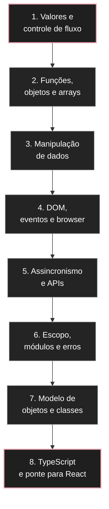
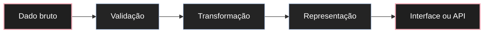
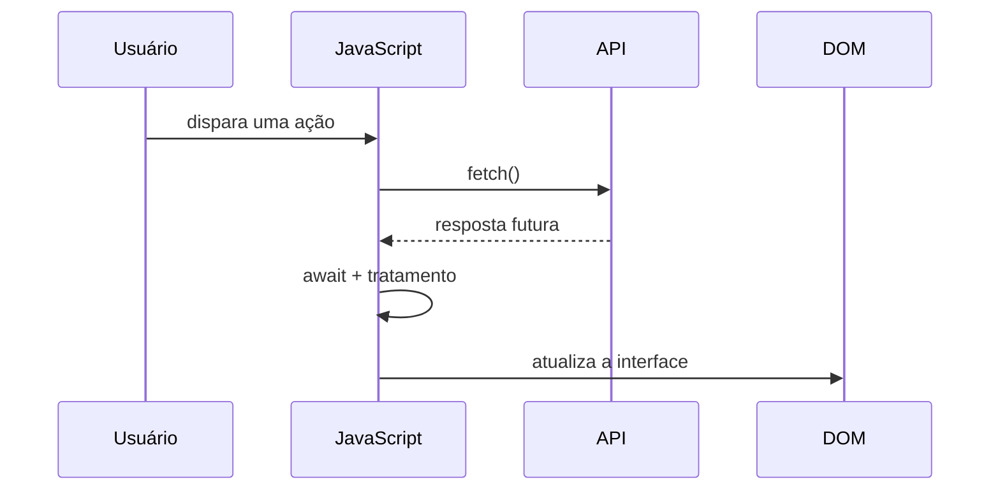
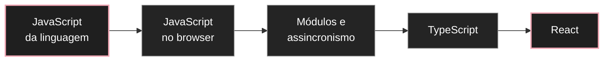

# Guia de estudos de JavaScript

Esta trilha organiza o aprendizado de [[javascript/Introdução ao JavaScript|JavaScript]] do fundamento até a arquitetura, priorizando compreensão conceitual, prática real de interface e conexões com design, produto e navegador.

A lógica pedagógica é simples: primeiro entender **valores e decisões**, depois **funções e estruturas de dados**, então **DOM e eventos**, em seguida **assincronismo**, e só depois aprofundar **arquitetura, modelo de objetos e TypeScript**. A ordem do vault não precisa ser a ordem da aprendizagem.

---

## 1. Mapa mental da trilha



A pergunta central que acompanha toda a trilha é: **como um valor entra no programa, é transformado, produz uma decisão e finalmente altera alguma coisa observável na interface?**

---

## 2. Vocabulário mínimo antes de começar

Você não precisa dominar tudo antecipadamente. Basta reconhecer estas ideias:

* **Valor**: uma informação concreta, como `"Léo"`, `42` ou `true`.
* **Variável**: um nome que referencia um valor.
* **Expressão**: um trecho de código que produz um valor.
* **Estado**: informação que pode mudar durante a execução.
* **Função**: uma transformação ou ação reutilizável.
* **Objeto**: conjunto de propriedades e comportamentos relacionados.
* **Array**: coleção ordenada de valores.
* **Evento**: algo que aconteceu e pode disparar uma reação.
* **DOM**: representação em árvore da página HTML que o JavaScript consegue consultar e modificar.
* **Callback**: função entregue a outra função para ser executada depois.
* **Promise**: representação de um resultado que ainda pode chegar no futuro.
* **Escopo**: região do programa em que um nome pode ser acessado.

Ao encontrar um termo estranho, volte ao conceito imediatamente anterior e tente explicar a relação em uma frase. A trilha deve formar uma cadeia de dependências, não uma coleção de definições soltas.

---

## 3. Bloco 1 — valores, expressões e controle de fluxo

O primeiro bloco responde: **com que tipos de informação o programa trabalha e como ele toma decisões?**

Ordem recomendada:

* [[javascript/Introdução ao JavaScript|Introdução ao JavaScript]] — visão geral da linguagem e de onde ela executa.
* [[javascript/01-fundamentos/01-Var, let e const|Var, let e const]] — nomes, referências e mutabilidade.
* [[javascript/01-fundamentos/02-Console.log|Console.log]] — observar o programa antes de tentar controlá-lo.
* [[javascript/01-fundamentos/03-Tipos de dados|Tipos de dados]] — reconhecer a natureza dos valores.
* [[javascript/01-fundamentos/04-Operadores e operações|Operadores e operações]] — produzir novos valores e comparações.
* [[javascript/01-fundamentos/05-Condicionais (if-else)|Condicionais]] — transformar comparações em decisões.
* [[javascript/01-fundamentos/06-Switch|Switch]] — escolher entre múltiplos caminhos discretos.
* [[javascript/01-fundamentos/07-Truthy e falsy|Truthy e falsy]] — entender como valores participam de decisões booleanas.
* [[javascript/01-fundamentos/09-Estruturas de repetição (for e while)|Estruturas de repetição]] — repetir regras sobre uma sequência de estados.
* [[javascript/01-fundamentos/08-Hoisting|Hoisting]] — começar a entender como declarações são preparadas antes da execução.
* [[javascript/01-fundamentos/10-Debug (depuração)|Debug]] — inspecionar o fluxo real em vez de adivinhar.

### Modelo mental

Pense em uma interface no Figma com variantes. Um valor descreve o estado atual; uma comparação testa esse estado; uma condicional escolhe qual variante deve aparecer.

```javascript
const usuarioLogado = true;
const tipoDeBotao = usuarioLogado ? "sair" : "entrar";

console.log(tipoDeBotao);
```

Antes de seguir, você deve conseguir explicar por que `usuarioLogado` é um valor, `usuarioLogado ? ...` é uma expressão e `tipoDeBotao` é uma variável que guarda o resultado dessa expressão.

---

## 4. Bloco 2 — funções, objetos e coleções

Agora a pergunta muda para: **como empacotar comportamento e dados para não repetir lógica?**

Ordem recomendada:

* [[javascript/02-funcoes-e-objetos/01-Funções|Funções]] — entrada, transformação e saída.
* [[javascript/02-funcoes-e-objetos/02-Arrow functions|Arrow functions]] — sintaxe moderna e diferenças de comportamento.
* [[javascript/02-funcoes-e-objetos/03-Objetos|Objetos]] — agrupar propriedades relacionadas.
* [[javascript/02-funcoes-e-objetos/04-Dot notation e propriedades|Dot notation e propriedades]] — acessar e alterar partes de um objeto.
* [[javascript/03-manipulacao/02-Arrays e métodos de array|Arrays e métodos de array]] — trabalhar com coleções.
* [[javascript/03-manipulacao/04-O método forEach em detalhes|O método forEach em detalhes]] — percorrer uma coleção por efeito colateral.
* [[javascript/03-manipulacao/01-Template strings|Template strings]] — transformar valores em texto de interface.

### Distinção que precisa ficar clara

Uma função responde principalmente **o que fazer**. Um objeto responde principalmente **quais dados e comportamentos pertencem juntos**. Um array responde **quais itens formam uma coleção ordenada**.

Exemplo de UI:

```javascript
const produtos = [
  { nome: "Caderno", preco: 32 },
  { nome: "Caneta", preco: 8 }
];

const cards = produtos.map((produto) => ({
  titulo: produto.nome,
  legenda: `R$ ${produto.preco}`
}));

console.log(cards);
```

Esse trecho já combina array, objeto, callback, `map()` e template string. É um bom ponto de verificação porque vários conceitos começam a operar juntos.

---

## 5. Bloco 3 — transformação e representação de dados

Este bloco responde: **como transformar informação de uma forma para outra?**

* [[javascript/03-manipulacao/05-Propriedades e métodos de string|Propriedades e métodos de string]] — limpar, buscar e transformar texto.
* [[javascript/03-manipulacao/06-Math|Math]] — operações numéricas utilitárias.
* [[javascript/03-manipulacao/07-Regex|Regex]] — reconhecer padrões em texto.
* [[javascript/03-manipulacao/08-JSON|JSON]] — serializar dados para transporte ou armazenamento.
* [[javascript/03-manipulacao/09-Como converter markdown do obsidian em html|Como converter Markdown do Obsidian em HTML]] — caso real de transformação entre representações.

A analogia de produto aqui é um pipeline de conteúdo: dado bruto entra, uma regra transforma, e uma representação pronta para outra camada sai.



---

## 6. Bloco 4 — DOM, eventos e navegador

Até aqui o JavaScript poderia existir sem uma interface. Agora ele passa a controlar uma página real.

Ordem recomendada:

* [[javascript/04-dom-e-browser/01-DOM|DOM]] — entender a árvore da interface.
* [[javascript/04-dom-e-browser/02-Métodos do objeto document|Métodos do objeto document]] — localizar e manipular elementos.
* [[javascript/04-dom-e-browser/04-Eventos|Eventos]] — reagir a ações do usuário e do navegador.
* [[javascript/conceitos/Ordem de Carregamento do DOM e Script|Ordem de carregamento do DOM e script]] — compreender quando o JavaScript encontra ou não os elementos.
* [[javascript/04-dom-e-browser/03-O objeto window|O objeto window]] — contexto global do navegador.
* [[javascript/04-dom-e-browser/05-O console do navegador|O console do navegador]] — inspeção e experimentação ao vivo.
* [[javascript/04-dom-e-browser/07-Local storage|Local storage]] — persistir pequenos estados no navegador.
* [[javascript/04-dom-e-browser/06-Animações com scroll|Animações com scroll]] — responder à posição e visibilidade dos elementos.
* [[javascript/01. Criando uma Busca Simples no DOM|Criando uma busca simples no DOM]] — mini-projeto que integra seleção, eventos, strings e atualização visual.

### Projeto de checkpoint

Construa mentalmente uma busca de cards:

1. o usuário digita;
2. um evento dispara;
3. o texto é normalizado;
4. o array é filtrado;
5. o DOM é atualizado.

Se você consegue acompanhar onde cada conceito entra nesse fluxo, o bloco está consolidado.

---

## 7. Bloco 5 — assincronismo e APIs

A pergunta agora é: **o que acontece quando o resultado não está disponível imediatamente?**

Ordem recomendada:

* [[javascript/05-assincrono/01-Callbacks|Callbacks]] — função executada em outro momento ou por outra rotina.
* [[javascript/05-assincrono/02-API|API]] — contrato de comunicação entre sistemas.
* [[javascript/03-manipulacao/08-JSON|JSON]] — representação frequente dos dados transportados.
* [[javascript/05-assincrono/03-Fetch|Fetch]] — iniciar uma requisição HTTP no navegador.
* [[javascript/05-assincrono/04-Async await|Async e await]] — escrever fluxo assíncrono com aparência sequencial.
* [[javascript/06-arquitetura-e-avancado/07-Event loop e call stack|Event loop e call stack]] — entender por que o JavaScript consegue coordenar tarefas que terminam em momentos diferentes.
* [[javascript/Consumindo APIs e Fetch|Consumindo APIs e Fetch]] — consolidação prática do bloco.

### Mapa do fluxo assíncrono



Aqui vale separar quatro coisas que costumam se misturar: `fetch()` inicia a requisição; a `Promise` representa o resultado futuro; `await` pausa aquela função assíncrona até o resultado; o event loop coordena quando as continuações podem voltar à pilha de execução.

---

## 8. Bloco 6 — escopo, módulos e robustez

Neste ponto você já consegue construir comportamentos. Agora precisa impedir que o código vire um único bloco difícil de manter.

* [[javascript/06-arquitetura-e-avancado/03-Escopo e closures|Escopo e closures]] — controlar a vida e a visibilidade dos valores.
* [[javascript/06-arquitetura-e-avancado/04-Desestruturação e spread|Desestruturação e spread]] — manipular estruturas sem excesso de código repetitivo.
* [[javascript/06-arquitetura-e-avancado/05-Módulos import e export|Módulos import e export]] — separar responsabilidades por arquivo.
* [[javascript/06-arquitetura-e-avancado/06-Tratamento de erros|Tratamento de erros]] — lidar explicitamente com caminhos de falha.
* [[javascript/06-arquitetura-e-avancado/02-Node.js|Node.js]] — entender que JavaScript também pode executar fora do navegador.

A analogia é um design system bem organizado: cada módulo possui uma responsabilidade clara, expõe uma interface pública e esconde detalhes internos que outras partes não precisam conhecer.

---

## 9. Bloco 7 — modelo de objetos, protótipos e classes

Este bloco deve vir depois de objetos e funções. Classes em JavaScript ficam mais fáceis quando você entende que elas são uma camada de sintaxe sobre o modelo prototipal da linguagem.

Ordem recomendada:

* [[javascript/02-funcoes-e-objetos/05-Entendendo o this|Entendendo o this]] — descobrir de onde vem o contexto de uma chamada.
* [[javascript/02-funcoes-e-objetos/06-Funções construtoras|Funções construtoras]] — criar múltiplos objetos a partir de um padrão.
* [[javascript/02-funcoes-e-objetos/07-Protótipos e proto|Protótipos e proto]] — entender a cadeia de delegação da linguagem.
* [[javascript/02-funcoes-e-objetos/08-Herança e objetos aninhados|Herança e objetos aninhados]] — relações entre estruturas.
* [[javascript/02-funcoes-e-objetos/09-Classes|Classes]] — sintaxe moderna para organizar construtores e métodos.
* [[javascript/02-funcoes-e-objetos/10-Get e set|Get e set]] — controlar leitura e escrita de propriedades.
* [[javascript/06-arquitetura-e-avancado/01-Programação orientada a objetos|Programação orientada a objetos]] — conectar encapsulamento, abstração, herança e polimorfismo sem confundir esses conceitos com a sintaxe `class`.

### Distinção crítica

**Objeto não é classe. Classe não é POO. POO não é o único jeito de organizar JavaScript.**

Você pode criar objetos sem classes, usar classes sem aplicar bem princípios de orientação a objetos e escrever excelentes aplicações JavaScript com composição funcional e módulos.

---

## 10. Bloco 8 — TypeScript e ponte para React

Depois de dominar valores, funções, objetos, arrays, DOM, assincronismo e módulos, a tipagem estática começa a resolver problemas que você já consegue enxergar.

* [[javascript/06-arquitetura-e-avancado/08-TypeScript introdução|Introdução ao TypeScript]] — tipos declarados, contratos e feedback antes da execução.
* [[react/Introdução ao React|Introdução ao React]] — próxima camada para construir interfaces por componentes.

A transição recomendada é:



React não substitui JavaScript. Ele pressupõe JavaScript. Quanto mais claros estiverem arrays, objetos, closures, módulos e assincronismo, menos React parecerá uma coleção de regras arbitrárias.

---

## 11. Pontos de confusão para revisar

Antes de considerar a trilha consolidada, verifique se você consegue explicar sem consultar:

* diferença entre declaração, expressão e valor;
* diferença entre `const` e imutabilidade;
* diferença entre `==` e `===`;
* diferença entre `map()`, `filter()`, `forEach()` e `reduce()`;
* diferença entre função tradicional e arrow function, especialmente em relação a `this`;
* diferença entre objeto, protótipo, construtor e classe;
* diferença entre DOM, HTML e objeto JavaScript;
* diferença entre callback, Promise, `async/await` e event loop;
* diferença entre erro síncrono, rejeição de Promise e erro HTTP;
* diferença entre módulo, pacote, biblioteca e framework;
* diferença entre JavaScript e TypeScript.

Essas distinções são mais importantes do que memorizar sintaxe isolada porque revelam se o modelo mental está correto.

---

## 12. Projetos de consolidação

A trilha fica muito mais forte se cada bloco terminar em um artefato observável.

| Etapa | Projeto | Conceitos integrados |
| --- | --- | --- |
| Fundamentos | Calculadora de orçamento simples | valores, operadores, condicionais, funções |
| Dados | Filtro e ordenação de cards | objetos, arrays, `map`, `filter`, strings |
| DOM | Busca instantânea em uma lista | eventos, seleção DOM, renderização |
| Persistência | Preferência de tema | eventos, DOM, `localStorage` |
| API | Catálogo carregado remotamente | `fetch`, JSON, `async/await`, erros |
| Arquitetura | Separar catálogo em módulos | `import`, `export`, escopo, responsabilidades |
| Tipagem | Tipar o catálogo anterior | TypeScript, contratos, tipos de domínio |
| Ponte para React | Recriar o catálogo em componentes | props, estado, eventos e composição |

A ideia não é construir oito aplicativos grandes. É usar o mesmo domínio de UI e acrescentar uma camada conceitual de cada vez.

---

## 13. Critério de domínio

Você não precisa decorar toda a API da linguagem. Considere um bloco dominado quando consegue:

1. explicar o conceito com suas próprias palavras;
2. prever o resultado de um pequeno trecho de código;
3. escrever um exemplo mínimo sem copiar;
4. identificar onde o conceito aparece em uma interface real;
5. diferenciar o conceito de outros parecidos;
6. depurar um erro simples relacionado a ele.

Se alguma dessas etapas falhar, a lacuna está localizada e pode ser revisada sem voltar ao começo da trilha.

---

## Resumo para memorizar

JavaScript fica mais simples quando você o lê como uma sequência de camadas: **valores → decisões → funções → estruturas de dados → DOM → eventos → assincronismo → módulos → modelo de objetos → tipos → React**.

A sintaxe muda de assunto para assunto, mas o mecanismo permanece: dados entram, alguma regra os transforma e um efeito observável acontece. O objetivo desta trilha é fazer você enxergar esse mecanismo antes de decorar a forma específica de escrevê-lo.