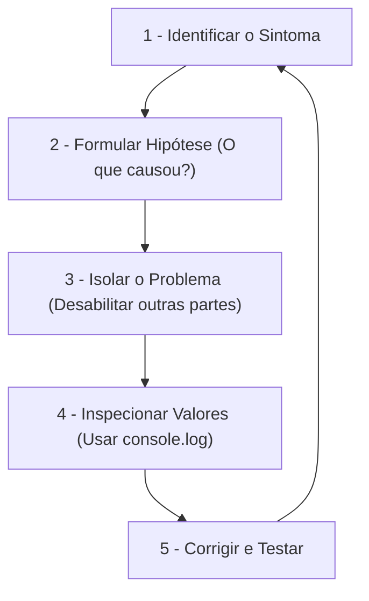

# Debug (depuração) - método Feynman

**Debug** (ou depuração) é o processo de identificar, rastrear e corrigir erros (os chamados *bugs*) no seu código para fazer o programa funcionar exatamente como esperado.

Para um designer, fazer debug é como **investigar um componente quebrado no Figma**. Quando um elemento não se alinha corretamente, você não reconstrói tudo do zero: você inspeciona a árvore de camadas, verifica se as regras de Auto Layout estão em *Hug* ou *Fill*, checa as restrições (constraints) e isola o problema até descobrir qual propriedade está errada.

---

## A origem do termo (curiosidade)
Nos primórdios da computação (década de 1940), os computadores eram máquinas gigantescas. Um dia, um erro ocorreu porque uma **mariposa real** (um inseto, ou *bug* em inglês) ficou presa em um dos relés físicos da máquina. Ao retirarem a mariposa, eles fizeram o primeiro "de-bugging" (literalmente, "desinsetação"). Hoje, qualquer falha no código é um *bug*, e removê-la é fazer *debug*.

---

## Como investigar um bug no código (técnicas)

Assim como no Figma você usa o painel de inspeção e as guias visuais, na programação usamos ferramentas para "enxergar" o que está acontecendo por baixo dos panos:

### 1 - o ___placeholder_2___ (as guias visuais)
*   **O que é:** Uma instrução para imprimir no console do navegador o valor de uma variável ou o resultado de uma operação.
*   **Analogia de Design:** É como desenhar linhas guias temporárias na tela para verificar se um elemento está realmente alinhado com a grade (grid).
*   **Exemplo:**
    ```javascript
    const precoOriginal = 100;
    const desconto = 0.9;
    const precoFinal = precoOriginal * desconto;

    // Queremos ter certeza de que o cálculo deu 90
    console.log("Calculando preço final:", precoFinal);
    ```

### 2 - breakpoints / pontos de parada (pausar o protótipo)
*   **O que é:** Uma ferramenta do navegador (DevTools) que permite pausar a execução do seu código no [[javascript/04-dom-e-browser/01-DOM\|DOM]] ou em uma linha específica para que você possa inspecionar o estado de todas as variáveis naquele exato instante.
*   **Analogia de Design:** É como pausar uma animação de transição do Figma frame a frame para ver exatamente o momento em que um elemento sai do lugar ou some da tela.

### 3 - ler as ___placeholder_4___ (o inspetor de alertas)
O navegador nos diz exatamente onde a lógica falhou. Aprender a ler essas mensagens economiza horas de trabalho:
*   **ReferenceError (Variável não encontrada):** É como tentar usar um componente no Figma que você deletou do arquivo de bibliotecas.
*   **TypeError (Erro de tipo em [[javascript/01-fundamentos/03-Tipos de dados\|Tipos de Dados]]):** É como tentar aplicar uma transição de "clique" em uma imagem estática que não é interativa, ou tentar tratar um texto como se fosse um número em um cálculo.

---

## O fluxo mental para resolver qualquer bug

Quando seu código não funcionar, siga o método científico de design:



---

## Resumo para memorizar

*   **Bug:** Um comportamento indesejado ou erro no código.
*   **Debug:** O trabalho de detetive para achar a causa raiz e resolver o bug.
*   **Console do Navegador:** Sua principal mesa de testes para inspecionar dados vivos enquanto o código roda.
