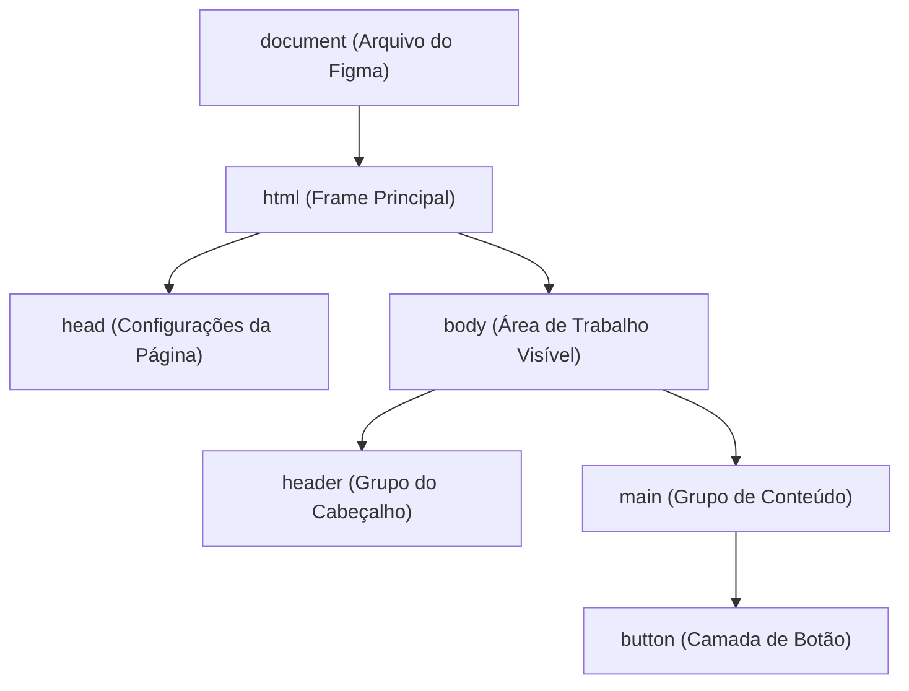

# Entendendo o DOM (document object model) - método Feynman

Para um designer, o DOM não é um conceito novo. Ele é exatamente a mesma estrutura que você usa todos os dias ao abrir um arquivo no Figma ou no Photoshop.

O DOM é o **Painel de Camadas (Layers Panel)** da sua página web.

---

## A analogia do Figma

Quando você desenha um site no Figma, você tem uma estrutura organizada:

*   **O Documento (File):** É o seu arquivo geral do Figma.
*   **O Canvas/Frame Principal:** É a tela do navegador (o elemento body).
*   **Grupos, Auto Layouts e Vetores:** São as divs, seções, textos e imagens do HTML.

No Figma, se você quer mudar a cor de um botão, você:
1. Vai até o painel de camadas à esquerda.
2. Clica no grupo do botão.
3. Altera a cor de preenchimento na barra lateral direita.

No desenvolvimento web, o **DOM** é a árvore de camadas que permite ao [[javascript/Introdução ao JavaScript\|JavaScript]] fazer exatamente isso, mas de forma automatizada por meio de linhas de comando.

---

## Como o JavaScript enxerga o DOM

O navegador lê o seu código HTML e cria um mapa de [[javascript/01-fundamentos/Objetos\|Objetos]] estruturado em árvore. Cada elemento do seu HTML vira um "nó" nessa árvore (veja a nota sobre [[javascript/06-arquitetura-e-avancado/Node.js\|Nodes]]).

Aqui está uma representação simples de como o HTML vira o DOM:



---

## O fluxo de trabalho com JavaScript

Para interagir com qualquer elemento na tela, você sempre segue três passos básicos que equivalem às suas ações no software de design:

### 1. Selecionar o elemento (clicar na camada)
Antes de alterar qualquer coisa, você precisa dizer ao [[javascript/Introdução ao JavaScript\|JavaScript]] qual elemento quer mexer. Para ver todos os métodos de busca disponíveis, consulte a nota exaustiva sobre [[javascript/04-dom-e-browser/Métodos do objeto document\|Métodos do objeto document]].
```javascript
// Clicando na camada que tem a identificação "botao-salvar"
const botao = document.getElementById("botao-salvar");
```

### 2. Alterar propriedades (mudar no painel de propriedades)
Depois de selecionar, você altera as propriedades dele (estilo, texto, tamanho).
```javascript
// Mudando o texto escrito no botão
botao.textContent = "Salvar Alterações";

// Mudando a cor de fundo (equivalente a mudar o Fill no Figma)
botao.style.backgroundColor = "blue";
```

### 3. Ouvir eventos (criar protótipo interativo)
No Figma, você puxa uma seta azul de um botão para outra tela e define "On Click -> Navigate to". No [[javascript/Introdução ao JavaScript\|JavaScript]], você faz a mesma coisa usando escutadores de [[javascript/04-dom-e-browser/Eventos\|eventos]]:
```javascript
// Quando o usuário clicar no botão, execute uma ação
botao.addEventListener("click", function() {
  alert("O botão foi clicado!");
});
```

---

## Resumo para memorizar

*   **DOM (Document Object Model):** É a representação do seu HTML estruturada como uma árvore de camadas interativas.
*   **[[javascript/04-dom-e-browser/Métodos do objeto document\|document]]:** O ponto de partida de tudo (o arquivo aberto e sua biblioteca de métodos).
*   **Elemento/Nó:** Cada caixa, texto ou imagem individual dentro das camadas.
*   **O papel do [[javascript/Introdução ao JavaScript\|JavaScript]]:** É a ferramenta que seleciona e altera essas camadas em tempo real enquanto o usuário navega.
