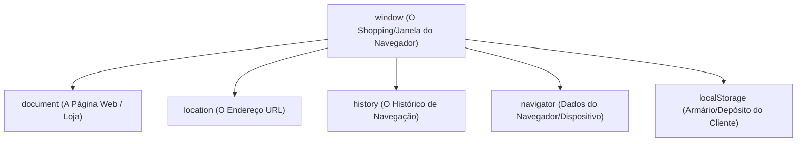

# O objeto window no JavaScript - método Feynman

No desenvolvimento web, o objeto **`window`** é o elemento mais alto na hierarquia do navegador. Ele representa a janela do navegador que contém o documento da página web. Em JavaScript executado no browser, ele é o **objeto global** — o que significa que qualquer variável ou função declarada globalmente torna-se, automaticamente, uma propriedade ou método do `window`.

Sob a perspectiva da **Infraestrutura Urbana**, se o [[javascript/04-dom-e-browser/02-Métodos do objeto document|document]] é o **Gerente de um Prédio**, o `window` é o **Shopping Mall (ou o Complexo Inteiro)** onde esse prédio está inserido.

---

## A analogia do Shopping Mall

Imagine o ecossistema do navegador como um grande complexo de entretenimento e comércio:

*   **O `window` (O Shopping Mall):** Ele engloba tudo. Ele controla as portas de entrada e saída (tamanho da janela), tem a central de segurança (histórico de navegação, localização), o sistema de alto-falantes para anúncios rápidos (`alert`, `prompt`) e a rede elétrica geral.
*   **O `document` (O Prédio/Loja Principal):** É uma loja específica e gigante dentro do shopping. É onde os clientes andam, compram e interagem diretamente com os produtos (os elementos HTML).
*   **O `location` (O Endereço/GPS):** Indica a rua e o número de onde o shopping está localizado no mapa (a URL).
*   **O `history` (O Livro de Visitas):** Registra de onde os visitantes vieram e para onde foram (botões de voltar/avançar).



---

## O que é o Objeto Window?

O `window` tem dupla personalidade em JavaScript no front-end:
1.  **A Janela do Navegador:** Controla dimensões, rolagens, novas abas e diálogos com o usuário.
2.  **O Escopo Global:** Tudo que não está dentro de uma função ou classe no escopo principal do script "flutua" dentro do `window`.
    ```javascript
    var nome = "Antigravity";
    console.log(window.nome); // "Antigravity"
    ```

---

## 1. Métodos de Diálogo e Interação (Alto-falantes do Shopping)

Estes métodos abrem caixas de diálogo simples diretamente na tela do usuário, bloqueando a execução do script até que o usuário responda:

| Método | Descrição | Retorno | Exemplo de Uso |
| :--- | :--- | :--- | :--- |
| **`window.alert(mensagem)`** | Exibe um alerta pop-up simples com uma mensagem e um botão "OK". | `undefined` | `alert('Seu arquivo foi salvo!')` |
| **`window.confirm(mensagem)`** | Exibe uma pergunta com botões "Cancelar" e "OK". | `boolean` (`true`/`false`) | `const prosseguir = confirm('Deseja deletar?')` |
| **`window.prompt(msg, padrao)`** | Exibe um campo de entrada de texto para o usuário digitar algo. | `string` (ou `null`) | `const nome = prompt('Qual seu nome?', 'Visitante')` |

---

## 2. Métodos de Tempo e Agendamento (Relógio do Shopping)

Permitem agendar a execução de tarefas para o futuro (assincronamente):

| Método | Descrição | Retorno | Exemplo de Uso |
| :--- | :--- | :--- | :--- |
| **`window.setTimeout(callback, delay)`** | Executa uma função uma única vez após um atraso (em milissegundos). | ID do Timer (`number`) | `const t = setTimeout(() => {}, 2000)` |
| **`window.clearTimeout(timerId)`** | Cancela um agendamento feito pelo `setTimeout()`. | `undefined` | `clearTimeout(t)` |
| **`window.setInterval(callback, delay)`** | Executa uma função repetidamente a cada intervalo de tempo. | ID do Interval (`number`) | `const i = setInterval(() => {}, 1000)` |
| **`window.clearInterval(intervalId)`** | Cancela a repetição contínua agendada pelo `setInterval()`. | `undefined` | `clearInterval(i)` |
| **`window.requestAnimationFrame(cb)`** | Pede ao navegador para rodar uma animação suave antes do próximo redesenho da tela (altamente otimizado). | ID da Frame (`number`) | `const req = requestAnimationFrame(animar)` |
| **`window.cancelAnimationFrame(frameId)`** | Cancela a requisição de quadro de animação agendada. | `undefined` | `cancelAnimationFrame(req)` |

---

## 3. Métodos de Navegação, Controle de Janelas e Abas (Portarias)

Usados para abrir, fechar e gerenciar janelas auxiliares ou abas:

| Método | Descrição | Retorno | Exemplo de Uso |
| :--- | :--- | :--- | :--- |
| **`window.open(url, target, features)`** | Abre uma nova aba ou janela pop-up com a URL indicada. | Objeto `window` da nova aba | `window.open('https://google.com', '_blank')` |
| **`window.close()`** | Fecha a janela atual (geralmente só funciona em janelas criadas via `window.open`). | `undefined` | `window.close()` |
| **`window.stop()`** | Para o carregamento da página (equivalente ao botão "Parar" do navegador). | `undefined` | `window.stop()` |
| **`window.print()`** | Abre a caixa de diálogo de impressão do sistema operacional para imprimir a página. | `undefined` | `window.print()` |
| **`window.focus()`** | Traz o foco de volta para a janela atual. | `undefined` | `window.focus()` |
| **`window.blur()`** | Remove o foco da janela atual. | `undefined` | `window.blur()` |

---

## 4. Métodos de Dimensões e Rolagem (Geometria do Shopping)

Métodos para mover, redimensionar ou rolar a janela do navegador:

| Método | Descrição | Exemplo de Uso |
| :--- | :--- | :--- |
| **`window.scrollTo(x, y)`** ou `scrollTo(opcoes)` | Rola a página até coordenadas específicas de pixel de forma estática ou suave. | `window.scrollTo({ top: 0, behavior: 'smooth' })` |
| **`window.scrollBy(x, y)`** ou `scrollBy(opcoes)` | Rola a página em relação à posição atual do scroll. | `window.scrollBy(0, 100)` (rola 100px para baixo) |
| **`window.resizeTo(largura, altura)`** | Redimensiona a janela para uma largura e altura absolutas (em pixels). | `window.resizeTo(800, 600)` |
| **`window.resizeBy(x, y)`** | Aumenta ou diminui o tamanho da janela em relação às medidas atuais. | `window.resizeBy(100, -50)` |
| **`window.moveTo(x, y)`** | Move a janela para as coordenadas absolutas `(x, y)` da tela física. | `window.moveTo(0, 0)` |
| **`window.moveBy(x, y)`** | Move a janela na tela física a partir da sua posição atual. | `window.moveBy(10, 50)` |

---

## 5. Métodos Utilitários e APIs Gerais (Serviços do Shopping)

Métodos e APIs que ajudam a ler estilos, codificar dados ou realizar consultas de layout:

| Método | Descrição | Exemplo de Uso |
| :--- | :--- | :--- |
| **`window.getComputedStyle(elemento)`** | Retorna todos os valores de CSS finais aplicados a um elemento, após resolver heranças. | `const estilo = window.getComputedStyle(btn)` |
| **`window.matchMedia(mediaQuery)`** | Permite testar media queries em JavaScript (como detectar se o usuário está no celular ou tema dark). | `const isMobile = window.matchMedia('(max-width: 600px)').matches` |
| **`window.fetch(url, opcoes)`** | Inicia uma requisição de rede para buscar recursos/dados (APIs) externos. *(Geralmente usado apenas como `fetch()`)* | `fetch('/api/dados').then(...)` |
| **`window.postMessage(mensagem, targetOrigin)`** | Envia uma mensagem de dados segura de uma página para outra (como de uma página mãe para um `<iframe>`). | `window.postMessage('Olá frame!', '*')` |
| **`window.atob(textoCodificado)`** | Descodifica uma string de dados que foi codificada usando Base64. | `window.atob('T2zDoQ==')` (retorna "Olá") |
| **`window.btoa(string)`** | Cria uma string Base64 codificada a partir de dados binários/texto. | `window.btoa('Olá')` (retorna "T2zDoQ==") |
| **`window.queueMicrotask(funcao)`** | Enfileira uma microtarefa de alta prioridade na fila de execução do JavaScript. | `queueMicrotask(() => console.log('Roda rápido'))` |

---

## 6. Métodos Avançados, APIs Modernas e Legados (Exaustivo)

Para cobrir absolutamente todas as ferramentas da caixa de ferramentas do `window`, aqui estão os métodos avançados, experimentais ou de APIs específicas do navegador:

| Método | Descrição | Exemplo de Uso |
| :--- | :--- | :--- |
| **`window.requestIdleCallback(cb, opt)`** | Agenda uma função para rodar em períodos de ociosidade do navegador, sem travar tarefas críticas. | `requestIdleCallback((deadline) => { ... })` |
| **`window.cancelIdleCallback(handle)`** | Cancela um agendamento feito por `requestIdleCallback`. | `cancelIdleCallback(handle)` |
| **`window.structuredClone(valor, opt)`** | Cria uma cópia profunda (deep clone) de objetos e dados de forma nativa e rápida. | `const copia = structuredClone(objetoOriginal)` |
| **`window.reportError(erro)`** | Dispara um erro simulando uma exceção não capturada (útil para reportar erros para bibliotecas de telemetria). | `reportError(new Error('Erro simulado'))` |
| **`window.createImageBitmap(imagem, ...)`** | Cria um bitmap de imagem a partir de diversas origens (como ``, `<canvas>`, `Blob`) de forma assíncrona. | `createImageBitmap(imgBlob).then(bitmap => {})` |
| **`window.showOpenFilePicker(opt)`** | Abre uma janela de seleção de arquivos do sistema para ler arquivos diretamente (API moderna File System). | `showOpenFilePicker()` |
| **`window.showSaveFilePicker(opt)`** | Abre a janela para salvar um arquivo diretamente no computador do usuário. | `showSaveFilePicker()` |
| **`window.showDirectoryPicker(opt)`** | Solicita ao usuário permissão de acesso a um diretório local do computador. | `showDirectoryPicker()` |
| **`window.matchMedia(mediaQuery)`** | Cria um objeto `MediaQueryList` para escutar e testar mudanças de media queries CSS. | `window.matchMedia('(prefers-color-scheme: dark)')` |
| **`window.getSelection()`** | Retorna o texto e os nós atualmente selecionados pelo usuário na tela. | `const selecao = window.getSelection()` |

### Métodos herdados de `EventTarget` (Escuta Global de Eventos)
Como o `window` é um objeto do tipo `EventTarget`, ele também herda estes métodos fundamentais:
*   **`window.addEventListener(tipo, callback, opcoes)`**: Adiciona um escutador de eventos globais (ex: redimensionamento de janela, orientação, scroll).
    ```javascript
    window.addEventListener('resize', () => console.log('Tamanho alterado!'));
    ```
*   **`window.removeEventListener(tipo, callback)`**: Remove o escutador de eventos registrado anteriormente.
*   **`window.dispatchEvent(evento)`**: Dispara um evento customizado no escopo global.

### Métodos Legados, Obsoletos ou Não-Standard
Estes métodos ainda existem por questões de retrocompatibilidade, mas devem ser evitados em novos códigos:
*   **`window.find(texto, caseSensitive, backward, ...)`**: Procura por uma string de texto no documento (semelhante ao Ctrl+F do navegador). *Não recomendado*.
*   **`window.captureEvents(eventFlags)`** e **`window.releaseEvents(eventFlags)`**: Antigo sistema de captura de eventos do Netscape. *Obsoleto*.
*   **`window.dump(mensagem)`**: Imprime uma mensagem no console de depuração do próprio navegador (geralmente desabilitado por padrão).
*   **`window.updateCommands(nome)`**: Método legado específico do Firefox/Gecko para atualizar comandos da UI.

---

## Principais Propriedades do Objeto `window`

O `window` contém propriedades cruciais para ler o estado do navegador e do dispositivo:

| Propriedade | O que acessa? |
| :--- | :--- |
| **`window.innerWidth`** e **`window.innerHeight`** | Retornam a largura e altura da área de conteúdo visível da janela (viewport). |
| **`window.outerWidth`** e **`window.outerHeight`** | Retornam a largura e altura totais da janela do navegador (incluindo abas, barras de rolagem e ferramentas). |
| **`window.scrollX`** e **`window.scrollY`** | Retornam quantos pixels a página já foi rolada horizontalmente e verticalmente. |
| **`window.screen`** | Retorna informações sobre a tela física do usuário (resolução, profundidade de cores). |
| **`window.location`** | Permite ler ou alterar o endereço URL atual da página. |
| **`window.history`** | Permite avançar (`history.forward()`) ou voltar (`history.back()`) na navegação do usuário. |
| **`window.navigator`** | Contém informações sobre o navegador (nome, versão, sistema operacional, permissões de GPS). |
| **`window.localStorage`** | Banco de dados simples chave-valor que armazena dados persistidos no navegador. |
| **`window.sessionStorage`** | Semelhante ao `localStorage`, mas os dados são apagados quando a aba é fechada. |
| **`window.devicePixelRatio`** | Retorna a proporção entre pixels físicos da tela e pixels lógicos (ex: telas Retina retornam `2` ou `3`). |

---

## A diferença crucial: `window` vs. `document`

*   **`window`** é a **moldura/contêiner**: Ele cuida de tudo o que está *fora* da página web em si (abas, histórico, tamanho da tela, temporizadores e requisições HTTP gerais).
*   **`document`** é o **conteúdo**: Ele cuida exclusivamente do que está renderizado *dentro* da página (textos, imagens, inputs, divs, estilização direta dos elementos).
*   **Acesso:** O `document` é, na verdade, uma propriedade de `window` (`window.document`).

---

## Resumo para memorizar

*   **Globalidade:** Você não precisa escrever `window.alert()`, pode escrever apenas `alert()`, pois o `window` é o escopo global implícito.
*   **Dimensões:** Use `innerWidth` para criar lógicas baseadas no tamanho visível da tela do navegador do usuário.
*   **Agendadores:** Dominar `setTimeout` e `setInterval` é essencial para disparar e controlar comportamentos temporizados em interfaces interativas.
