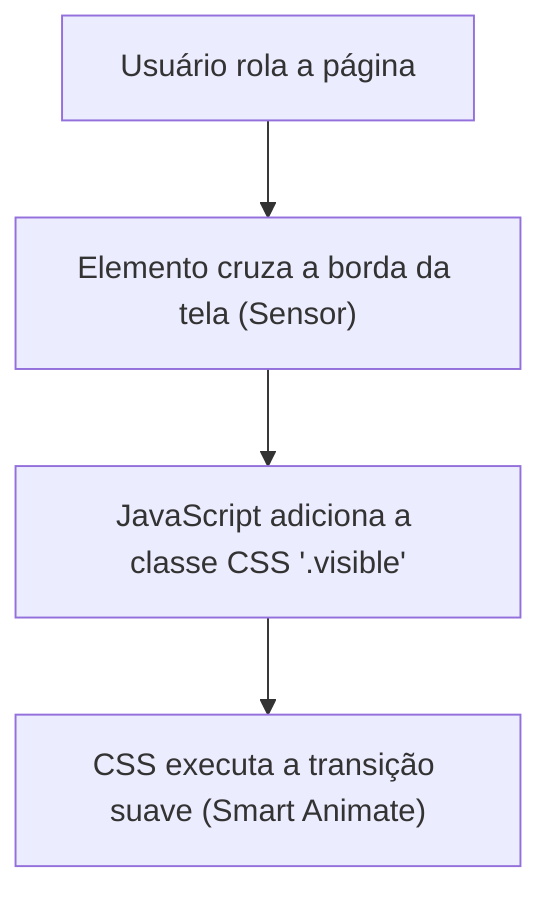

# Animações com scroll - método Feynman

Animações ao scroll são efeitos visuais que acontecem quando o usuário rola a página para baixo ou para cima (elementos surgindo com fade-in, barras de progresso enchendo, efeitos parallax, etc.).

Para um designer, isso é equivalente às interações baseadas em Scroll/Drag com Smart Animate no Figma. É o mapeamento de um movimento de rolagem para uma transição de opacidade, escala ou posição de um elemento.

No desenvolvimento web, o [[javascript/Introdução ao JavaScript\|JavaScript]] funciona como o sensor que detecta os [[javascript/04-dom-e-browser/04-Eventos\|eventos]] de scroll, e o CSS faz o trabalho de animação visual.

---

## Duas formas de fazer isso no JavaScript

### Método 1: o sensor de câmera (intersection observer) — recomendado
Em vez de ficar calculando números matemáticos toda hora, o navegador nos dá uma [[csharp/25-Consumindo APIs em Csharp\|API]] moderna e de altíssima performance chamada Intersection Observer. 
Imagine colocar uma área de colisão invisível na tela do navegador. Sempre que um elemento entra nessa área, um gatilho é disparado.



#### Exemplo prático:

**1. O CSS (O design da transição):**
```css
/* Estado inicial: invisível e deslocado para baixo */
.card-animado {
  opacity: 0;
  transform: translateY(50px);
  transition: all 0.6s ease-out; /* Nosso Smart Animate */
}

/* Estado final: visível e na posição correta */
.card-animado.visible {
  opacity: 1;
  transform: translateY(0);
}
```

**2. O [[javascript/Introdução ao JavaScript\|JavaScript]] (O Sensor):**
```javascript
// Criamos o sensor (observador)
const sensor = new IntersectionObserver((entries) => {
  entries.forEach(entry => {
    // Se o elemento estiver visível na tela
    if (entry.isIntersecting) {
      entry.target.classList.add('visible'); // Adiciona a classe que altera o estado e ativa a animação
    }
  });
}, {
  threshold: 0.1 // Dispara o gatilho quando 10% do elemento aparecer na tela
});

// Selecionamos as camadas que queremos observar e ativamos o sensor nelas
const elementos = document.querySelectorAll('.card-animado');
elementos.forEach(el => sensor.observe(el));
```

---

### Método 2: o cálculo contínuo (mapeamento de coordenadas)
Usado para efeitos mais complexos como Parallax (onde a velocidade de rolagem de um elemento é diferente do resto da página). Aqui, escutamos o [[javascript/04-dom-e-browser/04-Eventos\|Eventos]] de scroll e calculamos a distância exata.

```javascript
window.addEventListener('scroll', () => {
  const distanciaRolada = window.scrollY; // Quantos pixels rolamos para baixo
  
  const imagemBackground = document.querySelector('.hero-bg');
  // Move o fundo mais devagar que o scroll normal (efeito parallax)
  imagemBackground.style.transform = `translateY(${distanciaRolada * 0.5}px)`;
});
```

> [!WARNING]
> Evite colocar muitas [[javascript/02-funcoes-e-objetos/01-Funções\|Funções]] pesadas dentro do [[javascript/04-dom-e-browser/04-Eventos\|Eventos]] de scroll direto (Método 2), pois ele roda dezenas de vezes por segundo e pode deixar o site travado (com lag). Para detectar se elementos apareceram na tela, sempre prefira o Intersection Observer (Método 1).

---

## Resumo para memorizar

*   **Animação ao Scroll:** Uma transição visual controlada pelo movimento da página.
*   **Intersection Observer:** A ferramenta moderna e performática que detecta quando um elemento entra na tela (como um sensor de presença).
*   **Divisão de Tarefas:** O [[javascript/Introdução ao JavaScript\|JavaScript]] apenas adiciona/remove [[javascript/02-funcoes-e-objetos/09-Classes\|Classes]] de controle (ex: .visible), enquanto as transições e movimentações de verdade são feitas no CSS (usando transition e transform).
