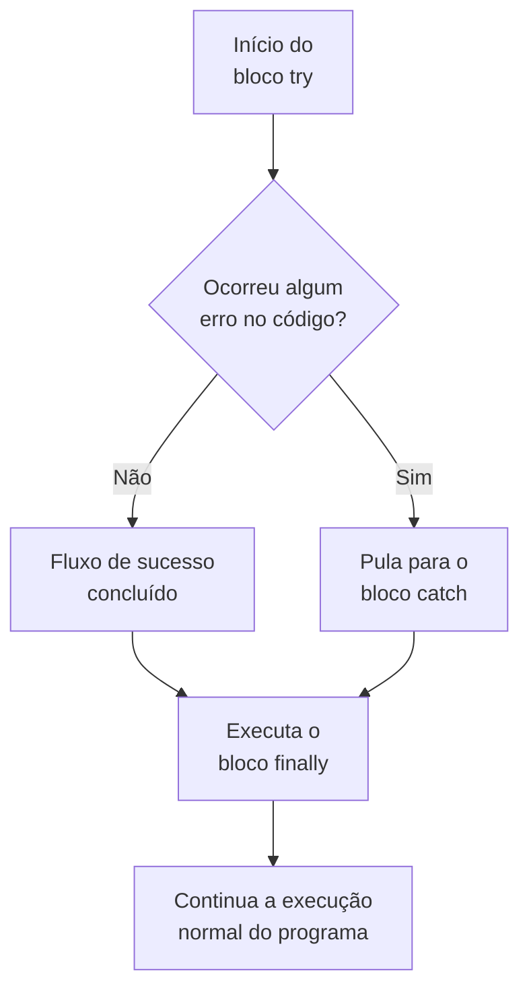

# Tratamento de erros (try, catch e finally)

Em desenvolvimento de software, imprevistos acontecem o tempo todo: a internet cai durante uma requisição, um arquivo não é encontrado no disco ou uma API externa retorna dados fora do padrão. Sem um mecanismo de proteção, qualquer erro encerra a execução do programa e trava a interface do usuário.

A estrutura `try / catch / finally` é a **rede de segurança** do código, garantindo resiliência e continuidade.

---

## Analogia do mundo real: o pagamento por aproximação

Pense na maquininha de cartão de crédito:

* **`try` (Tentar a transação principal)**: Você aproxima o cartão e a máquina tenta processar o pagamento com o banco (fluxo padrão).
* **`catch` (Tratar a recusa/falha)**: Se o banco recusar ou não houver saldo, a máquina não explode nem desliga. Ela captura o erro e avisa na tela: *"Transação não autorizada. Tente outro cartão"*.
* **`finally` (Limpar a mesa e finalizar)**: Dando certo ou dando errado a transação, a máquina **sempre** imprime o comprovante, libera a conexão e volta para a tela inicial para o próximo cliente.



---

## 1. O bloco `try` (tentar)

O `try` delimita o trecho de código onde você vai executar operações que oferecem risco de falha (como fazer um `fetch()`, ler arquivos ou validar entradas complexas do usuário).

```javascript
try {
    const dados = JSON.parse(respostaDoServidor); // Pode falhar se a string não for um JSON válido
    console.log(dados);
}
```

---

## 2. O bloco `catch` (capturar e tratar)

Se qualquer linha dentro do `try` disparar um erro, o [[javascript/Introdução ao JavaScript|JavaScript]] interrompe imediatamente o `try` e pula direto para o bloco `catch(erro)`.

O parâmetro `erro` é um objeto que contém detalhes da falha:
* `erro.message`: Texto descritivo do que aconteceu.
* `erro.name`: Tipo do erro (`TypeError`, `SyntaxError`, `ReferenceError`, etc.).
* `erro.stack`: Rastreamento exato da linha do arquivo onde a falha ocorreu.

```javascript
try {
    const dados = JSON.parse("{ formatoInvalido ");
} catch (erro) {
    console.warn("Falha ao interpretar dados:", erro.message);
    // Exibe um estado de erro amigável na UI em vez de travar o app
}
```

---

## 3. O bloco `finally` (finalizar e limpar)

O `finally` é **opcional**, mas fundamental para ações de limpeza e liberação de recursos. Ele **sempre será executado**, independentemente se o código rodou com sucesso no `try` ou se caiu no `catch`.

Mesmo que haja um `return` dentro do `try` ou do `catch`, o `finally` roda antes de sair da função.

### Quando usar o `finally`:
* Fechar conexões com bancos de dados.
* Desligar spinners/loaders de carregamento na interface (`loading = false`).
* Liberar memória ou fechar streams de arquivos abertos.

---

## Exemplo prático completo em UI (requisição com loader)

Veja como o `try / catch / finally` é aplicado em uma chamada de API assíncrona com estado de carregamento:

```javascript
async function carregarPerfilDoUsuario(usuarioId) {
    const loader = document.getElementById("spinner-loading");
    const container = document.getElementById("perfil-container");

    try {
        // 1. Inicia o feedback visual
        loader.classList.remove("escondido");

        // 2. Tenta buscar os dados na API
        const resposta = await fetch(`https://api.exemplo.com/usuarios/${usuarioId}`);
        
        if (!resposta.ok) {
            throw new Error(`Erro no servidor: Status HTTP ${resposta.status}`);
        }

        const usuario = await resposta.json();
        container.innerHTML = `<h1>${usuario.nome}</h1>`;

    } catch (erro) {
        // 3. Contingência: trata o erro de conexão ou 404/500
        console.error("Falha ao buscar perfil:", erro.message);
        container.innerHTML = `<p class="alerta-erro">Não foi possível carregar o perfil. Tente novamente.</p>`;

    } finally {
        // 4. Limpeza: Oculta o loader OBRIGATORIAMENTE, dando certo ou errado
        loader.classList.add("escondido");
    }
}
```

---

## Lançando erros manualmente com `throw`

Você pode criar seus próprios erros propositalmente quando uma regra de negócio for violada:

```javascript
function debitarSaldo(conta, valor) {
    if (valor <= 0) {
        throw new Error("O valor de débito deve ser maior que zero.");
    }
    if (conta.saldo < valor) {
        throw new Error("Saldo insuficiente para completar a transação.");
    }
    conta.saldo -= valor;
    return conta.saldo;
}
```

---

## Resumo para memorizar

* **`try`**: Coloque o código de risco (o plano principal).
* **`catch`**: Executa **somente se houver erro** para conter danos e mostrar mensagens ao usuário.
* **`finally`**: Executa **sempre** (no sucesso ou na falha), ideal para desativar loaders e liberar recursos.
* **`throw`**: Dispara uma exceção intencional quando uma regra do sistema é violada.
