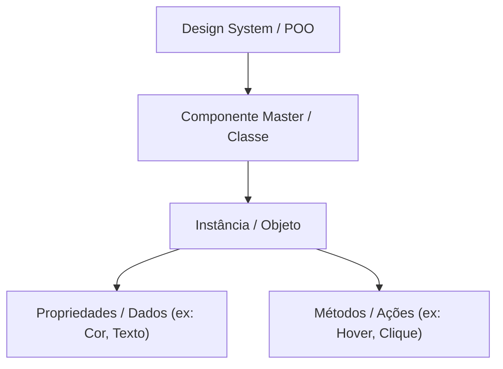

# Programação orientada a objetos (poo) - método Feynman

A **Programação Orientada a [[javascript/01-fundamentos/Objetos\|Objetos]] (POO)** é um paradigma (uma forma de pensar e organizar o código) baseado no conceito de "[[javascript/01-fundamentos/Objetos\|Objetos]]" que contêm dados (propriedades) e ações (métodos). Em [[javascript/Introdução ao JavaScript\|JavaScript]], implementamos esse conceito principalmente usando [[javascript/02-funcoes-e-objetos/Classes|Classes]] (e antigamente com [[javascript/02-funcoes-e-objetos/Funções construtoras|Funções Construtoras]]).

Para um designer, a POO é exatamente como construir e gerenciar um **Design System no Figma**. Em vez de escrever códigos soltos, você agrupa tudo em componentes estruturados que podem ser reutilizados, customizados e combinados.

---

## O paradigma poo como um design system

No desenvolvimento de software tradicional sem POO, as variáveis e [[javascript/01-fundamentos/Funções\|Funções]] ficam espalhadas (código procedural). Com a POO, estruturamos o código em blocos organizados e interconectados:



---

## Os 4 pilares da poo (traduzidos para design)

Para dominar a POO, precisamos entender seus quatro pilares fundamentais. Vamos associar cada um a recursos que você já usa no Figma:

### 1 - abstração (simplificação)
*   **O que é no código:** Isolar apenas os aspectos essenciais de um [[javascript/01-fundamentos/Objetos\|Objetos]], ignorando detalhes complexos que não importam para o usuário daquele [[javascript/01-fundamentos/Objetos\|Objetos]].
*   **Analogia no Figma:** Quando você usa um componente de "Card", você só precisa interagir com as propriedades dele (como título e imagem). Você não precisa ver ou ajustar manualmente cada linha do Auto Layout interno para que ele funcione.
*   **Exemplo Prático:**
    ```javascript
    // Abstraímos um celular apenas com o que o usuário interage
    class Celular {
      ligarTela() { /* código complexo para energizar pixels */ }
      tocarSom() { /* código complexo de áudio */ }
    }
    ```

### 2 - encapsulamento (proteção e organização)
*   **O que é no código:** Esconder os detalhes internos de como o [[javascript/01-fundamentos/Objetos\|Objetos]] funciona e proteger seus dados, expondo apenas o que for estritamente necessário por meio de interfaces controladas (como métodos [[javascript/01-fundamentos/Get e Set\|get e set]]).
*   **Analogia no Figma:** É como bloquear camadas internas de um componente master. O usuário da instância só pode alterar o conteúdo do texto ou a cor do botão através do painel lateral de propriedades (Component Properties), impedindo que ele delete acidentalmente a estrutura do Auto Layout por dentro.
*   **Exemplo Prático:**
    ```javascript
    class ContaBancaria {
      #saldo = 0; // o '#' torna a propriedade privada (encapsulada)

      depositar(valor) {
        if (valor > 0) this.#saldo += valor;
      }
      
      verSaldo() { return this.#saldo; } // Acesso controlado
    }
    ```

### 3 - herança (reutilização de componentes)
*   **O que é no código:** Criar uma classe nova que herda todas as características (propriedades e métodos) de uma classe existente, permitindo reutilizar o código e adicionar particularidades.
*   **Analogia no Figma:** Pense em um "Componente Base". Você cria um componente de botão geral. Depois, você cria um botão específico de "Sucesso" e outro de "Perigo" que herdam a estrutura, o tamanho e o comportamento do botão principal, mudando apenas a cor de fundo.
*   **Exemplo Prático:**
    ```javascript
    class BotaoBase {
      constructor(texto) { this.texto = texto; }
      clicar() { console.log("Clicou no botão: " + this.texto); }
    }

    // BotaoSucesso herda (extends) as propriedades de BotaoBase
    class BotaoSucesso extends BotaoBase {
      constructor(texto) {
        super(texto); // Chama o construtor do BotaoBase
        this.cor = "verde";
      }
    }
    ```

### 4 - polimorfismo (múltiplas formas)
*   **O que é no código:** A capacidade de [[javascript/01-fundamentos/Objetos\|Objetos]] diferentes responderem à mesma mensagem ou método de maneiras diferentes.
*   **Analogia no Figma:** Imagine a ação de "Clique" na prototipagem. Se você clica em um botão "Play", ele toca um vídeo. Se você clica em um botão "Fechar", ele fecha a janela. A ação de entrada é a mesma (um clique), mas a resposta visual (saída) se comporta de maneira diferente baseada no componente.
*   **Exemplo Prático:**
    ```javascript
    class ElementoUI {
      desenhar() { console.log("Desenhando elemento genérico"); }
    }

    class Circulo extends ElementoUI {
      desenhar() { console.log("Desenhando um círculo"); }
    }

    class Retangulo extends ElementoUI {
      desenhar() { console.log("Desenhando um retângulo"); }
    }
    ```

---

## Resumo para memorizar

*   **POO:** Paradigma de organização baseado em componentes dinâmicos ([[javascript/01-fundamentos/Objetos\|Objetos]]) em vez de scripts lineares soltos.
*   **Abstração:** Focar na interface essencial, escondendo a complexidade técnica.
*   **Encapsulamento:** Trancar o interior do componente, permitindo edições apenas pelas propriedades expostas.
*   **Herança:** Criar variações a partir de um componente base (pai e filho).
*   **Polimorfismo:** A mesma ação (ex: clique) com resultados específicos para cada tipo de componente.
