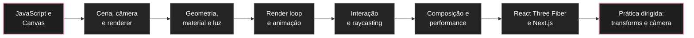

# Guia de estudos de Three.js

Esta trilha introduz [[javascript/07-threejs/01-Three.js e o modelo mental de uma cena 3D|Three.js]] a partir do que já é conhecido de JavaScript, DOM, Canvas e design de interfaces. O objetivo não é decorar a API inteira. É entender o suficiente da arquitetura 3D para conseguir construir, avaliar e dirigir uma cena com intenção.

A pergunta central é: **como uma descrição abstrata de objetos em um espaço tridimensional vira pixels em uma tela 2D?**

A ordem recomendada é:

* [[javascript/07-threejs/01-Three.js e o modelo mental de uma cena 3D|Three.js e o modelo mental de uma cena 3D]]: entender cena, câmera, renderer e objetos.
* [[javascript/07-threejs/02-Cena, câmera, renderer e coordenadas|Cena, câmera, renderer e coordenadas]]: entender onde as coisas existem e como a câmera as enxerga.
* [[javascript/07-threejs/03-Geometria, material, mesh e luz|Geometria, material, mesh e luz]]: separar forma, aparência e iluminação.
* [[javascript/07-threejs/04-Loop de renderização, tempo e animação|Loop de renderização, tempo e animação]]: entender o que realmente acontece a cada frame.
* [[javascript/07-threejs/05-Interação, raycasting e relação com o DOM|Interação, raycasting e relação com o DOM]]: conectar cursor, clique, resize e interface HTML à cena 3D.
* [[javascript/07-threejs/06-Composição visual, performance e diagnóstico de cenas 3D|Composição visual, performance e diagnóstico de cenas 3D]]: separar uma cena tecnicamente correta de uma cena visualmente convincente.
* [[javascript/07-threejs/07-React Three Fiber no Next.js|React Three Fiber no Next.js]]: traduzir o modelo mental de Three.js para componentes React e Next.js.
* [[javascript/07-threejs/08-Ordem prática para dominar Three.js|Ordem prática para dominar Three.js]]: priorizar transformações, espaços local/global, câmera, projeção e exercícios pequenos antes de cenas complexas.

---

## 1. O mapa mental da trilha



Three.js fica muito mais simples quando você percebe que boa parte do trabalho se repete em quatro perguntas:

1. **O que existe na cena?**
2. **Onde cada coisa está?**
3. **De onde estamos olhando?**
4. **Como o renderer transforma isso em pixels?**

---

## 2. O que você precisa saber antes

Não é necessário dominar matemática avançada. Para começar, basta reconhecer:

* objetos e arrays em JavaScript;
* funções e módulos `import` / `export`;
* coordenadas `x`, `y` e `z`;
* eventos do navegador;
* [[javascript/04-dom-e-browser/17-Canvas e gráficos|Canvas e gráficos]];
* `requestAnimationFrame` ou a ideia de executar código repetidamente ao longo do tempo.

Vetores, matrizes, shaders e álgebra linear ficam importantes depois, mas não precisam bloquear a primeira compreensão.

---

## 3. O que Three.js resolve

O navegador já possui APIs gráficas de baixo nível, como WebGL. Elas dão acesso à GPU, mas exigem que você cuide de muitos detalhes técnicos. Three.js cria uma camada mais amigável sobre esse processo.

Em vez de programar diretamente cada etapa gráfica, você trabalha com objetos como:

```javascript
const scene = new THREE.Scene();
const camera = new THREE.PerspectiveCamera();
const geometry = new THREE.BoxGeometry();
const material = new THREE.MeshStandardMaterial();
const mesh = new THREE.Mesh(geometry, material);
```

A ideia é parecida com usar componentes de interface em vez de desenhar cada pixel manualmente.

---

## 4. Critério de domínio

Considere esta trilha consolidada quando você conseguir olhar para uma cena e responder:

* qual é a câmera e qual é seu `fov`;
* onde a câmera está posicionada;
* quais objetos são `Mesh`;
* quais geometrias e materiais formam esses objetos;
* quais luzes realmente afetam os materiais;
* o que está sendo alterado a cada frame;
* se um efeito pertence ao Three.js, ao React Three Fiber ou ao CSS/DOM;
* qual parte provavelmente está deixando a cena pesada;
* por que uma composição parece achatada, genérica ou confusa;
* que mudança deve ser feita sem pedir ao Codex para reconstruir o sistema inteiro.

O objetivo prático é **ganhar capacidade de direção técnica e visual**.

---

## 5. Ordem prática de prioridade

Para cenas com muitas peças, câmera dirigida e animação, a ordem mais eficiente não é começar por shaders ou efeitos avançados.

Priorize:

1. `Object3D`, `Group`, posição, rotação, escala e pivô;
2. `Vector3`, matrizes e conversão entre espaços local e global;
3. câmera, `fov`, perspectiva e projeção em tela;
4. geometria, `BoxGeometry` e depois `BufferGeometry`;
5. React Three Fiber, `useThree`, refs e `useFrame`;
6. animação e interpolação de estados com GSAP;
7. `InstancedMesh` e shaders quando o problema realmente exigir.

A nota [[javascript/07-threejs/08-Ordem prática para dominar Three.js|Ordem prática para dominar Three.js]] transforma essa sequência em exercícios pequenos. A ideia é conseguir prever o comportamento de uma cena antes de tentar resolver composições complexas por tentativa e erro.

---

## 6. O que fica para depois

Depois da base, a trilha pode crescer com artigos específicos sobre:

* carregamento de modelos `glTF`;
* texturas e environment maps;
* shaders e GLSL;
* post-processing;
* instancing;
* partículas;
* curvas e geometrias customizadas;
* WebGPU;
* animações com GSAP;
* integração com ferramentas como Blender e Spline.

Esses assuntos não devem entrar todos de uma vez. Cada um resolve um problema diferente.

---

## Fontes principais

* [Three.js manual](https://threejs.org/manual/)
* [Three.js documentation](https://threejs.org/docs/)
* [Three.js examples](https://threejs.org/examples/)
* [React Three Fiber documentation](https://r3f.docs.pmnd.rs/)

---

## Resumo para memorizar

Three.js não é principalmente uma biblioteca de "efeitos 3D". É uma forma de descrever uma **cena**, posicionar uma **câmera**, criar **objetos** e pedir a um **renderer** que transforme esse estado em pixels. Aprender essa arquitetura primeiro torna animação, interação e React Three Fiber muito menos misteriosos.

Para trabalho aplicado, a prioridade é: **hierarquia e transformações → espaços local/global → câmera e projeção → geometria → React Three Fiber → animação → instancing e shaders**. Resolva os estados estáticos antes de animar a passagem entre eles.