# Guia de estudos de Three.js

Esta trilha introduz [[javascript/07-threejs/01-Three.js e o modelo mental de uma cena 3D|Three.js]] a partir do que já é conhecido de JavaScript, DOM, Canvas e design de interfaces. O objetivo não é decorar a API inteira. É entender o suficiente da arquitetura 3D para conseguir construir, avaliar e dirigir uma cena com intenção.

A pergunta central é: **como uma descrição abstrata de objetos em um espaço tridimensional vira pixels em uma tela 2D?**

A ordem recomendada é:

* [[javascript/07-threejs/01-Three.js e o modelo mental de uma cena 3D|Three.js e o modelo mental de uma cena 3D]]: entender cena, câmera, renderer e objetos.
* [[javascript/07-threejs/02-Cena, câmera, renderer e coordenadas|Cena, câmera, renderer e coordenadas]]: entender onde as coisas existem e como a câmera as enxerga.
* [[javascript/07-threejs/03-Geometria, material, mesh e luz|Geometria, material, mesh e luz]]: separar forma, aparência e iluminação.
* [[javascript/07-threejs/04-Loop de renderização, tempo e animação|Loop de renderização, tempo e animação]]: entender o que realmente acontece a cada frame.
* [[javascript/07-threejs/05-Interação, raycasting e relação com o DOM|Interação, raycasting e relação com o DOM]]: conectar cursor, clique, resize e interface HTML à cena 3D.
* [[javascript/07-threejs/06-Composição visual, performance e diagnóstico de cenas 3D|Composição visual, performance e diagnóstico de cenas 3D]]: separar uma cena tecnicamente correta de uma cena visualmente convincente.
* [[javascript/07-threejs/07-React Three Fiber no Next.js|React Three Fiber no Next.js]]: traduzir o modelo mental de Three.js para componentes React e Next.js.
* [[javascript/07-threejs/08-Ordem prática para dominar Three.js|Ordem prática para dominar Three.js]]: priorizar transformações, espaços local/global, câmera, projeção e exercícios pequenos antes de cenas complexas.
* [[javascript/07-threejs/09-Transformações locais, globais e hierarquia em Three.js|Transformações locais, globais e hierarquia em Three.js]]: dominar `Object3D`, `Group`, pivôs, matrizes e conversões entre espaços.
* [[javascript/07-threejs/10-BufferGeometry e geometria paramétrica em Three.js|BufferGeometry e geometria paramétrica em Three.js]]: construir forma a partir de vértices, índices, atributos e regras geométricas próprias.
* [[javascript/07-threejs/11-InstancedMesh e desenho eficiente de muitas formas|InstancedMesh e desenho eficiente de muitas formas]]: renderizar grandes famílias de objetos repetidos sem multiplicar draw calls desnecessariamente.
* [[javascript/07-threejs/12-Shaders, GLSL e materiais customizados|Shaders, GLSL e materiais customizados]]: entender o que a GPU executa por vértice e por fragmento e quando um material customizado realmente vale a pena.
* [[javascript/07-threejs/13-Câmera, projeção e leitura espacial em Three.js|Câmera, projeção e leitura espacial em Three.js]]: tratar `fov`, distância, alvo, parallax e enquadramento como parte da composição.
* [[javascript/07-threejs/14-GSAP, interpolação de estados e animação dirigida em Three.js|GSAP, interpolação de estados e animação dirigida em Three.js]]: separar estados canônicos, interpolação e controle temporal em sequências complexas.

---

## 1. O mapa mental da trilha

```mermaid
flowchart LR
    A["JavaScript e<br>Canvas"] --> B["Cena, câmera<br>e renderer"]
    B --> C["Geometria,<br>material e luz"]
    C --> D["Render loop<br>e interação"]
    D --> E["Composição e<br>performance"]
    E --> F["React Three Fiber<br>e Next.js"]
    F --> G["Transformações e<br>hierarquia"]
    G --> H["BufferGeometry e<br>geometria paramétrica"]
    H --> I["Instancing e<br>shaders"]
    I --> J["Câmera e<br>projeção"]
    J --> K["GSAP, estados e<br>timing"]

    classDef core fill:#1f1f1f,stroke:#f1a7b5,color:#fff,stroke-width:2px;
    classDef component fill:#242424,stroke:#888,color:#fff;
    class A,K core;
    class B,C,D,E,F,G,H,I,J component;
```



Three.js fica muito mais simples quando você percebe que boa parte do trabalho se repete em quatro perguntas:

1. **O que existe na cena?**
2. **Onde cada coisa está?**
3. **De onde estamos olhando?**
4. **Como o renderer transforma isso em pixels?**

Na parte avançada surge uma quinta pergunta: **como manter identidade, desempenho e intenção visual enquanto tudo isso muda ao longo do tempo?**

---

## 2. O que você precisa saber antes

Não é necessário dominar matemática avançada para começar. Para a base, basta reconhecer:

* objetos e arrays em JavaScript;
* funções e módulos `import` / `export`;
* coordenadas `x`, `y` e `z`;
* eventos do navegador;
* [[javascript/04-dom-e-browser/17-Canvas e gráficos|Canvas e gráficos]];
* `requestAnimationFrame` ou a ideia de executar código repetidamente ao longo do tempo.

Para os artigos 09 a 14, passa a ser importante reconhecer vetores, matrizes, hierarquia de transforms, interpolação e a diferença entre CPU e GPU. Esses conceitos são introduzidos progressivamente dentro da própria trilha.

---

## 3. O que Three.js resolve

O navegador já possui APIs gráficas de baixo nível, como WebGL. Elas dão acesso à GPU, mas exigem que você cuide de muitos detalhes técnicos. Three.js cria uma camada mais amigável sobre esse processo.

Em vez de programar diretamente cada etapa gráfica, você trabalha com objetos como:

```javascript
const scene = new THREE.Scene();
const camera = new THREE.PerspectiveCamera();
const geometry = new THREE.BoxGeometry();
const material = new THREE.MeshStandardMaterial();
const mesh = new THREE.Mesh(geometry, material);
```

A ideia é parecida com usar componentes de interface em vez de desenhar cada pixel manualmente. Nos níveis avançados, você começa a atravessar essa abstração quando precisa controlar topologia, buffers, shaders, projeção e timing com mais precisão.

---

## 4. Critério de domínio

Considere a base consolidada quando você conseguir olhar para uma cena e responder:

* qual é a câmera e qual é seu `fov`;
* onde a câmera está posicionada;
* quais objetos são `Mesh`;
* quais geometrias e materiais formam esses objetos;
* quais luzes realmente afetam os materiais;
* o que está sendo alterado a cada frame;
* se um efeito pertence ao Three.js, ao React Three Fiber ou ao CSS/DOM;
* qual parte provavelmente está deixando a cena pesada;
* por que uma composição parece achatada, genérica ou confusa.

Considere a parte avançada consolidada quando você também conseguir responder:

* em qual espaço uma transformação está sendo aplicada;
* se um pivô ou uma hierarquia de `Group` está causando um movimento inesperado;
* quando construir `BufferGeometry` própria em vez de combinar primitivas;
* quando `InstancedMesh` reduz draw calls de forma útil;
* o que pertence ao vertex shader e o que pertence ao fragment shader;
* como `fov`, distância e alvo alteram a leitura de uma forma sem mudar a geometria;
* como medir ou projetar pontos 3D na tela;
* quais propriedades definem um estado visual canônico;
* como interpolar entre estados sem destruir a identidade dos objetos;
* quando um problema de ritmo vem de duração, hold ou easing.

O objetivo prático é **ganhar capacidade de direção técnica e visual**.

---

## 5. Ordem prática de prioridade

Para cenas com muitas peças, câmera dirigida e animação, a ordem eficiente é:

1. `Object3D`, `Group`, posição, rotação, escala e pivô;
2. `Vector3`, matrizes e conversão entre espaços local e global;
3. câmera, `fov`, perspectiva e projeção em tela;
4. geometria, `BoxGeometry` e depois `BufferGeometry`;
5. React Three Fiber, `useThree`, refs e `useFrame`;
6. estados estáticos e identidade persistente das peças;
7. animação e interpolação de estados com GSAP;
8. `InstancedMesh` quando há repetição em escala;
9. shaders quando o efeito precisa realmente ser calculado na GPU.

A nota [[javascript/07-threejs/08-Ordem prática para dominar Three.js|Ordem prática para dominar Three.js]] transforma essa sequência em exercícios pequenos. Os artigos 09 a 14 aprofundam justamente os pontos em que cenas mais complexas deixam de ser resolvidas apenas por tentativa e erro.

---

## 6. Blocos avançados já concluídos

A expansão avançada foi organizada em três blocos até aqui.

**Fase 1, estrutura espacial:**

* [[javascript/07-threejs/09-Transformações locais, globais e hierarquia em Three.js|Transformações locais, globais e hierarquia em Three.js]];
* [[javascript/07-threejs/10-BufferGeometry e geometria paramétrica em Three.js|BufferGeometry e geometria paramétrica em Three.js]].

**Fase 2, GPU e escala:**

* [[javascript/07-threejs/11-InstancedMesh e desenho eficiente de muitas formas|InstancedMesh e desenho eficiente de muitas formas]];
* [[javascript/07-threejs/12-Shaders, GLSL e materiais customizados|Shaders, GLSL e materiais customizados]].

**Fase 3, câmera e movimento:**

* [[javascript/07-threejs/13-Câmera, projeção e leitura espacial em Three.js|Câmera, projeção e leitura espacial em Three.js]];
* [[javascript/07-threejs/14-GSAP, interpolação de estados e animação dirigida em Three.js|GSAP, interpolação de estados e animação dirigida em Three.js]].

Essa ordem não significa que shaders devam ser dominados antes de câmera e timing em todo projeto. Ela organiza a trilha editorial. Na prática, a prioridade continua sendo resolver forma, espaço e câmera antes de adicionar complexidade gráfica.

---

## 7. O que fica para as próximas fases

Depois da Fase 3, a trilha pode avançar para problemas de composição e pipeline profissional:

* perspectiva forçada, oclusão e objetos impossíveis;
* arquitetura avançada de React Three Fiber com separação entre matemática, estado e JSX;
* carregamento de modelos `glTF`;
* texturas, UVs e environment maps;
* post-processing;
* partículas e sistemas procedurais;
* integração Blender → Three.js;
* WebGPU;
* picking e interação avançada;
* profiling de CPU, GPU, memória e draw calls.

Esses assuntos entram em fases separadas para que cada bloco resolva um tipo claro de problema.

---

## Fontes principais

* [Three.js manual](https://threejs.org/manual/)
* [Three.js documentation](https://threejs.org/docs/)
* [Three.js examples](https://threejs.org/examples/)
* [React Three Fiber documentation](https://r3f.docs.pmnd.rs/)
* [GSAP documentation](https://gsap.com/docs/v3/)

---

## Resumo para memorizar

Three.js não é principalmente uma biblioteca de "efeitos 3D". É uma forma de descrever uma **cena**, posicionar uma **câmera**, criar **objetos** e pedir a um **renderer** que transforme esse estado em pixels.

A progressão da trilha agora é: **cena e objetos → geometria e renderização → interação → composição → React Three Fiber → hierarquia e espaços → BufferGeometry → instancing e shaders → câmera e projeção → estados e animação dirigida**.

Para trabalho aplicado, resolva primeiro os estados estáticos e a leitura espacial. Depois escolha a arquitetura de animação. Só então acrescente otimizações ou efeitos de GPU que o problema realmente exija.