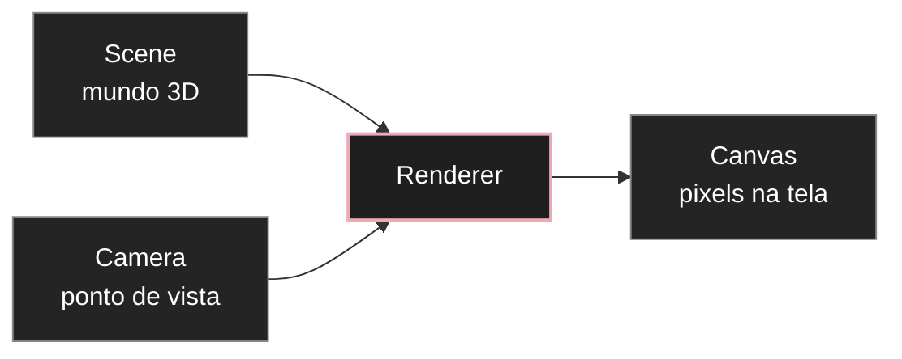

# Three.js e o modelo mental de uma cena 3D

Three.js é uma biblioteca JavaScript para criar gráficos 3D no navegador. Ela organiza tarefas que, diretamente em WebGL, exigiriam muito mais código e conhecimento de baixo nível.

A melhor forma de começar não é pensando em "efeitos 3D". Pense em um pequeno estúdio virtual. Você prepara um cenário, coloca objetos dentro dele, escolhe de onde uma câmera observa e usa um renderer para transformar tudo isso em pixels.

Essa arquitetura é a base para todo o restante da trilha de [[javascript/07-threejs/00-Guia de estudos de Three.js|Three.js]].

---

## 1. A analogia do estúdio

Imagine uma sessão de fotografia de produto.

Você possui:

* **Cena (`Scene`)**: o estúdio inteiro.
* **Objetos (`Object3D`, `Mesh`, luzes etc.)**: tudo que foi colocado dentro do estúdio.
* **Câmera (`Camera`)**: o ponto de vista usado para fotografar.
* **Renderer (`WebGLRenderer`)**: o sistema que transforma aquela configuração em uma imagem.
* **Canvas**: a superfície HTML onde a imagem final aparece.



A cena não é a imagem. A câmera também não é a imagem. A imagem surge quando o renderer combina o estado da cena com o ponto de vista da câmera.

---

## 2. O primeiro objeto mental: a cena

A cena funciona como um contêiner para objetos 3D.

```javascript
import * as THREE from "three";

const scene = new THREE.Scene();
```

Criar a cena não desenha nada. Ela inicialmente está vazia.

Você adiciona objetos com `scene.add()`:

```javascript
scene.add(cube);
scene.add(light);
```

Isso lembra a árvore de camadas do Figma: elementos podem existir dentro de grupos e cada elemento possui posição, rotação e escala.

---

## 3. O segundo objeto mental: a câmera

A câmera define de onde a cena é observada.

```javascript
const camera = new THREE.PerspectiveCamera(
  45,
  window.innerWidth / window.innerHeight,
  0.1,
  100
);
```

Os quatro argumentos são:

```javascript
new THREE.PerspectiveCamera(fov, aspect, near, far);
```

* `fov`: campo de visão vertical, em graus;
* `aspect`: proporção largura / altura;
* `near`: distância mínima que pode ser renderizada;
* `far`: distância máxima que pode ser renderizada.

A câmera começa na origem `(0, 0, 0)`. Se o objeto também estiver na origem, é comum posicionar a câmera para trás:

```javascript
camera.position.z = 5;
```

A relação entre câmera e objeto importa mais do que valores isolados.

---

## 4. O terceiro objeto mental: o renderer

O renderer pega a cena e a câmera e produz pixels.

```javascript
const renderer = new THREE.WebGLRenderer({ antialias: true });
renderer.setSize(window.innerWidth, window.innerHeight);
document.body.appendChild(renderer.domElement);
```

`renderer.domElement` é um elemento `<canvas>`.

Isso cria uma ponte direta com [[javascript/04-dom-e-browser/17-Canvas e gráficos|Canvas e gráficos]]. A diferença é que Three.js passa a controlar o que é desenhado nesse Canvas.

O ato central é:

```javascript
renderer.render(scene, camera);
```

Essa linha pode ser lida como:

> desenhe o estado atual desta cena a partir desta câmera.

---

## 5. O quarto objeto mental: um mesh

Um objeto visual típico em Three.js é um `Mesh`.

Ele combina:

* uma **geometria**, que define a forma;
* um **material**, que define como a superfície reage visualmente.

```javascript
const geometry = new THREE.BoxGeometry(1, 1, 1);
const material = new THREE.MeshBasicMaterial({ color: 0x7c3aed });
const cube = new THREE.Mesh(geometry, material);

scene.add(cube);
```

A analogia com design é útil:

* `Geometry`: estrutura da forma.
* `Material`: aparência da superfície.
* `Mesh`: o objeto visual resultante.

Uma geometria pode existir sem estar visível. Um material também pode existir sem estar aplicado. O `Mesh` junta os dois.

---

## 6. Por que às vezes você cria tudo e não vê nada

Uma cena 3D pode estar tecnicamente correta e continuar vazia na tela.

As causas mais comuns são:

* o objeto não foi adicionado à cena;
* a câmera está dentro do objeto;
* a câmera está apontando para outro lugar;
* o objeto está atrás da câmera;
* `near` e `far` estão cortando o objeto;
* o Canvas possui tamanho errado;
* o material precisa de luz, mas nenhuma luz foi adicionada;
* nada chamou `renderer.render()`.

Esse é um ponto importante para trabalhar com agentes de código. "Não aparece" não significa automaticamente que Three.js falhou. Há várias relações espaciais que precisam ser verificadas.

---

## 7. Exemplo completo

```javascript
import * as THREE from "three";

const scene = new THREE.Scene();

const camera = new THREE.PerspectiveCamera(
  45,
  window.innerWidth / window.innerHeight,
  0.1,
  100
);
camera.position.z = 5;

const renderer = new THREE.WebGLRenderer({ antialias: true });
renderer.setSize(window.innerWidth, window.innerHeight);
renderer.setPixelRatio(Math.min(window.devicePixelRatio, 2));
document.body.appendChild(renderer.domElement);

const geometry = new THREE.BoxGeometry(1.5, 1.5, 1.5);
const material = new THREE.MeshBasicMaterial({
  color: 0x7c3aed,
  wireframe: true
});

const cube = new THREE.Mesh(geometry, material);
scene.add(cube);

renderer.render(scene, camera);
```

Neste ponto o cubo não precisa se mover. O objetivo é verificar se você entende por que ele existe e por que aparece.

---

## 8. O que Three.js não decide por você

Three.js oferece ferramentas gráficas. Ele não decide:

* qual composição é boa;
* qual câmera cria a sensação desejada;
* quanto movimento é adequado;
* qual material combina com a direção visual;
* se a cena deveria ser 3D ou poderia ser CSS/SVG;
* se o efeito está prejudicando legibilidade ou performance.

Essas decisões continuam sendo de design.

---

## Fontes principais

* [Three.js: creating a scene](https://threejs.org/manual/en/creating-a-scene.html)
* [Three.js: fundamentals](https://threejs.org/manual/en/fundamentals.html)
* [Three.js documentation](https://threejs.org/docs/)

---

## Resumo para memorizar

Uma cena básica de Three.js precisa de **Scene + Camera + Renderer**. Para criar um objeto visual, normalmente você combina **Geometry + Material = Mesh** e adiciona esse mesh à cena. O renderer então transforma o estado da cena visto pela câmera em pixels dentro de um Canvas.