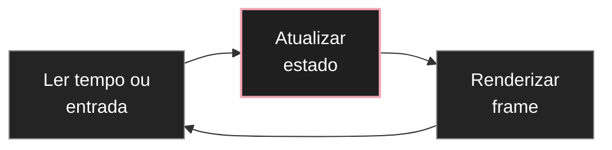

# Loop de renderização, tempo e animação

Uma cena de Three.js pode ser completamente estática. Quando ela precisa mudar ao longo do tempo, entra o **render loop**.

A ideia central é simples: a cada frame, você atualiza algum estado e renderiza a cena novamente.

Essa é a ponte entre [[javascript/07-threejs/03-Geometria, material, mesh e luz|objetos 3D]] e movimento.

---

## 1. Renderizar uma vez

Uma cena estática pode ser desenhada com:

```javascript
renderer.render(scene, camera);
```

Se nada mudar, não há necessidade conceitual de renderizar novamente.

---

## 2. O animation loop

A documentação atual recomenda usar `renderer.setAnimationLoop()`:

```javascript
function animate(time) {
  renderer.render(scene, camera);
}

renderer.setAnimationLoop(animate);
```

A função é chamada repetidamente enquanto a aplicação está ativa.

Dentro dela você pode alterar propriedades antes de desenhar o próximo frame:

```javascript
function animate(time) {
  cube.rotation.y = time * 0.001;
  renderer.render(scene, camera);
}
```

A relação é:



---

## 3. Frame não é unidade de velocidade

Evite pensar:

```javascript
cube.rotation.y += 0.01;
```

Esse código adiciona o mesmo valor por frame. Em telas ou máquinas com frequências diferentes, o movimento pode variar.

É melhor relacionar movimento ao tempo.

Uma opção é usar o tempo fornecido ao loop:

```javascript
function animate(time) {
  const seconds = time * 0.001;
  cube.rotation.y = seconds * 0.4;
  renderer.render(scene, camera);
}
```

Outra opção é `THREE.Clock`:

```javascript
const clock = new THREE.Clock();

function animate() {
  const delta = clock.getDelta();
  cube.rotation.y += delta * 0.4;
  renderer.render(scene, camera);
}
```

`delta` representa o tempo desde o frame anterior.

---

## 4. Movimento absoluto versus incremental

Movimento absoluto:

```javascript
mesh.position.y = Math.sin(seconds) * 0.5;
```

A posição é calculada diretamente a partir do tempo.

Movimento incremental:

```javascript
mesh.rotation.y += delta * 0.5;
```

A transformação atual é modificada a partir do estado anterior.

Para movimentos repetitivos e previsíveis, uma função do tempo costuma ser mais fácil de controlar e depurar.

---

## 5. Easing

Uma animação visualmente boa raramente é apenas uma mudança linear de A para B.

Uma interpolação linear básica pode ser feita com `lerp`:

```javascript
mesh.position.x = THREE.MathUtils.lerp(
  mesh.position.x,
  targetX,
  0.08
);
```

Isso faz o objeto se aproximar gradualmente do alvo.

Para transições com duração exata e curvas de easing específicas, bibliotecas como GSAP podem ser úteis. Mas não use GSAP para esconder a falta de um modelo espacial claro.

Primeiro defina:

* estado inicial;
* estado final;
* duração;
* propriedade que realmente precisa mudar.

Depois escolha a ferramenta de animação.

---

## 6. Movimento contínuo não é obrigatório

Um erro comum em portfólios 3D é manter tudo em movimento só porque a tecnologia permite.

Você pode renderizar apenas quando algo muda, ou manter o loop com movimentos muito sutis.

Pergunte:

* o movimento ajuda a perceber profundidade?
* existe um foco visual?
* a animação compete com o texto?
* o objeto fica melhor parado?
* o cursor precisa realmente controlar a cena inteira?

Uma cena sofisticada pode ter câmera praticamente parada e apenas uma pequena alteração de profundidade ou rotação.

---

## 7. Movimento relativo ao cursor

O cursor pode gerar um alvo:

```javascript
const pointer = {
  x: 0,
  y: 0
};

window.addEventListener("pointermove", (event) => {
  pointer.x = (event.clientX / window.innerWidth) * 2 - 1;
  pointer.y = -(event.clientY / window.innerHeight) * 2 + 1;
});
```

Depois o loop pode usar esse estado:

```javascript
function animate() {
  group.rotation.y = THREE.MathUtils.lerp(
    group.rotation.y,
    pointer.x * 0.15,
    0.05
  );

  group.rotation.x = THREE.MathUtils.lerp(
    group.rotation.x,
    pointer.y * 0.08,
    0.05
  );

  renderer.render(scene, camera);
}
```

O ponto importante é a escala: `0.15` radianos já cria uma resposta perceptível sem transformar a composição em brinquedo.

---

## 8. Exemplo completo e integrado

```javascript
import * as THREE from "three";

const scene = new THREE.Scene();
scene.background = new THREE.Color(0xf4f4f2);

const camera = new THREE.PerspectiveCamera(
  35,
  window.innerWidth / window.innerHeight,
  0.1,
  100
);
camera.position.set(0, 0, 7);

const renderer = new THREE.WebGLRenderer({ antialias: true });
renderer.setSize(window.innerWidth, window.innerHeight);
renderer.setPixelRatio(Math.min(window.devicePixelRatio, 2));
document.body.appendChild(renderer.domElement);

const group = new THREE.Group();
scene.add(group);

const material = new THREE.MeshBasicMaterial({
  color: 0x202020,
  wireframe: true
});

for (let i = 0; i < 5; i += 1) {
  const geometry = new THREE.BoxGeometry(1.1, 1.1, 0.25);
  const mesh = new THREE.Mesh(geometry, material);
  mesh.position.x = (i - 2) * 1.2;
  mesh.position.z = -Math.abs(i - 2) * 0.25;
  group.add(mesh);
}

const pointer = { x: 0, y: 0 };

window.addEventListener("pointermove", (event) => {
  pointer.x = (event.clientX / window.innerWidth) * 2 - 1;
  pointer.y = -(event.clientY / window.innerHeight) * 2 + 1;
});

function animate(time) {
  const seconds = time * 0.001;

  group.rotation.y = THREE.MathUtils.lerp(
    group.rotation.y,
    pointer.x * 0.12,
    0.04
  );

  group.rotation.x = THREE.MathUtils.lerp(
    group.rotation.x,
    pointer.y * 0.06,
    0.04
  );

  group.position.y = Math.sin(seconds * 0.5) * 0.05;

  renderer.render(scene, camera);
}

renderer.setAnimationLoop(animate);
```

O movimento aqui é propositalmente restrito. O objetivo é aprender a controlar ritmo e amplitude antes de adicionar mais efeitos.

---

## Fontes principais

* [Three.js: creating a scene](https://threejs.org/manual/en/creating-a-scene.html)
* [WebGLRenderer.setAnimationLoop](https://threejs.org/docs/#WebGLRenderer.setAnimationLoop)
* [Three.js animation system](https://threejs.org/manual/en/animation-system.html)

---

## Resumo para memorizar

O render loop executa repetidamente **atualização → renderização**. Movimento deve ser relacionado ao **tempo**, não ao número de frames. Use animação com intenção: poucas propriedades, amplitudes controladas e easing claro costumam produzir resultados melhores do que manter toda a cena constantemente em movimento.