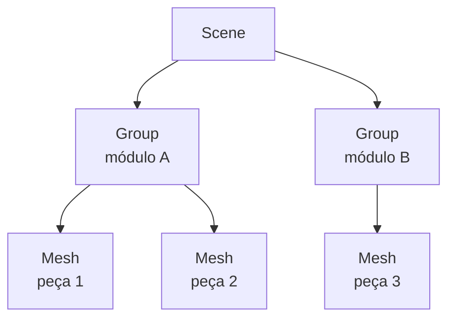

# Transformações locais, globais e hierarquia em Three.js

Quando uma cena 3D começa a ficar complexa, o problema deixa de ser simplesmente mover objetos. Passa a ser entender **em relação a quê** cada posição, rotação e escala está sendo interpretada.

Este artigo aprofunda [[javascript/07-threejs/02-Cena, câmera, renderer e coordenadas|câmera, renderer e coordenadas]] e conecta diretamente com [[javascript/07-threejs/07-React Three Fiber no Next.js|React Three Fiber no Next.js]].

---

## 1. O problema central: local não é global

Pense em um frame dentro de um componente no Figma. O frame pode estar a `x = 300`, mas um botão dentro dele pode estar a `x = 24` em relação ao próprio frame.

Three.js funciona do mesmo jeito.

```javascript
const group = new THREE.Group();
group.position.x = 3;

const mesh = new THREE.Mesh(geometry, material);
mesh.position.x = 1;

group.add(mesh);
scene.add(group);
```

O `mesh.position.x` continua sendo `1`, porque essa é sua posição local. Em espaço global, ele aparece em `4`.

---

## 2. Object3D forma uma árvore de transformações

Quase tudo que pode existir na cena herda de `Object3D`:

* `Mesh`;
* `Group`;
* `Camera`;
* `Light`;
* `Points`;
* `Line`.

A cena inteira é uma árvore hierárquica.



Quando o `Group` gira, todas as peças abaixo dele herdam essa transformação.

---

## 3. Matrizes explicam o que realmente acontece

Three.js mantém duas matrizes importantes:

* `matrix`: transformação local do objeto;
* `matrixWorld`: transformação acumulada até a raiz da cena.

Conceitualmente:

```text
matrixWorld do filho = matrixWorld do pai × matrix local do filho
```

Você normalmente não precisa multiplicar matrizes manualmente, mas precisa entender essa regra para não confundir coordenadas.

---

## 4. Converter local para global

Use `localToWorld` quando você conhece um ponto dentro do espaço local de um objeto e quer descobrir onde ele aparece no mundo.

```javascript
const localPoint = new THREE.Vector3(0.5, 0, 0);
const worldPoint = mesh.localToWorld(localPoint.clone());
```

Isso é essencial para alinhar terminais, calcular encaixes e depurar módulos aninhados.

---

## 5. Converter global para local

A operação inversa usa `worldToLocal`:

```javascript
const worldPoint = new THREE.Vector3(4, 2, 0);
const localPoint = group.worldToLocal(worldPoint.clone());
```

---

## 6. Rotação em grupos evita microgestão

Se três peças devem se comportar como um módulo, anime o `Group` quando possível.

```javascript
const module = new THREE.Group();
module.add(pieceA, pieceB, pieceC);
module.rotation.z = Math.PI / 4;
```

A hierarquia passa a expressar a semântica da composição.

---

## 7. Pivô é parte da geometria do movimento

Um objeto gira em torno de sua origem local. Para girar um braço por uma extremidade, crie um grupo-pivô:

```javascript
const pivot = new THREE.Group();
mesh.position.x = length / 2;
pivot.add(mesh);
pivot.rotation.z = Math.PI / 3;
```

---

## 8. Quaternion e rotação Euler

Para interpolar orientações complexas, `Quaternion` tende a ser mais robusto que interpolar ângulos Euler diretamente.

```javascript
const target = new THREE.Quaternion();
target.setFromEuler(new THREE.Euler(0.4, 1.1, 0));
mesh.quaternion.slerp(target, 0.08);
```

---

## 9. O erro clássico: transformar no nível errado

Pergunte sempre: esta mudança pertence à peça ou ao conjunto ao qual ela pertence?

---

## 10. Debug visual de espaços

```javascript
const axes = new THREE.AxesHelper(1);
group.add(axes);

const world = new THREE.Vector3();
mesh.getWorldPosition(world);
console.log(world);
```

---

## 11. Em React Three Fiber

```jsx
<group ref={moduleRef} position={[2, 0, 0]}>
  <mesh position={[1, 0, 0]}>
    <boxGeometry args={[2, 0.1, 0.1]} />
    <meshBasicMaterial />
  </mesh>
</group>
```

---

## Resumo para memorizar

Em Three.js, posição e rotação são locais ao pai. A cena é uma árvore de transformações. `Group` expressa relações estruturais, `localToWorld` e `worldToLocal` convertem espaços, e `matrixWorld` representa a transformação acumulada.

Quando a cena ficar confusa, identifique primeiro em qual nível a transformação deveria existir: peça, módulo, conjunto ou câmera.