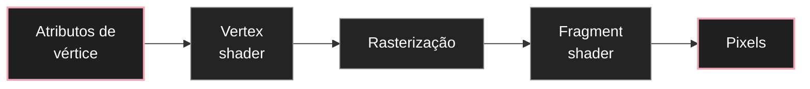

# Shaders, GLSL e materiais customizados

Shaders são pequenos programas executados na GPU. Eles controlam como vértices são transformados e como pixels recebem cor. Em Three.js, entender shaders ajuda a sair do conjunto de materiais prontos e criar comportamentos gráficos específicos.

Este artigo aprofunda [[javascript/07-threejs/03-Geometria, material, mesh e luz|materiais]], [[javascript/07-threejs/10-BufferGeometry e geometria paramétrica em Three.js|BufferGeometry]] e [[javascript/07-threejs/11-InstancedMesh e desenho eficiente de muitas formas|instancing]].

---

## 1. Dois estágios fundamentais

O pipeline gráfico tradicional trabalha, entre outros estágios, com dois shaders centrais:

* vertex shader: processa vértices;
* fragment shader: calcula a cor final de cada fragmento.

A divisão mental é simples:



---

## 2. Vertex shader mínimo

```glsl
void main() {
  gl_Position = projectionMatrix
              * modelViewMatrix
              * vec4(position, 1.0);
}
```

Three.js fornece matrizes e atributos comuns automaticamente.

A sequência transforma o ponto do espaço local do objeto até o espaço de projeção da câmera.

---

## 3. Fragment shader mínimo

```glsl
void main() {
  gl_FragColor = vec4(0.1, 0.1, 0.1, 1.0);
}
```

Cada fragmento recebe a mesma cor.

---

## 4. ShaderMaterial

```javascript
const material = new THREE.ShaderMaterial({
  vertexShader,
  fragmentShader
});
```

Esse material dá muito controle, mas também transfere para você responsabilidades que materiais prontos já resolvem.

---

## 5. Uniforms são parâmetros globais do shader

```javascript
const material = new THREE.ShaderMaterial({
  uniforms: {
    uTime: { value: 0 },
    uColor: { value: new THREE.Color(0xff3366) }
  },
  vertexShader,
  fragmentShader
});
```

No shader:

```glsl
uniform float uTime;
uniform vec3 uColor;
```

Atualização:

```javascript
material.uniforms.uTime.value = elapsed;
```

Uniforms são ótimos para animação porque mudam sem reconstruir a geometria.

---

## 6. Attributes variam por vértice

Se cada vértice precisa de um valor próprio, use atributo.

```javascript
geometry.setAttribute(
  "aStrength",
  new THREE.Float32BufferAttribute(values, 1)
);
```

No vertex shader:

```glsl
attribute float aStrength;
```

---

## 7. Varyings levam dados do vertex ao fragment

```glsl
varying float vStrength;

void main() {
  vStrength = aStrength;
  gl_Position = projectionMatrix * modelViewMatrix * vec4(position, 1.0);
}
```

Fragment shader:

```glsl
varying float vStrength;

void main() {
  gl_FragColor = vec4(vec3(vStrength), 1.0);
}
```

A GPU interpola esse valor entre os vértices.

---

## 8. Screen-space derivatives

Funções como `fwidth` ajudam a criar bordas suaves em função da resolução.

```glsl
float edge = smoothstep(0.5 - fwidth(value), 0.5 + fwidth(value), value);
```

Isso é útil para:

* linhas procedurais;
* antialiasing manual;
* bordas de formas;
* padrões gráficos.

---

## 9. Shaders não corrigem geometria ruim

Se existe uma lacuna topológica entre duas peças, um shader pode esconder, mas não resolver o problema.

A ordem correta é:

1. geometria;
2. projeção e câmera;
3. material;
4. shader, se ainda necessário.

Esse princípio evita usar complexidade visual para maquiar erro estrutural.

---

## 10. Quando ShaderMaterial vale a pena

Use quando você precisa de:

* deformação de vértices;
* padrões procedurais;
* transições baseadas em posição;
* máscaras matemáticas;
* cor controlada por atributos;
* efeitos de borda específicos;
* milhares de elementos com comportamento compartilhado na GPU.

Não use apenas porque shader parece mais avançado.

---

## 11. RawShaderMaterial

`RawShaderMaterial` remove parte das conveniências adicionadas por Three.js. Você precisa declarar mais elementos manualmente.

Para estudo, `ShaderMaterial` costuma ser melhor primeiro.

---

## 12. Precisão e tipos em GLSL

GLSL é tipado.

```glsl
float strength = 0.5;
vec2 uvPoint = vec2(0.2, 0.8);
vec3 color = vec3(1.0, 0.3, 0.2);
```

Operações entre tipos incompatíveis geram erro de compilação.

---

## 13. Debug de shaders

Se o shader não renderiza:

* simplifique o vertex shader;
* retorne uma cor sólida no fragment shader;
* confira nomes de uniforms e attributes;
* leia o console WebGL;
* teste valores extremos;
* remova branches e funções até localizar o problema.

Debug visual incremental funciona melhor que editar um shader grande de uma vez.

---

## 14. Exemplo completo e integrado

```javascript
import * as THREE from "three";

const vertexShader = `
  uniform float uTime;
  varying vec2 vUv;

  void main() {
    vUv = uv;
    vec3 p = position;
    p.z += sin(p.x * 4.0 + uTime) * 0.08;
    gl_Position = projectionMatrix * modelViewMatrix * vec4(p, 1.0);
  }
`;

const fragmentShader = `
  varying vec2 vUv;

  void main() {
    float line = smoothstep(0.48, 0.50, abs(vUv.y - 0.5));
    vec3 paper = vec3(0.91, 0.90, 0.87);
    vec3 ink = vec3(0.09, 0.09, 0.08);
    gl_FragColor = vec4(mix(ink, paper, line), 1.0);
  }
`;

const scene = new THREE.Scene();
const camera = new THREE.PerspectiveCamera(35, innerWidth / innerHeight, 0.1, 100);
camera.position.z = 5;

const renderer = new THREE.WebGLRenderer({ antialias: true });
renderer.setSize(innerWidth, innerHeight);
document.body.appendChild(renderer.domElement);

const geometry = new THREE.PlaneGeometry(3, 1, 80, 1);
const material = new THREE.ShaderMaterial({
  uniforms: { uTime: { value: 0 } },
  vertexShader,
  fragmentShader,
  side: THREE.DoubleSide
});

scene.add(new THREE.Mesh(geometry, material));

renderer.setAnimationLoop((time) => {
  material.uniforms.uTime.value = time * 0.001;
  renderer.render(scene, camera);
});
```

---

## Resumo para memorizar

Vertex shaders transformam vértices. Fragment shaders calculam cor. `uniform` é um parâmetro compartilhado, `attribute` pertence a cada vértice e `varying` transporta dados interpolados entre os dois estágios.

Shaders são úteis quando o comportamento precisa ser matemático, repetitivo ou executado eficientemente na GPU. Eles devem ampliar uma estrutura correta, não compensar geometria mal resolvida.