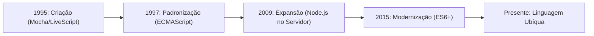

# Introdução ao JavaScript: história, origem e evolução - método Feynman

Para entender o [[javascript/Introdução ao JavaScript\|JavaScript]] hoje, precisamos olhar para trás e entender como um código criado às pressas em apenas 10 dias se tornou a linguagem mais popular do planeta.

---

## De onde vem e como foi criado?

Em 1995, a internet era muito diferente. Os sites eram apenas páginas estáticas de texto e imagens (HTML e um CSS muito primitivo). Não existiam animações, formulários inteligentes, nem interações em tempo real. Se você clicasse em um botão, a página inteira precisava recarregar.

A empresa líder de navegadores da época, a Netscape, percebeu que a web precisava de movimento. Eles precisavam de uma linguagem que rodasse diretamente no navegador do usuário para validar formulários e criar pequenas interações.

Para resolver isso, contrataram um programador chamado **Brendan Eich**. A missão dele era criar uma linguagem de programação leve e fácil de usar. O detalhe impressionante: ele projetou e escreveu a primeira versão da linguagem em apenas **10 dias**, em maio de 1995.

---

## Baseado em que o JavaScript foi construído?

Brendan Eich não criou a linguagem do zero absoluto. Ele se inspirou em três linguagens de programação que já existiam, combinando suas melhores características:

1.  **Java (Sintaxe Visual):** A Netscape tinha uma parceria com a Sun Microsystems (criadora do Java). Para agradar aos programadores da época, o [[javascript/Introdução ao JavaScript\|JavaScript]] adotou uma sintaxe muito parecida com a do Java (uso de chaves, ponto e vírgula, etc.).
2.  **Scheme ([[javascript/02-funções-e-objetos/01-Funções\|Funções]] Poderosas):** [[javascript/Introdução ao JavaScript\|JavaScript]] herdou do Scheme a ideia de que [[javascript/02-funções-e-objetos/01-Funções\|Funções]] são cidadãs de primeira classe (First-Class Functions). Isso significa que [[javascript/02-funções-e-objetos/01-Funções\|Funções]] podem ser guardadas em variáveis, passadas como argumentos e tratadas como qualquer outro dado.
3.  **Self (Herança por [[javascript/02-funções-e-objetos/07-Protótipos e proto\|Protótipos e Proto]]):** Em vez do modelo tradicional de [[javascript/02-funções-e-objetos/09-Classes\|Classes]] que existia em Java ou C++, [[javascript/Introdução ao JavaScript\|JavaScript]] usou o modelo do Self, onde [[javascript/02-funções-e-objetos/03-Objetos\|Objetos]] podem herdar características diretamente de outros [[javascript/02-funções-e-objetos/03-Objetos\|Objetos]] ([[javascript/02-funções-e-objetos/07-Protótipos e proto\|Protótipos e Proto]]), sem a necessidade de moldes complexos.

### O mito do nome: JavaScript não tem relação com Java

Originalmente, a linguagem foi batizada de **Mocha**, depois mudou para **LiveScript**. 

Na época, o Java era a linguagem mais famosa e comentada do mercado de tecnologia. Em uma jogada de marketing brilhante (e confusa), a Netscape mudou o nome para **[[javascript/Introdução ao JavaScript\|JavaScript]]** para pegar carona no sucesso do Java. 

Apesar do nome parecido, as duas linguagens funcionam de maneiras completamente diferentes. Como diz uma famosa analogia no desenvolvimento web: **"Java está para [[javascript/Introdução ao JavaScript\|JavaScript]] assim como Carro está para Carrapato"**.

---

## Sugestão de conteúdo adicional: o que mais você precisa saber?

Para consolidar sua introdução, sugiro entender três marcos fundamentais da linguagem:

### 1. O padrão ecmascript (o manual de regras oficial)
Para evitar que cada navegador criasse sua própria versão do [[javascript/Introdução ao JavaScript\|JavaScript]] (o que quebraria os sites em navegadores diferentes), a linguagem foi padronizada sob o nome de **ECMAScript**.
Quando você ouvir falar de "ES6" ou "ES2015", estamos nos referindo às atualizações oficiais nas regras da linguagem que trouxeram recursos modernos como `let`, `const`, `classes` e `arrow functions`.

### 2. Do navegador para o mundo (Node.js)
Por muitos anos, o [[javascript/Introdução ao JavaScript\|JavaScript]] só conseguia rodar dentro do navegador (Client-side). 
Em 2009, foi criado o **[[javascript/06-arquitetura-e-avancado/02-Node.js\|Node.js]].js**, uma tecnologia que permitiu executar o [[javascript/Introdução ao JavaScript\|JavaScript]] diretamente no sistema operacional do computador (Server-side). Hoje, a mesma linguagem que você usa para animar um botão no navegador é usada para gerenciar bancos de dados e servidores gigantescos.

### 3. A linha do tempo visual do JavaScript

---

## Sequência sugerida de estudos (roadmap)

Para aprender [[javascript/Introdução ao JavaScript\|JavaScript]] de forma lógica, recomendo seguir esta trilha passo a passo. Cada conceito serve de base para o próximo, simulando o fluxo de criação de um projeto:

### Fase 1: os blocos de construção (fundamentos)
1.  **[[javascript/01-fundamentos/03-Tipos de dados\|Tipos de Dados]]:** Entenda quais são os [[javascript/01-fundamentos/03-Tipos de dados\|Tipos de Dados]] básicos (texto, números, verdadeiro/falso) que a linguagem consegue processar.
2.  **[[javascript/01-fundamentos/01-Var, let e const\|Variáveis (Var, Let, Const)]]:** Aprenda onde e como guardar esses dados na memória usando caixas, gavetas e cofres.

### Fase 2: lógica e estrutura (organização)
3.  **[[javascript/02-funções-e-objetos/01-Funções\|Funções]]:** Crie suas primeiras "máquinas" de processamento de dados para reaproveitar blocos de código.
4.  **[[javascript/02-funções-e-objetos/03-Objetos\|Objetos]]:** Aprenda a criar estruturas complexas e fichas técnicas completas para agrupar suas variáveis.
5.  **[[javascript/02-funções-e-objetos/09-Classes\|Classes]], [[javascript/02-funções-e-objetos/10-Get e set\|Get e Set]]:** Estude a forma moderna de criar componentes e proteger os dados contra valores inválidos.

### Fase 3: interação real (front-end)
6.  **[[javascript/04-dom-e-browser/01-DOM\|DOM (Document Object Model)]]:** Descubra como o navegador lê o HTML e o transforma em uma árvore de camadas interativa.
7.  **[[javascript/04-dom-e-browser/04-Eventos\|Eventos]]:** Crie os gatilhos para fazer a tela reagir em tempo real quando o usuário clica, digita ou move o mouse.

### Fase 4: integração de sistemas (conectividade)
8.  **[[javascript/03-manipulacao/08-JSON\|JSON]]:** Aprenda o formato de texto universal usado para enviar dados pela rede.
9.  **[[javascript/05-assincrono/02-API\|APIs]]:** Entenda como se conectar a serviços externos para usar recursos de terceiros (como mapas ou imagens).
10. **[[javascript/05-assincrono/03-Fetch\|Fetch]]:** Domine o mecanismo assíncrono para fazer as requisições de dados na internet sem travar a interface do usuário.

### Fase 5: além do navegador (back-end)
11. **[[javascript/06-arquitetura-e-avancado/02-Node.js\|Node.js]]:** Compreenda como rodar seu código diretamente na máquina física (servidor e arquivos locais).

---

## Resumo para memorizar

*   **Criador:** Brendan Eich em 1995 pela Netscape.
*   **Tempo de desenvolvimento:** Apenas 10 dias.
*   **Influências principais:** Java (sintaxe), Scheme ([[javascript/02-funções-e-objetos/01-Funções\|Funções]]) e Self ([[javascript/02-funções-e-objetos/07-Protótipos e proto\|Protótipos e Proto]]).
*   **Independência:** Não tem relação funcional com o Java (foi apenas uma estratégia de marketing).
*   **ECMAScript:** É a especificação oficial que dita as regras de evolução da linguagem.

