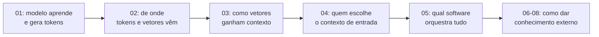
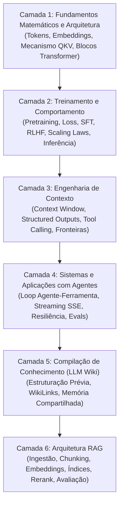

# Guia de estudos de LLMs: arquitetura, sistemas e engenharia

Este guia organiza os estudos sobre grandes modelos de linguagem (*Large Language Models* ou LLMs) em uma **trilha de maturidade progressiva**, conectando intuições didáticas com os mecanismos matemáticos reais, as restrições físicas de hardware e a arquitetura de sistemas modernos.

## Como ler esta trilha sem conhecer o vocabulário

A trilha ficou deliberadamente mais técnica, mas você não precisa conhecer todos os termos antes de começar. Na primeira leitura, o objetivo é construir um **mapa mental do sistema**; nomes como `RoPE`, `RMSNorm`, `SwiGLU`, `RLHF` ou `KV cache` entram depois como peças específicas desse mapa.

Use [[llm/Glossário de LLMs|Glossário de LLMs]] como apoio permanente. As entradas foram escritas para responder três perguntas rápidas: **o que é**, **para que serve** e **com o que não devo confundir**.

> [!NOTE] Ordem de leitura recomendada para a primeira passagem
> A trilha agora acompanha a ordem natural dos artigos. Use [[llm/Fundamentos — vetores, matrizes, tensores e shapes|Fundamentos tensoriais]] como base paralela e siga:
> **01 Visão geral → 02 Tokenização → 03 Transformer → 04 Engenharia de contexto → 05 Sistemas → 06 LLM Wiki → 07 Conhecimento externo → 08 RAG → 09 a 17 Pipeline RAG em profundidade.**
>
> O `01` funciona como **mapa panorâmico**: ele apresenta treinamento, inferência, logits, Softmax e temperatura sem exigir que todas as peças internas já estejam abertas. Os artigos seguintes voltam às caixas-pretas citadas ali e explicam, em sequência, de onde tokens, representações contextuais e sistemas externos vêm.

### O princípio de construção da trilha

A lógica agora é sempre:

**apresentar o sistema inteiro → abrir uma caixa-preta → usar o que foi aprendido para criar o próximo problema**.

Por exemplo:

Assim, você não precisa entender cada mecanismo na primeira aparição. A primeira aparição cria a pergunta; o artigo seguinte responde.

### O mapa mental antes dos nomes técnicos

Pense em uma LLM como um pipeline com cinco perguntas:

* **Como o texto entra?** Texto é quebrado em [[llm/Glossário de LLMs#Token|tokens]] e convertido em representações numéricas.
* **Como os tokens trocam informação?** O [[llm/Glossário de LLMs#Transformer|Transformer]] usa [[llm/Glossário de LLMs#Atenção|atenção]] e outras transformações para atualizar essas representações.
* **Como o modelo aprende?** Ele faz previsões, mede o erro com uma [[llm/Glossário de LLMs#Função de perda|função de perda]] e ajusta [[llm/Glossário de LLMs#Parâmetro|parâmetros]].
* **Como ele responde?** A inferência produz [[llm/Glossário de LLMs#Logit|logits]], transforma-os em probabilidades e escolhe novos tokens.
* **Como isso vira produto?** A aplicação organiza contexto, chama APIs, ferramentas, streaming, recuperação externa e avaliações.

Se essa cadeia estiver clara, os termos avançados deixam de ser uma lista de siglas e passam a ocupar lugares conhecidos dentro do sistema.

---

## As seis camadas de conhecimento

Em vez de tratar a inteligência artificial generativa como um conjunto de dicas superficiais de prompt, este repositório divide o domínio de LLMs em seis camadas interdependentes de engenharia:

---

## Sequência de leitura e aprofundamento

### Etapa 0: visão panorâmica do ciclo

Comece entendendo **o que o sistema faz**, sem exigir domínio de toda a implementação interna.

* [[llm/01-Dinâmica de treino e inferência em LLMs|Dinâmica de treino e inferência em LLMs]] - Visão geral do ciclo de aprendizagem e geração: pré-treino, pós-treino, loss, gradiente, hidden state, logits, Softmax, temperatura e amostragem. Ele cria as perguntas que os artigos `02` e `03` abrirão em detalhe.

---

### Camada 1: fundamentos matemáticos e arquitetura interna
Compreenda o fluxo físico e tensorial que transforma dados discretos em representações latentes contínuas dentro de redes neurais profundas.
* [[llm/Fundamentos — vetores, matrizes, tensores e shapes|Vetores, matrizes, tensores e shapes para LLMs]] - Base para entender escalar, vetor, matriz, tensor, shape, batch, reshape, transpose e a passagem de `[batch, tokens, embedding]` para `[batch, heads, tokens, head_dim]`.
* [[llm/02-Tokenização, embeddings e representações contextuais|Tokenização, embeddings e representações contextuais]] - Abre a primeira caixa-preta do `01`: como texto vira tokens, IDs e vetores antes de existir qualquer logit.
* [[llm/03-Arquitetura do Transformer e mecanismo de atenção|Arquitetura do Transformer e mecanismo de atenção]] - Abre a segunda caixa-preta: como os vetores trocam informação e se tornam representações contextuais através de attention, residual streams e FFNs.

---

### Camada 2: treinamento, dinâmica estatística e inferência

Depois de `02` e `03`, vale retornar ao `01` para uma segunda leitura. Nesse momento, cross-entropy, logits e gradientes deixam de ser peças abstratas porque você já sabe **que estruturas entram no modelo e que tipo de representação chega à saída**.

---

### Camada 3: engenharia de contexto e controle formal
Supere o modelo mental de "escrever um bom briefing" e domine o contexto como uma memória volátil, custosa e com vulnerabilidades de fronteira.
* [[llm/04-Engenharia de contexto e controle de inferência|Engenharia de contexto e controle de inferência]] - Depois de entender como o Transformer processa contexto, o foco passa para quem decide o que entra nessa memória de trabalho, com quais prioridades, fronteiras e contratos de saída.

---

### Camada 4: sistemas de software, resiliência e agentes
Aprenda a construir software de produção conectando LLMs a bancos de dados, ferramentas externas e interfaces em tempo real.
* [[llm/05-Sistemas de produção com LLMs, tool calling e streaming|Sistemas de produção com LLMs, tool calling e streaming]] - A engenharia de contexto vira software real: chamadas de função, loop agente-ferramenta, streaming, retries, tracing e resiliência.

---

### Camada 5: compilação de conhecimento e memória persistente
Transforme corpus volumosos e dispersos em representações estruturadas, auditáveis e interligadas antes do momento da consulta.
* [[llm/06-LLM Wiki conhecimento compilado para humanos e agentes|LLM Wiki: conhecimento compilado para humanos e agentes]] - O problema deixa de ser buscar um dado pontual com uma ferramenta e passa a ser organizar conhecimento documental persistente em escala.

---

### Camada 6: arquitetura RAG (Retrieval-Augmented Generation)
Aprenda a enriquecer modelos de linguagem com dados proprietários e externos através de pipelines de ingestão, recuperação vetorial e avaliação sistemática.
* [[llm/07-Por que LLMs precisam de conhecimento externo|Por que LLMs precisam de conhecimento externo]] - Generaliza o problema introduzido pela LLM Wiki: pesos, contexto temporário e conhecimento persistente são coisas diferentes.
* [[llm/08-O que é RAG e como funciona|O que é RAG e como funciona]] - Depois de entender por que recuperar, apresenta o pipeline completo que faz essa recuperação.
* [[llm/09-Chunking e estratégias de fragmentação|Chunking e estratégias de fragmentação]] - Abre a primeira etapa do pipeline de ingestão: em quais unidades um documento deve ser dividido para poder ser recuperado.
* [[llm/10-Embeddings aplicados ao RAG|Embeddings aplicados ao RAG]] - Os chunks viram coordenadas numéricas que podem ser comparadas com a pergunta do usuário.
* [[llm/11-Vector stores, índices e algoritmos de busca|Vector stores, índices e algoritmos de busca]] - Depois de criar vetores, resolve como armazená-los e procurar vizinhos em milhões de registros.
* [[llm/12-Estratégias de retrieval e busca híbrida|Estratégias de retrieval e busca híbrida]] - Depois de possuir um índice, melhora a estratégia de busca combinando evidência semântica e lexical.
* [[llm/13-Reranking e modelos de pontuação cruzada|Reranking e modelos de pontuação cruzada]] - Depois de recuperar candidatos rapidamente, usa modelos mais caros para ordenar melhor apenas esse conjunto reduzido.
* [[llm/14-Engenharia de contexto para RAG|Engenharia de contexto para RAG]] - Depois do reranking, decide quais evidências realmente entram na janela do modelo e em que ordem.
* [[llm/15-Construindo um RAG em JavaScript|Construindo um RAG em JavaScript]] - Junta as etapas anteriores em uma implementação ponta a ponta em JavaScript puro.
* [[llm/16-Avaliando um sistema RAG|Avaliando um sistema RAG]] - Depois de construir o sistema, separa avaliação de retrieval e geração para descobrir onde ele falha.
* [[llm/17-RAG avançado e limites arquiteturais|RAG avançado e limites arquiteturais]] - Só depois de possuir pipeline e métricas introduz estratégias avançadas e pergunta quando o próprio RAG deixa de ser a arquitetura adequada.

---

## O método de progressão de cada artigo

Cada nota técnica deste módulo segue rigorosamente cinco etapas de aprendizado:
1. **Intuição e analogia**: O modelo mental intuitivo baseado em design, interfaces e sistemas reais.
2. **Mecanismo técnico formal**: A matemática, os tensores e as decisões de engenharia reais.
3. **Implementação mínima executável**: Código compilável e testado demonstrando o cálculo central.
4. **Limites da analogia**: Onde a metáfora simplificada falha e quais erros conceituais ela pode induzir.
5. **Implicações práticas de engenharia**: Trade-offs de latência, consumo de memória VRAM, custo financeiro e consistência de software.

Além dessas cinco etapas internas, cada artigo deve deixar clara sua **ponte narrativa**: qual problema veio do artigo anterior e qual novo problema permanece aberto para o seguinte.

---

## Videoteca recomendada de IA e sistemas

Para complementar a leitura técnica com intuição visual de alta qualidade, animações tensoriais e explicações de engenharia de primeira mão, recomendamos os seguintes canais de referência internacional:

* **Andrej Karpathy** (Canal YouTube: `Andrej Karpathy`): As séries *Neural Networks: Zero to Hero* e a palestra histórica *State of GPT* são o padrão ouro absoluto para entender a construção de LLMs desde o byte zero em Python puro e tensores PyTorch.
* **3Blue1Brown** (Canal YouTube: `3Blue1Brown`): A série sobre redes neurais e Transformers (com capítulos dedicados ao mecanismo de atenção e álgebra de embeddings) fornece a melhor representação geométrica visual do espaço latente já produzida.
* **StatQuest with Josh Starmer** (Canal YouTube: `StatQuest with Josh Starmer`): Decomposições passo a passo e intuitivas de Word2Vec, cálculo de Cross-Entropy Loss, Self-Attention e mecanismos de Transformers sem pular etapas algébricas.
* **DeepLearning.AI / Andrew Ng** (Canal YouTube: `DeepLearningAI`): Cursos curtos práticos cobrindo engenharia de contexto, tool calling, avaliação formal com LLM-as-a-judge e sistemas RAG de nível empresarial.
* **Cohere / Jay Alammar** (Canal YouTube: `Jay Alammar` e `Cohere`): Visualizações clássicas de arquiteturas de busca vetorial, modelos bi-encoder vs cross-encoders, reranking e representações densas de texto.
* **Yannic Kilcher** (Canal YouTube: `Yannic Kilcher`): Leitura e dissecação minuciosa de papers fundamentais (*Attention Is All You Need*, *Llama*, *Chinchilla Scaling Laws*, *DPO* e pesquisas de retrieval).
