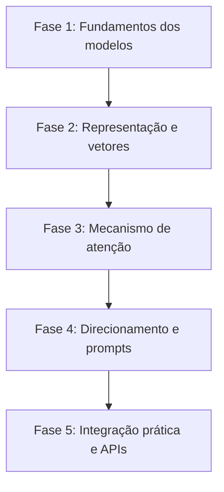

# Guia de estudos de LLMs - trilha Feynman para desenvolvedores e designers

Este guia organiza os estudos sobre grandes modelos de linguagem (*Large Language Models* ou LLMs) em uma **sequência lógica de leitura**, permitindo desmistificar a inteligência artificial generativa usando analogias visuais de design, produto e arquitetura web.

---

## Mapa de leitura

---

## Sequência de leitura dos artigos

### Fase 1: os fundamentos dos modelos de linguagem
Entenda o que realmente acontece por baixo do capô das LLMs, eliminando a ideia mística de mágica e tratando os modelos como motores preditivos probabilísticos.
* [[llm/01-O que são LLMs e como funcionam|O que são LLMs e como funcionam]] - A analogia do auto-completar inteligente, janelas de contexto, pesos matemáticos e inferência.

---

### Fase 2: representação numérica e o universo das palavras
Computadores não processam ideias em formato de texto bruto. Descubra como a linguagem é fatiada em pedaços e convertida em coordenadas de um mapa conceitual.
* [[llm/02-Tokens, embeddings e espaço vetorial|Tokens, embeddings e espaço vetorial]] - O seletor de cores (*Color Picker*) multidimensional, tokenização visual e cálculo de proximidade por similaridade de cosseno.

---

### Fase 3: o cérebro da revolução moderna
A arquitetura que aposentou as redes neurais antigas e permitiu processar textos gigantescos em paralelo.
* [[llm/03-A arquitetura Transformer e o mecanismo de atenção|A arquitetura Transformer e o mecanismo de atenção]] - A analogia da hierarquia visual do design (*Self-Attention*), codificadores e decodificadores.

---

### Fase 4: a linguagem de controle dos modelos
Assim como um desenvolvedor precisa de uma sintaxe limpa e um designer de um bom *briefing*, uma LLM responde à estrutura de contexto que recebe.
* [[llm/04-Engenharia de prompt e padrões de contexto|Engenharia de prompt e padrões de contexto]] - Estruturação de instruções do sistema, padrões *Zero-shot*, *Few-shot* e *Chain-of-Thought*.

---

### Fase 5: conectando LLMs às interfaces do mundo real
Traga a inteligência dos modelos para aplicações web funcionais usando a linguagem base do front-end.
* [[llm/05-Consumindo APIs de LLMs com JavaScript|Consumindo APIs de LLMs com JavaScript]] - Integração assíncrona com `fetch`, tratamento de *streaming* de respostas (*Server-Sent Events*) e boas práticas de interface.

---

## Resumo para memorizar

* **Natureza probabilística**: Uma LLM não pensa; ela calcula continuamente a probabilidade da próxima peça de texto com base no contexto recebido.
* **Transformação matemática**: Texto vira token, token vira vetor (*embedding*), vetor é ponderado por atenção (*Transformer*) e vira nova probabilidade.
* **Habilidade de engenharia**: O domínio prático de LLMs reside em entender suas restrições de contexto, latência de inferência e integração segura em aplicações web.
