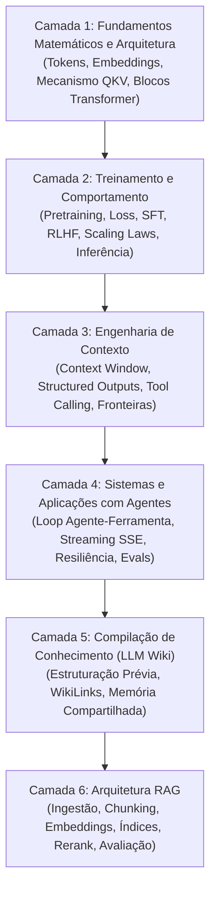

# Guia de estudos de LLMs: arquitetura, sistemas e engenharia

Este guia organiza os estudos sobre grandes modelos de linguagem (*Large Language Models* ou LLMs) em uma **trilha de maturidade progressiva**, conectando intuições didáticas com os mecanismos matemáticos reais, as restrições físicas de hardware e a arquitetura de sistemas modernos.

---

## As seis camadas de conhecimento

Em vez de tratar a inteligência artificial generativa como um conjunto de dicas superficiais de prompt, este repositório divide o domínio de LLMs em seis camadas interdependentes de engenharia:

---

## Sequência de leitura e aprofundamento

### Camada 1: fundamentos matemáticos e arquitetura interna
Compreenda o fluxo físico e tensorial que transforma dados discretos em representações latentes contínuas dentro de redes neurais profundas.
* [[llm/02-Tokenização, embeddings e representações contextuais|Tokenização, embeddings e representações contextuais]] - Tokenização via Byte-Pair Encoding (BPE), projeção de vocabulário estático ($W_E$) vs representações contextuais dinâmicas, modelos bi-encoder de sentença e similaridade geométrica.
* [[llm/03-Arquitetura do Transformer e mecanismo de atenção|Arquitetura do Transformer e mecanismo de atenção]] - Anatomia do bloco Transformer: Residual Streams, RoPE, RMSNorm, atenção multi-cabeça escalada ($QK^T / \sqrt{d_k} \times V$), causal masking triangular, FFNs (SwiGLU) e o papel crítico do KV Cache na inferência.

---

### Camada 2: treinamento, dinâmica estatística e inferência
Descubra como pesos matriciais são ajustados a partir de volumes massivos de dados e como o comportamento de assistente é esculpido pós-treinamento.
* [[llm/01-Dinâmica de treino e inferência em LLMs|Dinâmica de treino e inferência em LLMs]] - Além do autocomplete simplista: compressão semântica autorregressiva, cross-entropy loss, gradient descent, transição do pré-treino para o pós-treino (SFT e RLHF/DPO), amostragem de logits (temperatura, top-$p$, top-$k$) e alucinações como propriedades estatísticas.

---

### Camada 3: engenharia de contexto e controle formal
Supere o modelo mental de "escrever um bom briefing" e domine o contexto como uma memória volátil, custosa e com vulnerabilidades de fronteira.
* [[llm/04-Engenharia de contexto e controle de inferência|Engenharia de contexto e controle de inferência]] - De prompts a Context Engineering: papéis de sistema/desenvolvedor/usuário, injeção de prompt indireta, limites de raciocínio com CoT vs modelos de busca em tempo de teste, e saídas garantidas via decodificação restringida (*Constrained Decoding* / JSON Schema).

---

### Camada 4: sistemas de software, resiliência e agentes
Aprenda a construir software de produção conectando LLMs a bancos de dados, ferramentas externas e interfaces em tempo real.
* [[llm/05-Sistemas de produção com LLMs, tool calling e streaming|Sistemas de produção com LLMs, tool calling e streaming]] - Padrão de integração moderna: chamadas de função (*Tool Calling*), loop completo agente-ferramenta, streaming de Server-Sent Events com deltas estruturados, controle de concorrência com AbortController, retries com backoff exponencial e redução de latência com Prompt Caching.

---

### Camada 5: compilação de conhecimento e memória persistente
Transforme corpus volumosos e dispersos em representações estruturadas, auditáveis e interligadas antes do momento da consulta.
* [[llm/06-LLM Wiki conhecimento compilado para humanos e agentes|LLM Wiki: conhecimento compilado para humanos e agentes]] - A terceira via entre contexto direto e RAG: extração prévia, síntese em páginas atômicas com WikiLinks, complementaridade com RAG, analogia do compilador e o risco do erro cristalizado.

---

### Camada 6: arquitetura RAG (Retrieval-Augmented Generation)
Aprenda a enriquecer modelos de linguagem com dados proprietários e externos através de pipelines de ingestão, recuperação vetorial e avaliação sistemática.
* [[llm/07-Por que LLMs precisam de conhecimento externo|Por que LLMs precisam de conhecimento externo]] - Conhecimento paramétrico vs não paramétrico, limites de janelas longas, degradação de atenção (*Lost in the Middle*) e matriz de decisão para RAG.
* [[llm/08-O que é RAG e como funciona|O que é RAG e como funciona]] - O ciclo completo: separação estrita entre o pipeline offline de ingestão/indexação e o pipeline online de consulta/retrieval.
* [[llm/09-Chunking e estratégias de fragmentação|Chunking e estratégias de fragmentação]] - Estratégias de particionamento (tamanho fixo, estrutural em Markdown, semântico), overlap, metadados e o dilema chunks pequenos vs grandes.
* [[llm/10-Embeddings aplicados ao RAG|Embeddings aplicados ao RAG]] - Arquitetura Bi-Encoder, normalização L2, simplificação para produto escalar, Matryoshka Representation Learning (MRL) e pontos cegos de busca semântica.
* [[llm/11-Vector stores, índices e algoritmos de busca|Vector stores, índices e algoritmos de busca]] - Bancos vetoriais, KNN exato vs busca aproximada (ANN), grafos HNSW em camadas, `pgvector` vs bancos dedicados e pre-filtering.
* [[llm/12-Estratégias de retrieval e busca híbrida|Estratégias de retrieval e busca híbrida]] - Limitações da busca puramente vetorial, algoritmo BM25 léxico, busca híbrida e fusão de rankings com Reciprocal Rank Fusion (RRF).
* [[llm/13-Reranking e modelos de pontuação cruzada|Reranking e modelos de pontuação cruzada]] - O pipeline de dois estágios: por que o Top-1 do retrieval não é o melhor resultado, Cross-Encoders com atenção total e refinamento de candidatos.
* [[llm/14-Engenharia de contexto para RAG|Engenharia de contexto para RAG]] - Seleção, ordenação estratégica em ferradura contra *Lost in the Middle*, citações estritas (*provenance*) e blindagem contra *Context Poisoning*.
* [[llm/15-Construindo um RAG em JavaScript|Construindo um RAG em JavaScript]] - Implementação didática completa ponta a ponta em JavaScript puro (ES6+) sem frameworks mágicos, consumindo notas Markdown do Obsidian.
* [[llm/16-Avaliando um sistema RAG|Avaliando um sistema RAG]] - Avaliação formal e desacoplada: métricas de busca (*Hit Rate @ K*, Context Precision) vs métricas de geração (*Faithfulness*, Answer Relevance), datasets de teste e LLM-as-a-Judge.
* [[llm/17-RAG avançado e limites arquiteturais|RAG avançado e limites arquiteturais]] - Técnicas de fronteira (Query Rewriting, Multi-Query, HyDE, Parent-Child, Contextual Retrieval, Graph RAG, Agentic RAG) e cenários onde RAG é a escolha errada (Text-to-SQL, sumarização global, fine-tuning).

---

## O método de progressão de cada artigo

Cada nota técnica deste módulo segue rigorosamente cinco etapas de aprendizado:
1. **Intuição e analogia**: O modelo mental intuitivo baseado em design, interfaces e sistemas reais.
2. **Mecanismo técnico formal**: A matemática, os tensores e as decisões de engenharia reais.
3. **Implementação mínima executável**: Código compilável e testado demonstrando o cálculo central.
4. **Limites da analogia**: Onde a metáfora simplificada falha e quais erros conceituais ela pode induzir.
5. **Implicações práticas de engenharia**: Trade-offs de latência, consumo de memória VRAM, custo financeiro e consistência de software.
