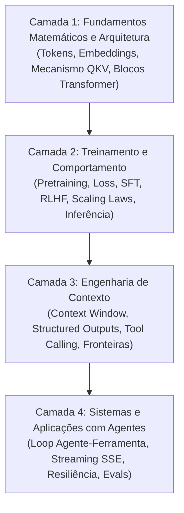

# Guia de estudos de LLMs - fundamentos de arquitetura, sistemas e engenharia

Este guia organiza os estudos sobre grandes modelos de linguagem (*Large Language Models* ou LLMs) em uma **trilha de maturidade progressiva**, conectando intuições didáticas com os mecanismos matemáticos reais, as restrições físicas de hardware e a arquitetura de sistemas modernos.

---

## As quatro camadas de conhecimento

Em vez de tratar a inteligência artificial generativa como um conjunto de dicas superficiais de prompt, este repositório divide o domínio de LLMs em quatro camadas interdependentes de engenharia:

---

## Sequência de leitura e aprofundamento

### Camada 1: fundamentos matemáticos e arquitetura interna
Compreenda o fluxo físico e tensorial que transforma dados discretos em representações latentes contínuas dentro de redes neurais profundas.
* [[llm/02-Tokens, embeddings e espaço vetorial|Tokens, embeddings e espaço vetorial]] - Tokenização via Byte-Pair Encoding (BPE), projeção de vocabulário estático ($W_E$) vs representações contextuais dinâmicas, modelos bi-encoder de sentença e similaridade geométrica.
* [[llm/03-A arquitetura Transformer e o mecanismo de atenção|A arquitetura Transformer e o mecanismo de atenção]] - Anatomia do bloco Transformer: Residual Streams, RoPE, RMSNorm, atenção multi-cabeça escalada ($QK^T / \sqrt{d_k} \times V$), causal masking triangular, FFNs (SwiGLU) e o papel crítico do KV Cache na inferência.

---

### Camada 2: treinamento, dinâmica estatística e inferência
Descubra como pesos matriciais são ajustados a partir de volumes massivos de dados e como o comportamento de assistente é esculpido pós-treinamento.
* [[llm/01-O que são LLMs e como funcionam|O que são LLMs e como funcionam]] - Além do autocomplete simplista: compressão semântica autorregressiva, cross-entropy loss, gradient descent, transição do pré-treino para o pós-treino (SFT e RLHF/DPO), amostragem de logits (temperatura, top-$p$, top-$k$) e alucinações como propriedades estatísticas.

---

### Camada 3: engenharia de contexto e controle formal
Supere o modelo mental de "escrever um bom briefing" e domine o contexto como uma memória volátil, custosa e com vulnerabilidades de fronteira.
* [[llm/04-Engenharia de prompt e padrões de contexto|Engenharia de prompt e padrões de contexto]] - De prompts a Context Engineering: papéis de sistema/desenvolvedor/usuário, injeção de prompt indireta, limites de raciocínio com CoT vs modelos de busca em tempo de teste, e saídas garantidas via decodificação restringida (*Constrained Decoding* / JSON Schema).

---

### Camada 4: sistemas de software, resiliência e agentes
Aprenda a construir software de produção conectando LLMs a bancos de dados, ferramentas externas e interfaces em tempo real.
* [[llm/05-Consumindo APIs de LLMs com JavaScript|Consumindo APIs de LLMs com JavaScript]] - Padrão de integração moderna: chamadas de função (*Tool Calling*), loop completo agente-ferramenta, streaming de Server-Sent Events com deltas estruturados, controle de concorrência com AbortController, retries com backoff exponencial e redução de latência com Prompt Caching.

---

## O método de progressão de cada artigo

Cada nota técnica deste módulo segue rigorosamente cinco etapas de aprendizado:
1. **Intuição e analogia**: O modelo mental intuitivo baseado em design, interfaces e sistemas reais.
2. **Mecanismo técnico formal**: A matemática, os tensores e as decisões de engenharia reais.
3. **Implementação mínima executável**: Código compilável e testado demonstrando o cálculo central.
4. **Limites da analogia**: Onde a metáfora simplificada falha e quais erros conceituais ela pode induzir.
5. **Implicações práticas de engenharia**: Trade-offs de latência, consumo de memória VRAM, custo financeiro e consistência de software.
