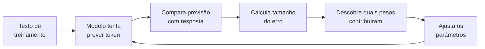
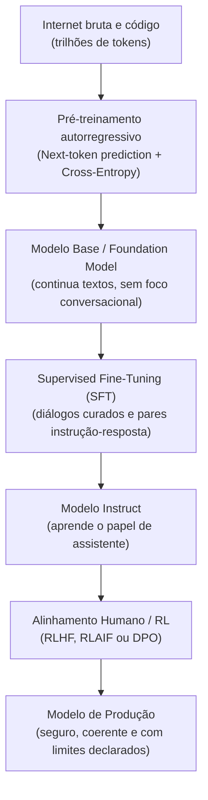
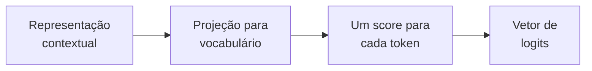
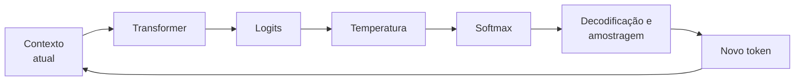

# Dinâmica de treino e inferência em LLMs: pré-treino, pós-treino e amostragem

Um modelo de linguagem de grande porte (*Large Language Model* ou LLM) é frequentemente descrito como um "auto-completar do teclado em grande escala". Embora a operação matemática durante a inferência seja formalmente autorregressiva (predição do próximo token), essa metáfora inicial é insuficiente para compreender como sistemas neurais profundos desenvolvem representações conceituais, modelam o mundo e executam raciocínio complexo.

> [!NOTE] Vocabulário antes de começar
> Para a primeira leitura, basta dominar estas cinco peças:
> * [[llm/Glossário de LLMs#Token|Token]]: unidade de texto que o modelo recebe e produz.
> * [[llm/Glossário de LLMs#Parâmetro|Parâmetro]]: número interno ajustável aprendido durante o treinamento.
> * [[llm/Glossário de LLMs#Função de perda|Função de perda]]: número que mede quão ruim foi uma previsão.
> * [[llm/Glossário de LLMs#Gradiente|Gradiente]]: informação sobre como uma mudança nos parâmetros afetaria o erro.
> * [[llm/Glossário de LLMs#Inferência|Inferência]]: uso do modelo já treinado para produzir uma saída.
>
> Se aparecer outro termo desconhecido, use [[llm/Glossário de LLMs|Glossário de LLMs]] e volte para o fluxo principal.

### O ciclo inteiro em linguagem simples

Antes da matemática, guarde esta sequência:



O treinamento é, essencialmente, a repetição desse ciclo em uma escala enorme. A matemática que aparece adiante formaliza cada uma dessas setas.

---

## 1. Intuição e analogia inicial: o motor de compressão

Pense no processo de aprendizado de uma LLM como a criação de um **algoritmo de compressão com perdas (*lossy compression*)** para toda a internet:
* Se você tentar compactar bilhões de páginas web, livros e repositórios de código em um arquivo de pesos matemáticos de algumas dezenas de gigabytes, um computador não conseguirá memorizar as frases textuais exatas.
* A única forma de compactar com sucesso é aprender as **regras subjacentes que geram os dados**: gramática, sintaxe, causalidade física, convenções de design, matemática, lógica de programação em [[javascript/Introdução ao JavaScript|JavaScript]] e nuances semânticas humanas.

Quando o modelo gera texto, ele não consulta uma base de dados armazenada; ele **reconstrói a informação a partir dessa representação comprimida**, avaliando continuamente a distribuição de probabilidades do próximo símbolo com base no contexto recebido.

---

## 2. Mecanismo técnico formal: o ciclo completo de vida

Para que um conjunto arbitrário de matrizes se transforme em um assistente de engenharia ou codificação, o sistema passa por duas grandes etapas: **pré-treinamento** e **pós-treinamento**.



### 2.1. O pré-treinamento: modelagem autorregressiva e cross-entropy
No pré-treinamento, o modelo recebe uma sequência de tokens $(x_1, x_2, \dots, x_{t-1})$ e calcula a probabilidade do token seguinte $x_t$.

O objetivo do treinamento é minimizar a função de perda de entropia cruzada (*Cross-Entropy Loss*):

$$\mathcal{L} = -\sum_{t=1}^{T} \log P(x_t \mid x_1, x_2, \dots, x_{t-1}; \theta)$$

Onde $\theta$ representa a totalidade dos pesos e parâmetros do modelo. Para cada token incorretamente previsto, um sinal de gradiente é retropropagado (*Backpropagation*), atualizando os pesos através de otimizadores baseados em descida de gradiente estocástica (como AdamW). Ao longo de meses de processamento em milhares de GPUs, o modelo constrói circuitos neurais capazes de rastrear entidades, dependências sintáticas e estados lógicos.

### 2.2. O pós-treinamento: SFT e RLHF/DPO
Um modelo apenas pré-treinado (*Base Model*) não responde perguntas como um assistente; se você perguntar `"Como declarar uma variável em C#?"`, ele pode continuar o texto gerando: `"Pergunta 2: Como criar um loop for?"`, pois viu muitas listas de exercícios na internet.

1. **Ajuste Fino Supervisionado (SFT - Supervised Fine-Tuning)**: O modelo é treinado em milhares de exemplos de alta qualidade no formato `Usuário: ... / Assistente: ...`. Aqui ele aprende a respeitar o formato conversacional.
2. **Aprendizado por Reforço com Feedback Humano (RLHF / DPO)**: Através de modelos de recompensa (*Reward Models*) ou otimização direta de preferências (*Direct Preference Optimization - DPO*), o modelo é penalizado por respostas evasivas, falsas ou perigosas, e recompensado por respostas claras, precisas e factualmente corretas.

---

## 3. Dinâmica de inferência: de logits a probabilidades

Na saída da última camada do Transformer, o modelo ainda não escolheu uma palavra nem produziu uma probabilidade. Ele possui uma [[llm/Fundamentos — vetores, matrizes, tensores e shapes|representação tensorial]] do contexto. Uma projeção final transforma a representação de cada posição em um vetor com uma posição para cada token do vocabulário.

Se o vocabulário tiver 128.000 tokens, a última dimensão da saída terá 128.000 números:

```text
[batch, tokens, vocab_size]
```

Para a posição que está sendo usada para prever o próximo token, podemos imaginar um vetor simplificado assim:

```text
Contexto: "O gato está..."

dormindo   →  4.2
comendo    →  2.7
dirigindo  → -1.3
azul       → -2.1
```

Esses números são os **logits**.

### 3.1. O que é um logit

Um [[llm/Glossário de LLMs#Logit|logit]] é uma **pontuação bruta de preferência** produzida pelo modelo para uma possibilidade antes da normalização em probabilidades.

O ponto essencial é que o valor absoluto isolado não possui a interpretação que uma porcentagem possui:

* `4.2` não significa 4,2%;
* `4.2` não significa 42%;
* um logit negativo não significa probabilidade negativa;
* logits não precisam somar 1;
* logits podem assumir valores positivos ou negativos.

O que inicialmente interessa são as **diferenças relativas**. No exemplo, `dormindo` recebeu uma pontuação maior que `comendo`, que recebeu uma pontuação muito maior que `dirigindo`.

> [!TIP] Analogia com pesquisa e design
> Imagine uma etapa de scoring de alternativas antes de transformar o resultado em participação percentual. Cada opção recebe uma pontuação segundo vários critérios. Uma opção pode marcar `4.2` e outra `2.7`, mas essas pontuações ainda não dizem “81% dos usuários escolheriam a primeira”. Falta uma regra que transforme os scores em uma distribuição comparável. Na LLM, essa regra é o Softmax.

### 3.2. De onde os logits vêm

Depois que o Transformer construiu uma representação contextual para uma posição, uma camada de saída projeta esse vetor para o tamanho do vocabulário.

O fluxo conceitual é:



Se `vocab_size = 128000`, cada posição recebe 128.000 logits. Isso conecta diretamente logits ao conceito de [[llm/Fundamentos — vetores, matrizes, tensores e shapes|shape]]: o modelo produz um eixo inteiro cujo significado é **qual token do vocabulário estamos pontuando**.

### 3.3. Softmax: de scores incomparáveis para uma distribuição

O [[llm/Glossário de LLMs#Softmax|Softmax]] recebe todos os logits juntos e os transforma em valores entre 0 e 1 cuja soma é 1.

A forma básica é:

$$P(x_i) = \frac{\exp(z_i)}{\sum_j \exp(z_j)}$$

Onde:

* $z_i$ é o logit do token que estamos observando;
* $\exp(z_i)$ transforma a pontuação em um valor positivo;
* o denominador soma os valores exponenciais de **todos** os candidatos;
* a divisão normaliza o resultado para que a soma final seja 1.

Por isso, a probabilidade de um token não depende apenas de seu próprio logit. Ela depende de **como seu logit se compara aos logits dos outros tokens**.

Exemplo conceitual:

```text
logits                         Softmax              probabilidades

dormindo    4.2   ─┐                              alta
comendo     2.7    ├── transformação ──────────→  menor
dirigindo  -1.3    │                              muito baixa
azul       -2.1   ─┘                              ainda menor
```

O Softmax preserva a ordem: se o logit de `dormindo` é maior que o de `comendo`, sua probabilidade também será maior. Mas ele transforma a distância entre scores em uma distribuição normalizada.

### 3.4. Por que usar exponencial

A exponencial tem duas propriedades úteis aqui:

* qualquer logit, inclusive negativo, vira um número positivo;
* diferenças entre logits ganham importância relativa: candidatos claramente favorecidos concentram mais massa de probabilidade.

Considere apenas dois logits, `4` e `2`. Depois da exponencial, eles se tornam aproximadamente `54,6` e `7,4`. A diferença original de apenas 2 unidades passa a produzir uma preferência probabilística muito mais clara depois da normalização.

Isso também explica por que **diferenças entre logits importam mais que o valor absoluto**. Somar a mesma constante a todos os logits não altera o resultado do Softmax.

### 3.5. Temperatura atua antes do Softmax

A [[llm/Glossário de LLMs#Temperatura|temperatura]] não cria novos conhecimentos nem muda os parâmetros do modelo. Ela reescala os logits antes do Softmax:

$$P(x_i) = \frac{\exp(z_i / T)}{\sum_j \exp(z_j / T)}$$

Se `T < 1`, as diferenças entre logits são ampliadas antes do Softmax e a distribuição fica mais concentrada nos candidatos de maior score.

Se `T > 1`, as diferenças são comprimidas e a distribuição fica mais espalhada.

```text
mesmos logits
     │
     ├── temperatura baixa → diferenças maiores → distribuição concentrada
     │
     └── temperatura alta  → diferenças menores → distribuição espalhada
```

> [!IMPORTANT] Temperatura zero
> Matematicamente, a fórmula com divisão por `T` não aceita `T = 0`. APIs que oferecem `temperature = 0` tratam esse caso por convenção de implementação, normalmente aproximando uma seleção determinística ou muito concentrada. Isso não significa literalmente executar a divisão por zero na equação do Softmax.

### 3.6. Softmax ainda não escolhe o token

Outro detalhe importante: **Softmax não é o mecanismo de escolha**.

Ele produz a distribuição:

```text
logits → Softmax → probabilidades
```

Depois disso, uma estratégia de decodificação decide o que fazer com a distribuição:

```text
probabilidades
     │
     ├── greedy / argmax → escolhe o maior
     ├── top-k           → restringe aos k maiores
     └── top-p           → restringe pela massa acumulada
                              ↓
                          amostragem
                              ↓
                         próximo token
```

Portanto, existem três conceitos diferentes:

* **logit**: score bruto;
* **Softmax**: transformação dos scores em distribuição;
* **decoding/amostragem**: regra usada para escolher o próximo token a partir dessa distribuição.

### 3.7. O ciclo autorregressivo completo

Depois que um token é escolhido, ele é acrescentado ao contexto e o processo inteiro acontece novamente:



É isso que significa uma LLM causal ser **autorregressiva**: cada token produzido passa a fazer parte da entrada usada para produzir o seguinte.

### 3.8. Top-p: amostragem por núcleo

Em vez de considerar todo o vocabulário, Top-p ordena os tokens por probabilidade e mantém o menor conjunto cuja soma cumulativa atinge o patamar $p$. Por exemplo, `p = 0.9` considera o grupo de tokens que, juntos, concentra aproximadamente 90% da massa de probabilidade antes da renormalização usada para amostrar.

---

## 4. Implementação mínima executável: pipeline de logits e amostragem com Top-p

Abaixo está o pipeline matemático completo em [[javascript/Introdução ao JavaScript|JavaScript]] puro simulando a transformação de logits brutos em probabilidades normalizadas com temperatura e corte Top-$p$:

```javascript
// Snippet atômico: Softmax com ajuste de temperatura
function aplicarSoftmaxComTemperatura(logits, temperatura = 1.0) {
    const tempSegura = Math.max(temperatura, 0.0001);
    // Subtrair o máximo não muda o Softmax e evita overflow exponencial.
    const maxLogit = Math.max(...logits);
    const exponenciais = logits.map(logit =>
        Math.exp((logit - maxLogit) / tempSegura)
    );
    const somaExponenciais = exponenciais.reduce((soma, valor) => soma + valor, 0);

    return exponenciais.map(valor => valor / somaExponenciais);
}
```

```javascript
// Exemplo completo e integrado: amostragem probabilística com corte Top-p
function aplicarSoftmaxComTemperatura(logits, temperatura = 1.0) {
    const tempSegura = Math.max(temperatura, 0.0001);
    const maxLogit = Math.max(...logits);
    const exponenciais = logits.map(logit =>
        Math.exp((logit - maxLogit) / tempSegura)
    );
    const somaExponenciais = exponenciais.reduce((soma, valor) => soma + valor, 0);

    return exponenciais.map(valor => valor / somaExponenciais);
}

function selecionarTokenNucleus(candidatos, temperatura = 0.7, topP = 0.9) {
    const tokens = candidatos.map(candidato => candidato.token);
    const logits = candidatos.map(candidato => candidato.logit);
    const probabilidades = aplicarSoftmaxComTemperatura(logits, temperatura);

    const paresOrdenados = tokens
        .map((token, indice) => ({ token, probabilidade: probabilidades[indice] }))
        .sort((a, b) => b.probabilidade - a.probabilidade);

    let somaCumulativa = 0;
    const nucleo = [];

    for (const par of paresOrdenados) {
        nucleo.push(par);
        somaCumulativa += par.probabilidade;
        if (somaCumulativa >= topP) break;
    }

    const massaDoNucleo = nucleo.reduce(
        (soma, par) => soma + par.probabilidade,
        0
    );
    const sorteio = Math.random() * massaDoNucleo;

    let acumulado = 0;
    for (const par of nucleo) {
        acumulado += par.probabilidade;
        if (sorteio <= acumulado) return par.token;
    }

    return nucleo[0].token;
}

const candidatos = [
    { token: "dormindo", logit: 4.2 },
    { token: "comendo", logit: 2.7 },
    { token: "dirigindo", logit: -1.3 },
    { token: "azul", logit: -2.1 }
];

console.log(selecionarTokenNucleus(candidatos, 0.7, 0.9));
```

---

## 5. Limites da analogia do auto-completar

Onde o modelo mental de "apenas um auto-completar" induz a erros graves de julgamento técnico:

1. **Memória de trabalho vs circuito computacional**: Um auto-completar clássico consulta frequências de sequências observadas (n-gramas). Uma LLM executa computação distribuída em dezenas de camadas residuais; durante os milissegundos de passagem pelo modelo, os tokens trocam informações para construir um estado latente abstrato do problema antes de emitir a resposta.
2. **Capacidade de generalização combinatória**: Uma LLM pode resolver um bug de sintaxe em um código mesclando regras de [[csharp/01-Introdução ao Csharp|C#]], padrões de arquitetura e nomes de variáveis que **nunca existiram juntos na história da internet**.
3. **Ponto cego do raciocínio linear**: Como a geração é estritamente para a frente (*feed-forward* por token), o modelo não pode "voltar atrás" para reescrever um token emitido de forma precipitada sem que isso tenha sido explicitamente guiado no contexto (daí a necessidade de modelos de raciocínio com busca e reflexão).

---

## 6. Implicações práticas de engenharia

* **Previsibilidade e testes**: Para testes de integração automatizados, configurações de baixa variabilidade podem reduzir diferenças entre execuções, mas determinismo completo depende do modelo, do provedor e da infraestrutura; `temperature = 0` não é uma garantia universal de resultados idênticos.
* **Alucinação e validação**: O objetivo de next-token prediction favorece continuidades linguisticamente plausíveis, não verificação factual automática. Sistemas que exigem fatos confiáveis precisam de contexto adequado, recuperação, ferramentas, validação ou outras formas de grounding.
* **Custo computacional de inferência**: O custo e a latência dependem de fatores como tamanho do modelo, comprimento do contexto, quantidade de tokens gerados, arquitetura, batching, cache e infraestrutura. Prompts menores podem ajudar, mas não são o único determinante do TTFT ou do custo de uma API.

---

## Conteúdo complementar em vídeo

* **State of GPT** (Andrej Karpathy - Microsoft Build): Explicação magistral sobre o pipeline completo de treinamento moderno (Pré-treino, SFT, Reward Modeling e RLHF), demonstrando a transição de um preditor de texto bruto para um assistente alinhado.
* **Cross Entropy Loss, Clearly Explained** (StatQuest with Josh Starmer): Demonstração passo a passo e visual da função de custo logarítmica utilizada para otimizar modelos de linguagem contra o próximo token real.
* **Large Language Models: How They Work and What They Mean** (3Blue1Brown): Introdução geométrica visual sobre como redes neurais processam vetores de probabilidade e convertem parâmetros em fluência textual.

---

## Resumo para memorizar

* **Natureza de compressão**: O pré-treinamento força a rede a aprender regularidades úteis dos dados para reduzir o erro de previsão do próximo token.
* **SFT e alinhamento**: Transformam um modelo base de continuação em um sistema mais adequado a seguir instruções e preferências de comportamento.
* **Logit**: É uma pontuação bruta para um candidato; não é porcentagem nem probabilidade.
* **Softmax**: Transforma o vetor inteiro de logits em uma distribuição normalizada cuja soma é 1.
* **Temperatura**: Reescala os logits antes do Softmax e altera a concentração da distribuição.
* **Decodificação**: Greedy, Top-k e Top-p são estratégias posteriores usadas para escolher ou restringir candidatos.
* **Ciclo autorregressivo**: O token escolhido volta ao contexto e todo o pipeline é executado novamente para produzir o próximo.
