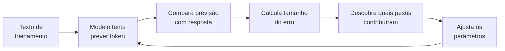
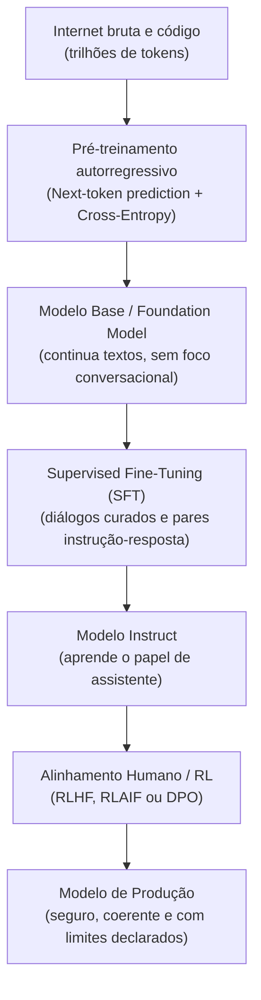
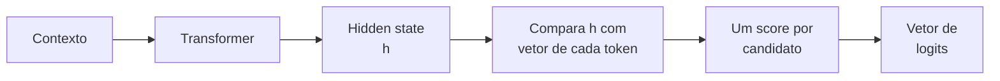
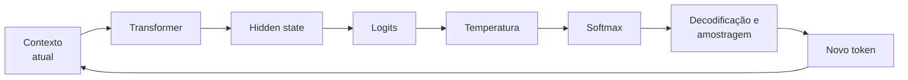

# Dinâmica de treino e inferência em LLMs: pré-treino, pós-treino e amostragem

Um modelo de linguagem de grande porte (*Large Language Model* ou LLM) é frequentemente descrito como um "auto-completar do teclado em grande escala". Embora a operação matemática durante a inferência seja formalmente autorregressiva (predição do próximo token), essa metáfora inicial é insuficiente para compreender como sistemas neurais profundos desenvolvem representações conceituais, modelam o mundo e executam raciocínio complexo.

> [!NOTE] Vocabulário antes de começar
> Para a primeira leitura, basta dominar estas cinco peças:
> * [[llm/Glossário de LLMs#Token|Token]]: unidade de texto que o modelo recebe e produz.
> * [[llm/Glossário de LLMs#Parâmetro|Parâmetro]]: número interno ajustável aprendido durante o treinamento.
> * [[llm/Glossário de LLMs#Função de perda|Função de perda]]: número que mede quão ruim foi uma previsão.
> * [[llm/Glossário de LLMs#Gradiente|Gradiente]]: informação sobre como uma mudança nos parâmetros afetaria o erro.
> * [[llm/Glossário de LLMs#Inferência|Inferência]]: uso do modelo já treinado para produzir uma saída.
>
> Se aparecer outro termo desconhecido, use [[llm/Glossário de LLMs|Glossário de LLMs]] e volte para o fluxo principal.

### O ciclo inteiro em linguagem simples

Antes da matemática, guarde esta sequência:



O treinamento é, essencialmente, a repetição desse ciclo em uma escala enorme. A matemática que aparece adiante formaliza cada uma dessas setas.

---

## 1. Intuição e analogia inicial: o motor de compressão

Pense no processo de aprendizado de uma LLM como a criação de um **algoritmo de compressão com perdas (*lossy compression*)** para toda a internet:
* Se você tentar compactar bilhões de páginas web, livros e repositórios de código em um arquivo de pesos matemáticos de algumas dezenas de gigabytes, um computador não conseguirá memorizar as frases textuais exatas.
* A única forma de compactar com sucesso é aprender as **regras subjacentes que geram os dados**: gramática, sintaxe, causalidade física, convenções de design, matemática, lógica de programação em [[javascript/Introdução ao JavaScript|JavaScript]] e nuances semânticas humanas.

Quando o modelo gera texto, ele não consulta uma base de dados armazenada; ele **reconstrói a informação a partir dessa representação comprimida**, avaliando continuamente a distribuição de probabilidades do próximo símbolo com base no contexto recebido.

---

## 2. Mecanismo técnico formal: o ciclo completo de vida

Para que um conjunto arbitrário de matrizes se transforme em um assistente de engenharia ou codificação, o sistema passa por duas grandes etapas: **pré-treinamento** e **pós-treinamento**.



### 2.1. O pré-treinamento: modelagem autorregressiva e cross-entropy
No pré-treinamento, o modelo recebe uma sequência de tokens $(x_1, x_2, \dots, x_{t-1})$ e calcula a probabilidade do token seguinte $x_t$.

O objetivo do treinamento é minimizar a função de perda de entropia cruzada (*Cross-Entropy Loss*):

$$\mathcal{L} = -\sum_{t=1}^{T} \log P(x_t \mid x_1, x_2, \dots, x_{t-1}; \theta)$$

Onde $\theta$ representa a totalidade dos pesos e parâmetros do modelo. Para cada token incorretamente previsto, a função de perda mede o erro e a [[llm/Glossário de LLMs#Backpropagation|backpropagation]] calcula [[llm/Glossário de LLMs#Gradiente|gradientes]] que indicam como mudanças nos parâmetros afetariam esse erro. Um otimizador como [[llm/Glossário de LLMs#AdamW|AdamW]] usa esses gradientes para atualizar os pesos.

Isso significa que **gradiente não é o score usado para escolher um token**. O gradiente pertence ao processo de aprendizagem: ele informa como alterar parâmetros para que, em exemplos futuros, o modelo produza scores melhores.

### 2.2. O pós-treinamento: SFT e RLHF/DPO
Um modelo apenas pré-treinado (*Base Model*) não responde perguntas como um assistente; se você perguntar `"Como declarar uma variável em C#?"`, ele pode continuar o texto gerando: `"Pergunta 2: Como criar um loop for?"`, pois viu muitas listas de exercícios na internet.

1. **Ajuste fino supervisionado (SFT - Supervised Fine-Tuning)**: O modelo é treinado em milhares de exemplos de alta qualidade no formato `Usuário: ... / Assistente: ...`. Aqui ele aprende a respeitar o formato conversacional.
2. **Aprendizado por reforço com feedback humano (RLHF / DPO)**: Através de modelos de recompensa (*Reward Models*) ou otimização direta de preferências (*Direct Preference Optimization - DPO*), o modelo é penalizado por respostas evasivas, falsas ou perigosas, e recompensado por respostas claras, precisas e factualmente corretas.

---

## 3. Dinâmica de inferência: de logits a probabilidades

Na saída da última camada do Transformer, o modelo ainda não escolheu uma palavra nem produziu uma probabilidade. Ele possui uma [[llm/Fundamentos — vetores, matrizes, tensores e shapes|representação tensorial]] do contexto. Uma projeção final transforma a representação de cada posição em um vetor com uma posição para cada token do vocabulário.

Se o vocabulário tiver 128.000 tokens, a última dimensão da saída terá 128.000 números:

```text
[batch, tokens, vocab_size]
```

Para a posição que está sendo usada para prever o próximo token, podemos imaginar um vetor simplificado assim:

```text
Contexto: "O gato está..."

dormindo   →  4.2
comendo    →  2.7
dirigindo  → -1.3
azul       → -2.1
```

Esses números são os **logits**.

### 3.1. O que é um logit

Um [[llm/Glossário de LLMs#Logit|logit]] é uma **pontuação bruta de compatibilidade entre o estado contextual atual do modelo e um token candidato**.

Uma maneira útil de pensar é que o Transformer termina sua computação dizendo algo como:

> “Dado tudo o que li até aqui, quanto cada token possível combina com o estado que construí?”

Para o contexto `"A capital da França é"`, uma saída simplificada poderia ser:

```text
Paris      →  8.1
Londres    →  3.4
França     →  2.8
banana     → -4.7
```

`8.1` não significa 81% de certeza. Significa apenas que, **na escala interna de scores deste passo**, `Paris` é muito mais compatível com o estado contextual do que `Londres` ou `banana`.

O ponto essencial é que o valor absoluto isolado não possui a interpretação que uma porcentagem possui:

* `4.2` não significa 4,2%;
* `4.2` não significa 42%;
* um logit negativo não significa probabilidade negativa;
* logits não precisam somar 1;
* logits podem assumir valores positivos ou negativos.

O que inicialmente interessa são as **diferenças relativas** entre os candidatos.

> [!IMPORTANT] Logit não é simplesmente proximidade semântica
> A intuição de “proximidade” ajuda, mas precisa ser qualificada. O modelo não pergunta apenas “qual palavra tem significado parecido com o contexto?”. O estado contextual já incorpora semântica, sintaxe, posição, relações entre entidades e padrões aprendidos. O logit mede a compatibilidade de um token como **próxima continuação** desse estado.
>
> Em `"A capital da França é"`, `Paris` não precisa ser a palavra semanticamente mais parecida com `França`; ela precisa ser a continuação que melhor se encaixa no estado contextual construído pelo modelo.

### 3.2. De onde os logits vêm

Depois que o Transformer construiu uma representação contextual para a posição atual, temos um vetor que costuma ser chamado de **hidden state** ou estado oculto. Vamos chamá-lo de $h$.

A camada de saída possui uma representação aprendida para cada token possível do vocabulário. Para cada candidato $i$, ela calcula aproximadamente:

$$z_i = h \cdot w_i + b_i$$

Onde:

* $h$ é o estado contextual produzido pelo Transformer;
* $w_i$ é o vetor de saída associado ao token candidato $i$;
* $b_i$ é um viés opcional da projeção;
* $z_i$ é o logit daquele token.

O produto escalar $h \cdot w_i$ funciona como um **score de compatibilidade aprendido**: combina as dimensões do estado contextual com as dimensões que favorecem aquele token na saída.

> [!NOTE] Similaridade não é a mesma operação
> Em busca semântica, “proximidade” frequentemente significa similaridade de cosseno entre embeddings normalizados. Logits não são, em geral, uma simples similaridade de cosseno entre palavras. Eles vêm da projeção aprendida do hidden state para o vocabulário. Algumas arquiteturas compartilham pesos entre embeddings de entrada e saída, mas mesmo nesses casos o score final continua sendo parte de uma projeção contextual, não uma consulta de “palavra mais parecida”.

O fluxo conceitual é:



Se `vocab_size = 128000`, cada posição recebe 128.000 logits. Isso conecta diretamente logits ao conceito de [[llm/Fundamentos — vetores, matrizes, tensores e shapes|shape]]: o modelo produz um eixo inteiro cujo significado é **qual token do vocabulário estamos pontuando**.

### 3.3. Logit e gradiente são coisas diferentes

Essa distinção é fundamental porque os dois aparecem próximos durante treinamento.

Na **inferência**, temos:

```text
contexto
→ hidden state
→ logits
→ Softmax
→ probabilidades
→ próximo token
```

Os parâmetros ficam fixos. Não é necessário calcular gradientes apenas para gerar uma resposta.

No **treinamento**, o começo é parecido, mas o processo continua:

```text
contexto
→ hidden state
→ logits
→ Softmax
→ probabilidades
→ loss
→ gradientes
→ atualização dos parâmetros
```

O **logit** responde:

> “quanto este token candidato pontua neste contexto?”

O **gradiente** responde:

> “se eu alterar este valor ou parâmetro um pouco, para que lado o erro muda?”

Para Softmax com cross-entropy, existe inclusive uma relação elegante entre os dois. O gradiente da perda em relação ao logit de cada classe pode ser escrito como:

$$\frac{\partial \mathcal{L}}{\partial z_i} = p_i - y_i$$

Onde $p_i$ é a probabilidade prevista e $y_i$ vale 1 para o token correto e 0 para os demais.

Se `Paris` era o token correto, mas recebeu probabilidade baixa, o gradiente cria um sinal que, propagado pelos parâmetros, tende a fazer o sistema **aumentar a compatibilidade com `Paris` em situações semelhantes** e reduzir a de candidatos incorretos.

> [!TIP] Uma frase para separar os conceitos
> **Logit é o placar atual. Gradiente é a instrução de como mudar o sistema de pontuação durante o treinamento.**

### 3.4. Softmax: de scores brutos para uma distribuição

O [[llm/Glossário de LLMs#Softmax|Softmax]] recebe todos os logits juntos e os transforma em valores entre 0 e 1 cuja soma é 1.

A forma básica é:

$$P(x_i) = \frac{\exp(z_i)}{\sum_j \exp(z_j)}$$

Onde:

* $z_i$ é o logit do token que estamos observando;
* $\exp(z_i)$ transforma a pontuação em um valor positivo;
* o denominador soma os valores exponenciais de **todos** os candidatos;
* a divisão normaliza o resultado para que a soma final seja 1.

Por isso, a probabilidade de um token não depende apenas de seu próprio logit. Ela depende de **como seu logit se compara aos logits dos outros tokens**.

Com os logits do exemplo `"O gato está..."`, o Softmax com temperatura 1 produz aproximadamente:

```text
dormindo    logit  4.2  →  81,4%
comendo     logit  2.7  →  18,2%
dirigindo   logit -1.3  →   0,3%
azul        logit -2.1  →   0,1%
```

O Softmax preserva a ordem dos logits, mas transforma a distância entre eles em uma distribuição normalizada.

### 3.5. Por que usar exponencial

A exponencial tem duas propriedades úteis aqui:

* qualquer logit, inclusive negativo, vira um número positivo;
* diferenças entre logits ganham importância relativa: candidatos claramente favorecidos concentram mais massa de probabilidade.

Considere apenas dois logits, `4` e `2`. Depois da exponencial, eles se tornam aproximadamente `54,6` e `7,4`. A diferença original de apenas 2 unidades passa a produzir uma preferência probabilística muito mais clara depois da normalização.

Isso também explica por que **diferenças entre logits importam mais que o valor absoluto**. Somar a mesma constante a todos os logits não altera o resultado do Softmax.

### 3.6. Temperatura: controlar o contraste entre os candidatos

A [[llm/Glossário de LLMs#Temperatura|temperatura]] não cria conhecimento, não altera os pesos do modelo e não faz o modelo “pensar mais”. Ela modifica **o contraste entre os logits antes do Softmax**.

A fórmula é:

$$P(x_i) = \frac{\exp(z_i / T)}{\sum_j \exp(z_j / T)}$$

O detalhe central está em dividir cada logit por $T$.

Se `T = 0,5`, dividir por um número menor que 1 aumenta as diferenças:

```text
logits originais:  [4.2, 2.7, -1.3, -2.1]
logits / 0,5:      [8.4, 5.4, -2.6, -4.2]
```

O candidato que já estava na frente passa a dominar ainda mais a distribuição.

Se `T = 2`, as diferenças diminuem:

```text
logits originais:  [4.2, 2.7, -1.3, -2.1]
logits / 2:        [2.1, 1.35, -0.65, -1.05]
```

Os candidatos menos favorecidos passam a receber uma parcela maior da probabilidade.

Com exatamente os mesmos logits, o efeito aproximado fica assim:

| Token | T = 0,5 | T = 1 | T = 2 |
| --- | ---: | ---: | ---: |
| `dormindo` | 95,3% | 81,4% | 63,3% |
| `comendo` | 4,7% | 18,2% | 29,9% |
| `dirigindo` | ~0,0% | 0,3% | 4,0% |
| `azul` | ~0,0% | 0,1% | 2,7% |

A temperatura **não muda qual token possui o maior logit** quando $T$ é positivo. Ela muda o quanto o líder domina a distribuição.

> [!TIP] Analogia com contraste visual
> Pense nos logits como níveis de luminosidade de quatro elementos. Temperatura baixa aumenta o contraste: o elemento mais forte se destaca e os demais quase desaparecem. Temperatura alta reduz o contraste: as diferenças continuam existindo, mas os elementos secundários ficam mais visíveis.

Isso ajuda a desfazer uma simplificação comum:

* temperatura baixa não significa automaticamente “resposta verdadeira”;
* temperatura alta não significa automaticamente “criatividade inteligente”;
* temperatura controla principalmente **quão concentrada ou espalhada fica a distribuição usada para escolher o próximo token**.

Em termos de comportamento, distribuições mais concentradas tendem a reduzir a variedade possível da amostragem; distribuições mais espalhadas permitem que candidatos menos prováveis sejam escolhidos com maior frequência.

> [!IMPORTANT] Temperatura zero
> Matematicamente, a fórmula com divisão por $T$ não aceita `T = 0`. APIs que oferecem `temperature = 0` tratam esse caso por convenção de implementação, normalmente aproximando uma seleção determinística ou extremamente concentrada. Isso não significa literalmente executar uma divisão por zero.

### 3.7. Softmax ainda não escolhe o token

Outro detalhe importante: **Softmax não é o mecanismo de escolha**.

Ele produz a distribuição:

```text
logits → temperatura → Softmax → probabilidades
```

Depois disso, uma estratégia de decodificação decide o que fazer com a distribuição:

```text
probabilidades
     │
     ├── greedy / argmax → escolhe o maior
     ├── top-k           → restringe aos k maiores
     └── top-p           → restringe pela massa acumulada
                              ↓
                          amostragem
                              ↓
                         próximo token
```

Portanto, existem quatro conceitos diferentes:

* **logit**: score bruto de compatibilidade;
* **temperatura**: reescala a diferença entre scores;
* **Softmax**: transforma os scores em distribuição;
* **decoding/amostragem**: regra usada para escolher o próximo token a partir dessa distribuição.

### 3.8. O ciclo autorregressivo completo

Depois que um token é escolhido, ele é acrescentado ao contexto e o processo inteiro acontece novamente:



É isso que significa uma LLM causal ser **autorregressiva**: cada token produzido passa a fazer parte da entrada usada para produzir o seguinte.

### 3.9. Top-p: amostragem por núcleo

Em vez de considerar todo o vocabulário, Top-p ordena os tokens por probabilidade e mantém o menor conjunto cuja soma cumulativa atinge o patamar $p$. Por exemplo, `p = 0.9` considera o grupo de tokens que, juntos, concentra aproximadamente 90% da massa de probabilidade antes da renormalização usada para amostrar.

---

## 4. Implementação mínima executável: pipeline de logits e amostragem com Top-p

Abaixo está o pipeline matemático completo em [[javascript/Introdução ao JavaScript|JavaScript]] puro simulando a transformação de logits brutos em probabilidades normalizadas com temperatura e corte Top-$p$:

```javascript
// Snippet atômico: Softmax com ajuste de temperatura
function aplicarSoftmaxComTemperatura(logits, temperatura = 1.0) {
    const tempSegura = Math.max(temperatura, 0.0001);
    // Subtrair o máximo não muda o Softmax e evita overflow exponencial.
    const maxLogit = Math.max(...logits);
    const exponenciais = logits.map(logit =>
        Math.exp((logit - maxLogit) / tempSegura)
    );
    const somaExponenciais = exponenciais.reduce((soma, valor) => soma + valor, 0);

    return exponenciais.map(valor => valor / somaExponenciais);
}
```

```javascript
// Exemplo completo e integrado: amostragem probabilística com corte Top-p
function aplicarSoftmaxComTemperatura(logits, temperatura = 1.0) {
    const tempSegura = Math.max(temperatura, 0.0001);
    const maxLogit = Math.max(...logits);
    const exponenciais = logits.map(logit =>
        Math.exp((logit - maxLogit) / tempSegura)
    );
    const somaExponenciais = exponenciais.reduce((soma, valor) => soma + valor, 0);

    return exponenciais.map(valor => valor / somaExponenciais);
}

function selecionarTokenNucleus(candidatos, temperatura = 0.7, topP = 0.9) {
    const tokens = candidatos.map(candidato => candidato.token);
    const logits = candidatos.map(candidato => candidato.logit);
    const probabilidades = aplicarSoftmaxComTemperatura(logits, temperatura);

    const paresOrdenados = tokens
        .map((token, indice) => ({ token, probabilidade: probabilidades[indice] }))
        .sort((a, b) => b.probabilidade - a.probabilidade);

    let somaCumulativa = 0;
    const nucleo = [];

    for (const par of paresOrdenados) {
        nucleo.push(par);
        somaCumulativa += par.probabilidade;
        if (somaCumulativa >= topP) break;
    }

    const massaDoNucleo = nucleo.reduce(
        (soma, par) => soma + par.probabilidade,
        0
    );
    const sorteio = Math.random() * massaDoNucleo;

    let acumulado = 0;
    for (const par of nucleo) {
        acumulado += par.probabilidade;
        if (sorteio <= acumulado) return par.token;
    }

    return nucleo[0].token;
}

const candidatos = [
    { token: "dormindo", logit: 4.2 },
    { token: "comendo", logit: 2.7 },
    { token: "dirigindo", logit: -1.3 },
    { token: "azul", logit: -2.1 }
];

console.log(selecionarTokenNucleus(candidatos, 0.7, 0.9));
```

---

## 5. Limites da analogia do auto-completar

Onde o modelo mental de "apenas um auto-completar" induz a erros graves de julgamento técnico:

1. **Memória de trabalho vs circuito computacional**: Um auto-completar clássico consulta frequências de sequências observadas (n-gramas). Uma LLM executa computação distribuída em dezenas de camadas residuais; durante os milissegundos de passagem pelo modelo, os tokens trocam informações para construir um estado latente abstrato do problema antes de emitir a resposta.
2. **Capacidade de generalização combinatória**: Uma LLM pode resolver um bug de sintaxe em um código mesclando regras de [[csharp/01-Introdução ao Csharp|C#]], padrões de arquitetura e nomes de variáveis que **nunca existiram juntos na história da internet**.
3. **Ponto cego do raciocínio linear**: Como a geração é estritamente para a frente (*feed-forward* por token), o modelo não pode "voltar atrás" para reescrever um token emitido de forma precipitada sem que isso tenha sido explicitamente guiado no contexto (daí a necessidade de modelos de raciocínio com busca e reflexão).

---

## 6. Implicações práticas de engenharia

* **Previsibilidade e testes**: Para testes de integração automatizados, configurações de baixa variabilidade podem reduzir diferenças entre execuções, mas determinismo completo depende do modelo, do provedor e da infraestrutura; `temperature = 0` não é uma garantia universal de resultados idênticos.
* **Alucinação e validação**: O objetivo de next-token prediction favorece continuidades linguisticamente plausíveis, não verificação factual automática. Sistemas que exigem fatos confiáveis precisam de contexto adequado, recuperação, ferramentas, validação ou outras formas de grounding.
* **Custo computacional de inferência**: O custo e a latência dependem de fatores como tamanho do modelo, comprimento do contexto, quantidade de tokens gerados, arquitetura, batching, cache e infraestrutura. Prompts menores podem ajudar, mas não são o único determinante do TTFT ou do custo de uma API.

---

## Conteúdo complementar em vídeo

* **State of GPT** (Andrej Karpathy - Microsoft Build): Explicação magistral sobre o pipeline completo de treinamento moderno (Pré-treino, SFT, Reward Modeling e RLHF), demonstrando a transição de um preditor de texto bruto para um assistente alinhado.
* **Cross Entropy Loss, Clearly Explained** (StatQuest with Josh Starmer): Demonstração passo a passo e visual da função de custo logarítmica utilizada para otimizar modelos de linguagem contra o próximo token real.
* **Large Language Models: How They Work and What They Mean** (3Blue1Brown): Introdução geométrica visual sobre como redes neurais processam vetores de probabilidade e convertem parâmetros em fluência textual.

---

## Resumo para memorizar

* **Natureza de compressão**: O pré-treinamento força a rede a aprender regularidades úteis dos dados para reduzir o erro de previsão do próximo token.
* **SFT e alinhamento**: Transformam um modelo base de continuação em um sistema mais adequado a seguir instruções e preferências de comportamento.
* **Hidden state**: É a representação contextual interna produzida pelo Transformer para uma posição.
* **Logit**: É um score bruto de compatibilidade entre o hidden state e um token candidato; não é porcentagem, probabilidade, similaridade de cosseno nem gradiente.
* **Gradiente**: É um sinal de treinamento que indica como alterações em valores e parâmetros afetariam a perda.
* **Softmax**: Transforma o vetor inteiro de logits em uma distribuição normalizada cuja soma é 1.
* **Temperatura**: Reescala as diferenças entre logits antes do Softmax; baixa temperatura concentra a distribuição e alta temperatura a espalha.
* **Decodificação**: Greedy, Top-k e Top-p são estratégias posteriores usadas para escolher ou restringir candidatos.
* **Ciclo autorregressivo**: O token escolhido volta ao contexto e todo o pipeline é executado novamente para produzir o próximo.