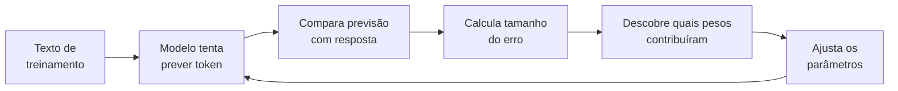
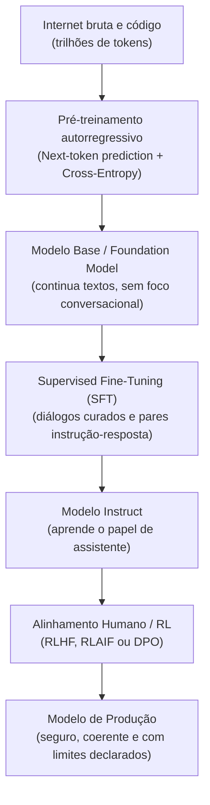

# Dinâmica de treino e inferência em LLMs: pré-treino, pós-treino e amostragem

Um modelo de linguagem de grande porte (*Large Language Model* ou LLM) é frequentemente descrito como um "auto-completar do teclado em grande escala". Embora a operação matemática durante a inferência seja formalmente autorregressiva (predição do próximo token), essa metáfora inicial é insuficiente para compreender como sistemas neurais profundos desenvolvem representações conceituais, modelam o mundo e executam raciocínio complexo.

> [!NOTE] Vocabulário antes de começar
> Para a primeira leitura, basta dominar estas cinco peças:
> * [[llm/Glossário de LLMs#Token|Token]]: unidade de texto que o modelo recebe e produz.
> * [[llm/Glossário de LLMs#Parâmetro|Parâmetro]]: número interno ajustável aprendido durante o treinamento.
> * [[llm/Glossário de LLMs#Função de perda|Função de perda]]: número que mede quão ruim foi uma previsão.
> * [[llm/Glossário de LLMs#Gradiente|Gradiente]]: informação sobre como uma mudança nos parâmetros afetaria o erro.
> * [[llm/Glossário de LLMs#Inferência|Inferência]]: uso do modelo já treinado para produzir uma saída.
>
> Se aparecer outro termo desconhecido, use [[llm/Glossário de LLMs|Glossário de LLMs]] e volte para o fluxo principal.

### O ciclo inteiro em linguagem simples

Antes da matemática, guarde esta sequência:



O treinamento é, essencialmente, a repetição desse ciclo em uma escala enorme. A matemática que aparece adiante formaliza cada uma dessas setas.

---

## 1. Intuição e analogia inicial: o motor de compressão

Pense no processo de aprendizado de uma LLM como a criação de um **algoritmo de compressão com perdas (*lossy compression*)** para toda a internet:
* Se você tentar compactar bilhões de páginas web, livros e repositórios de código em um arquivo de pesos matemáticos de algumas dezenas de gigabytes, um computador não conseguirá memorizar as frases textuais exatas.
* A única forma de compactar com sucesso é aprender as **regras subjacentes que geram os dados**: gramática, sintaxe, causalidade física, convenções de design, matemática, lógica de programação em [[javascript/Introdução ao JavaScript|JavaScript]] e nuances semânticas humanas.

Quando o modelo gera texto, ele não consulta uma base de dados armazenada; ele **reconstrói a informação a partir dessa representação comprimida**, avaliando continuamente a distribuição de probabilidades do próximo símbolo com base no contexto recebido.

---

## 2. Mecanismo técnico formal: o ciclo completo de vida

Para que um conjunto arbitrário de matrizes se transforme em um assistente de engenharia ou codificação, o sistema passa por duas grandes etapas: **pré-treinamento** e **pós-treinamento**.



### 2.1. O pré-treinamento: modelagem autorregressiva e cross-entropy
No pré-treinamento, o modelo recebe uma sequência de tokens $(x_1, x_2, \dots, x_{t-1})$ e calcula a probabilidade do token seguinte $x_t$.

O objetivo do treinamento é minimizar a função de perda de entropia cruzada (*Cross-Entropy Loss*):

$$\mathcal{L} = -\sum_{t=1}^{T} \log P(x_t \mid x_1, x_2, \dots, x_{t-1}; \theta)$$

Onde $\theta$ representa a totalidade dos pesos e parâmetros do modelo. Para cada token incorretamente previsto, um sinal de gradiente é retropropagado (*Backpropagation*), atualizando os pesos através de otimizadores baseados em descida de gradiente estocástica (como AdamW). Ao longo de meses de processamento em milhares de GPUs, o modelo constrói circuitos neurais capazes de rastrear entidades, dependências sintáticas e estados lógicos.

### 2.2. O pós-treinamento: SFT e RLHF/DPO
Um modelo apenas pré-treinado (*Base Model*) não responde perguntas como um assistente; se você perguntar `"Como declarar uma variável em C#?"`, ele pode continuar o texto gerando: `"Pergunta 2: Como criar um loop for?"`, pois viu muitas listas de exercícios na internet.

1. **Ajuste Fino Supervisionado (SFT - Supervised Fine-Tuning)**: O modelo é treinado em milhares de exemplos de alta qualidade no formato `Usuário: ... / Assistente: ...`. Aqui ele aprende a respeitar o formato conversacional.
2. **Aprendizado por Reforço com Feedback Humano (RLHF / DPO)**: Através de modelos de recompensa (*Reward Models*) ou otimização direta de preferências (*Direct Preference Optimization - DPO*), o modelo é penalizado por respostas evasivas, falsas ou perigosas, e recompensado por respostas claras, precisas e factualmente corretas.

---

## 3. Dinâmica de inferência e amostragem de logits

Na saída da última camada do Transformer, o modelo não emite palavras, mas um vetor de números reais não normalizados chamado **logits** (com tamanho igual ao vocabulário, ex.: 128.000 posições). Para transformar esses logits em probabilidades e escolher o token, aplicam-se operadores matemáticos de filtragem e temperatura:

### Temperatura ($T$)
A temperatura divide os logits antes da aplicação da função Softmax:

$$P(x_i) = \frac{\exp(z_i / T)}{\sum_{j} \exp(z_j / T)}$$

* Quando $T \to 0$ (ArgMax / Greedy): O modelo seleciona puramente o token com maior valor de logit. A saída se torna determinística e ideal para extrações em [[javascript/03-manipulacao/08-JSON|JSON]] e refatoração de código.
* Quando $T > 1.0$: A distribuição é achatada, aumentando a chance relativa de tokens menos óbvios. Isso eleva a variabilidade estilística, mas introduz risco de desvios lógicos.

### Top-$p$ (Amostragem por núcleo ou Nucleus Sampling)
Em vez de considerar todo o vocabulário, o algoritmo ordena os tokens por probabilidade e corta a lista assim que a soma cumulativa atinge o patamar $p$ (ex.: $p = 0.9$ considera apenas o grupo de tokens que juntos compõem 90% da massa de probabilidade).

---

## 4. Implementação mínima executável: pipeline de logits e amostragem com Top-p

Abaixo está o pipeline matemático completo em [[javascript/Introdução ao JavaScript|JavaScript]] puro simulando a transformação de logits brutos em probabilidades normalizadas com temperatura e corte Top-$p$:

```javascript
// Snippet atômico: Softmax termodinâmico com ajuste de temperatura
function aplicarSoftmaxComTemperatura(logits, temperatura = 1.0) {
    const tempSegura = Math.max(temperatura, 0.0001);
    // Subtrai o valor máximo para estabilidade numérica e evitar overflow exponencial
    const maxLogit = Math.max(...logits);
    const exponenciais = logits.map(l => Math.exp((l - maxLogit) / tempSegura));
    const somaExponenciais = exponenciais.reduce((acc, val) => acc + val, 0);
    return exponenciais.map(val => val / somaExponenciais);
}
```

```javascript
// Exemplo completo e integrado: amostragem probabilística com corte Top-p (Nucleus)
function selecionarTokenNucleus(candidatos, temperatura = 0.7, topP = 0.9) {
    const tokens = candidatos.map(c => c.token);
    const logitsBrutos = candidatos.map(c => c.logit);

    // 1. Aplicação da temperatura
    const probabilidades = aplicarSoftmaxComTemperatura(logitsBrutos, temperatura);

    // 2. Criação dos pares ordenados por probabilidade decrescente
    const paresOrdenados = tokens.map((token, idx) => ({
        token,
        prob: probabilidades[idx]
    })).sort((a, b) => b.prob - a.prob);

    // 3. Filtragem Top-p (núcleo cumulativo)
    let somaCumulativa = 0;
    const nucleoFiltrado = [];

    for (const par of paresOrdenados) {
        nucleoFiltrado.push(par);
        somaCumulativa += par.prob;
        if (somaCumulativa >= topP) break;
    }

    // 4. Renormalização da probabilidade dentro do núcleo
    const somaNucleo = nucleoFiltrado.reduce((acc, p) => acc + p.prob, 0);
    const aleatorio = Math.random() * somaNucleo;

    let acumulador = 0;
    for (const par of nucleoFiltrado) {
        acumulador += par.prob;
        if (aleatorio <= acumulador) {
            return { tokenEscolhido: par.token, probabilidadeOriginal: par.prob };
        }
    }

    return { tokenEscolhido: nucleoFiltrado[0].token, probabilidadeOriginal: nucleoFiltrado[0].prob };
}

// Demonstração com logits brutos emitidos pela última camada
const distribuicaoSaida = [
    { token: "function", logit: 12.4 },
    { token: "const", logit: 11.8 },
    { token: "class", logit: 9.1 },
    { token: "banana", logit: 1.2 },
    { token: "azul", logit: 0.4 }
];

const resultado = selecionarTokenNucleus(distribuicaoSaida, 0.5, 0.85);
console.log(`Token selecionado via inferência: "${resultado.tokenEscolhido}" (P: ${(resultado.probabilidadeOriginal * 100).toFixed(2)}%)`);
```

---

## 5. Limites da analogia do auto-completar

Onde o modelo mental de "apenas um auto-completar" induz a erros graves de julgamento técnico:

1. **Memória de trabalho vs circuito computacional**: Um auto-completar clássico consulta frequências de sequências observadas (n-gramas). Uma LLM executa computação distribuída em dezenas de camadas residuais; durante os milissegundos de passagem pelo modelo, os tokens trocam informações para construir um estado latente abstrato do problema antes de emitir a resposta.
2. **Capacidade de generalização combinatória**: Uma LLM pode resolver um bug de sintaxe em um código mesclando regras de [[csharp/01-Introdução ao Csharp|C#]], padrões de arquitetura e nomes de variáveis que **nunca existiram juntos na história da internet**.
3. **Ponto cego do raciocínio linear**: Como a geração é estritamente para a frente (*feed-forward* por token), o modelo não pode "voltar atrás" para reescrever um token emitido de forma precipitada sem que isso tenha sido explicitamente guiado no contexto (daí a necessidade de modelos de raciocínio com busca e reflexão).

---

## 6. Implicações práticas de engenharia

* **Previsibilidade e testes**: Para testes de integração automatizados, execute modelos com `temperatura = 0.0`. Variações probabilísticas em pipelines de CI/CD quebram asserções de testes determinísticos.
* **Alucinação como fenômeno intrínseco**: A alucinação não é um defeito de programação (*bug* de software tradicional); é uma consequência inevitável de um sistema projetado para maximizar fluência probabilística na ausência de validação empírica. Se o modelo não tiver fatos no contexto, a entropia o forçará a gerar uma continuidade plausível.
* **Custo computacional de inferência**: A complexidade da inferência é dominada pelo tamanho da janela de contexto e pelo número de parâmetros ativos. Manter prompts curtos e enxutos reduz diretamente a latência (*Time To First Token*) e a fatura financeira da API.

---

## Conteúdo complementar em vídeo

* **State of GPT** (Andrej Karpathy - Microsoft Build): Explicação magistral sobre o pipeline completo de treinamento moderno (Pré-treino, SFT, Reward Modeling e RLHF), demonstrando a transição de um preditor de texto bruto para um assistente alinhado.
* **Cross Entropy Loss, Clearly Explained** (StatQuest with Josh Starmer): Demonstração passo a passo e visual da função de custo logarítmica utilizada para otimizar modelos de linguagem contra o próximo token real.
* **Large Language Models: How They Work and What They Mean** (3Blue1Brown): Introdução geométrica visual sobre como redes neurais processam vetores de probabilidade e convertem parâmetros em fluência textual.

---

## Resumo para memorizar

* **Natureza de compressão**: O pré-treinamento força a rede a descobrir regras fundamentais de lógica e sintaxe para comprimir trilhões de tokens.
* **SFT e alinhamento**: Transformam um motor bruto de predição em um assistente conversacional estruturado e seguro.
* **Logits e temperatura**: A temperatura reescala as energias dos logits antes do Softmax, definindo a precisão ou aleatoriedade da amostragem.
* **Limitações arquiteturais**: A geração autorregressiva avança sem planejamento retrospectivo nativo, exigindo técnicas de engenharia de contexto para garantir consistência lógica.
