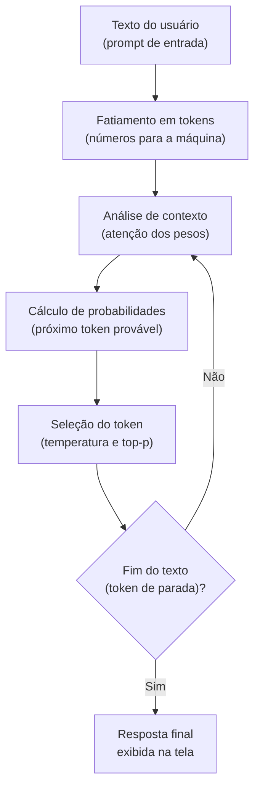

# O que são LLMs e como funcionam: o auto-completar em escala cósmica

Um modelo de linguagem de grande porte (*Large Language Model* ou LLM) pode parecer, à primeira vista, uma entidade dotada de consciência ou raciocínio humano. No entanto, por trás de respostas elegantes e códigos funcionais, existe um mecanismo puramente probabilístico e estatístico.

---

## O que é uma LLM? (A explicação Feynman)

Imagine o recurso de **auto-completar do teclado do seu celular**, que sugere a próxima palavra enquanto você digita uma mensagem. Se você digitar `"hoje o dia está..."`, o teclado sugere `"lindo"` ou `"ensolarado"` porque viu essa sequência milhares de vezes nas mensagens que você enviou anteriormente.

Uma LLM é exatamente esse mesmo auto-completar, mas expandido para uma escala colossal:
* Em vez de ler apenas as mensagens do seu aparelho, ela leu **trilhões de palavras** provenientes de livros, enciclopédias, artigos científicos e repositórios de código na internet.
* Em vez de considerar apenas as duas palavras anteriores, ela analisa **páginas inteiras de contexto** antes de escolher o próximo pedaço de texto.

Uma LLM não pesquisa respostas prontas em uma tabela como faz um banco de dados relacional. Ela calcula, a cada milissegundo: **"Diante de todo o texto que recebi até agora, qual é o próximo fragmento estatisticamente mais provável?"**

---

## O ciclo de geração de uma resposta

O processo pelo qual o modelo recebe uma solicitação (*prompt*) e devolve um resultado chama-se **inferência**. Esse fluxo ocorre em um ciclo sequencial contínuo:



---

## Os três pilares de uma LLM

### 1. Parâmetros e pesos (o conhecimento comprimido)
Quando dizemos que um modelo tem "70 bilhões de parâmetros" (70B), imagine uma mesa de som de estúdio com 70 bilhões de botões deslizantes (*sliders*). Durante o treinamento, esses botões foram ajustados para que a máquina consiga modelar a estrutura da linguagem humana e da lógica de programação. Os parâmetros são os números que guardam as conexões conceituais aprendidas.

### 2. Janela de contexto (a memória de trabalho da tela)
No [[me|me.md]], vimos a analogia do painel de camadas do Figma. A janela de contexto é a **área de transferência ativa** do modelo. Se uma LLM possui uma janela de contexto de 128.000 tokens (aproximadamente 300 páginas de livro), ela só consegue "enxergar" e relacionar as informações que couberem dentro desse espaço de trabalho ao mesmo tempo. Tudo o que ultrapassar esse limite é esquecido.

### 3. Hiperparâmetros de amostragem: temperatura e top-p
Quando o modelo calcula as probabilidades para a próxima palavra, ele não é obrigado a escolher sempre a de probabilidade número um:
* **Temperatura baixa (`0.0` a `0.2`)**: O modelo escolhe rigorosamente as opções mais prováveis e previsíveis. Ideal para geração de código em [[javascript/01-fundamentos/01-Var, let e const|JavaScript]], fórmulas matemáticas e extração de [[javascript/03-manipulacao/08-JSON|JSON]].
* **Temperatura alta (`0.7` a `1.0`)**: O modelo se permite escolher palavras alternativas com pontuações menores. Isso gera variedade, criatividade e estilo em textos dissertativos, mas aumenta a chance de erros factuais.

---

## O que são alucinações?

Como as LLMs são motores de fluência textual e não motores de validação da verdade, elas priorizam a continuidade plausível do texto. Quando o modelo não encontra evidências factuais em seus pesos para uma resposta, ele ainda assim tenta montar uma frase gramaticalmente perfeita e convincente. Esse fenômeno é conhecido como **alucinação**.

A melhor forma de evitar alucinações em desenvolvimento de software é fornecer o contexto direto na solicitação, técnica base de [[llm/04-Engenharia de prompt e padrões de contexto|Engenharia de prompt e padrões de contexto]].

---

## Exemplo prático: simulando a distribuição de probabilidades

Abaixo temos um trecho em [[javascript/Introdução ao JavaScript|JavaScript]] demonstrando a lógica matemática conceitual de como um modelo seleciona o próximo token a partir de pesos probabilísticos:

```javascript
// Snippet atômico: seleção ponderada com temperatura
function escolherProximoToken(probabilidades, temperatura = 1.0) {
    // Aplicação da temperatura nas probabilidades (Logits)
    const logitsAjustados = probabilidades.map(item => ({
        token: item.token,
        peso: Math.exp(Math.log(item.probabilidade) / temperatura)
    }));

    const somaPesos = logitsAjustados.reduce((acumulado, item) => acumulado + item.peso, 0);
    const aleatorio = Math.random() * somaPesos;

    let somaAtual = 0;
    for (const item of logitsAjustados) {
        somaAtual += item.peso;
        if (aleatorio <= somaAtual) return item.token;
    }
    return logitsAjustados[0].token;
}
```

```javascript
// Exemplo completo e integrado: simulador didático do ciclo de auto-completar
const vocabulario = [
    { token: "código", probabilidade: 0.55 },
    { token: "layout", probabilidade: 0.25 },
    { token: "bug", probabilidade: 0.15 },
    { token: "café", probabilidade: 0.05 }
];

function executarInferênciaSimulada(promptInicial, rodadas = 3, temp = 0.2) {
    let fraseGerada = promptInicial;
    console.log(`Prompt recebido: "${promptInicial}"`);

    for (let passo = 1; passo <= rodadas; passo++) {
        const tokenEscolhido = escolherProximoToken(vocabulario, temp);
        fraseGerada += " " + tokenEscolhido;
        console.log(`Passo ${passo} -> Token predito: "${tokenEscolhido}"`);
    }

    return fraseGerada;
}

const resultadoFinal = executarInferênciaSimulada("O desenvolvedor inspecionou o", 2, 0.1);
console.log(`Saída final: "${resultadoFinal}"`);
```

---

## Resumo para memorizar

* **Auto-completar estatístico**: LLMs calculam a probabilidade do próximo token com base em padrões extraídos de um volume maciço de dados.
* **Inferência cíclica**: Cada palavra gerada é reinserida no contexto anterior para que o próximo passo seja calculado.
* **Temperatura**: Define se o modelo deve ser estritamente determinístico (frio) ou exploratório (quente).
* **Ausência de consciência**: O modelo não compreende o mundo real; ele modela a relação simbólica entre representações numéricas de palavras.
