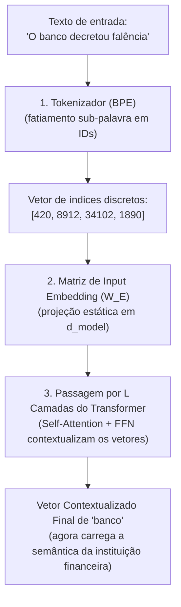

# Tokens, embeddings e espaço vetorial: representação discreta e contínua

Para que redes neurais processem a linguagem humana, símbolos alfanuméricos discretos precisam ser convertidos em tensores numéricos contínuos navegáveis geometricamente. No entanto, existe uma distinção crucial frequentemente confundida na literatura introdutória: a diferença entre **input embeddings de vocabulário** (estáticos), **representações contextuais dinâmicas** (internas ao Transformer) e **sentence embeddings** (modelos de busca semântica).

---

## 1. Intuição e analogia: as coordenadas conceituais

Imagine como descrevemos uma cor em uma interface digital no Figma ou no CSS:
* Usamos uma tupla tridimensional como `rgb(255, 0, 0)`. Essa trinca de números não é apenas um código de identificação; é uma **coordenada espacial** em um cubo de cor.
* A distância matemática entre `rgb(255, 0, 0)` e `rgb(250, 10, 10)` é mínima. O computador sabe que ambas são tonalidades de vermelho sem precisar ver a imagem.

Um **embedding** funciona sob o mesmo princípio, mas expande essa lógica para milhares de dimensões conceituais (ex.: $d = 1536$ ou $d = 4096$). Em vez de mapear apenas vermelho, verde e azul, cada eixo mede afinidades abstratas: grau de tecnicidade, tempo verbal, polaridade sentimental, abstração vs concretude.

---

## 2. Mecanismo técnico formal: do caractere ao vetor contextualizado

A transformação de texto em geometria ocorre em três estágios arquiteturais distintos:



### 2.1. Tokenização moderna: Byte-Pair Encoding (BPE)
Modelos modernos não dividem textos por palavras (o vocabulário explodiria) nem por caracteres individuais (a sequência ficaria longa demais para a atenção quadrática). Utiliza-se o algoritmo **Byte-Pair Encoding (BPE)** ou **WordPiece**:
* Inicia-se com os caracteres fundamentais em nível de bytes UTF-8.
* Estatisticamente, os pares de bytes mais frequentes em um corpus massivo são fundidos iterativamente até atingir um tamanho de vocabulário pré-definido $V$ (geralmente entre 32.000 e 128.000 tokens).
* Palavras frequentes tornam-se um único token (`" JavaScript"` $\to$ 1 token). Palavras raras ou compostas são particionadas (`"refatoração"` $\to$ `["ref", "ator", "ação"]`).

> [!WARNING] Limite de tokenização
> Como o modelo opera sobre tokens e não sobre letras individuais, tarefas como inverter palavras, contar a letra "r" na palavra "morango" ou resolver operações aritméticas com múltiplos dígitos tornam-se difíceis sem separação explícita de caracteres no prompt.

### 2.2. A matriz de embedding estático ($W_E$)
Ao entrar no modelo, cada token ID $i \in \{0, \dots, V-1\}$ é usado como índice para recuperar uma linha da matriz de projeção $W_E \in \mathbb{R}^{V \times d_{\text{model}}}$.
* Nessa etapa, o embedding do token `"banco"` é **puramente estático e idêntico**, seja em `"banco de praça"` ou em `"banco de investimentos"`.
* O embedding estático não possui consciência de contexto; ele é apenas o ponto de partida do vocabulário no espaço de ativações.

### 2.3. A representação contextual dinâmica
É somente ao atravessar os blocos residuais do Transformer que o vetor sofre transformações sucessivas por operações lineares e não lineares:
* O mecanismo de atenção mistura a informação do vetor `"banco"` com os vetores de `"decretou"` e `"falência"`.
* Na camada final ($L$), o vetor resultante não é mais a representação isolada do dicionário, mas uma **representação dinâmica rica em contexto**, onde a dimensão semântica financeira foi amplificada e a dimensão mobiliária de praça foi suprimida.

### 2.4. Distinção fundamental: embeddings de sentença para busca semântica
Modelos de busca vetorial (como `text-embedding-3-small` ou `bge-large`) são treinados especificamente como **bi-encoders** através de *contrastive learning*:
* Eles compactam uma sentença ou documento inteiro em um único vetor denso consolidado (frequentemente usando média ponderada ou pooling da última camada).
* Esses vetores são projetados para otimizar métricas geométricas diretas, como a **similaridade de cosseno**:

$$\text{Similaridade}(u, v) = \frac{u \cdot v}{\|u\| \|v\|} = \frac{\sum_{i=1}^{d} u_i v_i}{\sqrt{\sum_{i=1}^{d} u_i^2} \sqrt{\sum_{i=1}^{d} v_i^2}}$$

---

## 3. Implementação mínima executável: cálculo vetorial rigoroso e pooling

Abaixo está o código em [[javascript/Introdução ao JavaScript|JavaScript]] puro implementando a matemática correta da similaridade de cosseno (com validação estrita de normas e dimensões) e um mecanismo conceitual de pooling de tokens:

```javascript
// Snippet atômico: similaridade de cosseno com validação estrita de norma
function calcularSimilaridadeCosseno(vetorA, vetorB) {
    if (vetorA.length !== vetorB.length) {
        throw new Error("Os vetores devem possuir a mesma dimensão dimensional.");
    }

    let produtoEscalar = 0;
    let somaQuadradosA = 0;
    let somaQuadradosB = 0;

    for (let i = 0; i < vetorA.length; i++) {
        produtoEscalar += vetorA[i] * vetorB[i];
        somaQuadradosA += vetorA[i] * vetorA[i];
        somaQuadradosB += vetorB[i] * vetorB[i];
    }

    const normaA = Math.sqrt(somaQuadradosA);
    const normaB = Math.sqrt(somaQuadradosB);

    if (normaA === 0 || normaB === 0) return 0; // Proteção contra divisão por zero
    return produtoEscalar / (normaA * normaB);
}
```

```javascript
// Exemplo completo e integrado: simulador de pooling de sentença e busca vetorial
class BancoVetorialMinimo {
    constructor() {
        this.documentos = [];
    }

    // Simulação de Mean-Pooling: média dos vetores contextuais dos tokens da frase
    gerarEmbeddingDocumento(vetoresTokens) {
        const dimensao = vetoresTokens[0].length;
        const vetorMedio = new Array(dimensao).fill(0);

        for (const vetor of vetoresTokens) {
            for (let d = 0; d < dimensao; d++) {
                vetorMedio[d] += vetor[d];
            }
        }

        // Normalização pela quantidade de tokens
        return vetorMedio.map(val => val / vetoresTokens.length);
    }

    adicionarDocumento(id, texto, vetoresTokens) {
        const embedding = this.gerarEmbeddingDocumento(vetoresTokens);
        this.documentos.push({ id, texto, embedding });
    }

    buscarMaisProximo(embeddingConsulta) {
        return this.documentos
            .map(doc => ({
                id: doc.id,
                texto: doc.texto,
                score: calcularSimilaridadeCosseno(embeddingConsulta, doc.embedding)
            }))
            .sort((a, b) => b.score - a.score);
    }
}

// Demonstração: comparando consulta técnica com base de conhecimento
const db = new BancoVetorialMinimo();

// Vetores hipotéticos em espaço 4D: [Sintaxe, Frontend, Banco de Dados, Infraestrutura]
db.adicionarDocumento("doc-1", "Manipulação de DOM com eventos de clique", [
    [0.1, 0.9, 0.0, 0.1],
    [0.2, 0.85, 0.0, 0.0]
]);

db.adicionarDocumento("doc-2", "Configuração de registros DNS e CNAME", [
    [0.0, 0.1, 0.1, 0.95],
    [0.1, 0.0, 0.2, 0.90]
]);

// Consulta: 'Como alterar classes visuais com JavaScript'
const consultaTokens = [
    [0.15, 0.92, 0.0, 0.05],
    [0.20, 0.88, 0.0, 0.10]
];
const embeddingBusca = db.gerarEmbeddingDocumento(consultaTokens);

const ranking = db.buscarMaisProximo(embeddingBusca);
ranking.forEach(r => {
    console.log(`Documento: "${r.texto}" -> Similaridade: ${(r.score * 100).toFixed(2)}%`);
});
```

---

## 4. Limites da analogia do seletor de cores

1. **A maldição da dimensionalidade**: Em 3 dimensões (RGB), a intuição geométrica euclidiana funciona perfeitamente. Em 1536 dimensões, quase todos os vetores aleatórios são ortogonais entre si ($90^\circ$). Fenômenos de densidade espacial mudam radicalmente em espaços hiperdimensionais.
2. **Polissemia em embeddings estáticos**: O vetor estático inicial de $W_E$ não consegue resolver trocadilhos, ironias ou ambiguidades por si só. Dizer que "o embedding carrega o significado final da palavra" é falso para o Transformer; o significado só existe na dinâmica relacional entre os tokens através das camadas.

---

## 5. Implicações práticas de engenharia

* **Custos de armazenamento e indexing**: Vetores de float32 em $d = 1536$ consomem 6 KB por documento. Em bases com milhões de registros, técnicas de **Quantização Vetorial** (como quantização escalar de float32 para int8 ou vetores binários) e algoritmos de busca aproximada (HNSW - *Hierarchical Navigable Small World*) são indispensáveis para evitar esgotamento de memória RAM.
* **Sensibilidade de Chunking em RAG**: Ao construir pipelines de busca semântica, o tamanho do pedaço (*chunk*) enviado para o modelo de embedding afeta a qualidade. Chunks pequenos perdem contexto amplo; chunks excessivamente longos diluem conceitos específicos na média matemática do pooling vetorial.

---

## Resumo para memorizar

* **BPE**: Fatiamento de sub-palavras baseado em frequência estatística de bytes, balanceando tamanho de vocabulário e extensão de sequência.
* **$W_E$ vs Contexto**: O embedding estático inicial apenas indexa o token; a representação rica e desambiguada é construída dinamicamente pelas camadas do Transformer.
* **Modelos bi-encoders**: Redes treinadas especificamente com contrastive learning para gerar um único vetor representativo de sentenças ou documentos inteiros.
* **Similaridade de cosseno**: A medida angular normalizada fundamental para busca semântica, recuperações de RAG e classificação vetorial.
