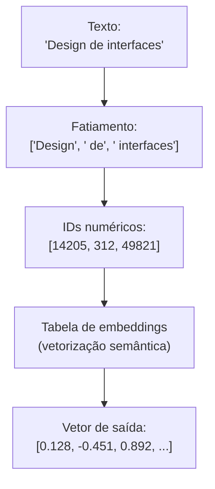

# Tokens, embeddings e espaço vetorial: como a IA enxerga o mundo

Computadores e modelos de inteligência artificial são processadores matemáticos. Eles não sabem o que é uma letra `"A"`, uma palavra `"botão"` ou uma frase inteira. Para que uma LLM possa analisar uma pergunta, ela precisa traduzir o texto em números através de duas etapas essenciais: **tokenização** e **vetorização (embeddings)**.

---

## O que são tokens?

Em vez de processar o texto caractere por caractere (muito lento) ou palavra por palavra (o vocabulário seria infinito), os modelos fatiam o texto em pequenos pedaços chamados **tokens**.

Um token pode ser uma palavra inteira, uma sílaba, um prefixo ou até mesmo um único caractere especial.

### Analogia Feynman: os blocos de Lego da escrita
Pense na tokenização como desmontar um modelo montado de Lego em blocos pré-fabricados de 2, 4 ou 8 pinos:
* Palavras muito comuns como `"o"`, `"de"`, `"em"` ou `"computador"` são blocos prontos de peça única (1 token).
* Palavras raras, técnicas ou em português com acentuação costumam ser quebradas em 2 ou mais blocos menores (ex.: `"desenvolvimento"` pode virar `["desenvolvi", "mento"]`).

Em média, para o idioma inglês, **1 token equivale a aproximadamente 4 caracteres** ou 0,75 palavras. Em línguas latinas com mais flexões morfológicas como o português, a contagem de tokens costuma ser ligeiramente maior.

---

## O que é um embedding? (A analogia do seletor de cores)

Depois que o texto foi fatiado em tokens, cada token recebe um identificador numérico inicial (como um ID de banco de dados). Mas apenas um ID não diz nada sobre o *significado* da palavra. É aqui que entram os **embeddings**.

### A cor no Figma vs o significado no espaço vetorial
No Figma ou no CSS, como você define uma cor com precisão? Você usa coordenadas numéricas em um espaço tridimensional chamado **RGB** ou **HSL**:
* Cor A: `rgb(255, 0, 0)` -> Vermelho puro.
* Cor B: `rgb(250, 20, 20)` -> Vermelho quase idêntico.
* Cor C: `rgb(0, 0, 255)` -> Azul puro, totalmente distante das duas anteriores.

Se você calcular a distância matemática entre os números de A e B, a distância é minúscula. A máquina "sabe" que A e B são cores parecidas sem precisar de olhos humanos.

Um **embedding** faz exatamente a mesma coisa, mas em vez de 3 dimensões (Vermelho, Verde, Azul), ele usa **milhares de dimensões conceituais** (ex.: 1536 ou 3072 números flutuantes para cada palavra).



---

## Espaço vetorial e similaridade de cosseno

Quando todas as palavras e frases são representadas por vetores de números, elas passam a habitar um mapa geométrico imaginário chamado **espaço vetorial**.

Palavras com significados próximos ficam agrupadas na mesma região desse mapa:
* `"botão"`, `"modal"` e `"dropdown"` ficam vizinhos próximos na região de elementos de UI.
* `"cachorro"`, `"gato"` e `"leão"` ficam agrupados na região de animais.

### Como medir a proximidade? (Similaridade de cosseno)
Para saber se duas frases tratam do mesmo assunto, não comparamos letras iguais. Calculamos o ângulo entre seus vetores no espaço:
* Se o ângulo for $0^\circ$ (cosseno = $1.0$), os significados são idênticos.
* Se o ângulo for $90^\circ$ (cosseno = $0.0$), não há qualquer relação temática.
* Se o ângulo for $180^\circ$ (cosseno = $-1.0$), os conceitos são opostos.

Essa matemática é a fundação da busca semântica em vaults do Obsidian, sistemas de recomendação da Netflix e bancos de dados vetoriais (como Pinecone, Chroma ou pgvector).

---

## Exemplo em JavaScript: calculando a distância semântica entre dois vetores

Abaixo está a implementação real do cálculo de **similaridade de cosseno** em [[javascript/Introdução ao JavaScript|JavaScript]], a mesma fórmula usada internamente por buscadores de IA:

```javascript
// Snippet atômico: produto escalar e cálculo de norma
function calcularSimilaridadeCosseno(vetorA, vetorB) {
    let produtoEscalar = 0;
    let normaA = 0;
    let normaB = 0;

    for (let i = 0; i < vetorA.length; i++) {
        produtoEscalar += vetorA[i] * vetorB[i];
        normaA += vetorA[i] * vetorA[i];
        normaB += vetorB[i] * vetorB[i];
    }

    return produtoEscalar / (Math.sqrt(normA) * Math.sqrt(normaB));
}
```

```javascript
// Exemplo completo e integrado: comparador de proximidade conceitual
// Simulando vetores de 4 dimensões de tópicos: [UI, Front-end, Animais, Culinária]
const vetorBotao = [0.95, 0.90, 0.01, 0.02];
const vetorComponente = [0.92, 0.88, 0.00, 0.05];
const vetorReceitaBolo = [0.03, 0.01, 0.05, 0.98];

function analisarProximidade(termo1, vetor1, termo2, vetor2) {
    const pontuacao = calcularSimilaridadeCosseno(vetor1, vetor2);
    const porcentagem = (pontuacao * 100).toFixed(1);
    console.log(`Proximidade semântica entre "${termo1}" e "${termo2}": ${porcentagem}%`);
}

analisarProximidade("Botão", vetorBotao, "Componente", vetorComponente);
analisarProximidade("Botão", vetorBotao, "Receita de Bolo", vetorReceitaBolo);
```

---

## Resumo para memorizar

* **Tokens**: Pedaços atômicos de palavras que a IA consegue catalogar e quantificar.
* **Embeddings**: A lista de números (coordenadas) que descreve o significado e a essência semântica de cada token.
* **Espaço vetorial**: O mapa geométrico onde ideias similares ficam fisicamente próximas umas das outras.
* **Similaridade de cosseno**: A régua matemática usada para medir o grau de parentesco entre dois conceitos a partir do ângulo entre seus vetores.
