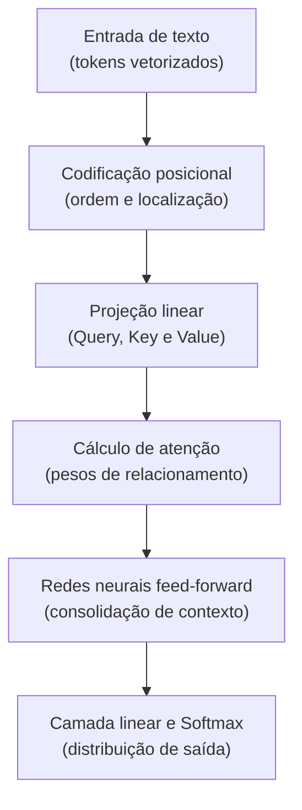

# A arquitetura Transformer e o mecanismo de atenção: o motor da revolução da IA

Em 2017, uma equipe de pesquisadores do Google publicou um artigo científico com um título histórico: *"Attention Is All You Need"*. Esse documento introduziu a arquitetura **Transformer**, a estrutura que substituiu todas as abordagens anteriores de processamento de linguagem natural (como RNNs e LSTMs) e deu origem a modelos como GPT, Claude, Gemini e Llama.

---

## O problema das redes neurais antigas

Antes do Transformer, os computadores liam textos de forma estritamente sequencial, palavra por palavra, da esquerda para a direita, como uma pessoa tentando memorizar um parágrafo enorme numa fita cassete:
* Quando chegavam na palavra número 100 de uma frase, a rede já havia esquecido ou distorcido os detalhes das primeiras palavras.
* Não era possível processar todas as palavras simultaneamente, o que impedia o uso de placas de vídeo modernas (GPUs) em sua capacidade máxima.

O Transformer resolveu isso de uma só vez com dois conceitos revolucionários: **processamento paralelo de toda a frase** e **atenção própria (*Self-Attention*)**.

---

## O que é o mecanismo de atenção? (A analogia da hierarquia visual do design)

Imagine que você está navegando em uma página de produto bem desenhada ou em um arquivo no Figma:
* Seus olhos não leem cada pixel em linha reta da esquerda para a direita.
* Seu cérebro aplica **atenção seletiva**: você olha para o título principal, conecta instantaneamente com a foto do produto e associa com a cor chamativa do botão de compra (*Call to Action*).

O mecanismo de **Self-Attention** faz exatamente isso com as palavras de um texto. Ao analisar uma palavra específica, ele mede quanta "atenção" essa palavra deve dedicar a todas as outras palavras ao redor.

### O exemplo clássico da ambiguidade
Considere a seguinte frase:
> *"O animal não atravessou a rua porque **ele** estava muito cansado."*

A quem a palavra **"ele"** se refere? Ao animal ou à rua?
Para um ser humano, é óbvio que é ao animal. Mas para um computador antigo, ambas eram substantivos neutros. O mecanismo de atenção calcula conexões entre `"ele"` e todas as palavras da frase e descobre uma correlação fortíssima entre `"ele"`, `"cansado"` e `"animal"`, descartando a palavra `"rua"`.



---

## Os três papéis da atenção: Query, Key e Value

Internamente, para descobrir quem se relaciona com quem, o mecanismo de atenção emprega um padrão comparável a uma consulta de busca ou a uma pesquisa em banco de dados:

1. **Query (A Pergunta)**: É a palavra atual levantando a mão e perguntando: *"O que estou procurando para fazer sentido?"*
2. **Key (A Chave / Rótulo)**: São as etiquetas de todas as outras palavras dizendo: *"Aqui está o tipo de informação que eu ofereço."*
3. **Value (O Conteúdo)**: É a carga de significado real que será somada se a Query e a Key derem compatibilidade (*match*).

A fórmula fundamental da atenção escalada calcula a compatibilidade entre a Query ($Q$) e todas as Keys ($K$), normaliza o resultado e multiplica pelos Values ($V$):

$$\text{Attention}(Q, K, V) = \text{softmax}\left(\frac{Q K^T}{\sqrt{d_k}}\right) V$$

---

## Atenção de múltiplas cabeças (Multi-Head Attention)

Um designer experiente não olha para uma tela apenas sob um aspecto. Ele avalia contraste de cores, hierarquia tipográfica e alinhamento de grid, tudo em paralelo.

No Transformer, isso se chama **Multi-Head Attention**. Em vez de calcular uma única rede de atenção, o modelo possui dezenas de "cabeças" trabalhando ao mesmo tempo:
* Uma cabeça foca em identificar relações gramaticais (sujeito e verbo).
* Outra cabeça foca em referências pronominais (ele, ela, isso).
* Outra cabeça foca no tom emocional e estilo do texto.

---

## Exemplo em JavaScript: simulando o cálculo de atenção de um token

Abaixo temos uma demonstração prática em [[javascript/Introdução ao JavaScript|JavaScript]] de como uma matriz simplificada de pontuações de atenção conecta pronomes aos substantivos de maior relevância:

```javascript
// Snippet atômico: função de ativação Softmax para converter pontuações em porcentagens
function softmax(valores) {
    const exponenciais = valores.map(v => Math.exp(v));
    const somaExponenciais = exponenciais.reduce((acc, v) => acc + v, 0);
    return exponenciais.map(v => v / somaExponenciais);
}
```

```javascript
// Exemplo completo e integrado: calculadora didática de foco de atenção
const palavrasFrase = ["O", "animal", "não", "atravessou", "a", "rua", "porque", "ele", "estava", "cansado"];

// Pontuações fictícias de compatibilidade calculadas entre 'ele' e as outras palavras (Q * K)
const pontuacoesBrutas = [0.1, 8.5, 0.2, 1.1, 0.1, 0.4, 0.3, 2.0, 1.5, 7.8];

function calcularMapaDeAtencao(palavras, pontuacoes, palavraFoco) {
    const pesosAtencao = softmax(pontuacoes);

    console.log(`Distribuição de atenção calculada para o termo "${palavraFoco}":`);
    palavras.forEach((palavra, idx) => {
        const porcentagem = (pesosAtencao[idx] * 100).toFixed(2);
        const barraVisual = "█".repeat(Math.round(porcentagem / 5));
        console.log(`${palavra.padEnd(12)} -> ${porcentagem.padStart(6)}% ${barraVisual}`);
    });
}

calcularMapaDeAtencao(palavrasFrase, pontuacoesBrutas, "ele");
```

---

## Resumo para memorizar

* **Revolução paralela**: O Transformer processa todos os tokens de uma vez, permitindo treinamento maciço em hardware moderno.
* **Self-Attention**: A capacidade de cada palavra medir sua conexão e relevância em relação a todas as outras palavras do mesmo texto.
* **Query, Key e Value**: A mecânica matemática inspirada em buscas de banco de dados para ponderar afinidades conceituais.
* **Multi-Head**: Várias lentes de análise simultâneas analisando sintaxe, semântica e contexto ao mesmo tempo.
