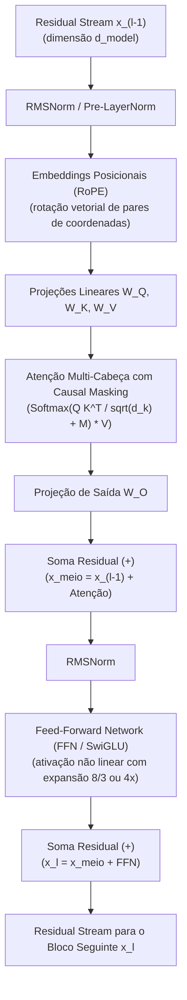

# Arquitetura do Transformer e mecanismo de atenção: tensores, RoPE e KV cache

Em 2017, o artigo *"Attention Is All You Need"* (Vaswani et al.) transformou o paradigma do processamento de linguagem natural. Embora o artigo original propusesse uma arquitetura codificador-decodificador (*Encoder-Decoder*) voltada para tradução automática, a evolução dos modelos de fundação modernos (como GPT, Llama e Claude) consolidou a variante **Decoder-only autorregressiva** como o padrão dominante para geração de texto e código.

---

## 1. Intuição e analogia: o quadro de comunicações do estúdio

Pense em um time multidisciplinar em uma sala de design de produto:
* Em uma linha de montagem linear antiga (redes recorrentes RNNs), uma pessoa só podia falar com o colega imediatamente ao lado, passando um bilhete que ia se desgastando e perdendo dados até chegar ao final da sala.
* No Transformer, todos os profissionais (tokens) estão sentados em uma mesa redonda ao mesmo tempo. No centro da sala há um **quadro compartilhado de anotações (o Residual Stream)**.
* Cada especialista analisa as fichas dos outros colegas simultaneamente, decide quais informações são críticas para o seu trabalho (*Self-Attention*) e anota sua contribuição de volta no quadro sem apagar o que já estava lá.

---

## 2. Mecanismo técnico formal: o bloco Transformer em detalhes

A representação de um token atravessa uma pilha de $L$ blocos idênticos. O fluxo interno de cada bloco é estruturado por operações matriciais rigorosas:



### 2.1. Residual stream e normalização (RMSNorm)
O vetor de ativação central $x \in \mathbb{R}^{d_{\text{model}}}$ flui de ponta a ponta pelo modelo:
* **Conexões residuais**: Em vez de substituir $x$ pelo resultado da camada, o modelo soma a saída: $x_{l} = x_{l-1} + f(x_{l-1})$. Isso cria uma "supervia" de gradientes que evita o desaparecimento do gradiente (*Vanishing Gradient*) durante o treinamento de centenas de camadas.
* **RMSNorm (Root Mean Square Normalization)**: Substituiu a antiga LayerNorm na maioria dos modelos modernos por dispensar o cálculo da média, normalizando os tensores puramente pela raiz quadrada da média dos quadrados e reduzindo o overhead computacional em cerca de 10% a 50%.

### 2.2. Embeddings posicionais rotacionais (RoPE)
Como o cálculo de atenção é invariante à permutação (uma operação matricial não sabe quem veio antes ou depois), os modelos precisam injetar a ordem dos tokens:
* **RoPE (Rotary Position Embedding)**: Em vez de somar vetores posicionais fixos na entrada, o RoPE rotaciona os vetores de Query e Key no plano complexo bidimensional por um ângulo proporcional à posição $m$ do token na sequência. O produto escalar resultante $q_m^T k_n$ passa a depender diretamente da **distância relativa** $(m - n)$, permitindo extrapolação de janelas de contexto com maior estabilidade.

### 2.3. O cálculo formal da atenção multi-cabeça e Causal Masking
Para cada cabeça de atenção $h \in \{1, \dots, H\}$, com dimensão $d_k = d_{\text{model}} / H$, calculam-se as projeções lineares:

$$Q = X W_Q, \quad K = X W_K, \quad V = X W_V$$

A matriz de compatibilidade $Q K^T$ é escalada por $\sqrt{d_k}$ para evitar que produtos escalares em alta dimensão caiam em regiões de gradiente quase nulo da função Softmax:

$$\text{Attention}(Q, K, V) = \text{Softmax}\left(\frac{Q K^T}{\sqrt{d_k}} + M\right) V$$

Onde $M$ é a **Causal Mask** (máscara triangular inferior):

$$M_{ij} = \begin{cases} 0, & \text{se } i \ge j \\ -\infty, & \text{se } i < j \end{cases}$$

Ao somar $-\infty$, a função Softmax converte essas posições em probabilidade estritamente zero ($\exp(-\infty) = 0$), garantindo que o token presente nunca tenha acesso aos tokens que estão no futuro durante o treinamento paralelo.

### 2.4. Feed-Forward Network (FFN) e ativações SwiGLU
Enquanto a atenção é o mecanismo onde os tokens se comunicam entre si horizontalmente, a camada **FFN** opera em cada token individualmente de forma vertical:
* É considerada a **memória factual/associativa** do modelo.
* Em arquiteturas modernas (como Llama), utiliza-se **SwiGLU** (Swish-Gated Linear Unit), expandindo a dimensão intermediária para $\frac{8}{3} d_{\text{model}}$ com uma porta de controle multiplicativa não linear:

$$\text{SwiGLU}(x) = (\text{Swish}(x W_{\text{gate}}) \odot x W_{\text{up}}) W_{\text{down}}$$

---

## 3. As três famílias arquiteturais do Transformer

| Arquitetura | Exemplos | Mecanismo de Atenção | Melhor Aplicação Prática |
| :--- | :--- | :--- | :--- |
| **Decoder-only** | GPT-4, Llama 3, Claude, Gemini | Causal (máscara triangular, olha só para trás) | Geração de texto, código, diálogo e raciocínio autorregressivo. |
| **Encoder-only** | BERT, RoBERTa, DeBERTa | Bidirecional (olha para frente e para trás livremente) | Classificação de texto, extração de entidades (NER) e modelos de embeddings. |
| **Encoder-Decoder** | T5, BART, Whisper (áudio) | Encoder bidirecional + Decoder com Cross-Attention | Tradução automática, transcrição de áudio para texto e resumos supervisionados. |

---

## 4. O papel crítico do KV Cache na inferência

Durante a geração interativa de texto token por token, recalcular as projeções $K$ e $V$ de todos os tokens anteriores a cada novo passo consumiria tempo $O(N^2)$ proibitivo.

O **KV Cache** resolve isso armazenando as matrizes $K$ e $V$ das camadas anteriores na memória da GPU:
* O novo token precisa calcular sua Query $Q$ atual e compará-la apenas com os $K$ já guardados no cache.
* **O gargalo de hardware**: O KV Cache não consome poder de processamento matemático (FLOPS), mas sim **largura de banda e capacidade de memória VRAM**. Em contextos longos (ex.: 128k tokens com múltiplos usuários simultâneos), o tamanho do KV Cache pode ultrapassar o próprio tamanho dos pesos do modelo, exigindo técnicas modernas como **GQA (Grouped-Query Attention)** e **PagedAttention**.

---

## 5. Implementação mínima executável: atenção escalada com Causal Masking

Abaixo temos a implementação matricial completa em [[javascript/Introdução ao JavaScript|JavaScript]] puro simulando o cálculo exato de atenção auto-regressiva com máscara causal:

```javascript
// Snippet atômico: multiplicação de matrizes 2D em JavaScript
function multiplicarMatrizes(A, B) {
    const linhasA = A.length;
    const colsA = A[0].length;
    const colsB = B[0].length;
    const C = Array.from({ length: linhasA }, () => new Array(colsB).fill(0));

    for (let i = 0; i < linhasA; i++) {
        for (let j = 0; j < colsB; j++) {
            let soma = 0;
            for (let k = 0; k < colsA; k++) {
                soma += A[i][k] * B[k][j];
            }
            C[i][j] = soma;
        }
    }
    return C;
}
```

```javascript
// Exemplo completo e integrado: motor de Self-Attention Causal com Softmax
function calcularAtencaoCausal(Q, K, V) {
    const seqLen = Q.length;
    const dK = Q[0].length;
    const raizDK = Math.sqrt(dK);

    // 1. Transpor matriz K (dimensão dK x seqLen)
    const KT = Array.from({ length: dK }, (_, col) => K.map(linha => linha[col]));

    // 2. Produto escalar Q * K^T (dimensão seqLen x seqLen)
    const pontuacoes = multiplicarMatrizes(Q, KT);

    // 3. Aplicação da escala e da Máscara Causal triangular (M_ij = -Infinity para j > i)
    for (let i = 0; i < seqLen; i++) {
        for (let j = 0; j < seqLen; j++) {
            if (j > i) {
                pontuacoes[i][j] = -Infinity; // Impede vazamento do futuro
            } else {
                pontuacoes[i][j] = pontuacoes[i][j] / raizDK;
            }
        }
    }

    // 4. Softmax por linha para obter a matriz de pesos de atenção
    const pesosAtencao = pontuacoes.map(linha => {
        // Encontra o máximo finito para estabilidade numérica
        const valoresValidos = linha.filter(v => v !== -Infinity);
        const maximo = valoresValidos.length > 0 ? Math.max(...valoresValidos) : 0;

        const expLinha = linha.map(v => (v === -Infinity ? 0 : Math.exp(v - maximo)));
        const somaExp = expLinha.reduce((acc, v) => acc + v, 0);
        return expLinha.map(v => (somaExp === 0 ? 0 : v / somaExp));
    });

    // 5. Multiplicação pelos Values: Pesos * V
    const saida = multiplicarMatrizes(pesosAtencao, V);

    return { pesosAtencao, saida };
}

// Demonstração: sequência de 3 tokens com dimensão dk = 2
// Tokens: [0: "O", 1: "código", 2: "quebrou"]
const Q_demo = [[1.2, 0.5], [0.8, 1.4], [0.2, 0.9]];
const K_demo = [[1.1, 0.4], [0.7, 1.5], [0.1, 0.8]];
const V_demo = [[0.9, 0.1], [0.2, 0.8], [0.5, 0.5]];

const { pesosAtencao, saida } = calcularAtencaoCausal(Q_demo, K_demo, V_demo);

console.log("Matriz de Pesos de Atenção Causal (Softmax):");
pesosAtencao.forEach((linha, i) => {
    const formatada = linha.map(v => (v * 100).toFixed(1) + "%").join(" | ");
    console.log(`Token ${i} atende para -> [ ${formatada} ]`);
});
```

---

## 6. Limites da analogia do quadro do estúdio

1. **Atenção não é raciocínio deliberado**: Atenção é apenas ponderação matricial combinatória. O modelo não "pensa sobre o que prestar atenção"; as matrizes de projeção $W_Q$ e $W_K$ foram estaticamente ajustadas no treinamento para maximizar a concordância entre traços semânticos e preditivos.
2. **Custo quadrático fundamental**: No quadro humano, 10 pessoas conversando é gerenciável. Na atenção do Transformer, cada token se compara com todos os outros tokens presentes ($N \times N$), gerando complexidade temporal e espacial $O(N^2)$ que torna o processamento de milhões de tokens simultâneos um imenso desafio de infraestrutura.

---

## 7. Implicações práticas de engenharia

* **Memory-bound vs Compute-bound**: A fase de *Prefill* (ler o prompt de entrada) é altamente paralelizável e limita-se pela capacidade matemática da GPU (*compute-bound*). A fase de *Decode* (gerar token a token lendo o KV Cache) é limitada pela velocidade de transferência de dados da memória da GPU (*memory-bandwidth bound*).
* **Decisões de infraestrutura de inferência**: Ao hospedar LLMs locais (com vLLM, Ollama ou TGI), o tamanho do contexto configurado determina diretamente quanta VRAM precisa ser alocada previamente para as tabelas do KV Cache, ditando o número máximo de usuários simultâneos suportados por placa.

---

## Resumo para memorizar

* **Residual stream**: O tronco principal de dados que preserva a identidade dos tensores e viabiliza redes com mais de 100 camadas profundas.
* **Causal Masking**: A restrição triangular com $-\infty$ que garante matematicamente a causalidade temporal no treinamento e na inferência autorregressiva.
* **RoPE**: A codificação posicional geométrica dominante que preserva a distância relativa entre tokens via rotação no plano complexo.
* **KV Cache**: O componente que salva a inferência do custo quadrático em tempo de execução, transferindo a pressão para a memória VRAM.
