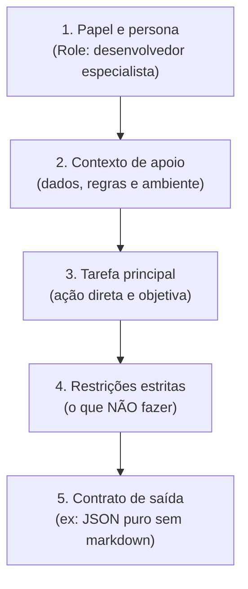

# Engenharia de prompt e padrões de contexto: a linguagem de controle dos modelos

Engenharia de prompt (*Prompt Engineering*) não é apenas escrever perguntas em linguagem natural de forma intuitiva. É a disciplina técnica de estruturar entradas de dados para direcionar a probabilidade das LLMs rumo a saídas previsíveis, seguras e bem formatadas.

---

## O que é um prompt? (A analogia do design briefing)

Pense na LLM como um **designer sênior freelancer talentoso, mas que sofre de amnésia total**:
* Se você disser apenas: *"Crie um layout bonito para um aplicativo"*, ele pode entregar algo em estilo brutalista, ou um aplicativo médico em tons de cinza, ou um e-commerce em cores neon. A culpa não é dele; o pedido foi excessivamente vago.
* Agora, se você entregar um **briefing de projeto estruturado**: *"Crie a interface de um app de entregas, público-alvo de 18 a 25 anos, modo escuro com paleta rosa suave, tipografia grotesca limpa, contendo header fixo e lista em cards"*, o resultado será preciso de primeira.

Um prompt técnico é exatamente esse briefing detalhado, delimitando as fronteiras de decisão da máquina.

---

## Anatomia de um prompt profissional

Um prompt robusto para integração de software é dividido em blocos lógicos bem delimitados:



---

## Os principais padrões de direcionamento

### 1. Instrução zero-shot
O modelo recebe a tarefa de forma direta, sem nenhum exemplo prévio de resposta.
> *"Classifique o seguinte comentário de cliente como Positivo, Neutro ou Negativo: 'A entrega atrasou dois dias, mas o produto veio perfeito.' Classificação:"*

### 2. Instrução few-shot (aprendizado em contexto)
Você fornece 2 ou 3 pares de exemplo (entrada $\to$ saída) antes de apresentar a entrada real. Isso reduz drasticamente a variabilidade do modelo e ensina o formato desejado sem precisar treinar pesos novos.
> *"Converta solicitações de usuários em ações de interface:*  
> *Entrada: 'Quero ver meus pedidos' -> Ação: NAVEGAR_PARA('/pedidos')*  
> *Entrada: 'Mudar para tema claro' -> Ação: ALTERAR_TEMA('claro')*  
> *Entrada: 'Sair da minha conta' -> Ação:"*

### 3. Cadeia de pensamento (Chain-of-Thought - CoT)
Quando a tarefa envolve raciocínio lógico, cálculos ou depuração de código, pedir para o modelo *"pensar passo a passo antes de dar a resposta final"* força a rede a gerar tokens intermediários de reflexão, aumentando a probabilidade de acerto na conclusão.

---

## Evitando respostas quebradas em APIs: o contrato JSON

Ao construir aplicações em [[javascript/Introdução ao JavaScript|JavaScript]] ou [[react/Introdução ao React|React]], você nunca deve confiar em respostas de texto corrido livre de uma LLM se o objetivo for preencher estados de interface.

Sempre declare um **schema estrito** e exija o retorno em formato [[javascript/03-manipulacao/08-JSON|JSON]]:
> *"Responda estritamente com um objeto JSON válido, sem cercas de código markdown (```json), seguindo a estrutura: { 'titulo': string, 'prioridade': 'alta' | 'baixa', 'tags': string[] }."*

---

## Exemplo prático em JavaScript: construtor de prompts modular

Abaixo temos um módulo em [[javascript/Introdução ao JavaScript|JavaScript]] que monta prompts técnicos consistentes garantindo a inclusão de papéis, contexto e contratos de saída:

```javascript
// Snippet atômico: função para formatar mensagens no padrão OpenAI/Gemini
function formatarMensagemSistema(instrucao, formatoSaida = "JSON") {
    return {
        role: "system",
        content: `${instrucao}\nIMPORTANTE: Forneça sua resposta estritamente no formato ${formatoSaida}.`
    };
}
```

```javascript
// Exemplo completo e integrado: classe construtora de prompts para interfaces
class ConstrutorDePrompt {
    constructor(papel) {
        this.papel = papel;
        this.exemplos = [];
        this.regras = [];
        this.formatoEsperado = "texto";
    }

    adicionarRegra(regra) {
        this.regras.push(`- ${regra}`);
        return this;
    }

    adicionarExemplo(entrada, saida) {
        this.exemplos.push({ entrada, saida });
        return this;
    }

    definirFormatoSaida(formato) {
        this.formatoEsperado = formato;
        return this;
    }

    gerarPromptFinal(entradaDoUsuario) {
        let textoFinal = `[PAPEL]\n${this.papel}\n\n`;

        if (this.regras.length > 0) {
            textoFinal += `[REGRAS E RESTRIÇÕES]\n${this.regras.join("\n")}\n\n`;
        }

        if (this.exemplos.length > 0) {
            textoFinal += `[EXEMPLOS DE RESPOSTA]\n`;
            this.exemplos.forEach((ex, idx) => {
                textoFinal += `Exemplo ${idx + 1}:\nEntrada: ${ex.entrada}\nSaída: ${ex.saida}\n`;
            });
            textoFinal += "\n";
        }

        textoFinal += `[CONTRATO DE FORMATO]\nA resposta deve ser entregue em: ${this.formatoEsperado}\n\n`;
        textoFinal += `[ENTRADA DO USUÁRIO]\n${entradaDoUsuario}\n\n[RESPOSTA]:`;

        return textoFinal;
    }
}

// Uso prático para criar um extrator de tags de UI
const extratorPrompt = new ConstrutorDePrompt("Você é um assistente de taxonomia de design system.")
    .adicionarRegra("Nunca invente componentes inexistentes.")
    .adicionarRegra("Ignore elogios ou saudações.")
    .definirFormatoSaida("JSON puro com a chave 'componentes' contendo uma lista de strings")
    .adicionarExemplo("Adicione um botão rosa e um input de busca", '{"componentes": ["Button", "SearchInput"]}');

const promptParaEnvio = extratorPrompt.gerarPromptFinal("Crie um formulário de login com card e checkbox de lembrar senha");
console.log(promptParaEnvio);
```

---

## Resumo para memorizar

* **Briefing claro**: Uma LLM reflete a clareza e as fronteiras definidas no texto da entrada.
* **Few-shot**: Mostrar 2 ou 3 exemplos práticos reduz ambiguidades melhor do que parágrafos longos de explicação.
* **Chain-of-Thought**: Pedir para raciocinar por etapas antes da conclusão final previne erros lógicos.
* **Contratos estritos**: Em desenvolvimento de software, force sempre respostas em [[javascript/03-manipulacao/08-JSON|JSON]] validável.
