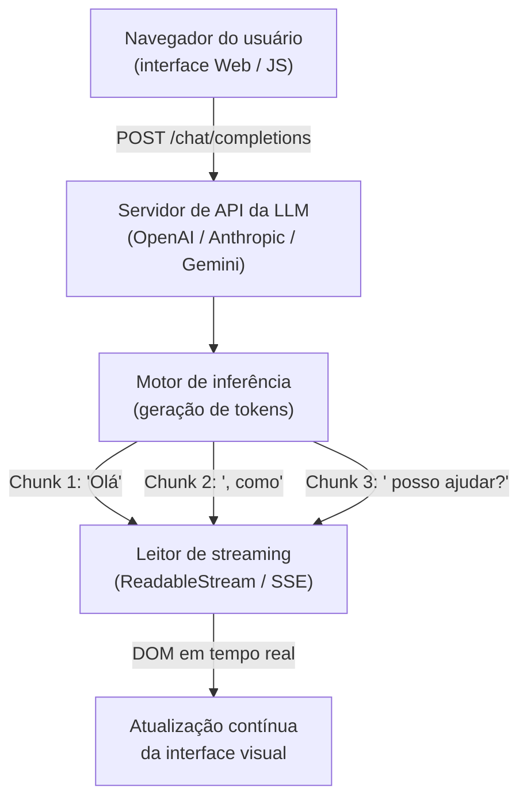

# Consumindo APIs de LLMs com JavaScript: conectando a inteligência à interface

A forma mais comum de utilizar grandes modelos de linguagem no desenvolvimento web é através de **APIs HTTP REST** consumidas via [[javascript/05-assincrono/03-Fetch|Fetch]] e [[javascript/05-assincrono/04-Async await|Async Await]]. Neste artigo, você verá como estruturar requisições seguras e implementar o famoso efeito de digitação em tempo real (*streaming*).

---

## O modelo mental de uma requisição para LLMs

Consumir uma API de IA é idêntico a consumir qualquer outro serviço web em nuvem (como vimos em [[javascript/Consumindo APIs e Fetch|Consumindo APIs e Fetch]]), com duas particularidades fundamentais:

1. **Payload com histórico completo**: Como as LLMs não possuem estado de sessão (*stateless*), a cada mensagem você precisa reenviar todo o histórico da conversa (`messages: [{ role: "user", content: "..." }]`).
2. **Tempo de resposta elevado**: Ao contrário de uma consulta de banco de dados que responde em 50ms, a geração de texto de uma LLM pode levar de 2 a 15 segundos. Por isso, a técnica de **Streaming via Server-Sent Events (SSE)** é indispensável para uma boa experiência de usuário (*UX*).



---

## Estrutura padrão de uma requisição (sem streaming)

O padrão universal adotado pela indústria (OpenAI, Groq, Ollama, DeepSeek) utiliza um endpoint `POST` enviando um corpo no formato [[javascript/03-manipulacao/08-JSON|JSON]]:

```javascript
// Snippet atômico: chamada básica com fetch
async function consultarModelo(promptUsuario, apiKey) {
    const resposta = await fetch("https://api.openai.com/v1/chat/completions", {
        method: "POST",
        headers: {
            "Content-Type": "application/json",
            "Authorization": `Bearer ${apiKey}`
        },
        body: JSON.stringify({
            model: "gpt-4o-mini",
            messages: [
                { role: "system", content: "Você é um assistente conciso de programação." },
                { role: "user", content: promptUsuario }
            ],
            temperature: 0.2
        })
    });

    const dados = await resposta.json();
    return dados.choices[0].message.content;
}
```

---

## Como funciona o efeito de digitação (Streaming com ReadableStream)

Ao ativar o parâmetro `stream: true` na requisição, o servidor não espera terminar toda a frase para responder. Ele envia pedacinhos de texto (*chunks*) à medida que cada token é calculado.

No navegador, utilizamos a API nativa `response.body.getReader()` com um `TextDecoder` para ler esses pacotes contínuos:

```javascript
// Snippet atômico: leitura de fluxo em tempo real
async function processarFluxo(leitor, elementoDestino) {
    const decodificador = new TextDecoder("utf-8");

    while (true) {
        const { done, value } = await leitor.read();
        if (done) break;

        const fragmentoTexto = decodificador.decode(value);
        elementoDestino.textContent += fragmentoTexto;
    }
}
```

---

## Exemplo completo e integrado: componente de chat interativo

Abaixo temos uma mini-aplicação completa em [[javascript/Introdução ao JavaScript|JavaScript]] puro que captura o evento de envio do formulário, exibe o estado de carregamento e simula a digitação de tokens no [[javascript/04-dom-e-browser/01-DOM|DOM]]:

```javascript
// Exemplo completo: gerenciador de interface com streaming simulado
class AssistenteChatUI {
    constructor(seletorContainer) {
        this.container = document.querySelector(seletorContainer);
        this.historico = [
            { role: "system", content: "Você é um mentor especialista em design e front-end." }
        ];
    }

    renderizarMensagem(autor, textoInicial = "") {
        const balao = document.createElement("div");
        balao.className = `mensagem-chat ${autor}`;
        balao.innerHTML = `<strong>${autor === "user" ? "Você" : "Assistente"}:</strong> <span class="conteudo">${textoInicial}</span>`;
        this.container.appendChild(balao);
        return balao.querySelector(".conteudo");
    }

    async simularDigitacao(elementoAlvo, textoCompleto) {
        const tokens = textoCompleto.split(" ");
        for (let i = 0; i < tokens.length; i++) {
            elementoAlvo.textContent += (i > 0 ? " " : "") + tokens[i];
            // Aguarda 40ms entre cada palavra para simular a chegada de tokens via streaming
            await new Promise(resolve => setTimeout(resolve, 40));
        }
    }

    async enviarMensagem(textoDoUsuario) {
        // 1. Renderiza a mensagem do usuário na tela
        this.renderizarMensagem("user", textoDoUsuario);
        this.historico.push({ role: "user", content: textoDoUsuario });

        // 2. Prepara o balão vazio do assistente para receber o stream
        const elementoResposta = this.renderizarMensagem("assistant", "");

        // 3. Simulação da inferência do modelo com streaming de saída
        const respostaFicticia = "Excelente pergunta. No desenvolvimento de interfaces modernas, " +
            "a integração com LLMs transforma dados brutos em componentes dinâmicos em tempo real.";

        await this.simularDigitacao(elementoResposta, respostaFicticia);
        this.historico.push({ role: "assistant", content: respostaFicticia });
    }
}

// Inicialização conceitual no DOM
document.addEventListener("DOMContentLoaded", () => {
    const areaMensagens = document.getElementById("chat-mensagens");
    if (areaMensagens) {
        const chat = new AssistenteChatUI("#chat-mensagens");
        chat.enviarMensagem("Como o streaming melhora o feedback visual para o usuário?");
    }
});
```

---

## Boas práticas essenciais de segurança e produto

1. **Nunca exponha chaves de API (`API Keys`) no front-end**: Chaves colocadas diretamente no código do navegador podem ser lidas por qualquer pessoa pelo DevTools. Sempre crie uma rota de backend intermediária (usando [[javascript/06-arquitetura-e-avancado/02-Node.js|Node.js]] ou Edge Functions) para assinar as requisições.
2. **Defina limites de taxa (*Rate Limiting*)**: Modelos de IA custam dinheiro por token processado. Limite o número de envios por minuto em formulários públicos.
3. **Tratamento de timeout e cancelamento**: Use `AbortController` para permitir que o usuário cancele uma geração longa caso mude de ideia ou deseje enviar outra pergunta.

---

## Resumo para memorizar

* **Protocolo HTTP REST**: As LLMs são acessadas por requisições `POST` com histórico de mensagens serializado em [[javascript/03-manipulacao/08-JSON|JSON]].
* **Streaming é essencial**: Entregar tokens gradualmente reduz a percepção de espera do usuário de 10 segundos para menos de 1 segundo.
* **Segurança em primeiro lugar**: Chaves de provedores de IA devem residir exclusivamente em ambientes de backend protegidos.
