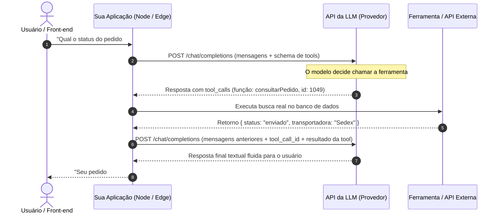

# Sistemas de produção com LLMs, tool calling e streaming: o loop agente e resiliência

Integrar modelos de linguagem em aplicações modernas de software vai muito além de enviar uma pergunta via [[javascript/05-assincrono/03-Fetch|Fetch]] e renderizar uma string de texto corrido. Em sistemas corporativos e interfaces interativas, o consumo de APIs de IA exige domínio sobre o **loop agente-ferramenta (*Tool Calling*)**, streaming com separação de eventos, resiliência contra saturação de limites de taxa e otimização de custos via **Prompt Caching**.

---

## 1. Intuição e analogia: o assistente executivo e o catálogo de ferramentas

Pense na integração de uma LLM como a contratação de um **assistente executivo brilhante que trabalha isolado em uma sala sem internet nem telefone**:
* Por si só, ele não pode consultar o saldo de um usuário, não pode enviar um e-mail e não sabe que horas são agora.
* Você entrega a ele um **catálogo de ferramentas disponíveis** com instruções claras de uso (ex.: *"ferramenta `consultarSaldo(clienteId)`"*).
* Quando o usuário faz uma pergunta, o assistente analisa a demanda e, se necessário, devolve uma nota dizendo: *"Por favor, execute a ferramenta `consultarSaldo` com o parâmetro `clienteId: 482` e me traga o resultado."*
* O seu software executa a consulta no banco de dados real, devolve o resultado para o assistente e ele finalmente elabora a resposta amigável para o usuário.

---

## 2. Mecanismo técnico formal: o loop completo de Tool Calling

As APIs modernas (OpenAI, Anthropic, Gemini, Groq, Ollama) não executam código internamente em seus servidores por padrão; elas **decidem estruturadamente quando uma ferramenta deve ser chamada** através de decodificação restringida.

O fluxo de orquestração funciona em um ciclo de quatro etapas:



---

## 3. Padrões de arquitetura de software para produção

Construir software tolerante a falhas com LLMs exige a aplicação de padrões consagrados de engenharia de software distribuída:

### 3.1. Retries exponenciais com jitter
APIs de IA sofrem picos súbitos de latência e erros intermitentes de sobrecarga (HTTP 429 - *Rate Limit Exceeded* ou HTTP 503 - *Service Unavailable*). Nunca faça retries imediatos em loop fechado; utilize **backoff exponencial com perturbação aleatória (*jitter*)**:

$$\text{Espera} = \min(\text{Máximo}, \text{Base} \times 2^{\text{tentativa}}) + \text{random}(0, \text{jitter})$$

### 3.2. Prompt Caching: derrubando custo e latência
Modelos modernos oferecem **Prompt Caching** automático ou explícito (Anthropic e OpenAI):
* Quando você envia um bloco de contexto longo e estático (como a documentação inteira da sua empresa ou um schema de banco) no início da mensagem do sistema, o provedor reutiliza as matrizes do **KV Cache** já calculadas na GPU em requisições anteriores.
* Isso **reduz o custo financeiro em até 90%** para tokens cacheados e derruba o *Time To First Token* (TTFT) de vários segundos para milissegundos.
* **Regra de ouro**: Coloque sempre o conteúdo fixo e imutável no topo absoluto do prompt (System instructions e documentação base) e deixe o dado dinâmico do usuário estritamente no final.

---

## 4. Implementação mínima executável: orquestrador de Tool Calling e resiliência

Abaixo temos uma implementação completa em [[javascript/Introdução ao JavaScript|JavaScript]] puro simulando o loop de execução de ferramentas com tratamento de schema e chamadas assíncronas:

```javascript
// Snippet atômico: algoritmo de retry exponencial com jitter
async function executarComRetry(funcaoAssincrona, maxTentativas = 3, baseMs = 500) {
    for (let tentativa = 1; tentativa <= maxTentativas; tentativa++) {
        try {
            return await funcaoAssincrona();
        } catch (erro) {
            if (tentativa === maxTentativas) throw erro;
            const atraso = (baseMs * Math.pow(2, tentativa)) + (Math.random() * 200);
            console.warn(`Tentativa ${tentativa} falhou. Aguardando ${atraso.toFixed(0)}ms antes do retry...`);
            await new Promise(resolve => setTimeout(resolve, atraso));
        }
    }
}
```

```javascript
// Exemplo completo e integrado: loop de agente com catálogo de ferramentas
class OrquestradorDeAgente {
    constructor() {
        this.ferramentas = new Map();
        this.mensagens = [];
    }

    registrarFerramenta(nome, descricao, schemaParametros, funcaoExecutora) {
        this.ferramentas.set(nome, {
            definicao: {
                type: "function",
                function: { name: nome, description: descricao, parameters: schemaParametros }
            },
            executar: funcaoExecutora
        });
    }

    // Simula a inferência da LLM (em produção, é uma requisição fetch para o endpoint da API)
    async simularChamadaAPI(historico) {
        const ultimaMsg = historico[historico.length - 1];

        // Se a última mensagem for a resposta de uma ferramenta, o modelo conclui a conversa
        if (ultimaMsg.role === "tool") {
            return {
                mensagem: {
                    role: "assistant",
                    content: `Confirmado: o produto consultado possui status '${ultimaMsg.content}'.`
                }
            };
        }

        // Se o usuário perguntou sobre estoque, o modelo emite um tool_call estruturado
        if (ultimaMsg.content.includes("estoque")) {
            return {
                mensagem: {
                    role: "assistant",
                    tool_calls: [{
                        id: "call_abc123",
                        type: "function",
                        function: {
                            name: "verificarEstoque",
                            arguments: JSON.stringify({ sku: "PRD-998" })
                        }
                    }]
                }
            };
        }

        return { mensagem: { role: "assistant", content: "Como posso ajudar você hoje?" } };
    }

    async processarEntradaUsuario(textoUsuario) {
        this.mensagens.push({ role: "user", content: textoUsuario });
        console.log(`[Usuário]: ${textoUsuario}`);

        // 1. Chamada inicial para o modelo
        const respostaModelo = await executarComRetry(() => this.simularChamadaAPI(this.mensagens));
        const msgAssistente = respostaModelo.mensagem;
        this.mensagens.push(msgAssistente);

        // 2. Verificação se o modelo requisitou execução de ferramenta
        if (msgAssistente.tool_calls && msgAssistente.tool_calls.length > 0) {
            for (const call of msgAssistente.tool_calls) {
                const nomeFuncao = call.function.name;
                const parametros = JSON.parse(call.function.arguments);

                console.log(`[Sistema]: LLM solicitou a ferramenta '${nomeFuncao}' com argumentos:`, parametros);
                const ferramenta = this.ferramentas.get(nomeFuncao);

                if (!ferramenta) throw new Error(`Ferramenta '${nomeFuncao}' não encontrada no catálogo.`);

                // Execução real da ferramenta no código local/servidor
                const resultadoFerramenta = await ferramenta.executar(parametros);

                // Devolução do resultado com o tool_call_id associado
                this.mensagens.push({
                    role: "tool",
                    tool_call_id: call.id,
                    content: JSON.stringify(resultadoFerramenta)
                });
            }

            // 3. Segunda chamada para a LLM com o resultado da ferramenta injetado
            const respostaFinal = await executarComRetry(() => this.simularChamadaAPI(this.mensagens));
            this.mensagens.push(respostaFinal.mensagem);
            console.log(`[Assistente]: ${respostaFinal.mensagem.content}`);
            return respostaFinal.mensagem.content;
        }

        console.log(`[Assistente]: ${msgAssistente.content}`);
        return msgAssistente.content;
    }
}

// Demonstração do ciclo operacional
async function main() {
    const agente = new OrquestradorDeAgente();

    // Registro de ferramenta com schema JSON compatível com a OpenAPI/OpenAI
    agente.registrarFerramenta(
        "verificarEstoque",
        "Consulta a quantidade disponível e status de um item pelo código SKU",
        { type: "object", properties: { sku: { type: "string" } }, required: ["sku"] },
        async ({ sku }) => {
            // Simulação de consulta ao banco de dados interno
            return { sku, quantidade: 14, status: "DISPONIVEL_PARA_ENVIO" };
        }
    );

    await agente.processarEntradaUsuario("Verifique o estoque do produto PRD-998, por favor.");
}

main();
```

---

## 5. Limites da analogia do assistente na sala

1. **Latência composta em cascatas de ferramentas**: Em fluxos com agentes autônomos que realizam 4 ou 5 chamadas sequenciais de ferramentas, cada passo adiciona uma nova viagem completa de rede (*Round-Trip Time - RTT*) mais a inferência da LLM. Um fluxo mal projetado pode ultrapassar 30 segundos, inviabilizando interfaces síncronas para o usuário final.
2. **Segurança de execução (Arbitrary Code Execution)**: Nunca permita que ferramentas executem comandos arbitrários no sistema operacional ou em bancos de dados sem confirmação explícita (*Human-in-the-loop*) ou sandbox isolado. Uma LLM sujeita a injeção indireta de prompt pode ser induzida a chamar uma ferramenta destrutiva como `excluirUsuario(id)`.

---

## 6. Implicações práticas de engenharia

* **Streaming de eventos de ferramentas**: Ao consumir respostas com `stream: true`, os deltas de texto chegam em pedaços contínuos, mas os deltas de `tool_calls` chegam como fragmentos parciais de strings de argumentos (ex.: `{"sk`, depois `u": "P`, depois `RD-998"}`). A aplicação deve acumular e reconstruir o JSON completo antes de tentar o parse sintático.
* **Observabilidade e rastreamento (Tracing)**: Em produção, utilize ferramentas de telemetria dedicadas (como Langfuse, Arize Phoenix ou OpenTelemetry) para registrar a árvore completa de execução de cada requisição: tempo de TTFT, contagem exata de tokens de entrada/saída, chamadas de ferramentas e custo financeiro consolidado por rota.

---

## Resumo para memorizar

* **Tool Calling é orquestração**: O modelo apenas emite intenções estruturadas de chamadas; a execução segura do código é responsabilidade integral da sua aplicação.
* **Resiliência distribuída**: Retries exponenciais com jitter e controles de cancelamento com `AbortController` são obrigatórios em ambientes de produção.
* **Prompt Caching**: Estruturar o contexto de forma estável (conteúdo fixo no topo) reduz drasticamente a fatura financeira e a latência de primeiro token.
* **Loop iterativo**: O padrão agente-ferramenta exige controle rigoroso de estado de mensagens para alimentar o histórico de volta à LLM após a execução da ferramenta.
