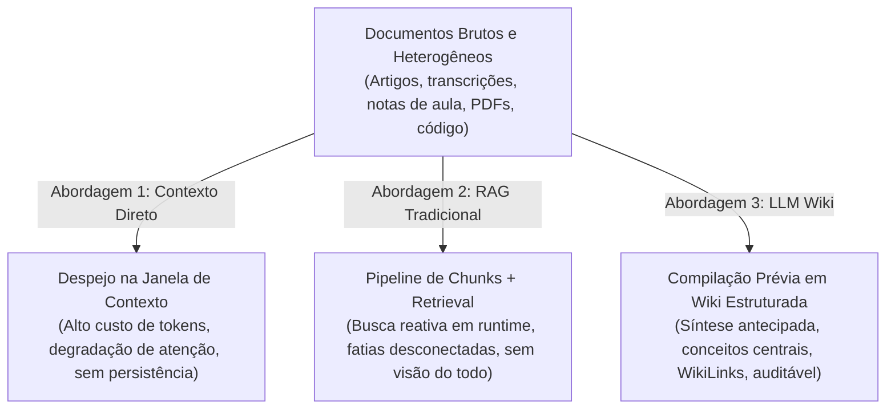
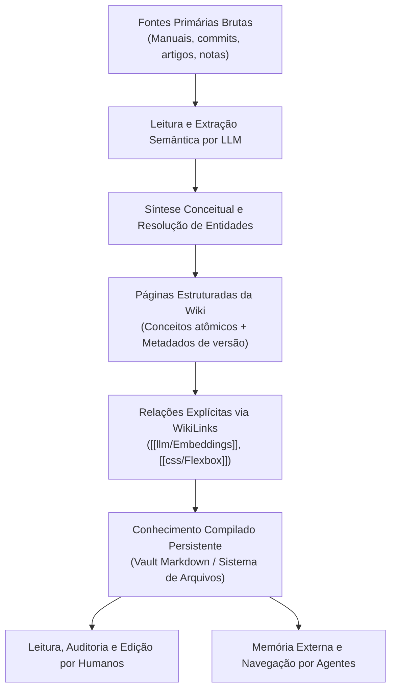

# LLM Wiki: conhecimento compilado para humanos e agentes

Quando lidamos com um grande volume de documentos, notas e códigos, a engenharia de software tradicionalmente oscila entre dois extremos: ou concatenamos o máximo de texto bruto possível na janela de contexto de uma LLM, ou fatiamos tudo em pequenos pedaços (*chunks*) para recuperação vetorial em tempo de execução via RAG (*Retrieval-Augmented Generation*). No entanto, existe uma terceira via arquitetural cada vez mais relevante: o padrão **LLM Wiki**, que transforma previamente o corpus desorganizado em uma base de conhecimento estruturada, persistente e navegável tanto por pessoas quanto por agentes autônomos.

---

## 1. O problema: as três estratégias diante de muitos documentos

Conforme uma base documental cresce, deparamo-nos com três caminhos distintos de design de sistemas:



1. **Documentos brutos diretamente no contexto**: Enviar todos os arquivos na mensagem do usuário. É simples, mas sofre de latência severa, custo financeiro contínuo e saturação da atenção (*Lost in the Middle*).
2. **Documentos brutos via RAG tradicional**: O corpus é fatiado em pedaços e indexado. Na consulta, um algoritmo recupera os 3 ou 5 pedaços mais semelhantes. O modelo só enxerga recortes desconectados, dificultando a compreensão de relações globais e a evolução histórica de conceitos.
3. **LLM Wiki (Conhecimento Compilado)**: Antes de qualquer usuário ou agente fazer uma pergunta, uma LLM lê o corpus, extrai entidades fundamentais, sintetiza temas recorrentes, resolve ambiguidades e escreve **páginas estruturadas interligadas por WikiLinks** com rastreabilidade explícita das fontes.

---

## 2. A anatomia de uma LLM Wiki: uma camada intermediária persistente

Uma LLM Wiki não é um simples "gerador de resumos automáticos". Ela opera como uma camada de abstração semântica entre os dados primários caóticos e as necessidades de consulta do dia a dia.



### Distinções terminológicas fundamentais
Para evitar ambiguidades de engenharia, quatro elementos precisam ser claramente diferenciados:
* **Fonte primária**: O documento original, imutável e com autoridade máxima (ex.: o PDF de uma norma, o commit do Git ou a ata de uma reunião).
* **Wiki compilada**: A interpretação estruturada, sintética e navegável gerada a partir das fontes. É uma representação derivada e otimizada.
* **Retrieval**: O mecanismo computacional (busca textual BM25, busca vetorial ou grafos) empregado para localizar trechos relevantes.
* **LLM**: O motor probabilístico que lê, interpreta, traduz e sintetiza o texto.

---

## 3. LLM Wiki não é RAG: a distinção entre tempo de consulta e tempo de compilação

É comum desenvolvedores confundirem LLM Wiki com RAG. A diferença essencial está no **momento em que o trabalho computacional pesado acontece**:

* **RAG é Reativo (Tempo de Consulta / Runtime)**:
  $$\text{Pergunta} \longrightarrow \text{Busca em Chunks} \longrightarrow \text{Injeção de Recortes} \longrightarrow \text{Interpretação e Síntese na Hora}$$
  O trabalho de sintetizar o que o documento significa é refeito a cada nova pergunta de cada usuário.
* **LLM Wiki é Antecipada (Tempo de Ingestão / Compilação)**:
  $$\text{Documentos} \longrightarrow \text{Interpretação Prévia} \longrightarrow \text{Estruturação em Páginas} \longrightarrow \text{Wiki Persistente}$$
  A interpretação profunda já foi realizada antecipadamente e gravada em disco.

### Complementaridade: RAG sobre uma LLM Wiki
Uma LLM Wiki e o RAG não são concorrentes excludentes; eles são **frequentemente complementares**.
Em vez de aplicar o RAG sobre milhares de páginas de PDFs desconexos e ruidosos, você pode aplicar o RAG **sobre as páginas limpas e interconectadas da própria LLM Wiki**. O retrieval torna-se muito mais preciso porque os documentos indexados já são unidades conceituais consolidadas.

---

## 4. Tabela conceitual comparativa de estratégias

| Critério | Documentos Diretos no Contexto | RAG Tradicional | LLM Wiki (Conhecimento Compilado) |
| :--- | :--- | :--- | :--- |
| **Custo de preparação** | Zero (nenhum pré-processamento). | Médio (chunking e cálculo de embeddings). | Alto (leitura integral e síntese de páginas por LLMs). |
| **Custo em runtime** | Altíssimo (milhões de tokens por chamada). | Baixo a médio (apenas Top-$k$ chunks). | Mínimo a baixo (consulta páginas prontas e limpas). |
| **Rastreabilidade (*Provenance*)** | Baixa (o modelo sintetiza tudo sem citar trechos). | Média/Alta (cita os chunks recuperados). | Alta (cada página e afirmação aponta para o documento fonte). |
| **Atualização** | Imediata (basta enviar o arquivo novo). | Rápida (reindexar apenas os chunks alterados). | Complexa (exige recompilar as páginas afetadas e links). |
| **Capacidade de síntese global**| Alta (se couber na janela de contexto). | Baixa (só enxerga fragmentos locais isolados). | Máxima (conecta entidades de diferentes arquivos). |
| **Escalabilidade** | Péssima (limitada pelo teto da janela). | Excelente (escala para bilhões de vetores). | Alta (páginas organizadas como vault ou enciclopédia). |
| **Legibilidade humana** | Nula (apenas dados brutos soltos no prompt). | Nula (índice vetorial é opaco e binário). | Perfeita (arquivos Markdown limpos legíveis no Obsidian). |
| **Risco de distorção** | Mínimo (o modelo lê o dado original). | Baixo (recupera trechos literais). | Médio/Alto (risco de cristalizar interpretações errôneas). |

---

## 5. Vantagens críticas de uma LLM Wiki

### 5.1. Conhecimento persistente e acumulativo
Em um chat comum com LLM, uma análise brilhante sobre a arquitetura do sistema desaparece assim que a conversa é encerrada. Na LLM Wiki, essa síntese é salva em uma nota Markdown (ex.: `csharp/Arquitetura de microsserviços.md`). Quando novos documentos chegam semanas depois, eles complementam a página existente em vez de recomeçar do zero.

### 5.2. Estrutura semântica explícita vs implícita
Em um banco vetorial, a relação entre "Flexbox" e "CSS Grid" é uma proximidade matemática implícita em um espaço de 1536 dimensões. Na LLM Wiki, essa relação é **explícita e navegável**: uma seção comparativa com um WikiLink formal `[[css/Flexbox|Flexbox]]`.

### 5.3. Navegação e auditoria humana
Se um índice vetorial recuperar o chunk errado, um humano não tem como inspecionar facilmente o motivo. Uma LLM Wiki pode ser aberta no Obsidian, auditada, corrigida manualmente com grifos (`==destaques==`) e refinada continuamente.

### 5.4. Memória compartilhada entre múltiplos agentes
Diferentes instâncias de agentes autônomos (como agentes de codificação, pesquisa e suporte) podem ler e gravar na mesma base compartilhada de Markdown, colaborando sobre o mesmo modelo conceitual da organização.

---

## 6. Limites, riscos e armadilhas de engenharia

### 6.1. A wiki é uma representação derivada, não a fonte
Toda transformação de texto introduz risco de compressão com perdas:
$$\text{Fonte Primária} \xrightarrow{\text{Interpretação por LLM}} \text{Página da Wiki} \xrightarrow{\text{Leitura pelo Agente}} \text{Ação / Resposta}$$
Cada passagem é uma oportunidade para omissão de ressalvas críticas, simplificações excessivas ou generalizações indevidas. A citação explícita do arquivo original e da linha exata é mandatória.

### 6.2. O perigo do "erro cristalizado"
No RAG, se uma busca falhar em uma resposta, o erro evapora ao final da sessão. Em uma LLM Wiki, se o modelo interpretar incorretamente uma regra de negócio durante a compilação e gravá-la em uma página Markdown, **esse erro torna-se persistente**. Todos os agentes e humanos que consultarem essa página no futuro absorverão a premissa falsa como verdade estabelecida.

### 6.3. O desafio da invalidação de cache e consistência
Quando um documento original de 2024 é revogado por uma portaria de 2026:
* Em quais páginas da wiki esse documento foi citado?
* Quais afirmações derivadas tornaram-se falsas?
* Quais WikiLinks ficaram quebrados?
A atualização incremental de uma wiki exige rastreamento de dependências (*Dependency Graphs*), similar ao funcionamento de ferramentas como `make` ou empacotadores de software.

### 6.4. Conflitos entre fontes
Duas atas de reunião podem afirmar coisas opostas sobre a prioridade de uma feature. A LLM Wiki **jamais deve tentar conciliar silenciosamente os textos em uma verdade média artificial**. Ela deve registrar explicitamente o desacordo:
> *"Nota de Divergência: Segundo a ata [Doc A], o protocolo padrão é X. Segundo o relatório [Doc B], o protocolo foi alterado para Y em 14/05."*

---

## 7. A analogia do compilador de software

Pense no processo como a compilação de código em [[csharp/01-Introdução ao Csharp|C#]]:
* **Código-fonte em texto plano**: São os documentos originais, dispersos e autoritativos.
* **Compilador**: É a LLM processando a sintaxe e a semântica.
* **Bytecode / Binário otimizado**: É a LLM Wiki estruturada, pronta para execução rápida e indexação eficiente.

### Onde a analogia quebra
Um compilador tradicional (`csc` ou `gcc`) é estritamente determinístico e formal. Se você compilá-lo 1.000 vezes, o binário será idêntico e sem interpretações subjetivas. A compilação por LLM é **probabilística e interpretativa**; ela pode sintetizar o mesmo corpus com ênfases ligeiramente diferentes dependendo da temperatura e do prompt de compilação.

---

## 8. Um exemplo prático com o próprio vault do Obsidian

Imagine que este repositório de programação receba continuamente:
* Artigos sobre tokenização em [[llm/02-Tokenização, embeddings e representações contextuais|Tokenização, embeddings e representações contextuais]].
* Notas sobre o mecanismo de atenção em [[llm/03-Arquitetura do Transformer e mecanismo de atenção|Arquitetura do Transformer e mecanismo de atenção]].
* Exemplos práticos de chamadas de API em [[llm/05-Sistemas de produção com LLMs, tool calling e streaming|Sistemas de produção com LLMs, tool calling e streaming]].

Um pipeline de LLM Wiki identifica a recorrência transversal do termo **"Embeddings"** e compila uma página central integradora:
* **Definição formal**: Distinção entre $W_E$, estados latentes e modelos bi-encoders.
* **Relações cruzadas**: Links para [[llm/02-Tokenização, embeddings e representações contextuais|Tokenização]], [[llm/10-Embeddings aplicados ao RAG|Embeddings no RAG]] e [[javascript/03-manipulacao/08-JSON|Manipulação JSON]].
* **Histórico e fontes**: Lista de notas primárias de onde os conceitos foram sintetizados.

---

## 9. Implementação conceitual em JavaScript: o pipeline de compilação

Abaixo está uma demonstração em [[javascript/Introdução ao JavaScript|JavaScript]] puro simulando como um pipeline de compilação identifica conceitos novos, gera links e preserva fontes primárias:

```javascript
// Exemplo conceitual: compilador de páginas de LLM Wiki
class CompiladorLLMWiki {
    constructor() {
        this.paginasWiki = new Map(); // titulo -> { conteudo, fontes, wikilinks }
    }

    // Simula a leitura e extração de conceitos por uma LLM
    extrairConceitos(documentoFonte) {
        // Em produção, este método chama uma LLM com prompt de extração estruturada
        const conceitosIdentificados = [];
        if (documentoFonte.texto.includes("embedding")) {
            conceitosIdentificados.push({
                termo: "Embeddings",
                afirmacao: "Embeddings mapeiam símbolos discretos em espaços vetoriais densos contínuos.",
                fonte: documentoFonte.arquivo
            });
        }
        return conceitosIdentificados;
    }

    // Atualiza ou cria a página persistente na Wiki com rastreabilidade
    compilarDocumento(documentoFonte) {
        const entidades = this.extrairConceitos(documentoFonte);

        entidades.forEach(item => {
            const paginaExistente = this.paginasWiki.get(item.termo) || {
                titulo: item.termo,
                topicos: [],
                fontes: new Set(),
                links: new Set()
            };

            paginaExistente.topicos.push(item.afirmacao);
            paginaExistente.fontes.add(item.fonte);
            paginaExistente.links.add(`[[${item.termo}]]`);

            this.paginasWiki.set(item.termo, paginaExistente);
            console.log(`[Wiki Compiler]: Conceito '${item.termo}' compilado a partir de ${item.fonte}.`);
        });
    }

    // Renderiza a página final em formato Markdown com WikiLinks e Provenance
    renderizarPaginaMarkdown(termo) {
        const pagina = this.paginasWiki.get(termo);
        if (!pagina) return null;

        let md = `# ${pagina.titulo}\n\n`;
        md += `## Conceitos consolidados\n`;
        pagina.topicos.forEach(t => {
            md += `* ${t}\n`;
        });

        md += `\n## Fontes primárias de autoridade\n`;
        pagina.fontes.forEach(f => {
            md += `* Fonte primária: \`${f}\`\n`;
        });

        md += `\n---\n*Página compilada automaticamente em ${new Date().toISOString().split("T")[0]}*\n`;
        return md;
    }
}

// Demonstração
const wiki = new CompiladorLLMWiki();

wiki.compilarDocumento({
    arquivo: "raw/paper_attention.txt",
    texto: "Modelos utilizam embedding estático de vocabulário antes da atenção."
});

wiki.compilarDocumento({
    arquivo: "raw/notes_rag_meeting.txt",
    texto: "No RAG, o embedding de sentença é comparado via cosseno."
});

const paginaFinal = wiki.renderizarPaginaMarkdown("Embeddings");
console.log("\n=== PÁGINA COMPIADA GERADA NA WIKI ===\n");
console.log(paginaFinal);
```

---

## 10. Onde LLM Wiki faz sentido e onde não faz

### Casos de uso ideais
* **Vaults pessoais e de equipes técnicas**: Bases de estudo como este repositório, onde o conhecimento cresce cumulativamente ao longo dos meses.
* **Documentação de produto e arquitetura**: Mapear requisitos de sistemas onde especificações estão espalhadas em dezenas de mensagens do Slack e issues do GitHub.
* **Memória de longo prazo para agentes**: Agentes que precisam manter um mapa conceitual estável de um projeto sem reler o histórico inteiro de conversas.

### Onde não faz sentido
* **Feeds de notícias de altíssima frequência**: Onde milhares de notícias chegam por segundo; o custo de compilação contínua seria inviável.
* **Bases puramente factuais e tabulares**: Catálogos de preços de e-commerce ou cadastros bancários (onde bancos relacionais com SQL são insubstituíveis).
* **Auditorias que exigem reprodução literal estrita**: Situações jurídicas onde qualquer paráfrase interpretativa é proibida por lei.

---

## 11. Conexão com o próximo módulo: a arquitetura híbrida com RAG

A LLM Wiki não elimina a necessidade de recuperação; ela aprimora a qualidade dos dados que entram no pipeline de busca. Na próxima seção, iniciaremos o estudo aprofundado do RAG:

$$\text{Fontes Brutas} \xrightarrow{\text{LLM Wiki}} \text{Páginas Estruturadas} \xrightarrow{\text{Chunking \& Embeddings}} \text{Índice RAG} \xrightarrow{\text{Consulta}} \text{Agente}$$

Essa arquitetura mista utiliza a wiki para garantir coerência conceitual e o RAG para garantir recuperação dinâmica no momento exato da pergunta.

---

## Conteúdo complementar em vídeo

* **Building Knowledge Graphs and LLM Wikis** (DeepLearning.AI / Neo4j): Como transformar textos desestruturados em nós conceituais, entidades interligadas e grafos persistentes para agentes.
* **Agentic Memory and Long-Term Knowledge Systems** (AI Explained): Discussão arquitetural sobre os desafios de memória de longo prazo para modelos de linguagem e a importância de bases estruturadas.
* **Networked Thought and Note-Taking Systems for Machines** (Tiago Forte / Obsidian Community Talks): O modelo mental de pensamento em rede e grafos bidirecionais aplicado à organização de conhecimento compartilhável entre humanos e inteligências artificiais.

---

## Resumo para memorizar

* **Conhecimento compilado**: Uma LLM Wiki realiza a interpretação conceitual antecipadamente, gerando páginas estruturadas e interligadas por WikiLinks.
* **Não é RAG**: O RAG é uma estratégia de busca reativa em tempo de consulta; a LLM Wiki é uma estratégia de estruturação prévia de conhecimento persistente.
* **Auditabilidade e human-in-the-loop**: Ao contrário de vetores densos opacos, uma wiki em Markdown pode ser lida, validada e editada diretamente por humanos.
* **O risco do erro cristalizado**: Interpretações incorretas feitas durante a compilação tornam-se erros permanentes se não houver rastreabilidade e revisão de procedência (*provenance*).
