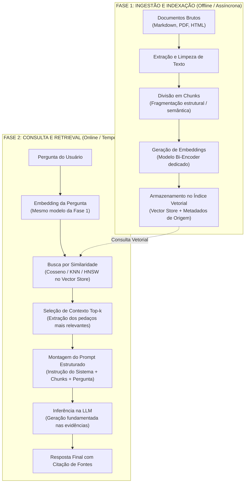

# O que é RAG e como funciona: o ciclo completo de ingestão e recuperação

A arquitetura **RAG (*Retrieval-Augmented Generation*)** tornou-se o padrão da indústria para conectar grandes modelos de linguagem a fontes externas e proprietárias de dados. Em vez de tratar a geração de texto como uma caixa-preta isolada, um sistema RAG decompõe a solução em dois pipelines assíncronos e independentes: a **Fase de Ingestão/Indexação** e a **Fase de Consulta/Recuperação**.

---

## 1. O problema que este conceito resolve

Modelos de linguagem não possuem acesso nativo aos arquivos Markdown de um vault local, bancos de dados SQL ou wikis internas de uma empresa. Além disso, mesmo quando o texto de um documento está disponível, ele raramente cabe integralmente na janela de contexto de forma eficiente e barata.

O RAG resolve esse desafio estabelecendo um processo sistemático para:
1. Catalogar, fragmentar e indexar coleções volumosas de documentos de forma prévia.
2. Localizar cirurgicamente os fragmentos mais relevantes para uma pergunta específica em milissegundos.
3. Montar um prompt enriquecido com evidências factuais para guiar a síntese da LLM.

---

## 2. Modelo mental simplificado: o arquivista e o redator

Imagine a redação de um grande jornal de notícias:
* **O Arquivista (Sistema de Recuperação)**: Passa o dia inteiro recortando jornais antigos, organizando artigos em pastas temáticas e catalogando fichas de índice por palavra-chave e assunto. Ele não escreve a matéria final; sua especialidade é saber exatamente em qual gaveta está a reportagem de 2018 sobre a fusão de duas empresas.
* **O Redator (LLM)**: Possui excelente estilo de escrita, vocabulário rico e capacidade de síntese. Quando o editor pede uma matéria sobre o histórico da empresa, o Redator não tenta puxar fatos da memória; ele pede as fichas ao Arquivista, lê os 3 recortes entregues e redige um texto fluído e embasado.

---

## 3. Funcionamento técnico real: a separação em duas fases

A integridade de um sistema RAG depende da separação estrita entre o trabalho prévio de preparação de dados e a resposta síncrona ao usuário:



### 3.1. Fase 1: Ingestão e indexação (o pipeline offline)
Esta etapa ocorre antes de qualquer usuário fazer perguntas e roda em segundo plano:
1. **Coleta de documentos**: Leitura dos arquivos fonte (ex.: notas Markdown do Obsidian).
2. **Chunking**: O documento longo é fatiado em blocos menores (chunks de 200 a 800 tokens) para caber na janela de atenção com alta densidade semântica.
3. **Extração de metadados**: Cada chunk recebe rótulos essenciais: nome do arquivo, cabeçalho de seção (`#`), autor, data e link original.
4. **Vetorização**: Cada chunk passa por um modelo de embedding de sentença (como vimos em [[llm/02-Tokenização, embeddings e representações contextuais|Tokenização, embeddings e representações contextuais]]), gerando um vetor de ponto flutuante denso (ex.: 1536 dimensões).
5. **Persistência**: Os vetores e seus respectivos textos e metadados são salvos em um banco vetorial (*Vector Store*).

### 3.2. Fase 2: Consulta e recuperação (o pipeline online em runtime)
Esta etapa roda no momento exato em que o usuário envia uma mensagem:
1. **Vetorização da query**: A pergunta do usuário passa **pelo mesmo modelo de embedding** usado na ingestão, gerando o vetor da consulta.
2. **Busca vetorial (Retrieval)**: O sistema calcula a distância geométrica (similaridade de cosseno) entre o vetor da consulta e os vetores armazenados, retornando os $k$ chunks mais próximos.
3. **Composição do prompt**: Os $k$ chunks de texto são inseridos na mensagem de contexto, encapsulados por tags defensivas (conforme detalhado em [[llm/04-Engenharia de contexto e controle de inferência|Engenharia de contexto e controle de inferência]]).
4. **Geração fundamentada**: A LLM recebe o prompt e produz a resposta final, citando as fontes recuperadas.

---

## 4. Implementação mínima executável: o fluxo completo ponta a ponta

Abaixo temos uma simulação completa e executável em [[javascript/Introdução ao JavaScript|JavaScript]] puro que demonstra o ciclo ponta a ponta do RAG:

```javascript
// Snippet atômico: função de similaridade de cosseno
function similaridadeCosseno(a, b) {
    let dot = 0, mA = 0, mB = 0;
    for (let i = 0; i < a.length; i++) {
        dot += a[i] * b[i];
        mA += a[i] * a[i];
        mB += b[i] * b[i];
    }
    return dot / (Math.sqrt(mA) * Math.sqrt(mB));
}
```

```javascript
// Exemplo completo e integrado: pipeline didático de RAG em memória
class PipelineRAGMinimo {
    constructor() {
        this.indice = [];
    }

    // Modelo de embedding simulado (para fins didáticos, mapa conceitual 3D: [Front, Back, Design])
    simularEmbedding(texto) {
        const t = texto.toLowerCase();
        const front = (t.includes("css") || t.includes("dom") || t.includes("html")) ? 0.9 : 0.1;
        const back = (t.includes("sql") || t.includes("api") || t.includes("node")) ? 0.9 : 0.1;
        const design = (t.includes("figma") || t.includes("cor") || t.includes("layout")) ? 0.9 : 0.1;
        return [front, back, design];
    }

    // FASE 1: Ingestão
    ingerirDocumento(id, arquivo, heading, conteudo) {
        const vetor = this.simularEmbedding(conteudo);
        this.indice.push({
            id,
            arquivo,
            heading,
            texto: conteudo,
            vetor
        });
    }

    // FASE 2: Consulta
    consultar(pergunta, topK = 1) {
        const vetorPergunta = this.simularEmbedding(pergunta);

        // 1. Busca por similaridade
        const resultados = this.indice
            .map(item => ({
                ...item,
                score: similaridadeCosseno(vetorPergunta, item.vetor)
            }))
            .sort((a, b) => b.score - a.score)
            .slice(0, topK);

        // 2. Montagem do prompt com contexto
        const contexto = resultados.map(r => `Fonte [${r.arquivo} > ${r.heading}]:\n${r.texto}`).join("\n\n");
        const promptFinal = `Use estritamente as evidências abaixo para responder.\n\nEVIDÊNCIAS:\n${contexto}\n\nPERGUNTA: ${pergunta}\n\nRESPOSTA:`;

        // 3. Simulação de geração da LLM
        return {
            promptEnviado: promptFinal,
            fontesUsadas: resultados.map(r => `${r.arquivo}#${r.heading}`)
        };
    }
}

// Execução prática
const rag = new PipelineRAGMinimo();

// Ingestão de duas notas do vault
rag.ingerirDocumento("chunk-1", "css/Flexbox.md", "Alinhamento", "Flexbox organiza elementos usando display flex e justify-content.");
rag.ingerirDocumento("chunk-2", "web/DNS.md", "Registros", "Registros A apontam nomes de domínio para endereços IPv4 de servidores.");

// Usuário pergunta sobre interface
const resultado = rag.consultar("Como alinhar caixas com CSS?", 1);
console.log("Prompt estruturado gerado pelo RAG:\n");
console.log(resultado.promptEnviado);
console.log("\nFontes rastreadas:", resultado.fontesUsadas);
```

---

## 5. Limites da analogia e erros comuns

1. **Achar que o RAG resolve a falta de raciocínio**: Se a pergunta exigir cruzamento de dados complexo (ex.: *"Qual o faturamento médio por funcionário dos 3 maiores clientes?"*), o RAG recuperará as tabelas, mas se a LLM não tiver capacidade aritmética nos pesos, a resposta ainda falhará.
2. **Desconexão temporal entre Ingestão e Consulta**: O índice vetorial é uma fotografia estática do momento da indexação. Se um arquivo Markdown for editado e o pipeline de ingestão não for re-executado, o RAG continuará respondendo com a informação antiga (*stale data*).

---

## 6. Implicações práticas de engenharia

* **Assincronia obrigatória**: A indexação de documentos nunca deve bloquear requisições de usuários; ela deve rodar via filas (*workers* com RabbitMQ, SQS ou cron jobs locais).
* **Consistência de modelos**: O modelo usado para gerar embeddings na ingestão deve ser **rigorosamente idêntico** ao modelo usado para vetorizar a pergunta na consulta. Misturar modelos ou versões diferentes invalida todo o espaço vetorial.

---

## Resumo para memorizar

* **Dois mundos**: Ingestão (preparação de chunks e índice em lote) e Consulta (recuperação por similaridade e geração em runtime).
* **Rastreabilidade**: O RAG transforma a resposta em um processo auditável, associando cada afirmação a um metadado de origem (*provenance*).
* **Eficiência**: Substitui leituras massivas de documentos inteiros pela injeção cirúrgica dos fragmentos mais densos e relevantes.
