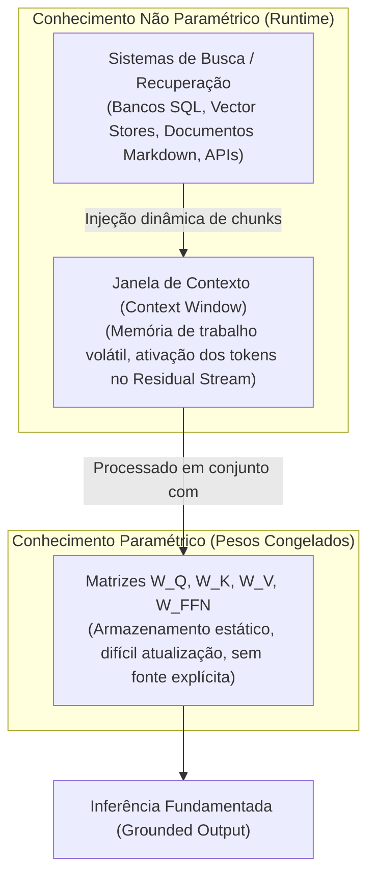
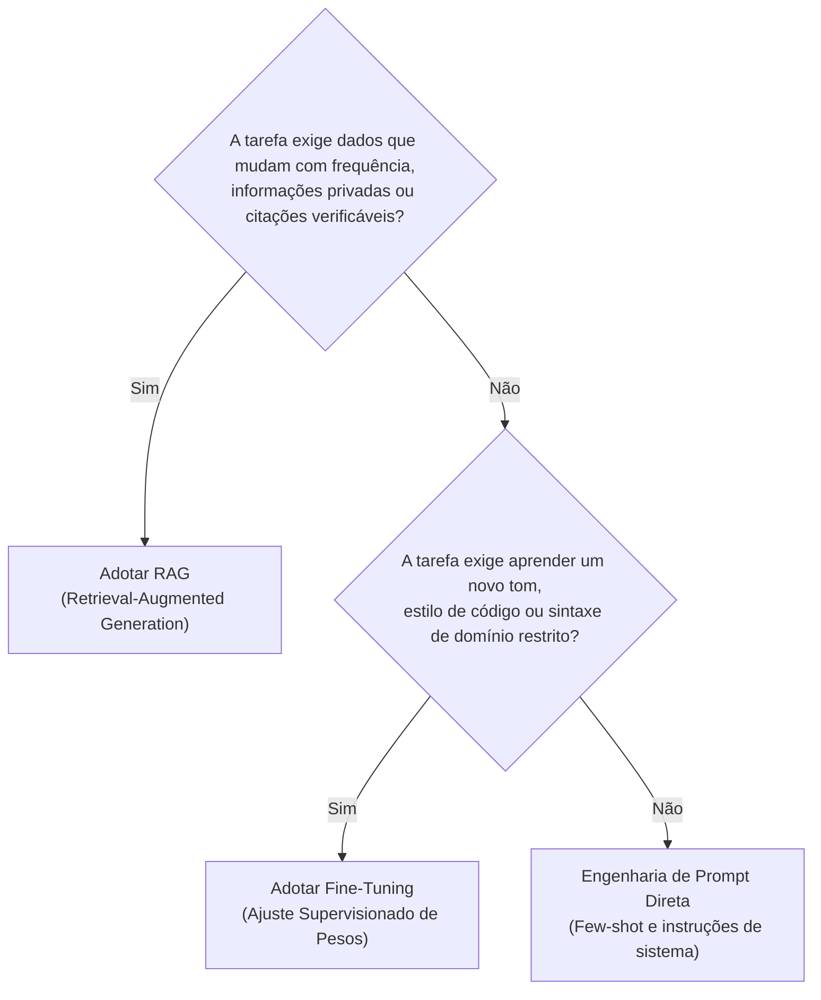

# Por que LLMs precisam de conhecimento externo: pesos, contexto e limites de inferência

Modelos de linguagem modernos possuem bilhões de parâmetros e demonstram fluência textual impressionante. No entanto, em ambientes corporativos e de engenharia de software, esperar que uma LLM responda com precisão factual confiando apenas em seus pesos internos é um erro arquitetural fundamental. Para projetar sistemas robustos, é imperativo compreender a fronteira física entre **o que o modelo aprendeu no treinamento**, **a memória de trabalho da inferência** e **o conhecimento externo injetado em tempo de execução (*runtime*)**.

---

## 1. O problema que este conceito resolve

Uma organização possui manuais internos, bases de código proprietárias, cadastros de clientes em bancos relacionais e políticas contratuais atualizadas semanalmente.
* Treinar uma LLM do zero para incorporar esses dados é financeiramente inviável (milhões de dólares em computação de GPU) e tecnicamente inadequado.
* Fazer ajuste fino (*fine-tuning*) apenas ajusta o tom, estilo ou formato de saída, mas é ineficiente e propenso a alucinações para memorização factual precisa.
* O conhecimento do mundo muda continuamente, enquanto os pesos matemáticos de um modelo congelam no momento em que o treinamento termina (*knowledge cutoff*).

O problema central a resolver é: **como capacitar um modelo probabilístico a responder perguntas sobre dados privados, recentes e específicos sem re-treinar a rede neural?**

---

## 2. Modelo mental simplificado: a prova com consulta vs o estudante decorador

Pense em um estudante de direito prestando um exame:
* **Conhecimento nos pesos (treinamento prévio)**: É o que o estudante memorizou durante a faculdade. Ele domina o vocabulário jurídico, a gramática, a estrutura de argumentação e os princípios gerais do direito. Porém, ele não decorou o texto literal de uma portaria municipal publicada ontem de manhã nem a ficha cadastral de um réu específico.
* **Conhecimento em runtime (prova com consulta)**: É permitir que o estudante faça a prova com os autos do processo abertos na mesa. Quando surge uma pergunta sobre o réu, ele não tenta adivinhar com base na memória biológica; ele lê o documento em sua frente, extrai as cláusulas exatas e sintetiza a resposta fundamentada.

---

## 3. Funcionamento técnico real: pesos, memória, contexto e busca

Para evitar confusões de engenharia, quatro conceitos frequentemente tratados como equivalentes precisam ser claramente distinguidos:

### 3.1. Diferença entre memória, contexto, busca e treinamento
* **Treinamento (*Pretraining* e *Fine-Tuning*)**: Atualização física dos pesos matriciais $\theta$ via descida de gradiente estocástica. Modifica a "fiação" neural da rede. É custoso, lento e gera conhecimento estático e difuso (você não consegue dar um `DELETE` seletivo em uma frase aprendida nos pesos).
* **Janela de contexto (*Context Window*)**: O buffer de ativação ativo durante uma chamada de inferência. É volátil (esvaziado ao término da requisição), tem custo linear de tokens e complexidade quadrática de atenção no *prefill* sem otimizações.
* **Memória de aplicação**: Estado gerenciado pelo software fora da LLM (sessões em Redis, bancos relacionais, histórico de mensagens serializado em [[javascript/03-manipulacao/08-JSON|JSON]]).
* **Busca (*Retrieval*)**: O processo determinístico ou probabilístico de consultar repositórios externos e trazer apenas a fração de dados relevante para o contexto no momento da inferência.

### 3.2. Por que simplesmente jogar documentos gigantescos na janela de contexto não resolve?
Com o surgimento de modelos suportando janelas de 1 milhão ou 2 milhões de tokens, surge a tentação ingênua: *"Por que não concatenar todos os PDFs da empresa no prompt a cada requisição?"*

Essa abordagem falha na prática por três motivos de engenharia:
1. **Degradação de atenção (*Lost in the Middle*)**: Conforme demonstrado em pesquisas de recuperação (*Needle in a Haystack*), a precisão de recuperação de fatos pontuais cai significativamente quando o dado está soterrado no meio de centenas de milhares de tokens irrelevantes.
2. **Latência operacional proibitiva**: O tempo de primeiro token (*Time To First Token* - TTFT) escala com o volume de tokens de entrada. Processar 500k tokens pode demorar 10 a 20 segundos antes que o primeiro caractere da resposta comece a ser gerado.
3. **Custo financeiro insustentável**: Mesmo com descontos de cache, enviar milhões de tokens a cada pergunta de suporte de clientes gera faturas astronômicas em escala.

---

## 4. Matriz de decisão: quando RAG faz sentido e quando não faz

### Quando RAG é indispensável
* Documentos dinâmicos com atualizações diárias ou em tempo real (manuais, tickets, notas de release).
* Auditoria estrita: cenários jurídicos, médicos ou financeiros onde a resposta **precisa apontar o arquivo e a página exata da fonte**.
* Controle de acesso baseado em papéis (*RBAC*): diferentes usuários podem consultar a mesma LLM, mas só devem acessar documentos que suas credenciais autorizam.

### Quando RAG é a escolha errada
* **Mudança de formato ou estilo**: Ensinar o modelo a sempre responder em formato de commit semântico ou no padrão de uma biblioteca proprietária é trabalho para *Fine-Tuning* ou *Few-shot*, não RAG.
* **Raciocínio holístico sobre todo o corpus**: Perguntas como *"Qual é o tema filosófico predominante que conecta todos os 200 livros da biblioteca?"* falham no RAG tradicional, pois exigem síntese global e não a recuperação de 5 parágrafos específicos.

---

## 5. Limites da analogia e erros conceituais comuns

1. **A analogia da prova com consulta quebra quando o texto é contraditório**: O estudante humano percebe ironia ou conflito óbvio entre dois papéis em sua mesa. A LLM avalia probabilidades de atenção; se o contexto recuperado contiver dois parágrafos contraditórios, o modelo pode fundi-los em uma resposta híbrida incorreta ou priorizar o último fragmento lido devido ao viés de recência.
2. **RAG não corrige deficiências de raciocínio da LLM**: O RAG fornece os fatos corretos para a mesa de trabalho, mas a capacidade de conectar causa e efeito, realizar inferências lógicas e sintetizar a resposta final ainda depende integralmente da inteligência do modelo de fundação subjacente.

---

## 6. Implicações práticas de engenharia

* **Separação de responsabilidades na arquitetura**: O pipeline de busca deve ser otimizado para **Revocação (*Recall*)** (trazer toda a evidência necessária), enquanto a LLM deve ser instruída para **Fidelidade (*Faithfulness*)** (restringir-se exclusivamente aos dados fornecidos, recusando-se a especular).
* **Gestão de custos e latência**: Injetar 3 a 5 fragmentos altamente relevantes (1.500 tokens) atinge latência sub-segundo e precisão factual muito superior a despejar 50 páginas de documentos não filtrados no prompt.

---

## Conteúdo complementar em vídeo

* **Retrieval Augmented Generation (RAG) Explained** (IBM Technology): Visão executiva e conceitual clara sobre a separação entre memória estática (pesos) e dados corporativos dinâmicos.
* **Why Context Windows Don't Replace RAG** (Matthew Berman / AI Breakdown): Análise prática de custo, latência e o fenômeno *Lost in the Middle* ao comparar janelas gigantescas de contexto contra recuperação direcionada.
* **Lost in the Middle: How Language Models Use Long Contexts** (Yannic Kilcher): Dissecação do paper de Stanford demonstrando a queda drástica de acurácia de modelos ao recuperar informações localizadas no meio do contexto.

---

## Resumo para memorizar

* **Conhecimento paramétrico**: Fixo nos pesos da rede; define como o modelo raciocina e estrutura a linguagem.
* **Conhecimento não paramétrico**: Fatos dinâmicos injetados na janela de contexto no momento da requisição.
* **Limitação de janelas longas**: Contextos gigantescos aumentam custo, elevam a latência e sofrem com degradação de atenção (*Lost in the Middle*).
* **Objetivo do RAG**: Transformar um problema de adivinhação estatística em uma tarefa de leitura, síntese e citação de fontes comprovadas.
