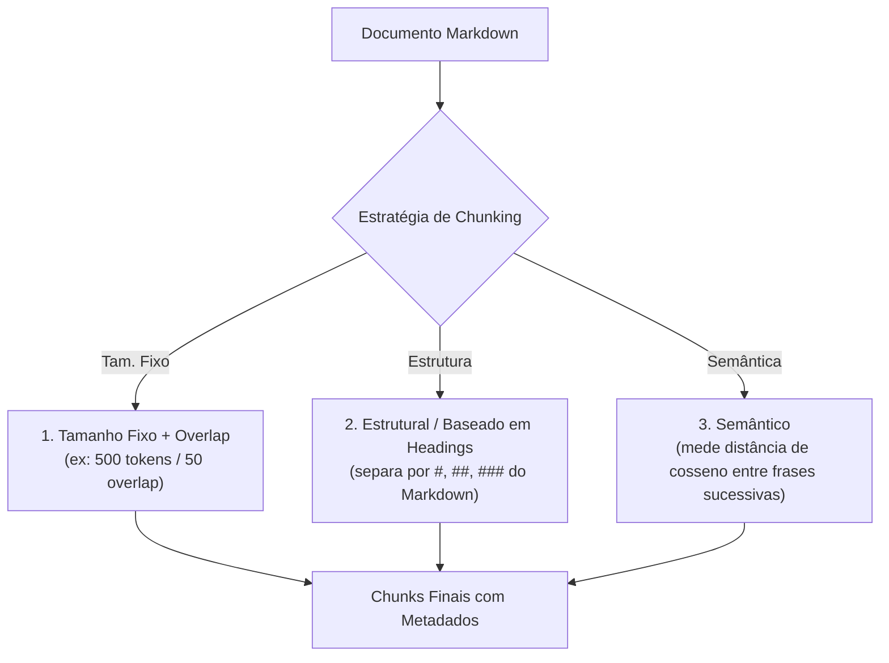

# Chunking e estratégias de fragmentação: dividindo documentos em unidades recuperáveis

Em qualquer arquitetura de RAG, o **chunking** (estratégia de fragmentação de documentos) é a decisão que mais impacta a qualidade final da recuperação. Não adianta possuir o modelo de embeddings mais sofisticado do mercado se o texto de entrada foi cortado no meio de uma frase, perdeu o título da seção ou misturou três assuntos incompatíveis em um único bloco.

---

## 1. O problema que este conceito resolve

Modelos de embedding possuem um limite máximo de tokens (frequentemente 512 ou 8192 tokens), mas mais importante: **quanto mais longo o texto comprimido em um único vetor, mais difusa se torna a sua representação geométrica** (como vimos no pooling de [[llm/02-Tokenização, embeddings e representações contextuais|Tokenização, embeddings e representações contextuais]]).

Se você vetorizar um artigo inteiro de 30 páginas do Obsidian sobre JavaScript, o embedding representará uma "média genérica" sobre front-end. Quando o usuário perguntar especificamente: *"Como tratar o erro do `AbortController`?"*, a similaridade de cosseno com o documento inteiro será fraca. O chunking resolve isso criando **unidades de recuperação atômicas, semanticamente coesas e autossuficientes**.

---

## 2. Modelo mental simplificado: a tesoura e as fichas de catálogo

Imagine que você precisa catalogar uma enciclopédia inteira em fichas bibliográficas:
* **Chunking ingênuo (a guilhotina mecânica)**: Uma máquina corta o livro exatamente a cada 500 caracteres, sem olhar onde caem os cortes. Uma frase como *"O comando para deletar todos os arquivos é `rm -rf`"* pode ser decepada ao meio: a primeira ficha fica com *"O comando para deletar todos os arquivos é"* e a segunda começa com *"`rm -rf`"*. Ambas as fichas perderam o sentido sozinhas.
* **Chunking inteligente (o fichamento estrutural)**: Você corta o livro respeitando capítulos, subtítulos (`##`) e parágrafos completos, e no topo de cada ficha você carimba: *"Livro: Guia Linux | Capítulo: Comandos de Disco | Seção: Remoção"*.

---

## 3. Funcionamento técnico real: estratégias de particionamento

Existem quatro abordagens principais de chunking na engenharia de software:



### 3.1. Tamanho fixo com sobreposição (*Chunk Size* e *Chunk Overlap*)
* **Chunk Size**: A quantidade máxima de caracteres ou tokens que cada pedaço pode conter (ex.: 500 tokens).
* **Chunk Overlap**: A quantidade de tokens do final do chunk anterior que são duplicados no início do chunk seguinte (ex.: 50 tokens, ou 10% a 20%).
* **Por que o overlap é necessário?** O overlap garante que entidades e pensamentos localizados exatamente na linha de corte não fiquem isolados, preservando o contexto semântico imediato.

### 3.2. Chunking estrutural (Markdown e hierarquia de headings)
Esta é a estratégia recomendada para bases como o Obsidian:
* O parser analisa a árvore sintática do Markdown (AST).
* Cada quebra de cabeçalho (`# Título`, `## Seção`, `### Subseção`) define o início de um novo bloco lógico.
* **Preservação de trilha (*Breadcrumbs*)**: Se um parágrafo reside sob `## Tratamento de Erros` dentro do arquivo `javascript/06-arquitetura/Node.js.md`, o chunk recebe o metadado contextual `caminho: "javascript > 06-arquitetura > Node.js > Tratamento de Erros"`.

### 3.3. Chunking semântico
Em vez de usar tamanhos fixos, o texto é quebrado em frases individuais. Um modelo de embedding avalia a similaridade entre a frase $i$ e a frase $i+1$:
* Se a similaridade for alta, elas continuam no mesmo chunk.
* Quando a similaridade de cosseno cai abruptamente (queda de tópico), um ponto de corte é inserido.
* **Custo**: Exige dezenas de chamadas de embedding durante a ingestão, tornando a indexação mais lenta e cara.

---

## 4. O dilema de engenharia: chunks pequenos vs chunks grandes

| Critério | Chunks Pequenos (100 a 250 tokens) | Chunks Grandes (800 a 1500 tokens) |
| :--- | :--- | :--- |
| **Precisão de Retrieval** | Muito alta (o vetor foca em uma única ideia). | Média/Baixa (vetor diluído em muitos tópicos). |
| **Contexto para a LLM** | Risco de fragmentação (falta contexto ao redor). | Rico e completo (a LLM tem a imagem ampla). |
| **Custo de Contexto** | Econômico (cabe muitos chunks no Top-$k$). | Caro (poucos chunks preenchem a janela). |
| **Solução Híbrida Ideal** | **Small-to-Big Retrieval / Parent-Child**: Busca vetorial no chunk pequeno, mas injeta o chunk pai maior no prompt. |

---

## 5. Implementação mínima executável: chunker estrutural de Markdown com metadados

Abaixo está um particionador estrutural em [[javascript/Introdução ao JavaScript|JavaScript]] puro projetado para notas Markdown de vaults como o Obsidian:

```javascript
// Snippet atômico: fatiador com overlap
function fatiarTextoComOverlap(texto, tamanhoMax = 300, overlap = 50) {
    const pedacos = [];
    let inicio = 0;
    while (inicio < texto.length) {
        let fim = inicio + tamanhoMax;
        pedacos.push(texto.slice(inicio, fim));
        if (fim >= texto.length) break;
        inicio += (tamanhoMax - overlap);
    }
    return pedacos;
}
```

```javascript
// Exemplo completo e integrado: parser estrutural por headings para Obsidian
class ChunkerMarkdownObsidian {
    constructor(tamanhoMaximoChunk = 400, overlap = 60) {
        this.tamanhoMax = tamanhoMaximoChunk;
        this.overlap = overlap;
    }

    processarArquivo(caminhoArquivo, conteudoMarkdown) {
        const linhas = conteudoMarkdown.split("\n");
        const chunks = [];

        let headingAtual = "Introdução";
        let bufferTexto = [];

        const descarregarBuffer = () => {
            const textoAcumulado = bufferTexto.join("\n").trim();
            if (textoAcumulado.length === 0) return;

            // Se o bloco da seção for maior que o limite, aplica fatia com overlap
            if (textoAcumulado.length > this.tamanhoMax) {
                const subFatias = fatiarTextoComOverlap(textoAcumulado, this.tamanhoMax, this.overlap);
                subFatias.forEach((fatia, subIdx) => {
                    chunks.push({
                        caminho: caminhoArquivo,
                        secao: headingAtual,
                        subIndice: subIdx,
                        conteudo: fatia
                    });
                });
            } else {
                chunks.push({
                    caminho: caminhoArquivo,
                    secao: headingAtual,
                    subIndice: 0,
                    conteudo: textoAcumulado
                });
            }
            bufferTexto = [];
        };

        for (const linha of linhas) {
            const matchHeading = linha.match(/^(#{1,3})\s+(.+)/);
            if (matchHeading) {
                descarregarBuffer();
                headingAtual = matchHeading[2].trim();
            } else {
                bufferTexto.push(linha);
            }
        }
        descarregarBuffer();

        return chunks;
    }
}

// Demonstração com nota típica do vault
const markdownExemplo = `
# Guia de CSS

CSS significa Cascading Style Sheets e define a camada visual.

## Flexbox
O Flexbox é um modelo unidimensional de layout.
Ele alinha elementos ao longo do eixo principal (main axis) e do eixo cruzado (cross axis).
Utiliza display: flex no elemento container pai.

## Grid Layout
O CSS Grid é um modelo bidimensional com linhas e colunas.
`;

const chunker = new ChunkerMarkdownObsidian(250, 40);
const resultados = chunker.processarArquivo("css/Guia de CSS.md", markdownExemplo);

console.log(`Total de chunks gerados: ${resultados.length}\n`);
resultados.forEach((c, i) => {
    console.log(`--- Chunk [${i + 1}] | Seção: [${c.secao}] ---`);
    console.log(`Texto: "${c.conteudo.replace(/\n/g, " ")}"`);
});
```

---

## 6. Limites da analogia e erros comuns

1. **Perda de tabelas e blocos de código**: Chunker ingênuo por tamanho fixo corta blocos cercados de código (```` ```js ````) ou tabelas Markdown no meio de uma linha, quebrando o parser e inutilizando a sintaxe. Estratégias estruturais devem sempre manter tabelas e blocos de código intactos em um único chunk.
2. **Ignorar links bidirecionais (WikiLinks)**: Em notas do Obsidian com sintaxe `[[Nota|Rótulo]]`, quebrar o chunk no meio da chave corrompe a referência.

---

## 7. Implicações práticas de engenharia

* **Injeção de cabeçalhos no texto do chunk (*Prepend Headings*)**: Ao enviar o chunk para o modelo de embedding, concatene o título da nota e o heading na primeira linha do texto (`Documento: Flexbox | Seção: Alinhamento | Conteúdo: ...`). Isso adiciona peso semântico e contextual sem custo computacional extra.

---

## Conteúdo complementar em vídeo

* **Chunking Strategies for LLM Applications** (Pinecone / Greg Kamradt): Aprofundamento clássico visual analisando as cinco gerações de chunking: fixo, recursivo, baseado em documentos, semântico e agêntico.
* **Text Splitters in LangChain & LlamaIndex** (DeepLearning.AI / Harrison Chase): Como implementar fatiamento recursivo por caracteres, separadores estruturais de Markdown e preservação de metadados de cabeçalho.
* **Semantic Chunking: Embedding-Based Text Splitting** (Aura / Greg Kamradt): Demonstração visual de como diferenças bruscas de distância de cosseno entre frases consecutivas são usadas para determinar quebras de chunking puramente semânticas.

---

## Resumo para memorizar

* **Chunking é semântica**: Cortar texto sem respeitar a estrutura de linguagem degrada severamente o retrieval.
* **Overlap**: Sobreposição percentual para garantir que conceitos limítrofes entre dois pedaços não se percam.
* **Chunking estrutural**: A melhor prática para Markdown, preservando headings, hierarquias e metadados de seções.
* **Equilíbrio de tamanho**: Chunks pequenos maximizam a precisão do embedding; chunks grandes oferecem melhor contexto para a LLM.
