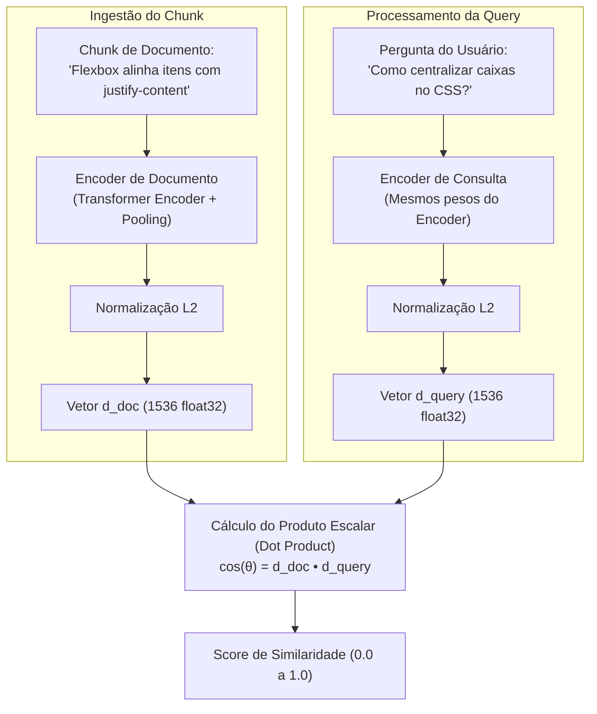

# Embeddings aplicados ao RAG: representação, dimensionalidade e limites de similaridade

No artigo [[llm/02-Tokenização, embeddings e representações contextuais|Tokenização, embeddings e representações contextuais]], estabelecemos a distinção entre a matriz de projeção inicial de vocabulário ($W_E$) e as ativações dinâmicas de uma LLM. Em arquiteturas de RAG (*Retrieval-Augmented Generation*), o foco desloca-se para uma terceira categoria especializada: os **modelos de embeddings densos de sentença (*Dense Retrieval Models*)**. Compreender a matemática e os limites dessa representação é essencial para evitar armadilhas de recuperação semântica.

---

## 1. O problema que este conceito resolve

A busca tradicional por palavras-chave (como o `Ctrl+F` ou consultas SQL `LIKE '%termo%'`) depende de coincidência lexical exata. Se o usuário pesquisa `"como centralizar uma caixa na tela?"` e a documentação técnica foi escrita como `"alinhamento de containers usando flexbox"`, a busca lexical falha completamente por não haver termos em comum.

Modelos de embedding aplicados ao RAG resolvem esse abismo linguístico projetando perguntas e documentos em um mesmo espaço vetorial contínuo, permitindo que a proximidade matemática represente afinidade conceitual.

---

## 2. Modelo mental e seus limites: a biblioteca em mapa estelar

Pense em uma biblioteca onde cada livro ou parágrafo é catalogado como uma **estrela com coordenadas em uma galáxia**:
* Livros sobre layout web ficam em uma constelação; livros sobre bancos relacionais ficam em outra constelação distante.
* Quando o usuário faz uma pergunta, o bibliotecário calcula as coordenadas da pergunta e aponta um telescópio para as estrelas mais próximas no céu.

### Onde a analogia quebra (Limites conceituais)
1. **O espaço não é estático nem objetivo**: O vetor não "captura o significado absoluto e divino da frase". Ele captura apenas as correlações estatísticas aprendidas pelo modelo de embedding a partir dos pares de texto em que foi treinado.
2. **Compressão com perdas inevitável**: Comprimir um parágrafo denso de 300 palavras em uma lista de 1536 números de ponto flutuante inevitavelmente perde detalhes finos, negações lógicas sutis e especificidades numéricas.

---

## 3. Funcionamento técnico real: a arquitetura Bi-Encoder

Modelos de embedding para RAG (como OpenAI `text-embedding-3`, BGE ou Cohere Embed) utilizam a arquitetura **Bi-Encoder** (geralmente baseada em Transformers do tipo Encoder-only como RoBERTa):



### 3.1. Normalização L2 e a simplificação do produto escalar
A similaridade de cosseno requer o cálculo de duas normas euclidianas no denominador:

$$\text{cos}(\theta) = \frac{u \cdot v}{\|u\|_2 \|v\|_2}$$

Em bancos de dados vetoriais de alta escala, calcular a raiz quadrada da soma dos quadrados a cada milissegundo para milhões de comparações é custoso.
* **A solução de engenharia**: Os vetores são **normalizados pela norma L2** logo na saída do modelo de embedding ($\|u\|_2 = 1$).
* Quando dois vetores são unitários ($\|u\| = 1$ e $\|v\| = 1$), a similaridade de cosseno torna-se **identicamente igual ao produto escalar simples (*Dot Product*)**:

$$\text{cos}(\theta) = u \cdot v = \sum_{i=1}^{d} u_i v_i$$

Isso reduz a busca por similaridade a operações de multiplicação e soma de matrizes altamente vetorizáveis em hardware SIMD e GPUs.

### 3.2. A questão da dimensionalidade e Matryoshka Embeddings
* Modelos clássicos operam em dimensões fixas: 768 (MiniLM), 1536 (OpenAI small) ou 3072 (OpenAI large).
* **Matryoshka Representation Learning (MRL)**: Modelos modernos são treinados para que as primeiras $N$ dimensões (ex.: as primeiras 256 ou 512 de um total de 1536) já concentrem a maior parte da massa de informação semântica. Isso permite truncar o vetor, reduzindo o consumo de memória RAM e disco em até 75% com perda mínima de precisão.

---

## 4. Onde a busca puramente semântica falha

Modelos de embedding possuem pontos cegos específicos que desenvolvedores de RAG devem prever:

1. **Negações e restrições booleanas**:
   * Frase A: *"Como rodar o script com Docker."*
   * Frase B: *"Como rodar o script SEM usar Docker."*
   * Ambas compartilham praticamente o mesmo vocabulário e tópicos. No espaço vetorial, seus embeddings terão similaridade altíssima ($\approx 0.92$), fazendo o RAG recuperar documentos que violam frontalmente a restrição do usuário.
2. **Códigos de erro, identificadores e SKUs**:
   * Consulta: *"Erro HTTP 404"* vs *"Erro HTTP 500"*.
   * Vetorialmente, ambos estão agrupados na região de "erros de servidor web". O modelo de embedding dificilmente priorizará o código exato se outro documento falar de erro web em tom mais próximo.
3. **Assimetria Query-Documento**:
   * Uma pergunta costuma ser curta, inquisitiva e vaga (*"O que é CORS?"*). O chunk do documento é longo, técnico e declarativo (*"O mecanismo de Cross-Origin Resource Sharing restringe requisições..."*).
   * Modelos modernos utilizam prefixos de instrução específicos para equilibrar essa assimetria (ex.: `task: search_query` na pergunta vs `task: search_document` no chunk).

---

## 5. Implementação mínima executável: normalização L2 e produto escalar otimizado

Abaixo está o motor matemático em [[javascript/Introdução ao JavaScript|JavaScript]] puro implementando normalização L2 e produto escalar unitário:

```javascript
// Snippet atômico: normalização de vetor para norma L2 unitária
function normalizarL2(vetor) {
    const somaQuadrados = vetor.reduce((acc, val) => acc + (val * val), 0);
    const norma = Math.sqrt(somaQuadrados);
    if (norma === 0) return vetor.slice();
    return vetor.map(val => val / norma);
}
```

```javascript
// Exemplo completo e integrado: motor de comparação vetorial para RAG
class ComparadorVetorialRAG {
    constructor() {
        this.indiceUnitario = [];
    }

    adicionarChunk(id, texto, vetorBruto) {
        // Normaliza no momento da indexação para economizar ciclos na consulta
        const vetorUnitario = normalizarL2(vetorBruto);
        this.indiceUnitario.push({ id, texto, vetor: vetorUnitario });
    }

    // Busca ultra-rápida via Produto Escalar (equivalente a cosseno para vetores unitários)
    buscarMaisSemelhante(vetorConsultaBruto, limiteCorte = 0.5) {
        const queryUnitario = normalizarL2(vetorConsultaBruto);

        return this.indiceUnitario
            .map(item => {
                let produtoEscalar = 0;
                for (let i = 0; i < queryUnitario.length; i++) {
                    produtoEscalar += queryUnitario[i] * item.vetor[i];
                }
                return {
                    id: item.id,
                    texto: item.texto,
                    scoreCosseno: produtoEscalar
                };
            })
            .filter(r => r.scoreCosseno >= limiteCorte)
            .sort((a, b) => b.scoreCosseno - a.scoreCosseno);
    }
}

// Demonstração: vetores 4D hipotéticos
const motor = new ComparadorVetorialRAG();

motor.adicionarChunk("c1", "Configurando regras de CORS no backend", [0.8, 0.2, 0.1, 0.0]);
motor.adicionarChunk("c2", "Criando componentes visuais no React", [0.1, 0.9, 0.0, 0.2]);

const vetorPergunta = [0.85, 0.15, 0.05, 0.0]; // Pergunta sobre segurança web / CORS
const resultados = motor.buscarMaisSemelhante(vetorPergunta, 0.6);

resultados.forEach(r => {
    console.log(`Match [${r.id}] -> Score: ${(r.scoreCosseno * 100).toFixed(2)}% | Texto: "${r.texto}"`);
});
```

---

## 6. Implicações práticas de engenharia

* **Armazenamento de Float32 vs Float16**: Um vetor de 1536 dimensões em ponto flutuante padrão de 32 bits consome 6.144 bytes ($6\text{ KB}$). Multiplicado por 1 milhão de chunks, temos mais de $6\text{ GB}$ apenas em vetores puros na RAM. Converter para Float16 ou quantizar para Int8 (*Scalar Quantization*) reduz pela metade ou a um quarto a pegada de memória com degradação estatística desprezível.

---

## Resumo para memorizar

* **Bi-Encoders**: A arquitetura padrão de embeddings para RAG, gerando vetores independentes para chunks e queries.
* **Normalização L2**: Transforma o cálculo de similaridade de cosseno em um produto escalar direto, acelerando drasticamente a busca vetorial.
* **Limites semânticos**: Embeddings tropeçam em negações lógicas, números exatos e palavras com sintaxe rígida.
* **MRL (Matryoshka)**: Técnica que viabiliza truncar vetores para economizar RAM mantendo o poder de representação.
