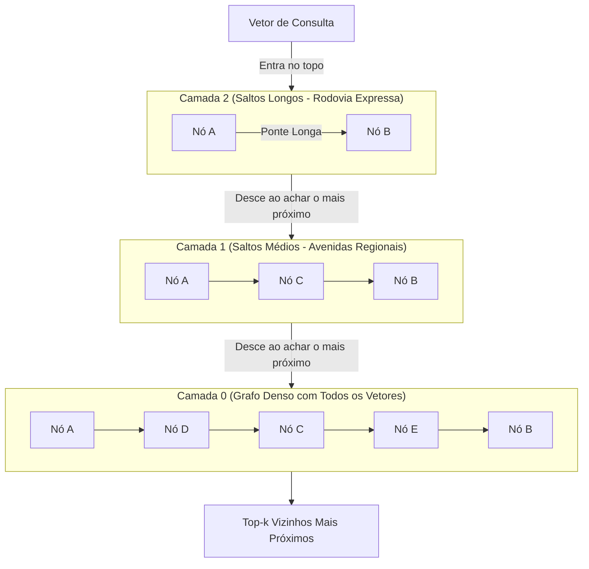

# Vector stores, índices e algoritmos de busca: além da busca por força bruta

Após fragmentar documentos em chunks e projetá-los em vetores com modelos de embedding, surge o desafio central da infraestrutura: **como encontrar os 5 vetores mais próximos entre milhões de registros em menos de 10 milissegundos?** Calcular a distância contra cada vetor existente no banco (busca linear por força bruta) torna-se computacionalmente inviável conforme a base de dados cresce.

---

## 1. O problema que este conceito resolve

Em uma base pequena com 500 chunks, comparar a consulta contra todos os itens (*K-Nearest Neighbors exato - KNN*) leva alguns milissegundos. No entanto, a complexidade temporal da busca exata é $O(N \cdot d)$, onde $N$ é o número de vetores e $d$ é a dimensionalidade (ex.: 1536).
* Em uma base corporativa com 2 milhões de chunks, uma única busca exigiria calcular mais de 3 bilhões de multiplicações de ponto flutuante na CPU/RAM a cada pergunta.
* A latência explodiria para vários segundos, inviabilizando qualquer sistema interativo.

Os **bancos vetoriais (*Vector Stores*)** e os **índices de Busca por Vizinho Mais Próximo Aproximado (*ANN - Approximate Nearest Neighbors*)** resolvem esse gargalo trocando uma fração minúscula de exatidão matemática por ordens de magnitude de velocidade ($O(\log N)$).

---

## 2. Modelo mental simplificado: a rodovia e as saídas expressas

Imagine que você está dirigindo em direção a um endereço em uma metrópole desconhecida:
* **Busca exata (KNN por força bruta)**: Você para o carro e inspeciona cada uma das 500.000 casas da cidade, medindo com uma fita métrica a distância exata até o seu destino final. O resultado é 100% garantido, mas você levará semanas para concluir.
* **Busca aproximada (ANN com grafo hierárquico - HNSW)**: Você entra em uma rodovia expressa de alta velocidade com pouquíssimas saídas (Camada Superior do Grafo). Quando você avista a região correta da cidade, pega a saída para avenidas regionais (Camada Intermediária). Por fim, desce para as ruas residenciais locais (Camada Inferior) e inspeciona apenas as 10 casas mais próximas. Você chegou ao destino em 15 minutos percorrendo menos de 0,01% das ruas da cidade.

---

## 3. Funcionamento técnico real: a arquitetura do HNSW

O algoritmo **HNSW (*Hierarchical Navigable Small World*)** é a estrutura de índice vetorial mais amplamente adotada na indústria (utilizada por Pinecone, Weaviate, Qdrant, Milvus e extensões como `pgvector`):



### 3.1. Como o HNSW opera em camadas
1. **Estrutura multi-camada**: É uma generalização geométrica de uma lista encadeada com saltos (*Skip List*).
2. **Navegação gulosa (*Greedy Routing*)**: O algoritmo entra pelo nó de entrada no nível mais alto. Ele avalia os vizinhos e pula para o vetor mais próximo da consulta. Quando não há mais vizinhos mais próximos naquele nível, ele desce um nível pelo mesmo nó e repete o processo.
3. **Trade-off configurável**: Parâmetros como `M` (número máximo de conexões bidirecionais por nó) e `ef_search` (tamanho da lista de candidatos durante a busca) controlam o equilíbrio entre velocidade de busca (latência) e revocação (*Recall*).

---

## 4. Arquitetura de armazenamento: bancos vetoriais dedicados vs pgvector

Um banco vetorial de produção não guarda apenas matrizes numéricas; ele opera como um banco de dados completo que gerencia transações ACID, persistência durável em disco e integridade referencial:

| Critério | Extensão Relacional (`pgvector` no PostgreSQL) | Banco Vetorial Dedicado (Qdrant, Pinecone, Milvus) |
| :--- | :--- | :--- |
| **Arquitetura** | Extensão nativa C dentro do banco de dados relacional existente. | Sistema distribuído especializado em tensores e memória RAM. |
| **Complexidade Operacional** | Mínima (mesmo banco onde residem tabelas de usuários, pedidos e logs). | Alta (novo cluster independente para monitorar, escalar e pagar). |
| **Filtros por Metadados** | Excelente (executa joins SQL nativos entre dados relacionais e vetores). | Variável (requer filtragem pós ou pré-índice específica de cada engine). |
| **Escala Típica Recomendada** | Perfeito para até alguns milhões de vetores por tabela. | Indicado para dezenas ou centenas de milhões de vetores com altíssima concorrência. |

---

## 5. Implementação mínima executável: busca linear exata vs particionamento conceitual

Abaixo está o código em [[javascript/Introdução ao JavaScript|JavaScript]] puro comparando a busca vetorial exata com filtragem por metadados acoplada:

```javascript
// Snippet atômico: produto escalar para vetores unitários L2
function dotProduct(u, v) {
    let soma = 0;
    for (let i = 0; i < u.length; i++) soma += u[i] * v[i];
    return soma;
}
```

```javascript
// Exemplo completo e integrado: vector store didático em memória com metadados
class VectorStoreMinimo {
    constructor() {
        this.registros = [];
    }

    inserir(id, vetor, texto, metadados = {}) {
        this.registros.push({
            id,
            vetor,
            texto,
            metadados // Armazenamento acoplado: autor, tags, categoria, data
        });
    }

    // Busca com Filtragem Pré-Vetorial (Pre-Filtering)
    buscar(vetorConsulta, topK = 2, filtroMetadados = null) {
        let candidatos = this.registros;

        // 1. Aplicação de filtros estruturados de metadados
        if (filtroMetadados) {
            candidatos = candidatos.filter(item => {
                for (const [chave, valor] of Object.entries(filtroMetadados)) {
                    if (item.metadados[chave] !== valor) return false;
                }
                return true;
            });
        }

        // 2. Cálculo da distância contra os candidatos sobreviventes
        return candidatos
            .map(item => ({
                id: item.id,
                texto: item.texto,
                metadados: item.metadados,
                score: dotProduct(vetorConsulta, item.vetor)
            }))
            .sort((a, b) => b.score - a.score)
            .slice(0, topK);
    }
}

// Demonstração: base com chunks de programação e filtros por linguagem
const store = new VectorStoreMinimo();

// Vetores unitários 3D fictícios
store.inserir("c1", [0.9, 0.1, 0.0], "Manipulando DOM no navegador", { lang: "js", tipo: "frontend" });
store.inserir("c2", [0.85, 0.2, 0.0], "Async Await e Fetch API", { lang: "js", tipo: "async" });
store.inserir("c3", [0.1, 0.1, 0.95], "Configurando Entity Framework no C#", { lang: "csharp", tipo: "backend" });

const vetorQuery = [0.88, 0.18, 0.0]; // Pergunta sobre JS assíncrono

// Busca com filtro estrito: apenas chunks de JavaScript
const resultados = store.buscar(vetorQuery, 2, { lang: "js" });
console.log("Resultados recuperados com filtro de metadata:");
resultados.forEach(r => {
    console.log(`[${r.id}] Score: ${(r.score * 100).toFixed(1)}% | Meta:`, r.metadados, `| Texto: "${r.texto}"`);
});
```

---

## 6. Limites da analogia e erros comuns

1. **Achar que ANN sempre acha o vizinho mais próximo absoluto**: Índices como HNSW são probabilísticos (*aproximados*). Em cerca de 1% a 5% das consultas, dependendo da calibração de `ef_search`, o vetor mais próximo absoluto pode ser ignorado se estiver em um ramo isolado do grafo.
2. **Custo de indexação em disco e RAM**: Índices HNSW precisam residir inteiramente na memória RAM para garantir baixa latência. Criar um índice HNSW para milhões de vetores de 1536 dimensões exige servidores com dezenas de gigabytes de RAM apenas para sustentar o grafo.

---

## 7. Implicações práticas de engenharia

* **Pre-filtering vs Post-filtering**:
  * *Post-filtering*: O índice busca os 10 vetores mais próximos e depois filtra por `lang == 'js'`. Se 9 deles eram de C#, você sobra com apenas 1 resultado (degradação drástica do Top-$k$).
  * *Pre-filtering / Single-stage*: O motor restringe o espaço do grafo antes de calcular as distâncias, garantindo que o Top-$k$ venha integralmente preenchido com documentos válidos.

---

## Resumo para memorizar

* **KNN vs ANN**: KNN é exato mas lento $O(N)$; ANN é aproximado mas opera em tempo logarítmico $O(\log N)$.
* **HNSW**: A estrutura de grafos navegáveis em múltiplas camadas que domina a busca vetorial moderna.
* **Metadados acoplados**: Um vector store de produção deve persistir o texto original e seus metadados de filtro junto com os vetores numéricos.
* **Escolha pragmática**: Para a maioria das aplicações até 2 milhões de vetores, `pgvector` no PostgreSQL existente elimina a sobrecarga de operar um banco de dados novo.
