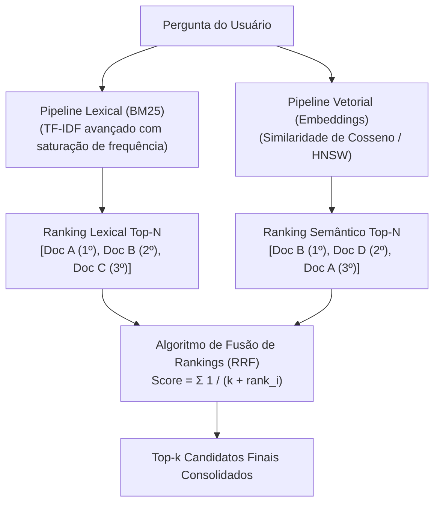

# Estratégias de retrieval e busca híbrida: combinando semântica e palavras-chave

A etapa de **Retrieval** (recuperação) é a ponte que conecta a pergunta do usuário ao índice de documentos. Embora a busca vetorial densa tenha ganhado enorme destaque com o avanço da IA generativa, confiar exclusivamente em embeddings semânticos em ambientes de produção é uma das causas mais frequentes de falhas silenciosas em sistemas RAG. A engenharia moderna adota a **Busca Híbrida (*Hybrid Search*)**, combinando busca lexical e busca vetorial.

---

## 1. O problema que este conceito resolve

A busca puramente semântica falha em cenários cotidianos de desenvolvimento de software:
* Se o usuário digita `"Erro TS2304: Cannot find name 'React'"`, o modelo de embedding vê um identificador de erro que nunca viu isolado no treinamento. Ele calcula que o vetor é genericamente sobre "erros de TypeScript" e recupera documentos sobre `TS2307` ou `TS2322`.
* Se o usuário pesquisa `"Qual o IP do servidor de homologação 192.168.1.15?"`, embeddings não entendem correspondência exata de sequências de números e trazem IPs aleatórios de outros servidores.

Por outro lado, a busca tradicional por palavras-chave falha quando o usuário usa sinônimos ou expressões informais. O problema a resolver é: **como unificar a precisão cirúrgica de palavras-chave exatas com a flexibilidade da compreensão semântica?**

---

## 2. Modelo mental simplificado: a busca por CPF vs a descrição fisionômica

Imagine um detetive tentando localizar uma pessoa em uma cidade:
* **Busca Lexical (BM25 / Palavra-chave)**: É procurar a pessoa pelo número do CPF ou RG no banco de dados da polícia. Se você tiver o número exato, a busca é instantânea e com 100% de certeza. Mas se você errar um único dígito, a busca retorna zero resultados.
* **Busca Semântica (Embeddings densos)**: É procurar a pessoa pela descrição: *"Homem alto, cabelos castanhos, veste casaco escuro e parece apressado"*. Você encontrará pessoas que combinam com o perfil mesmo sem saber o nome delas. No entanto, se houver 50 pessoas vestidas de forma parecida, você corre o risco de abordar o indivíduo errado.
* **Busca Híbrida**: O detetive cruza a descrição física com os três primeiros dígitos conhecidos do documento, eliminando imediatamente 99% dos suspeitos falsos.

---

## 3. Funcionamento técnico real: BM25, Vetores e Reciprocal Rank Fusion

A busca híbrida executa dois pipelines paralelos de recuperação e funde seus resultados antes de enviar o contexto para a LLM:



### 3.1. BM25 (Best Matching 25) em nível conceitual
O algoritmo **BM25** é o padrão ouro da recuperação lexical na ciência da informação (motor do Elasticsearch e Lucene):
* Ele aprimora a fórmula clássica do TF-IDF (*Term Frequency - Inverse Document Frequency*).
* **Saturação de frequência de termo**: Se uma palavra aparece 20 vezes em um parágrafo, ela não é 20 vezes mais relevante do que se aparecesse 3 vezes. O BM25 impõe uma curva assintótica que impede que repetições artificiais distorçam o score.
* **Normalização por tamanho do documento**: Penaliza documentos excessivamente longos que mencionam a palavra apenas por pura prolixidade.

### 3.2. Reciprocal Rank Fusion (RRF)
Como fundir o score do BM25 (que é um número arbitrário não normalizado, ex.: `18.42`) com o score de cosseno (que é um valor normalizado entre `0.0` e `1.0`)?

Normalizar scores de naturezas matemáticas distintas costuma gerar distorções. A solução mais elegante da engenharia é o **RRF (*Reciprocal Rank Fusion*)**, que ignora os valores numéricos absolutos e opera **estritamente sobre a posição dos documentos nos rankings**:

$$\text{RRF\_Score}(d) = \sum_{m \in M} \frac{1}{k + \text{rank}_m(d)}$$

Onde:
* $M$ é o conjunto de métodos de busca (Lexical e Vetorial).
* $\text{rank}_m(d)$ é a posição do documento $d$ no ranking do método $m$ (1º, 2º, 3º...).
* $k$ é uma constante de suavização (o valor padrão da indústria é $k = 60$), projetada para garantir que ser o 1º lugar em um ranking tenha peso relevante, sem desconsiderar documentos que ficaram em posições intermediárias em ambos os métodos.

---

## 4. Implementação mínima executável: motor de fusão híbrida com RRF

Abaixo está o algoritmo em [[javascript/Introdução ao JavaScript|JavaScript]] puro demonstrando como fundir listas de recuperação léxica e vetorial:

```javascript
// Snippet atômico: cálculo de RRF para um documento
function calcularRRF(rankings, k = 60) {
    const scores = new Map();

    rankings.forEach(lista => {
        lista.forEach((item, indice) => {
            const rank = indice + 1; // Posição base 1 (1º, 2º, etc)
            const scoreAnterior = scores.get(item.id) || { doc: item, rrfScore: 0 };
            scoreAnterior.rrfScore += 1 / (k + rank);
            scores.set(item.id, scoreAnterior);
        });
    });

    return Array.from(scores.values()).sort((a, b) => b.rrfScore - a.rrfScore);
}
```

```javascript
// Exemplo completo e integrado: simulador de busca híbrida com desempate
// 1. Resultados hipotéticos da Busca Lexical (BM25 focado em códigos de erro)
const rankingLexical = [
    { id: "doc-101", titulo: "Erro TS2304 em TypeScript: Soluções Práticas" },
    { id: "doc-102", titulo: "Visão Geral de Tipagem no JavaScript" },
    { id: "doc-103", titulo: "Configurando o tsconfig.json" }
];

// 2. Resultados hipotéticos da Busca Vetorial (Embeddings focados no tema 'compilação')
const rankingSemantico = [
    { id: "doc-104", titulo: "Como compilar projetos TypeScript no Node" },
    { id: "doc-101", titulo: "Erro TS2304 em TypeScript: Soluções Práticas" },
    { id: "doc-105", titulo: "Depuração de scripts com source-maps" }
];

// 3. Execução da fusão RRF (k = 60 padrão)
const resultadoHibrido = calcularRRF([rankingLexical, rankingSemantico], 60);

console.log("Ranking Final Consolidado via Busca Híbrida (RRF):");
resultadoHibrido.forEach((r, idx) => {
    console.log(`${idx + 1}º Lugar -> [${r.doc.id}] "${r.doc.titulo}" | RRF Score: ${r.rrfScore.toFixed(5)}`);
});
```

Observe como o documento `doc-101` assumiu o 1º lugar absoluto no ranking unificado por aparecer com destaque tanto na busca exata de palavra-chave quanto na busca semântica, corrigindo o falso positivo do `doc-104`.

---

## 5. Limites da analogia e erros comuns

1. **Parâmetro Top-k excessivo**: Configurar um Top-$k$ de 20 chunks para a LLM dilui o foco de atenção e aumenta a latência de geração. A regra de ouro é recuperar um conjunto amplo na busca híbrida (ex.: Top-25 de cada lado), fundir via RRF e filtrar para os 3 a 5 melhores candidatos antes de injetar no prompt.
2. **Threshold de similaridade estático**: Descartar chunks usando uma nota de corte fixa (ex.: `score >= 0.75`) é perigoso em produção. Dependendo do domínio da pergunta, o melhor documento disponível pode ter score `0.71` e ser descartado, deixando o RAG sem qualquer evidência para responder.

---

## 6. Implicações práticas de engenharia

* **Uso de BM25 com Tokenização Apropriada**: Em bases de código ou documentação técnica, garanta que o analisador do BM25 não descarte traços, pontos ou sublinhados (ex.: não quebre `TS-2304` em `TS` e `2304` isolados).

---

## Conteúdo complementar em vídeo

* **Hybrid Search: Combining BM25 and Vector Search** (Pinecone / James Briggs): Explicação aprofundada demonstrando como a busca esparsa (BM25) e a busca densa cobrem mutuamente seus pontos cegos.
* **Reciprocal Rank Fusion (RRF) Explained** (Cohere / Jay Alammar): Como o algoritmo de soma de frações ordinais funde listas de busca sem a fragilidade de normalizar scores arbitrários.
* **BM25 Algorithm: The Foundation of Search Engines** (StatQuest with Josh Starmer): Decomposição matemática de TF-IDF e da saturação assintótica do algoritmo BM25.

---

## Resumo para memorizar

* **Ponto cego vetorial**: Embeddings densos tropeçam em identificadores exatos, números e negações.
* **Ponto cego lexical**: BM25 tropeça em sinônimos, abstrações e variações linguísticas.
* **Busca Híbrida**: A união de BM25 + Embeddings oferece a maior taxa de sucesso na recuperação prática.
* **RRF**: Algoritmo de consenso que combina rankings por posição ordinal sem a necessidade de normalizar scores numéricos díspares.
