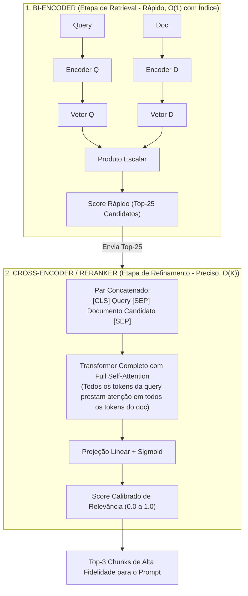

# Reranking e modelos de pontuação cruzada: refinando a relevância do contexto

Uma das maiores surpresas para desenvolvedores que implementam seus primeiros sistemas de RAG é descobrir que **o documento com o maior score na busca inicial (Top-1 do retrieval) frequentemente não é o melhor documento para responder à pergunta do usuário**. Para superar esse gargalo sem sobrecarregar a janela de contexto, a arquitetura moderna de dois estágios introduz o **Reranker** (modelo de pontuação cruzada ou *Cross-Encoder*).

---

## 1. O problema que este conceito resolve

Modelos de embedding (Bi-Encoders) são projetados para velocidade extrema: eles comprimem a pergunta e o documento em vetores separados antes de comparar. Por não permitirem que os tokens da pergunta interajam diretamente com os tokens do documento dentro das camadas de atenção do Transformer, o Bi-Encoder perde nuances relacionais finas.

Como resultado, a busca inicial (vetorial ou híbrida) consegue trazer um conjunto razoável de candidatos (ex.: 25 chunks), mas a ordenação entre eles costuma ser imprecisa. Enviar todos os 25 chunks para a LLM principal gera latência inaceitável, estoura o orçamento de contexto e induz a erros pelo fenômeno *Lost in the Middle*. O problema a resolver é: **como reordenar cirurgicamente os candidatos iniciais para garantir que os 3 melhores documentos fiquem no topo absoluto antes da injeção no prompt?**

---

## 2. Modelo mental simplificado: o filtro de currículos do RH

Imagine o processo de contratação em uma grande empresa de tecnologia:
* **Fase 1: Triagem Inicial (Retrieval / Bi-Encoder)**: O sistema de RH recebe 5.000 currículos. Um filtro automatizado busca palavras-chave e afinidades gerais de formação, reduzindo os 5.000 candidatos para os 30 melhores pré-selecionados em poucos segundos. O filtro é rápido e barato, mas superficial.
* **Fase 2: Entrevista Presencial Aprofundada (Reranker / Cross-Encoder)**: O líder técnico não entrevista os 5.000 candidatos (levaria meses). Ele entrevista apenas os 30 pré-selecionados, fazendo perguntas diretas e avaliando a compatibilidade fina olho no olho. Ao final, ele ranqueia os 3 melhores para a contratação.

---

## 3. Funcionamento técnico real: Bi-Encoder vs Cross-Encoder

A diferença matemática entre o modelo de busca inicial e o modelo de reranking reside no momento em que a **atenção cruzada** acontece:



### 3.1. A mecânica do Cross-Encoder
Enquanto o Bi-Encoder gera dois vetores isolados, o Cross-Encoder recebe a pergunta e o documento **juntos em uma única sequência**:

$$\text{Entrada} = \text{[CLS]} \circ \text{Query} \circ \text{[SEP]} \circ \text{Documento} \circ \text{[SEP]}$$

Ao passar por todas as camadas do Transformer:
* Cada palavra da pergunta troca informação matricial diretamente com cada palavra do documento via *Self-Attention* completa (como vimos em [[llm/03-Arquitetura do Transformer e mecanismo de atenção|Arquitetura do Transformer e mecanismo de atenção]]).
* O modelo detecta contradições, refutações, negações e nuances lógicas que um vetor comprimido perdeu.
* A saída é um único número escalar calibrado entre `0.0` e `1.0` representando a probabilidade daquele documento conter a resposta exata para aquela pergunta.

### 3.2. O pipeline de dois estágios (Two-Stage Retrieval)
1. **Estágio 1 (Recall Alto)**: Busca Híbrida (BM25 + Vetorial) recupera rapidamente os 20 a 50 melhores candidatos da base inteira (milhões de chunks).
2. **Estágio 2 (Precisão Máxima)**: O Reranker processa apenas esses 20 a 50 pares, reclassificando-os.
3. **Corte e injeção**: Apenas os 3 a 5 primeiros colocados pós-reranking são injetados na janela de contexto da LLM.

---

## 4. Diferença fundamental: Retrieval vs Reranking

| Propriedade | Retrieval Inicial (Bi-Encoder / BM25) | Reranking (Cross-Encoder / Cohere / BGE) |
| :--- | :--- | :--- |
| **Escopo de Análise** | Toda a base de documentos (milhões de registros). | Apenas o lote restrito de candidatos (20 a 50 chunks). |
| **Velocidade / Latência** | Sub-milissegundo a 10ms (utilizando índices HNSW). | 50ms a 200ms (computação neural completa sobre cada par). |
| **Interação Query-Doc** | Nenhuma (compara apenas os vetores finais comprimidos). | Total (atenção completa token a token entre pergunta e texto). |
| **Pré-computação** | Os vetores dos documentos são pré-calculados offline. | Não pode ser pré-calculado; depende da pergunta em runtime. |

---

## 5. Implementação mínima executável: orquestrador com etapa de reranking

Abaixo está a arquitetura em [[javascript/Introdução ao JavaScript|JavaScript]] puro implementando o pipeline de dois estágios:

```javascript
// Snippet atômico: ordenação de candidatos por score do reranker
function aplicarCorteReranker(candidatosRerankeados, topFinal = 3, scoreMinimo = 0.6) {
    return candidatosRerankeados
        .filter(c => c.scoreRerank >= scoreMinimo)
        .sort((a, b) => b.scoreRerank - a.scoreRerank)
        .slice(0, topFinal);
}
```

```javascript
// Exemplo completo e integrado: pipeline de dois estágios (Retrieval + Reranking)
class OrquestradorRAGComRerank {
    constructor() {
        this.baseDocumentos = [];
    }

    adicionarChunk(id, texto, tags = []) {
        this.baseDocumentos.push({ id, texto, tags });
    }

    // ESTÁGIO 1: Retrieval Inicial (simulando retorno rápido de 5 candidatos com ruído)
    recuperarCandidatosIniciais(query, topK = 5) {
        console.log(`[Estágio 1]: Buscando ${topK} candidatos preliminares para "${query}"...`);
        // Simulação: retorna documentos da base com scores preliminares da busca vetorial
        return this.baseDocumentos.map(doc => ({
            ...doc,
            scoreInicial: Math.random() * 0.4 + 0.5 // Scores preliminares entre 0.50 e 0.90
        })).slice(0, topK);
    }

    // ESTÁGIO 2: Reranker (Cross-Encoder simulado avaliando correspondência exata)
    async executarReranking(query, candidatos) {
        console.log(`[Estágio 2]: Executando pontuação cruzada (Cross-Encoder) em ${candidatos.length} pares...`);

        return candidatos.map(c => {
            const q = query.toLowerCase();
            const t = c.texto.toLowerCase();

            // Simulação de Cross-Attention: mede se o documento realmente responde à dúvida
            let scoreAfinidade = 0.2;
            if (t.includes("display: flex") && q.includes("flexbox")) scoreAfinidade = 0.95;
            else if (t.includes("grid") && q.includes("flexbox")) scoreAfinidade = 0.35;
            else if (t.includes("alinhamento") && q.includes("centralizar")) scoreAfinidade = 0.88;

            return {
                ...c,
                scoreRerank: scoreAfinidade
            };
        });
    }

    async consultar(query) {
        // 1. Busca ampla inicial (Recall)
        const candidatosIniciais = this.recuperarCandidatosIniciais(query, 4);

        // 2. Refinamento denso com Reranker (Precision)
        const avaliados = await this.executarReranking(query, candidatosIniciais);

        // 3. Seleção final dos 2 melhores
        const selecionados = aplicarCorteReranker(avaliados, 2, 0.5);

        console.log("\n--- Resultado Final após Reranking ---");
        selecionados.forEach((s, idx) => {
            console.log(`${idx + 1}º Lugar -> [${s.id}] Score Rerank: ${(s.scoreRerank * 100).toFixed(1)}% | Texto: "${s.texto}"`);
        });

        return selecionados;
    }
}

// Demonstração com base de CSS
const pipeline = new OrquestradorRAGComRerank();
pipeline.adicionarChunk("chunk-a", "CSS Grid organiza layouts bidimensionais em linhas e colunas.");
pipeline.adicionarChunk("chunk-b", "Flexbox alinha itens com display: flex e justify-content.");
pipeline.adicionarChunk("chunk-c", "Como centralizar caixas com margens automáticas.");
pipeline.adicionarChunk("chunk-d", "Histórico do CSS e versões do consórcio W3C.");

pipeline.consultar("Como usar flexbox para alinhar botões?");
```

---

## 6. Limites da analogia e trade-offs práticos

1. **Impacto na latência global**: O Reranker adiciona uma chamada neural síncrona no caminho crítico da requisição (geralmente entre 40ms e 150ms). Se a sua aplicação exige tempo de resposta extremo (sub-200ms total), o modelo de reranking deve rodar localmente via ONNX Runtime ou ser dimensionado com rigor.
2. **Dependência do primeiro estágio**: O Reranker só pode reordenar o que foi recuperado pelo estágio anterior. Se o documento correto não estava entre os 25 candidatos da busca inicial, o reranker não terá como fazer milagre (o problema é de *Recall* no Estágio 1).

---

## Resumo para memorizar

* **Bi-Encoder vs Cross-Encoder**: Bi-Encoder é rápido e busca em milhões de registros; Cross-Encoder é preciso e avalia 30 candidatos em profundidade.
* **Atenção cruzada total**: O Reranker analisa a interação entre cada token da pergunta e do documento simultaneamente.
* **Arquitetura de dois estágios**: A melhor relação entre custo, latência e relevância em sistemas de RAG profissionais.
* **Eliminação de ruído**: Impede que documentos medianos ou falsos positivos poluam a janela de contexto da LLM.
