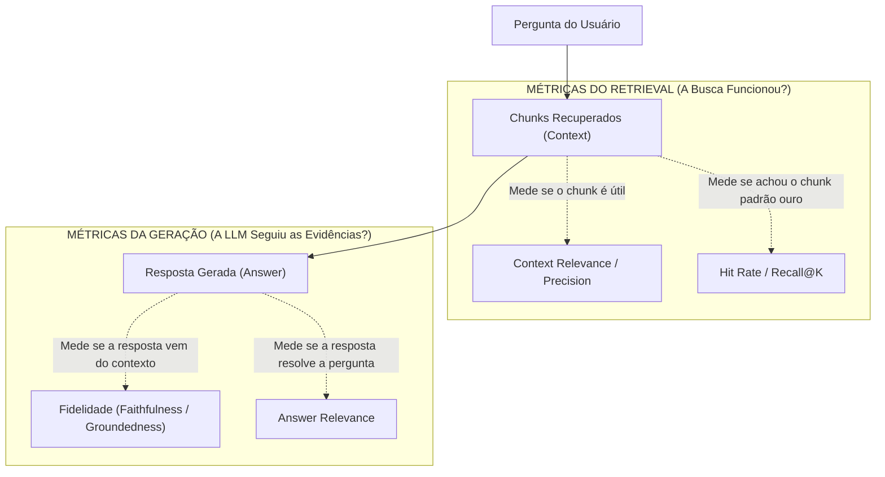

# Avaliando um sistema RAG: métricas de retrieval, fidelidade e datasets de teste

Um dos erros mais custosos no desenvolvimento com IA generativa é julgar a eficácia de um sistema RAG fazendo perguntas manuais na tela e concluindo: *"A resposta parece convincente, então o sistema está pronto para produção"*. Uma resposta linguisticamente elegante e fluida pode ser uma **alucinação completa**, ou o modelo pode ter respondido utilizando conhecimento prévio de seus próprios pesos, mascarando uma falha total no mecanismo de busca de documentos.

---

## 1. O problema que este conceito resolve

Para saber se um RAG realmente funciona e onde ele quebra quando alteramos o tamanho do chunk, o modelo de embedding ou o prompt, precisamos **desacoplar e avaliar separadamente os dois componentes do sistema**:
1. **O componente de Retrieval (Busca)**: *"O sistema foi capaz de encontrar a evidência exata necessária para responder à pergunta?"*
2. **O componente de Geração (Síntese)**: *"A resposta final gerada pela LLM deriva estritamente dos documentos recuperados, sem inventar fatos ou ignorar evidências?"*

Sem métricas quantitativas automatizadas (*Evals*), qualquer alteração no código é um ato de adivinhação.

---

## 2. Modelo mental simplificado: a prova escolar corrigida por gabarito

Pense na correção de uma prova dissertativa com consulta:
* **Avaliação da Pesquisa (Retrieval)**: O aluno abriu os livros corretos nas páginas que continham a fórmula da questão? Se a questão era sobre a Revolução Francesa e o aluno abriu o livro de Biologia marinha, a pesquisa tirou nota zero, mesmo que ele escreva uma redação linda.
* **Avaliação da Resposta (Geração)**: O aluno escreveu a resposta baseando-se estritamente no que estava escrito no livro de história, ou começou a inventar acontecimentos da própria imaginação?

---

## 3. As métricas fundamentais de um sistema RAG

A literatura moderna de avaliação de RAG (estruturada por frameworks como RAGAS e TruLens) baseia-se na **Tríade de Avaliação do RAG**:



### 3.1. Métricas da etapa de Retrieval
* **Hit Rate @ K**: Mede a proporção de consultas de teste em que o documento correto (*ground-truth*) apareceu entre os $K$ primeiros resultados recuperados (ex.: Hit Rate @ 3 = 90% significa que em 9 de cada 10 perguntas o chunk certo estava no Top-3).
* **Context Precision (Precisão)**: Avalia a densidade do contexto recuperado. De todos os chunks injetados no prompt, quantos eram realmente relevantes e quantos eram puro ruído e distração?
* **Context Recall (Revocação)**: Avalia se todas as informações necessárias para responder completamente à dúvida foram recuperadas, ou se fatos cruciais ficaram de fora do Top-$k$.

### 3.2. Métricas da etapa de Geração
* **Fidelidade / Ancoragem (*Faithfulness / Groundedness*)**: Mede se todas as afirmações factuais presentes na resposta podem ser diretamente inferidas a partir do contexto recuperado. Se a resposta afirma: *"O prazo de entrega é de 2 dias"*, mas o documento não menciona prazos, o score de fidelidade cai (indício de alucinação paramétrica).
* **Relevância da Resposta (*Answer Relevance*)**: Mede se a resposta realmente responde ao que foi perguntado, sem fugir do tema ou ser evasiva.

---

## 4. Criando um dataset de avaliação (*Ground-Truth Dataset*)

Para avaliar um RAG de forma sistemática, construímos um arquivo estruturado contendo no mínimo:
1. `pergunta`: A dúvida simulada do usuário.
2. `ground_truth_context`: O identificador ou texto exato do chunk que obrigatoriamente contém a resposta correta.
3. `ground_truth_answer`: A resposta esperada ideal escrita por um especialista humano.

---

## 5. Implementação mínima executável: suite de avaliação do MiniRAG

Abaixo temos um script em [[javascript/Introdução ao JavaScript|JavaScript]] puro que executa uma suite de testes automatizada sobre o motor desenvolvido no artigo [[llm/14-Construindo um RAG em JavaScript|Construindo um RAG em JavaScript]], calculando o **Hit Rate** e verificando a **fidelidade de fontes**:

```javascript
// Exemplo completo: runner de testes e cálculo de métricas de RAG
class AvaliadorRAG {
    constructor(motorRAG, datasetTeste) {
        this.rag = motorRAG;
        this.dataset = datasetTeste;
    }

    async executarAvaliacao(topK = 2) {
        let acertosHitRate = 0;
        const relatorio = [];

        for (const item of this.dataset) {
            // 1. Execução do retrieval
            const chunksRecuperados = this.rag.recuperarContexto(item.pergunta, topK);
            const idsRecuperados = chunksRecuperados.map(c => c.id);

            // 2. Avaliação de Retrieval: Hit Rate (o chunk esperado está no Top-K?)
            const acertou = idsRecuperados.some(id => id.includes(item.chunkEsperadoId));
            if (acertou) acertosHitRate++;

            // 3. Execução da resposta completa
            const respostaCompleta = await this.rag.responderPergunta(item.pergunta, topK);

            // 4. Verificação simples de fidelidade de citações
            const citouFonte = respostaCompleta.resposta.includes("[Doc-");

            relatorio.push({
                pergunta: item.pergunta,
                esperado: item.chunkEsperadoId,
                recuperadoTopK: idsRecuperados,
                hit: acertou ? "PASSOU" : "FALHOU",
                citacaoCorreta: citouFonte ? "SIM" : "NÃO"
            });
        }

        const taxaHitRate = (acertosHitRate / this.dataset.length) * 100;

        return {
            totalTestes: this.dataset.length,
            hitRate: `${taxaHitRate.toFixed(1)}%`,
            detalhes: relatorio
        };
    }
}

// -------------------------------------------------------------
// DATASET DE TESTE DE VALIDAÇÃO
// -------------------------------------------------------------

const datasetExemplo = [
    {
        pergunta: "Como funciona o justify-content no Flexbox?",
        chunkEsperadoId: "Flexbox.md#Alinhamento Principal",
        respostaEsperada: "O justify-content alinha itens no eixo principal."
    },
    {
        pergunta: "Para que serve o registro CNAME no DNS?",
        chunkEsperadoId: "DNS.md#Registros A e CNAME",
        respostaEsperada: "Cria um apelido apontando para outro domínio."
    },
    {
        pergunta: "Como fazer uma migração de banco no Entity Framework?",
        chunkEsperadoId: "CSharp.md#Migrations", // Documento que NÃO existe na base
        respostaEsperada: "Informação não disponível na base."
    }
];

// Supondo que 'sistemaRAG' seja a instância do MiniRAG do artigo 14:
// const avaliador = new AvaliadorRAG(sistemaRAG, datasetExemplo);
// avaliador.executarAvaliacao(2).then(res => console.log(res));
```

---

## 6. O paradigma "LLM-as-a-Judge"

Em sistemas de larga escala com centenas de testes, a avaliação humana manual torna-se um gargalo. A indústria adota o padrão **LLM como Juiz (*LLM-as-a-Judge*)**:
* Um modelo mais avançado e rigoroso (como GPT-4o ou Claude 3.5 Sonnet) recebe um prompt de avaliação com rubricas estritas:
  > *"Avalie se a resposta abaixo contém apenas afirmações sustentadas pelas evidências. Dê uma nota de 1 a 5 e aponte quaisquer alucinações."*
* A saída é exigida em JSON estruturado para alimentar dashboards de qualidade e CI/CD.

---

## Resumo para memorizar

* **Desacoplamento obrigatório**: Avalie o Retrieval separadamente da Geração.
* **Hit Rate @ K**: Mede se a busca encontrou a evidência certa entre os primeiros resultados.
* **Fidelidade (*Faithfulness*)**: Garante que a resposta deriva estritamente dos documentos sem alucinações.
* **Evals em CI/CD**: A única forma de garantir que alterações em chunks ou embeddings não introduzam regressões silenciosas no sistema.
