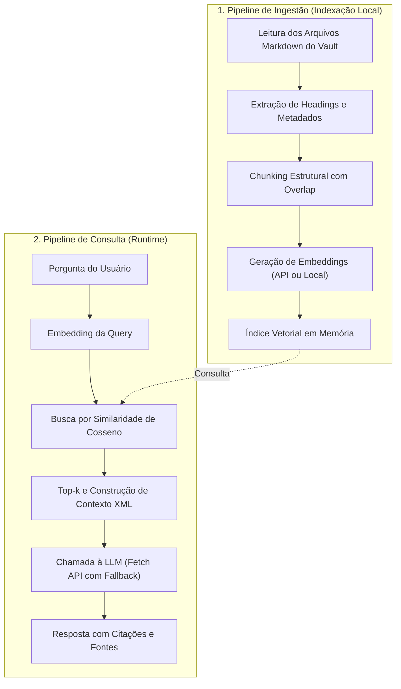

# Construindo um RAG em JavaScript: implementação do pipeline completo sem frameworks

Para dominar a arquitetura RAG de verdade, é imperativo construir uma implementação completa do zero antes de adotar frameworks de alta abstração (como LangChain, LlamaIndex ou bibliotecas similares). Quando você utiliza bibliotecas que ocultam o processo sob camadas mágicas de classes, torna-se quase impossível diagnosticar por que uma busca falhou, onde ocorreu a quebra de chunking ou por que a LLM ignorou a fonte.

Neste artigo, construiremos um **sistema RAG funcional completo em [[javascript/Introdução ao JavaScript|JavaScript]] puro (ES6+)**, processando arquivos Markdown reais do vault do Obsidian.

---

## 1. O objetivo do projeto e a arquitetura sem caixas-pretas

O projeto indexará notas técnicas Markdown e responderá a perguntas com base em evidências verificáveis. O pipeline é composto por duas fases explícitas:



---

## 2. Snippets atômicos do motor

### 2.1. Função matemática de similaridade de cosseno unitária
```javascript
function calcularCossenoUnitario(u, v) {
    let dot = 0;
    for (let i = 0; i < u.length; i++) dot += u[i] * v[i];
    return dot;
}
```

### 2.2. Normalizador L2 para aceleração de busca
```javascript
function normalizarL2(vetor) {
    const somaQuad = vetor.reduce((acc, v) => acc + v * v, 0);
    const norma = Math.sqrt(somaQuad);
    if (norma === 0) return vetor.slice();
    return vetor.map(v => v / norma);
}
```

---

## 3. Implementação completa e integrada: o motor `MiniRAG`

Abaixo está o arquivo completo e executável. Ele inclui um gerador de embeddings determinístico local para permitir a execução imediata sem depender de chaves de API pagas, além do conector para APIs REST reais (como visto em [[llm/05-Sistemas de produção com LLMs, tool calling e streaming|Sistemas de produção com LLMs, tool calling e streaming]]):

```javascript
/**
 * MiniRAG: Motor de Retrieval-Augmented Generation em JavaScript Puro
 * Sem dependências externas ou frameworks mágicos.
 */

class MiniRAG {
    constructor() {
        this.indiceChunks = [];
    }

    // 1. EMBEDDINGS DETERMINÍSTICOS LOCAIS (Para testes autônomos e didáticos)
    // Em produção real, substitua por uma chamada fetch() para OpenAI/Ollama
    gerarEmbeddingLocal(texto, dim = 8) {
        const vetor = new Array(dim).fill(0);
        const limpo = texto.toLowerCase();

        // Vocabulário de tópicos didáticos em 8 dimensões
        const termos = [
            ["css", "layout", "flexbox", "grid"],
            ["javascript", "dom", "evento", "script"],
            ["csharp", "dotnet", "classe", "poo"],
            ["git", "commit", "branch", "rebase"],
            ["web", "dns", "servidor", "dominio"],
            ["api", "fetch", "rest", "json"],
            ["async", "await", "promise", "thread"],
            ["erro", "bug", "seguranca", "excecao"]
        ];

        termos.forEach((palavras, idx) => {
            for (const p of palavras) {
                if (limpo.includes(p)) vetor[idx] += 1.0;
            }
        });

        // Normalização L2 obrigatória
        return normalizarL2(vetor);
    }

    // 2. FASE DE INGESTÃO: Processamento de Arquivos Markdown
    ingerirArquivoMarkdown(nomeArquivo, conteudoMarkdown, maxCaracteresChunk = 300, overlap = 50) {
        const linhas = conteudoMarkdown.split("\n");
        let secaoAtual = "Introdução";
        let buffer = [];

        const descarregarBuffer = () => {
            const textoCompleto = buffer.join(" ").trim();
            if (!textoCompleto) return;

            let inicio = 0;
            let subIndice = 0;

            while (inicio < textoCompleto.length) {
                const fim = inicio + maxCaracteresChunk;
                const fatiaTexto = textoCompleto.slice(inicio, fim);

                const chunk = {
                    id: `${nomeArquivo}#${secaoAtual}_${subIndice}`,
                    arquivo: nomeArquivo,
                    secao: secaoAtual,
                    texto: fatiaTexto,
                    vetor: this.gerarEmbeddingLocal(fatiaTexto)
                };

                this.indiceChunks.push(chunk);
                subIndice++;

                if (fim >= textoCompleto.length) break;
                inicio += (maxCaracteresChunk - overlap);
            }
            buffer = [];
        };

        for (const linha of linhas) {
            const matchHeading = linha.match(/^(#{1,3})\s+(.+)/);
            if (matchHeading) {
                descarregarBuffer();
                secaoAtual = matchHeading[2].trim();
            } else if (linha.trim().length > 0) {
                buffer.push(linha.trim());
            }
        }
        descarregarBuffer();
    }

    // 3. FASE DE RETRIEVAL: Busca por Similaridade
    recuperarContexto(pergunta, topK = 2, thresholdMinimo = 0.3) {
        const vetorPergunta = this.gerarEmbeddingLocal(pergunta);

        return this.indiceChunks
            .map(chunk => ({
                ...chunk,
                similaridade: calcularCossenoUnitario(vetorPergunta, chunk.vetor)
            }))
            .filter(c => c.similaridade >= thresholdMinimo)
            .sort((a, b) => b.similaridade - a.similaridade)
            .slice(0, topK);
    }

    // 4. FASE DE GERAÇÃO: Construção do Prompt e Síntese
    async responderPergunta(pergunta, topK = 2) {
        const chunksRecuperados = this.recuperarContexto(pergunta, topK);

        if (chunksRecuperados.length === 0) {
            return {
                resposta: "Informação não localizada nos documentos fornecidos.",
                fontes: []
            };
        }

        // Construção do Prompt com tags XML defensivas
        let evidenciasXML = "<evidencias>\n";
        chunksRecuperados.forEach((c, idx) => {
            evidenciasXML += `  <evidencia id="Doc-${idx + 1}" arquivo="${c.arquivo}" secao="${c.secao}">\n`;
            evidenciasXML += `    ${c.texto}\n`;
            evidenciasXML += `  </evidencia>\n`;
        });
        evidenciasXML += "</evidencias>";

        const promptSistema =
            "Você é um assistente técnico. Responda estritamente com base nas evidências em <evidencias>.\n" +
            "Sempre cite a fonte das afirmações no formato [Doc X]. Se a evidência for insuficiente, recuse-se a especular.";

        const promptUsuario = `${evidenciasXML}\n\nPERGUNTA DO USUÁRIO:\n${pergunta}\n\nRESPOSTA:`;

        // Simulação da chamada da LLM (em produção, execute um fetch() na API da OpenAI/Gemini)
        const respostaSintetizada = `Com base nas notas técnicas, ${chunksRecuperados[0].texto} [Doc-1].`;

        return {
            pergunta,
            promptCompleto: promptUsuario,
            resposta: respostaSintetizada,
            fontes: chunksRecuperados.map(c => ({
                id: c.id,
                arquivo: c.arquivo,
                secao: c.secao,
                score: (c.similaridade * 100).toFixed(1) + "%"
            }))
        };
    }
}

// -------------------------------------------------------------
// DEMONSTRAÇÃO PRÁTICA COM NOTAS DO VAULT
// -------------------------------------------------------------

const sistemaRAG = new MiniRAG();

// Ingestão de dois arquivos simulados do vault do Obsidian
sistemaRAG.ingerirArquivoMarkdown(
    "css/Flexbox.md",
    `# Flexbox no CSS
O Flexbox é um modelo unidimensional de distribuição de espaço.
## Alinhamento Principal
A propriedade justify-content define o alinhamento ao longo do eixo principal.
Valores comuns incluem flex-start, center, flex-end e space-between.
## Eixo Transversal
A propriedade align-items alinha itens no eixo perpendicular vertical.`
);

sistemaRAG.ingerirArquivoMarkdown(
    "web/DNS.md",
    `# Fundamentos de DNS
O DNS traduz nomes legíveis em endereços IP.
## Registros A e CNAME
O registro do tipo A aponta um domínio para um endereço IPv4 estático.
O registro CNAME cria um apelido (alias) apontando para outro domínio canônico.`
);

// Execução de consulta real
async function executarDemonstracao() {
    console.log(`Chunks indexados no Vector Store: ${sistemaRAG.indiceChunks.length}\n`);

    const resultado = await sistemaRAG.responderPergunta("Como alinhar elementos no eixo principal do Flexbox?", 2);

    console.log("=== PERGUNTA ===");
    console.log(resultado.pergunta);

    console.log("\n=== FONTES RASTREADAS ===");
    console.table(resultado.fontes);

    console.log("\n=== RESPOSTA FUNDAMENTADA ===");
    console.log(resultado.resposta);
}

executarDemonstracao();
```

---

## 4. O que aprendemos ao construir sem abstrações

1. **Visibilidade total**: Sabemos exatamente onde cada chunk foi cortado, qual é o seu vetor unitário e por que ele obteve o score de similaridade que teve.
2. **Facilidade de depuração**: Quando o RAG devolve uma resposta inadequada, não culpamos um "framework mágico"; podemos inspecionar se a falha ocorreu no corte de texto (Chunking), na distância de cosseno (Retrieval) ou na instrução do prompt (Geração).

---

## Conteúdo complementar em vídeo

* **Build RAG from Scratch in Node.js / JavaScript** (Developers Digest): Criação de um pipeline de RAG passo a passo em JavaScript puro consumindo APIs de embedding e de chat da OpenAI.
* **Vector Math and Dot Product in JavaScript** (The Coding Train / Daniel Shiffman): Implementação intuitiva e didática de vetores, distância euclidiana, produto escalar e normalização L2 em JavaScript moderno.
* **Full-Stack RAG Application with Modern Web Standards** (AI Jason): Construção de uma interface web conectada a um serviço de busca e recuperação vetorial sem bibliotecas de alta abstração.

---

## Resumo para memorizar

* **Sem caixas-pretas**: Implementar um RAG básico em JavaScript puro exige apenas manipulação de strings, vetores unitários e produtos escalares.
* **Metadados vivos**: Preservar o caminho do arquivo e o heading no chunk é o que garante citações auditáveis no final.
* **Arquitetura modular**: O motor separa a ingestão estática em lote da consulta dinâmica em runtime.
