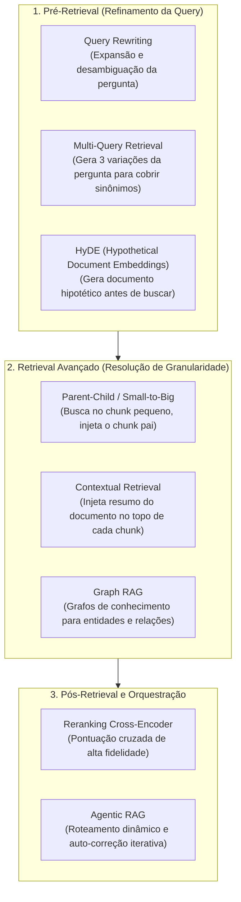

# RAG avançado e limites arquiteturais: técnicas de fronteira e quando não usar RAG

O padrão clássico de RAG (Naive RAG: cortar texto em chunks fixos, gerar embeddings densos, buscar pelo Top-$k$ e concatenar no prompt) atende bem a provas de conceito simples. No entanto, em sistemas de produção complexos, essa abordagem ingênua atinge rapidamente um teto de qualidade. Para lidar com ambiguidades linguísticas, relações entre entidades dispersas e bases vivas em constante mutação, a engenharia de software desenvolveu padrões de **RAG Avançado**. Simultaneamente, entender **quando o RAG é a ferramenta errada para o problema** é indispensável para evitar desperdício de tempo e recursos.

---

## 1. O problema que este conceito resolve

Sistemas de RAG ingênuos sofrem de falhas estruturais conhecidas:
1. **Perguntas mal formuladas**: Usuários fazem perguntas ambíguas, curtas ou com termos coloquiais que não batem com o vocabulário formal dos documentos técnicos.
2. **Desconexão de contexto (Perda do todo)**: Chunks pequenos encontram o fato específico, mas perdem a visão global do documento; chunks grandes diluem a busca vetorial.
3. **Dados relacionais e em rede**: Perguntas que exigem cruzar conexões indiretas entre múltiplos documentos (ex.: *"Quais projetos do cliente X foram liderados por engenheiros que já trabalharam com a tecnologia Y?"*) falham na busca vetorial pura, pois nenhum chunk isolado contém essa resposta pronta.
4. **Custo de re-indexação contínua**: Re-indexar milhões de chunks a cada alteração em um arquivo Markdown é computacionalmente inviável.

---

## 2. Padrões avançados de recuperação e orquestração



### 2.1. Técnicas de Pré-Retrieval: transformando a pergunta
* **Query Rewriting (Reescrita de Consulta)**: Antes de enviar a pergunta do usuário para o banco vetorial, uma LLM rápida reescreve a consulta para torná-la formal, específica e rica em palavras-chave técnicas.
* **Multi-Query Retrieval**: O modelo gera 3 a 5 variações da mesma pergunta abordando diferentes perspectivas e sinônimos. Executa-se a busca para todas as variações e os resultados são fundidos via RRF (como vimos em [[llm/11-Estratégias de retrieval e busca híbrida|Estratégias de retrieval e busca híbrida]]).
* **HyDE (Hypothetical Document Embeddings)**: Quando a pergunta é muito curta ou inquisitiva, a LLM gera uma *resposta hipotética plausível*. O embedding é calculado sobre essa resposta hipotética (que compartilha o vocabulário declarativo dos documentos do banco) e usado para buscar os documentos reais.

### 2.2. Técnicas de Recuperação Avançada
* **Parent-Child Retrieval (Small-to-Big)**:
  * Divide o documento em chunks pais grandes (ex.: 1.500 tokens) e cada pai em vários chunks filhos pequenos (ex.: 200 tokens).
  * O índice vetorial busca sobre os chunks filhos (máxima precisão semântica).
  * Ao recuperar um filho, o sistema recupera o **chunk pai correspondente** e o injeta no prompt da LLM. A busca é atômica, mas a leitura do modelo é completa.
* **Contextual Retrieval (Injeção de Contexto Global)**:
  * Durante a ingestão, uma LLM rápida lê o documento inteiro e adiciona 2 a 3 frases de contexto explicativo no topo de cada chunk antes de gerar o embedding (ex.: *"Este fragmento pertence ao manual financeiro da Empresa X, seção de políticas de reembolso de viagens de 2026: ..."*). Isso evita que chunks isolados percam a identidade do todo.
* **Graph RAG (Grafos de Conhecimento + Vetores)**:
  * Extrai entidades (pessoas, tecnologias, empresas) e relacionamentos (`A trabalhaCom B`) dos textos para construir um grafo.
  * Permite responder a perguntas complexas de raciocínio multi-saltos (*multi-hop reasoning*) combinando travessia de grafos com similaridade vetorial.

### 2.3. Agentic RAG (RAG com Agentes)
Em vez de um pipeline linear rígido, uma LLM atua como um agente orquestrador (conforme explorado em [[llm/05-Sistemas de produção com LLMs, tool calling e streaming|Sistemas de produção com LLMs, tool calling e streaming]]):
1. O agente avalia a pergunta e decide qual base consultar (ex.: base de código, tickets de suporte ou documentação oficial).
2. Se os documentos recuperados forem insuficientes ou contraditórios, o agente reformula a pergunta e executa uma **segunda rodada de busca automaticamente** antes de responder ao usuário.

---

## 3. Estratégias de produção: caching e indexação incremental

### Caching semântico de consultas
Perguntas idênticas ou muito semelhantes não precisam refazer todo o pipeline de retrieval e geração:
* O sistema compara a nova consulta contra um cache de consultas anteriores via similaridade de cosseno.
* Se a similaridade for superior a $0.98$, a resposta anterior é retornada imediatamente com custo zero e latência de 20ms.

### Atualização incremental com hash de conteúdo
Para manter o índice do Obsidian sincronizado sem gastar fortuna em embeddings:
* Armazena-se um hash criptográfico (ex.: SHA-256) do conteúdo de cada arquivo.
* Na ingestão periódica, o sistema calcula o hash dos arquivos do disco. Apenas arquivos cujo hash foi alterado têm seus chunks antigos deletados e novos vetores calculados.

---

## 4. Quando RAG é a escolha errada

RAG não é a solução universal para todos os problemas de dados com LLMs. Existem cenários onde adotar RAG introduz complexidade inútil ou falhas garantidas:

| Cenário / Necessidade | Por que o RAG Falha | Abordagem Recomendada |
| :--- | :--- | :--- |
| **Sumarização Global de Livros Inteiros** | O RAG busca fragmentos pontuais. Ele não consegue condensar a tese de um livro de 400 páginas baseado em 5 chunks. | Modelos com janelas longas nativas (1M+ tokens) ou pipelines de redução iterativa (*Map-Reduce*). |
| **Consultas Analíticas e Agregações Numéricas** | Perguntas como *"Qual a média de vendas por estado em 2025?"* exigem soma determinística de milhares de linhas, não similaridade vetorial. | **Text-to-SQL**: A LLM gera uma consulta SQL pura executada diretamente em um banco relacional ou data warehouse. |
| **Adaptação de Tom, Estilo e Formato Rígido** | Ensinar a LLM a falar como um pirata ou a gerar respostas estritamente no padrão de lint da empresa. | **Fine-Tuning (SFT)** ou **Few-shot Prompting**. |
| **Domínio com Vocabulário Estritamente Fechado** | Dicionários médicos ultrassensíveis ou linguagens de domínio específico (DSL) proprietárias que o modelo base desconhece. | **Treinamento Contínuo de Pré-Treino (Continual Pretraining)** + Fine-Tuning de vocabulário. |

---

## 5. Implementação mínima executável: simulador de Parent-Child Retrieval

Abaixo está o código em [[javascript/Introdução ao JavaScript|JavaScript]] puro demonstrando a mecânica do **Parent-Child Retrieval**:

```javascript
// Exemplo completo: motor de Small-to-Big (Parent-Child) em memória
class MotorParentChildRAG {
    constructor() {
        this.chunksPais = new Map();   // id -> texto completo (800 tokens)
        this.chunksFilhos = [];        // { id, paiId, vetor, textoCurto } (150 tokens)
    }

    adicionarDocumentoPaiComFilhos(idPai, textoPai, fatiasFilhas) {
        this.chunksPais.set(idPai, textoPai);

        fatiasFilhas.forEach((textoFilho, idx) => {
            this.chunksFilhos.push({
                id: `${idPai}_filho_${idx}`,
                idPai: idPai,
                textoCurto: textoFilho,
                // Vetor fictício representativo da fatia atômica
                vetor: [textoFilho.includes("flexbox") ? 0.95 : 0.1, 0.2]
            });
        });
    }

    recuperarContextoParaPrompt(query) {
        const vetorQuery = [query.toLowerCase().includes("flexbox") ? 0.9 : 0.05, 0.2];

        // 1. A busca vetorial roda exclusivamente nos FILHOS pequenos (máxima precisão)
        const filhoMaisProximo = this.chunksFilhos
            .map(f => {
                const dot = f.vetor[0] * vetorQuery[0] + f.vetor[1] * vetorQuery[1];
                return { ...f, score: dot };
            })
            .sort((a, b) => b.score - a.score)[0];

        console.log(`[Busca Vetorial]: Filho atômico localizado: "${filhoMaisProximo.textoCurto}" (Score: ${(filhoMaisProximo.score * 100).toFixed(1)}%)`);

        // 2. A injeção no prompt utiliza o PAI grande (contexto completo para a LLM)
        const textoPaiCompleto = this.chunksPais.get(filhoMaisProximo.idPai);
        console.log(`[Injeção de Contexto]: Recuperando Pai completo [${filhoMaisProximo.idPai}] para a LLM...`);

        return {
            chunkBuscado: filhoMaisProximo.id,
            contextoInjetadoNoPrompt: textoPaiCompleto
        };
    }
}

// Demonstração prática
const motorPC = new MotorParentChildRAG();

const documentoCompletoPai = `
# Guia Abrangente de Layouts CSS
O CSS moderno possui dois sistemas principais de posicionamento: Flexbox e Grid.
O Flexbox foi desenvolvido para layouts unidimensionais (linha ou coluna), oferecendo controle
excepcional de distribuição de espaço através de justify-content e align-items.
Já o CSS Grid gerencia layouts bidimensionais completos com colunas e linhas simultâneas.
`;

const fatiasFilhas = [
    "Flexbox foi desenvolvido para layouts unidimensionais com justify-content.",
    "CSS Grid gerencia layouts bidimensionais completos com colunas e linhas."
];

motorPC.adicionarDocumentoPaiComFilhos("doc-css-01", documentoCompletoPai, fatiasFilhas);

const resultado = motorPC.recuperarContextoParaPrompt("Como funciona o flexbox unidimensional?");
console.log("\nTexto completo que vai para a janela da LLM:\n", resultado.contextoInjetadoNoPrompt);
```

---

## 6. Limites e trade-offs práticos

1. **Complexidade de engenharia vs ganho incremental**: Técnicas como Graph RAG ou Agentic RAG exigem múltiplos ciclos de inferência de LLM durante a própria busca, multiplicando o custo da requisição por 5x a 10x e elevando a latência para 2 a 8 segundos. Comece sempre pelo RAG Híbrido com Reranker antes de adotar arquiteturas de grafos ou agentes autônomos.

---

## Resumo para memorizar

* **Parent-Child**: Busca vetorial precisa no fragmento filho pequeno; injeção contextual rica no fragmento pai grande.
* **Contextual Retrieval**: Injeta o tema global do documento em cada chunk para evitar que o corte cegue o modelo.
* **Limites do RAG**: RAG falha em análises estatísticas agregadas (onde Text-to-SQL é o correto) e na síntese panorâmica de livros inteiros.
* **Engenharia pragmática**: Só adicione complexidade avançada (grafos, reescrita de queries, agentes) quando as métricas de avaliação formal (*Evals*) demonstrarem gargalos reais no pipeline básico.
