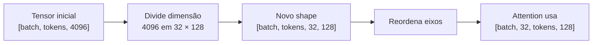
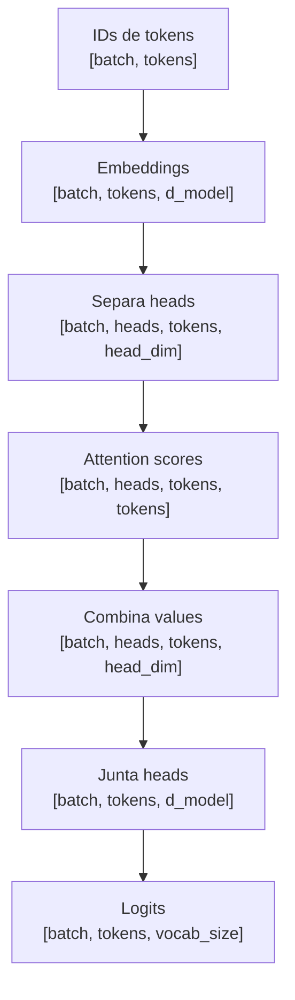

# Vetores, matrizes, tensores e shapes para LLMs

Antes de entender embeddings, attention, batches e Transformer, vale dominar uma ideia que aparece o tempo inteiro em machine learning: **como os números são organizados**.

Este artigo constrói essa base do zero e chega até shapes como `[batch, heads, tokens, head_dim]`, que aparecem diretamente em mecanismos de atenção.

> [!NOTE] Vocabulário antes de começar
> * [[llm/Glossário de LLMs#Vetor|Vetor]]: lista ordenada de números.
> * [[llm/Glossário de LLMs#Matriz|Matriz]]: tabela de números em linhas e colunas.
> * [[llm/Glossário de LLMs#Tensor|Tensor]]: estrutura numérica com um ou mais eixos.
> * [[llm/Glossário de LLMs#Dimensão|Dimensão]]: eixo ou posição disponível em uma representação.
> * [[llm/Glossário de LLMs#Embedding|Embedding]]: representação vetorial aprendida.

---

## 1. A ideia central: tensor é organização de números

No uso cotidiano de machine learning, um **tensor** é uma estrutura multidimensional de números.

O ponto mais importante não é decorar quantas dimensões existem, mas entender que cada eixo costuma representar alguma coisa.

Um único número:

```text
7
```

pode ser visto como um tensor de dimensão 0.

Uma lista de números:

```text
[7, 2, 9]
```

é um vetor, ou tensor de uma dimensão.

Uma tabela:

```text
[
  [7, 2, 9],
  [4, 1, 8]
]
```

é uma matriz, ou tensor de duas dimensões.

Uma coleção de matrizes:

```text
[
  [
    [7, 2, 9],
    [4, 1, 8]
  ],
  [
    [3, 5, 6],
    [0, 2, 1]
  ]
]
```

é um tensor de três dimensões.

> [!TIP] Analogia com design
> Pense em uma estrutura de variantes no Figma. Um eixo pode representar **componente**, outro **variante**, outro **estado** e outro **propriedade**. O tensor é a estrutura que organiza os valores para que possamos acessar uma combinação específica desses eixos.

---

## 2. Dimensão não significa dimensão física

Em machine learning, “dimensão” não precisa significar largura, altura ou profundidade física.

É melhor pensar em uma dimensão como um **eixo de organização**.

Considere:

```text
[32, 2048, 4096]
```

Esse shape pode significar:

```text
32 exemplos
× 2048 posições
× 4096 características por posição
```

Os três eixos representam conceitos diferentes.

É por isso que, em deep learning, perguntar “qual é o shape deste tensor?” costuma ser mais útil do que simplesmente perguntar “quantas dimensões ele tem?”.

---

## 3. Shape: a legenda estrutural do tensor

O **shape** descreve o tamanho de cada eixo.

Um vetor:

```text
[0.2, 0.8, 0.1, 0.4]
```

tem shape `[4]`.

Uma matriz:

```text
[
  [0.2, 0.8, 0.1, 0.4],
  [0.9, 0.1, 0.7, 0.3],
  [0.4, 0.6, 0.8, 0.2]
]
```

tem shape `[3, 4]`.

Quando você conhece o significado dos eixos, pode anotar mentalmente `[tokens, embedding_dim]`, e isso já conta uma história sobre o dado.

---

## 4. De texto para tensor

Considere a frase `O gato dormiu`.

Depois da [[llm/02-Tokenização, embeddings e representações contextuais|tokenização]], imagine que obtemos três tokens:

```text
["O", "gato", "dormiu"]
```

Cada token recebe um embedding. Vamos usar embeddings absurdamente pequenos, com quatro dimensões:

```text
"O"      → [0.2, 0.8, 0.1, 0.4]
"gato"   → [0.9, 0.1, 0.7, 0.3]
"dormiu" → [0.4, 0.6, 0.8, 0.2]
```

A sequência inteira vira uma matriz com shape `[3, 4]`, ou semanticamente `[tokens, embedding_dim]`.

O texto deixou de ser texto e passou a circular no modelo como números organizados.

---

## 5. Batch: adicionando outro eixo

Modelos raramente processam apenas uma sequência por vez durante treinamento.

Podemos agrupar várias sequências em um **batch**.

Se cada sequência tiver `[2048 tokens, 4096 dimensões]` e processarmos 32 sequências juntas, obtemos:

```text
[32, 2048, 4096]
```

que podemos ler como:

```text
[batch, tokens, embedding_dim]
```

Esse tensor tem três eixos conceituais: qual exemplo do batch, qual posição dentro da sequência e qual dimensão da representação daquele token.

---

## 6. Por que batches existem

GPUs são muito eficientes executando muitas operações matriciais em paralelo. Agrupar exemplos permite aproveitar melhor esse hardware.

É uma das razões pelas quais tensores estão tão profundamente ligados a deep learning: eles são o formato natural para computação paralela em hardware acelerado.

---

## 7. Tensor não é só array multidimensional

Em programação e bibliotecas de machine learning, a definição prática “array multidimensional de números” funciona muito bem.

Mas um objeto tensor geralmente carrega outras informações importantes:

* **shape**: tamanho de cada eixo;
* **dtype**: tipo numérico, como `float32`, `float16` ou `bfloat16`;
* **device**: onde os dados estão, como CPU ou GPU;
* informações necessárias para cálculo de gradientes durante treinamento.

Exemplo em PyTorch:

```python
import torch

x = torch.tensor([
    [1.0, 2.0, 3.0],
    [4.0, 5.0, 6.0]
])

print(x.shape)
print(x.dtype)
print(x.device)
```

---

## 8. Índices: navegando pelos eixos

Se um tensor possui shape `[32, 2048, 4096]`, um acesso como `tensor[5][120][300]` pode ser lido como:

```text
exemplo 5
→ token 120
→ dimensão 300
```

Cada índice responde “onde estou em cada eixo?”.

---

## 9. Reshape: mudar a organização sem mudar os dados

Uma operação muito comum é **reshape**: reorganizar os mesmos valores em outro formato compatível.

Doze valores podem ter shape `[12]` ou ser reorganizados para `[3, 4]`. O número de elementos continua 12.

Essa ideia aparece diretamente em multi-head attention.

---

## 10. Do embedding para as cabeças de atenção

Suponha que o modelo trabalhe com embeddings de dimensão `4096` e tenha `32 heads`.

Podemos dividir:

```text
4096 / 32 = 128
```

Cada head trabalha então com uma dimensão de 128.

Um tensor `[batch, tokens, embedding_dim]`, por exemplo `[32, 2048, 4096]`, pode ser reorganizado para `[32, 2048, 32, 128]` e depois transposto para `[32, 32, 2048, 128]`.

Leitura semântica:

```text
[batch, heads, tokens, head_dim]
```

Esse é um tensor de quatro dimensões.

---

## 11. O que significa criar o eixo heads

A expressão “32 cabeças de atenção” pode soar como se existissem 32 módulos independentes separados.

Do ponto de vista dos dados, uma parte importante da implementação é reorganizar o tensor para existir explicitamente um eixo chamado **heads**.



Esse novo shape permite calcular attention para todas as heads em paralelo.

---

## 12. Q, K e V também são tensores

No [[llm/03-Arquitetura do Transformer e mecanismo de atenção|Transformer]], cada posição produz projeções Q, K e V.

Depois da separação em heads, podemos ter:

```text
Q: [batch, heads, tokens, head_dim]
K: [batch, heads, tokens, head_dim]
V: [batch, heads, tokens, head_dim]
```

Uma forma concreta seria `[32, 32, 2048, 128]` para cada um.

A equação de attention deixa então de ser apenas símbolos abstratos. Ela descreve operações entre tensores com shapes específicos.

---

## 13. Matmul e compatibilidade de shapes

Uma operação central é a multiplicação de matrizes, ou `matmul`.

Na atenção, Q é multiplicado por uma versão transposta de K:

$$QK^T$$

Se, por head, temos `Q: [tokens, head_dim]` e `K: [tokens, head_dim]`, então `Kᵀ: [head_dim, tokens]`.

Logo:

```text
[tokens, head_dim]
×
[head_dim, tokens]
=
[tokens, tokens]
```

O resultado relaciona cada posição com cada outra posição permitida.

Essa é uma das maiores vantagens de acompanhar shapes: você consegue prever o formato da saída antes de calcular qualquer valor.

---

## 14. Broadcasting

Bibliotecas de tensors conseguem aplicar certas operações entre shapes diferentes quando eles são compatíveis. Esse comportamento é chamado **broadcasting**.

Por exemplo, somar o vetor `[10, 20, 30]` a cada linha de uma matriz `[2, 3]` sem criar cópias manuais do vetor.

Broadcasting aparece o tempo inteiro em código de deep learning.

---

## 15. Transpose: mudar a ordem dos eixos

Transpose muda a organização dos eixos.

Uma matriz `[2, 3]` pode virar `[3, 2]`.

Em tensors com mais eixos, operações como `permute` ou `transpose` podem transformar `[batch, tokens, heads, head_dim]` em `[batch, heads, tokens, head_dim]`.

A informação é a mesma; a organização muda para facilitar a próxima operação.

---

## 16. Dtype e por que precisão importa

Nem todo tensor usa o mesmo tipo de número.

Exemplos comuns:

* `float32`;
* `float16`;
* `bfloat16`;
* inteiros para IDs de tokens.

Tipos menores ocupam menos memória e podem acelerar operações em GPU, mas possuem menos precisão.

Isso ajuda a entender por que formatos numéricos e quantização são tão importantes em LLMs.

---

## 17. Um exemplo mínimo em JavaScript

JavaScript puro não possui um tipo tensor nativo como PyTorch, mas podemos simular a ideia com arrays aninhados.

```javascript
const embeddings = [
    [0.2, 0.8, 0.1, 0.4],
    [0.9, 0.1, 0.7, 0.3],
    [0.4, 0.6, 0.8, 0.2]
];

function obterShape2D(matriz) {
    return [matriz.length, matriz[0].length];
}

console.log(obterShape2D(embeddings));
// [3, 4]
```

O ponto não é implementar uma biblioteca de tensors manualmente. É enxergar a estrutura: `3 tokens × 4 dimensões`.

---

## 18. Exemplo completo: inspecionando shapes conceituais

```javascript
function criarTensor3D(batch, tokens, dimensoes) {
    return Array.from({ length: batch }, (_, b) =>
        Array.from({ length: tokens }, (_, t) =>
            Array.from({ length: dimensoes }, (_, d) =>
                Number((b + t / 10 + d / 100).toFixed(2))
            )
        )
    );
}

function obterShape(tensor) {
    const shape = [];
    let atual = tensor;

    while (Array.isArray(atual)) {
        shape.push(atual.length);
        atual = atual[0];
    }

    return shape;
}

const tensor = criarTensor3D(2, 3, 4);

console.log("Shape:", obterShape(tensor));
console.log("Tensor:", tensor);

// Shape: [2, 3, 4]
// leitura: 2 exemplos × 3 tokens × 4 dimensões
```

---

## 19. O fluxo de shapes dentro de uma LLM

Uma maneira poderosa de estudar modelos é acompanhar apenas shapes:



Isso não explica sozinho toda a arquitetura, mas transforma várias equações em algo rastreável.

---

## 20. Um cuidado com a palavra tensor

Na matemática, tensor possui uma definição mais rigorosa relacionada a objetos que obedecem regras específicas de transformação entre sistemas de coordenadas.

Em machine learning e bibliotecas como PyTorch e TensorFlow, a palavra é usada de forma mais operacional para representar arrays multidimensionais acompanhados de metadados e capacidades computacionais.

Para esta trilha, a definição prática é suficiente:

> **tensor é uma estrutura multidimensional de números cuja organização por eixos determina como os dados podem ser transformados.**

---

## 21. Como ler código de deep learning a partir de agora

Quando você encontrar:

```python
x = x.view(batch_size, seq_len, num_heads, head_dim)
x = x.transpose(1, 2)
```

leia semanticamente:

```text
antes:
[batch, tokens, embedding]

depois do view:
[batch, tokens, heads, head_dim]

depois do transpose:
[batch, heads, tokens, head_dim]
```

Isso muda bastante a forma de compreender código de redes neurais: as funções deixam de ser chamadas isoladas e passam a ser transformações estruturais sobre os dados.

---

## Artigos relacionados

* [[llm/Glossário de LLMs|Glossário de LLMs]]
* [[llm/02-Tokenização, embeddings e representações contextuais|Tokenização, embeddings e representações contextuais]]
* [[llm/03-Arquitetura do Transformer e mecanismo de atenção|Arquitetura do Transformer e mecanismo de atenção]]
* [[llm/01-Dinâmica de treino e inferência em LLMs|Dinâmica de treino e inferência em LLMs]]

---

## Resumo para memorizar

* **Escalar**: um número.
* **Vetor**: uma dimensão.
* **Matriz**: duas dimensões.
* **Tensor**: estrutura numérica com qualquer quantidade de eixos.
* **Shape**: tamanho de cada eixo e principal pista sobre o significado estrutural dos dados.
* **Batch** adiciona um eixo de exemplos.
* **Multi-head attention** reorganiza a dimensão do embedding para criar um eixo de heads.
* Acompanhar shapes permite entender muitas operações antes mesmo de calcular seus valores.
* Em deep learning, grande parte da arquitetura pode ser enxergada como **transformações de tensores em outros tensores**.
