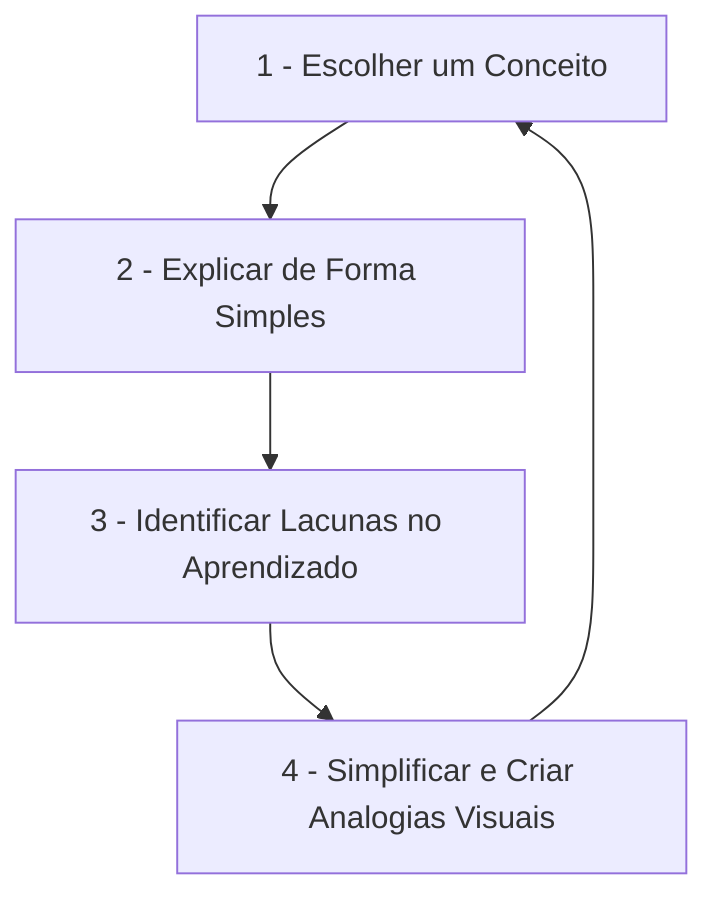

# Sobre mim e diretrizes do vault

> [!IMPORTANT] Instrução Obrigatória para Agentes de IA
> **ESTE ARQUIVO (me.md) É DE LEITURA OBRIGATÓRIA PARA TODOS OS AGENTES DE IA.**
> Antes de criar, modificar, mover arquivos ou interagir com este vault, leia e siga rigorosamente as diretrizes e regras definidas neste documento.

Bem-vindo ao meu repositório pessoal de estudos de programação. Este espaço foi projetado para consolidar meu aprendizado combinando minha perspectiva de **Designer** com o **Método Feynman** de aprendizado ativo.

---

## Diretrizes e regras do vault (instruções para agentes de ia)

Todas as interações, criações de arquivos e edições no vault devem obedecer às seguintes 7 regras:

1. **Registro de Histórico no `log.md` (Ordem Decrescente Obrigatória)**:
   * Toda criação, edição, movimentação ou exclusão de nota deve ser registrada imediatamente no arquivo `log.md` na raiz do vault.
   * As alterações mais recentes DEVEM ficar no topo da lista.

2. **Lint de Links Automatizado**:
   * Sempre rodar a verificação de integridade de links (linter) após criar, mover, renomear ou modificar arquivos no vault.
   * Garantir 0 links quebrados e 0 erros de sintaxe em tabelas.

3. **Capitalização Estrita em Português (Sentence Case)**:
   * Em TODOS os títulos de notas e cabeçalhos (`#`, `##`, `###`, `####`), apenas a primeira palavra deve ter a inicial maiúscula (ex: `## 1. Métodos de seleção e busca de elementos`).
   * Palavras subsequentes devem ser minúsculas, exceto se forem nomes próprios ou marcas de tecnologia (ex: `JavaScript`, `Python`, `React`, `Git`, `Figma`, `VS Code`, `Node.js`, `DOM`, `API`, `JSON`).

4. **Prevenção de Links Quebrados em Tabelas e Compatibilidade de WikiLinks**:
   * **Formato Geral Obrigatório**: Todos os WikiLinks devem incluir o caminho relativo da pasta e um rótulo de texto usando o pipe (ex: `[[pasta/subpasta/NomeDaNota|Nome da Nota]]`). Nunca use links diretos sem rótulo (ex: `[[pasta/subpasta/NomeDaNota]]`), pois o Obsidian exibirá o caminho bruto das pastas na visualização.
   * **Fora de Tabelas**: Use o pipe simples (`|`) para separar o caminho e o rótulo (ex: `[[javascript/01-fundamentos/01-Var, let e const|Var, Let e Const]]`).
   * **Dentro de Tabelas**: Use obrigatoriamente o pipe escapado (`\|`) para que o parser do Markdown não interprete o pipe do link como um separador de colunas (ex: `[[git/01-fundamentos/Git\|Git]]`).

5. **Método Feynman Obrigatório**:
   * Explicar conceitos técnicos através de analogias simples e intuitivas do mundo real (baseadas em design, Figma, vida cotidiana ou tecnologia acessível).
   * Incluir uma seção de `## Resumo para memorizar` ao final de cada nota de conceito.

6. **Interconexão de Links (Cross-linking)**:
   * Conectar ativamente conceitos relacionados usando o formato de wikilink do Obsidian (`[[caminho/Nota\|Rótulo]]` ou `[[caminho/Nota]]`).

7. **Proibição Absoluta de Emojis**:
   * Nenhum emoji deve ser adicionado aos arquivos do vault (títulos, tabelas ou texto), mantendo a estética minimalista e textual.

8. **Formatação de Listas (Evitar Marcadores Duplos e Quebras)**:
   * Evite iniciar linhas de lista diretamente com números sequenciais em fases avançadas (ex: `11.`, `15.`) sem uma linha em branco anterior. O parser de Markdown do Web App pode agrupar os itens em um único parágrafo corrido.
   * Para manter a formatação de lista com marcadores personalizados em diamante (`◆`) no Web App, use sempre a marcação de lista nativa (`* ` ou `- `).
   * Se quiser exibir números manuais na lista, use `* 11. [[Link]]`. Nunca use `* 11.` aninhado de forma a gerar sub-listas que criam marcadores duplos (`◆ ◆`) no CSS do app. Prefira listas limpas sem números (`* [[Link]]`) quando a contagem não for obrigatória.

---

## Perfil
* **Profissão:** Designer
* **Formação Acadêmica:**
  * Graduação em Comunicação (Publicidade)
  * Graduação em Design de Produto
  * MBA em Gestão de Negócios
  * Graduação em Análise e Desenvolvimento de Sistemas - ADS (Retomando os estudos)
* **Foco Atual:** Cursos práticos de programação e aprofundamento em desenvolvimento web (com foco em JavaScript, React e front-end).
* **Superpoder:** Pensamento visual e visão de negócios. Consigo conectar código, experiência do usuário (UX/UI) e visão estratégica de produto.

---

## O método Feynman de estudo
O método consiste em aprender explicando um conceito complexo da forma mais simples possível, como se estivesse ensinando para um leigo. 

Como vou aplicar isso nas minhas notas de programação:

> [!TIP] Dica de Renderização (Mermaid no Obsidian)
> Evite iniciar o texto de blocos do Mermaid com números seguidos de ponto (ex: `1.`), pois o parser do Obsidian tenta interpretá-los como listas de Markdown e retorna o erro `Unsupported markdown: list`. Prefira usar traços (ex: `1 -`).

1. **Escolha do tema:** Escolho um tópico de programação (ex: `var`, `let` e `const`).
2. **Explicação Simples (Para uma "criança"):** Escrevo a explicação usando termos comuns, evitando jargões técnicos exagerados.
3. **Correção de Lacunas:** Se eu não conseguir explicar de forma simples, significa que não entendi bem. Volto à documentação/estudos para preencher essa lacuna.
4. **Analogias de Design:** Traduzo os conceitos abstratos de código em analogias visuais baseadas no meu dia a dia de design (Figma, layouts, componentes).

---

## Preferências técnicas e estilo de código
* **Foco Atual Estratégico**: Dominar 100% o JavaScript puro (ES6+) primeiro, consolidando toda a linguagem base para depois revisar e aprofundar em React.
* **Estilo dos Exemplos**: Sempre fornecer exemplos práticos de verdade no formato de **mini-projetos reais de UI** (cards de produto, modais interativos, filtros dinâmicos, listas de tarefas, etc.).
* **Linguagem & Sintaxe**: JavaScript moderno (ES6+), priorizando `const`/`let`, Arrow Functions, desestruturação e Template Strings.
* **Front-end & UI**: React moderno com Hooks e ecossistema de UI (Tailwind CSS, Radix UI, Shadcn UI, Framer Motion).

---

## Minhas analogias (design, produto e negócios → programação)

Para me ajudar a fixar os conceitos, vou sempre associar termos técnicos a conceitos de design, produto e negócios que já domino:

* **Variáveis (`let`/`const`)** - *Estilos de texto/cor no Figma.* O valor pode mudar ou ser fixo, mas a referência é a mesma.
* **Objetos e Arrays** - *Componentes e Variantes.* Estruturas que agrupam propriedades específicas de um elemento.
* **Funções** - *Prototipagem Interativa / Actions.* Uma ação configurada que recebe um clique (input) e gera uma transição de tela (output).
* **DOM (Document Object Model)** - *A árvore de camadas (Layers Panel) do Figma.* Uma estrutura hierárquica onde um elemento fica dentro do outro.
* **CSS Flexbox/Grid** - *Auto Layout.* Regras de alinhamento, espaçamento e distribuição de elementos na tela.
* **Design System / Tokens** - *Variáveis CSS e Configurações de Tema.*
* **Regras de Negócio / MVP** - *Lógica de controle de fluxo (`if/else`), validações e módulos.*
* **Jornada do Usuário** - *Fluxo assíncrono (`Async/Await`) e tratamento de estados da aplicação.*

---

## Objetivos de aprendizagem
- [x] Consolidar a arquitetura e convenções do vault por pilares funcionais.
- [ ] Dominar a sintaxe e todos os conceitos avançados de JavaScript (ES6+).
- [ ] Construir mini-projetos práticos em JS aplicando manipulação de DOM e eventos.
- [ ] Revisar e dominar o ecossistema moderno do React e suas bibliotecas de UI.
