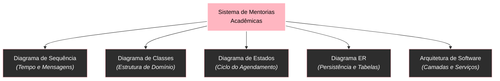

# Guia de estudos da trilha Mermaid

Este guia organiza a trilha completa de **Modelagem Visual com Mermaid**. O objetivo central não é apenas memorizar comandos ou sintaxe de flechas, mas desenvolver a capacidade de **modelar informação visualmente**, escolher o diagrama correto para cada problema e controlar a complexidade estrutural de sistemas de software e fluxos de negócio.

---

## 1. Por que aprender modelagem visual com Mermaid

Diagramar não é desenhar ilustrações soltas em uma prancheta livre: é **declarar uma estrutura lógica de informação**. 

Quando você escreve um diagrama em formato de código (*Diagrams as Code*), a posição visual dos elementos é uma consequência direta das relações, direções e hierarquias declaradas. Dominar Mermaid significa aprender a pensar em grafos, fluxos, trocas de mensagens e ciclos de vida antes de escrever a primeira linha de sintaxe.

---

## 2. Mapa da trilha de estudos

A trilha está organizada em três blocos progressivos:

### Bloco 1: Fundamentos de modelagem e topologia visual
* [[mermaid/01-Mermaid como linguagem de modelagem visual|01 - Mermaid como linguagem de modelagem visual]]
* [[mermaid/02-Flowcharts e fundamentos de grafos|02 - Flowcharts e fundamentos de grafos]]
* [[mermaid/03-Direção, hierarquia e organização espacial|03 - Direção, hierarquia e organização espacial]]
* [[mermaid/04-Nós, relações, subgraphs e semântica visual|04 - Nós, relações, subgraphs e semântica visual]]
* [[mermaid/05-Como escolher o tipo de diagrama|05 - Como escolher o tipo de diagrama]]

### Bloco 2: Modelagem de software na prática (sistema unificado)
* [[mermaid/06-Diagramas de sequência|06 - Diagramas de sequência]]
* [[mermaid/07-Diagramas de classes e UML com Mermaid|07 - Diagramas de classes e UML com Mermaid]]
* [[mermaid/08-Diagramas de estado|08 - Diagramas de estado]]
* [[mermaid/09-ER e modelagem de dados|09 - ER e modelagem de dados]]
* [[mermaid/10-Arquitetura de software com Mermaid|10 - Arquitetura de software com Mermaid]]

### Bloco 3: Engenharia visual avançada e automação
* [[mermaid/11-Controle de complexidade em diagramas grandes|11 - Controle de complexidade em diagramas grandes]]
* [[mermaid/12-Padrões, antipadrões e refatoração de diagramas|12 - Padrões, antipadrões e refatoração de diagramas]]
* [[mermaid/13-Mermaid dinâmico com JavaScript|13 - Mermaid dinâmico com JavaScript]]

---

## 3. O sistema prático unificado da trilha

Para demonstrar como diferentes diagramas revelam facetas distintas de um mesmo problema de engenharia, os artigos do Bloco 2 utilizam um sistema de exemplo contínuo: a **Plataforma de Mentorias Acadêmicas**.

* **Sequência**: O processo de match e confirmação entre Aluno, API, Mentor e Notificações.
* **Classes**: A modelagem de entidades orientadas a objetos (`Aluno`, `Mentor`, `Agendamento`, `Feedback`).
* **Estados**: O ciclo de vida da solicitação (`Pendente` $\rightarrow$ `Confirmado` $\rightarrow$ `Realizado`).
* **ER**: A estrutura de banco de dados relacional (chaves primárias, estrangeiras e cardinalidades).
* **Arquitetura**: A infraestrutura conectando cliente web, API de aplicação e bancos de dados.

---

## 4. Resumo para memorizar

* Mermaid é uma ferramenta de **modelagem declarativa de grafos**, não uma ferramenta de desenho manual livre.
* A qualidade de um diagrama depende da clareza da pergunta que ele se propõe a responder.
* O controle de direção, hierarquia e densidade de arestas evita layouts confusos ou excessivamente esticados.
