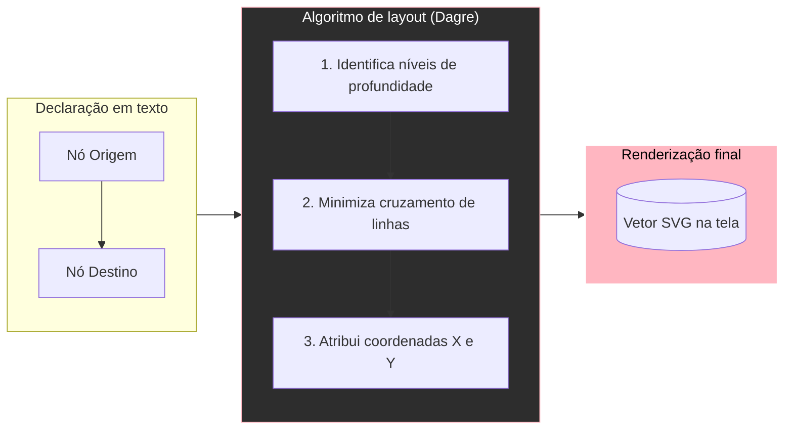
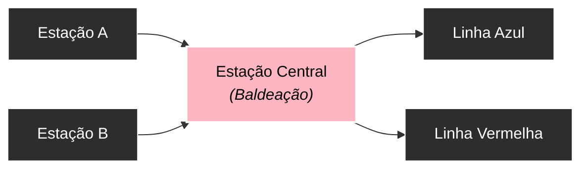
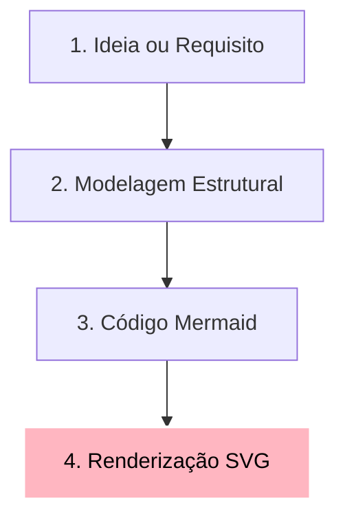

# Mermaid como linguagem de modelagem visual

Muitas pessoas iniciam os estudos de Mermaid acreditando que se trata de uma ferramenta para "desenhar caixinhas e setas" diretamente em arquivos Markdown. Essa premissa quase sempre gera frustração: o autor tenta forçar um elemento a ficar exatamente dois centímetros à direita de outro e descobre que o diagrama se recusa a obedecer.

Mermaid não é uma ferramenta de desenho vetorial livre (como Figma, Illustrator ou Miro). Mermaid é uma ferramenta de **Diagrams as Code** (Diagramas como Código) baseada em declaração de estruturas.

---

## 1. Declarativo versus imperativo: o motor de layout

Para compreender o Mermaid, vale fazer uma analogia direta com a evolução do design de interfaces e das linguagens de programação:

* **Desenho livre (Figma / Canvas absoluto)**: Você pega uma caixa, clica, arrasta e solta nas coordenadas `X: 420px, Y: 180px`. Você tem controle manual total de cada pixel, mas qualquer elemento inserido antes exige reposicionar manualmente todos os outros.
* **Auto layout / CSS Flexbox**: Você não declara coordenadas absolutas; você declara **regras de relacionamento e fluxo** (`display: flex`, `flex-direction: column`, `gap: 16px`). O navegador calcula as posições exatas.
* **Mermaid (Grafos declarativos)**: Você declara **nós** (entidades) e **arestas** (conexões/fluxos). O motor de renderização interno (motores como Dagre, Elk ou D3) calcula a posição geométrica ideal através de algoritmos de distribuição de grafos.

### Código-fonte do diagrama
````markdown

````

### Visualização renderizada


Quando um diagrama fica com aspecto de "minhoca horizontal infinita" ou "arranha-céu vertical ilegível", o problema não é um defeito do motor: é a **estrutura de dependências** que foi declarada de forma excessivamente linear ou com arestas cruzadas demais.

---

## 2. A analogia do mapa de metrô

Imagine o mapa do metrô de Londres ou de São Paulo. Ele não representa a geografia física real com precisão milimétrica de curvas de ruas. O mapa do metrô é um **modelo visual topológico**:

1. Ele responde a uma pergunta clara: *"Qual linha pego e onde faço baldeação?"*
2. Ele simplifica a realidade para focar nas conexões e na ordem das estações.
3. As posições relativas importam, mas a distância exata em metros é ignorada.

### Código-fonte do diagrama
````markdown

````

### Visualização renderizada


O Mermaid funciona exatamente como esse mapa: ele existe para comunicar **relações, hierarquias, causalidades e estados**, sem se perder no micro-gerenciamento de posicionamento estético.

---

## 3. Benefícios de modelar visualmente com código

* **Versionamento com Git**: Diferenças entre arquiteturas aparecem linha por linha em um `git diff`, permitindo code review de decisões visuais.
* **Manutenibilidade contínua**: Renomear um serviço ou adicionar uma etapa intermediária requer editar uma única linha, sem precisar rearranjar manualmente dezenas de caixas.
* **Padronização estética**: Todo o time segue o mesmo padrão visual, sem inconsistências de fontes, tamanhos ou cores arbitrárias.
* **Proximidade com a base de código**: Diagramas residem no mesmo repositório do projeto, reduzindo a defasagem entre a documentação e o código real.

---

## 4. Estrutura básica de declaração

Todo diagrama Mermaid é composto por três partes essenciais:

1. **Diretiva de tipo**: Indica qual representação será utilizada (`flowchart`, `sequenceDiagram`, `classDiagram`, etc.).
2. **Declaração de entidades**: Identificadores únicos com seus rótulos visuais.
3. **Declaração de relações**: Operadores de conexão que definem o sentido e o significado do fluxo.

### Código-fonte do diagrama
````markdown

````

### Visualização renderizada


---

## 5. Resumo para memorizar

* Mermaid é uma linguagem declarativa de grafos, e não uma prancheta de desenho livre.
* Você declara quem são os elementos e como se relacionam; o motor calcula o layout ideal.
* Diagramas eficientes comunicam conexões e causalidades, priorizando a clareza sobre o controle milimétrico de coordenadas.
