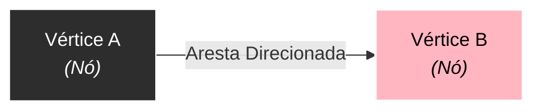
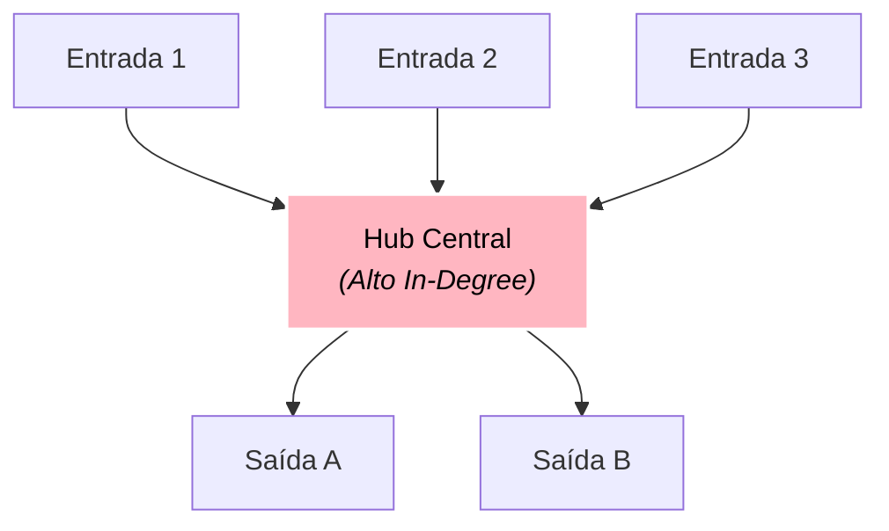
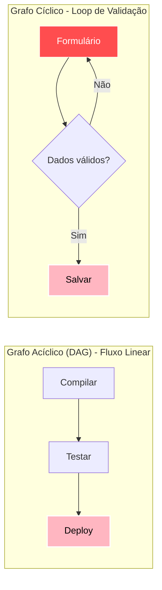
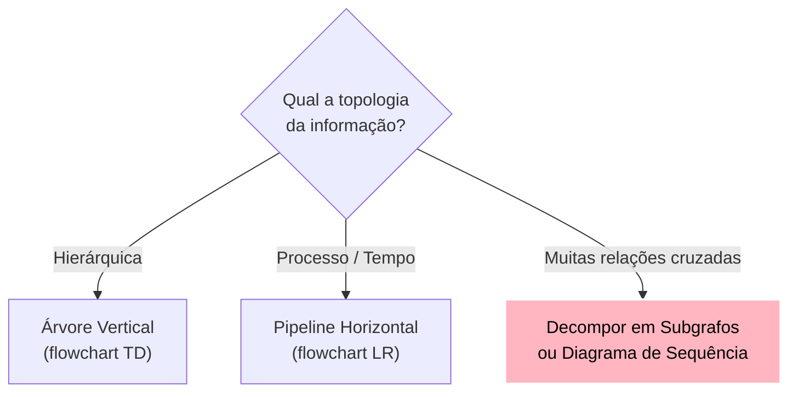

# Flowcharts e fundamentos de grafos

Antes de escrever qualquer fluxograma (`flowchart`), é fundamental compreender o conceito que sustenta toda essa representação: a **teoria dos grafos**. Não se trata de matemática avançada ou fórmulas complexas, mas de entender a estrutura que organiza nós e relações.

---

## 1. O que é um grafo no contexto de modelagem

Um grafo é uma coleção de **vértices (nós)** conectados por **arestas (ligações)**.

### Código-fonte do diagrama
````markdown

````

### Visualização renderizada


* **Vértice / Nó**: Representa uma entidade, tela, função, etapa de processamento ou estado.
* **Aresta / Conexão**: Representa a transição, dependência, chamada de método ou fluxo de dados entre dois nós.
* **Direcionalidade**: As arestas podem ser direcionadas (possuem sentido definido por setas `-->`) ou não direcionadas (ligação simples `---`).

---

## 2. Conceitos essenciais de grafos aplicados a diagramas

### 2.1. Grau de um nó (grau de entrada e de saída)
O grau de um nó indica quantas conexões chegam ou saem dele:
* **Grau de entrada (*In-degree*)**: Quantas arestas chegam ao nó. Um nó com alto grau de entrada costuma ser um ponto de convergência, gargalo ou serviço centralizado.
* **Grau de saída (*Out-degree*)**: Quantas arestas partem do nó. Um nó com alto grau de saída representa uma decisão com múltiplos caminhos (*switch/case*) ou um despachante de eventos (*Event Bus*).

### Código-fonte do diagrama
````markdown

````

### Visualização renderizada


### 2.2. Caminhos, ciclos e DAG (Grafo Direcionado Acíclico)
* **Caminho**: Sequência contínua de arestas que conecta um nó de origem a um nó de destino.
* **Ciclo**: Quando um caminho permite sair de um nó e retornar a ele mesmo (ex: loops de retry, validações que exigem nova digitação).
* **DAG (*Directed Acyclic Graph*)**: Um grafo direcionado que **não possui ciclos**. É a estrutura ideal para pipelines de build, compilação de código, resolução de dependências e etapas sequenciais de onboarding.

### Código-fonte do diagrama
````markdown

````

### Visualização renderizada


### 2.3. Densidade de arestas e o problema do espaguete
A **densidade** mede a proporção de arestas existentes em relação ao número máximo possível de conexões entre os nós.
* **Baixa densidade**: Nós organizados em árvore ou cadeia simples. Layout limpo e previsível.
* **Alta densidade**: Quase todos os nós conversam com todos os outros. Em Mermaid, alta densidade resulta em linhas se cruzando por cima de nós (*edge crossing*), tornando a visualização confusa.

---

## 3. Como a estrutura do problema dita o diagrama

Ao analisar um requisito antes de diagramar, faça três perguntas:

1. **Existe uma ordem temporal estrita?** Se sim, pense em uma cadeia ou DAG horizontal (`flowchart LR`).
2. **Existe uma hierarquia de subordinação ou composição?** Se sim, pense em uma árvore vertical (`flowchart TD`).
3. **Existem muitas relações cruzadas entre módulos distantes?** Se sim, evite um flowchart monolítico; decomponha em subgrafos ou use outro tipo de diagrama (como sequência ou arquitetura em blocos).

### Código-fonte do diagrama
````markdown

````

### Visualização renderizada


---

## 4. Resumo para memorizar

* Todo fluxograma é um grafo composto por nós (vértices) e conexões (arestas).
* Nós com alto grau de entrada/saída são pontos críticos de controle e tomada de decisão.
* Grafos acíclicos (DAGs) geram layouts estáveis; grafos com alta densidade de relações cruzadas exigem modularização para não virarem diagramas espaguete.
