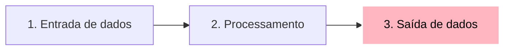
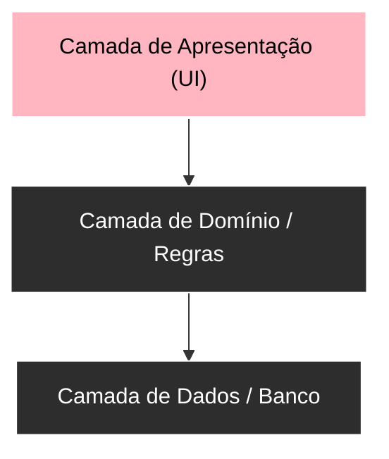
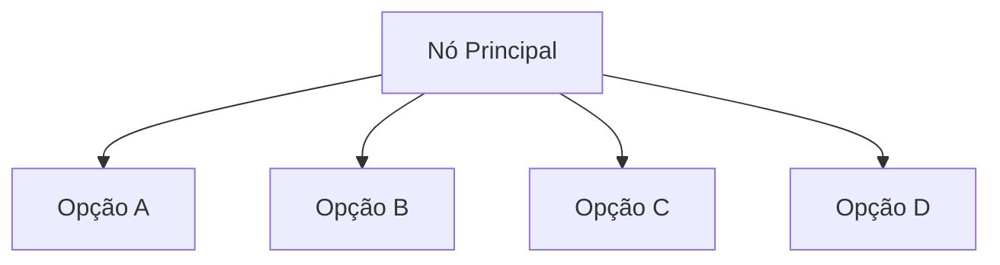
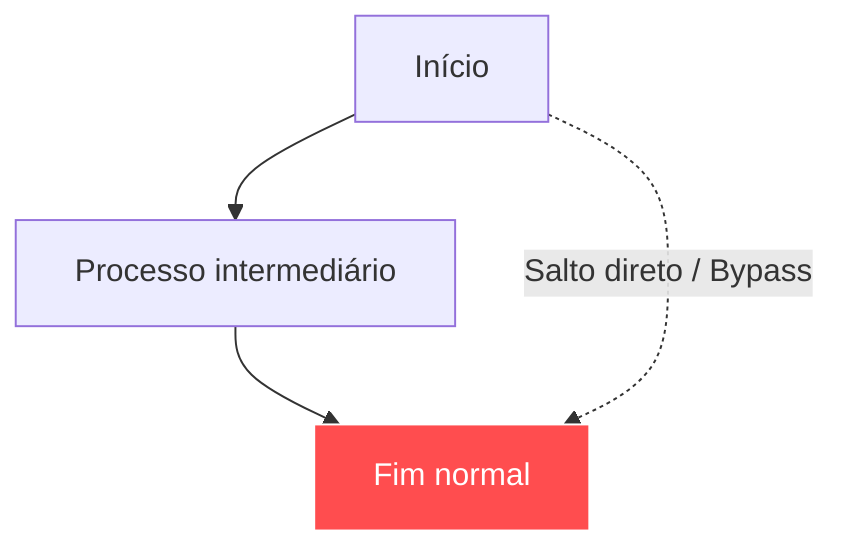

# Direção, hierarquia e organização espacial

A escolha da direção em um diagrama Mermaid não é uma preferência estética arbitrária: é uma **decisão de arquitetura da informação**. A orientação do fluxo determina como os olhos do leitor percorrem o documento e como o motor de renderização calcula larguras, alturas e quebras de linha.

---

## 1. As quatro direções fundamentais

| Código | Nome em inglês | Sentido visual | Melhor aplicação prática |
| :--- | :--- | :--- | :--- |
| `TD` ou `TB` | *Top to Bottom* | De cima para baixo | Hierarquias, árvores de decisão, layouts mobile-friendly |
| `LR` | *Left to Right* | Da esquerda para a direita | Processos temporais, jornadas de usuário, pipelines |
| `BT` | *Bottom to Top* | De baixo para cima | Pilhas de camadas (*layers* de infraestrutura, herança) |
| `RL` | *Right to Left* | Da direita para a esquerda | Fluxos reversos, devoluções, auditoria retrospectiva |

---

## 2. A semântica espacial: tempo horizontal versus hierarquia vertical

### 2.1. O eixo horizontal (tempo e causalidade)
Na cultura ocidental, lemos da esquerda para a direita. Por isso, a nossa percepção intuitiva associa a linha horizontal à **passagem do tempo e progressão de etapas**:

$$\text{Passado / Causa} \xrightarrow{\quad\text{Tempo}\quad} \text{Futuro / Efeito}$$

### Código-fonte do diagrama
````markdown

````

### Visualização renderizada


### 2.2. O eixo vertical (hierarquia, autoridade e profundidade)
O eixo vertical carrega uma conotação de **subordinação e camadas de abstração**:

$$\text{Alto nível (Interface / Abstração)} \Big\downarrow \text{Baixo nível (Implementação / Dados)}$$

### Código-fonte do diagrama
````markdown

````

### Visualização renderizada


---

## 3. O impacto dos nós na geometria do layout

O motor do Mermaid agrupa os nós em camadas (*ranks*). A forma como você conecta os nós impacta diretamente as dimensões da imagem:

### 3.1. Muitos nós irmãos aumentam a largura
Se um nó conecta diretamente a 10 nós paralelos em um fluxo `TD`, o diagrama ficará excessivamente largo, forçando rolagem horizontal desagradável em telas menores.

### Código-fonte do diagrama
````markdown

````

### Visualização renderizada


### 3.2. Cadeias profundas aumentam a altura
Se cada etapa conecta exclusivamente à próxima em `TD`, o diagrama vira uma tira fina e interminável vertical.

---

## 4. O perigo das conexões cruzadas (*Edge Crossing*)

Quando arestas conectam nós de níveis distantes passando por cima de outros nós, o motor precisa recalcular curvas para evitar sobreposição, gerando linhas sinuosas e difíceis de rastrear.

### Código-fonte do diagrama
````markdown

````

### Visualização renderizada


> [!TIP] Dica de Otimização Espacial
> Para evitar diagramas desproporcionais, combine subgrafos com direções internas (`direction TB` ou `direction LR`) e use quebras de linha manuais (`<br>`) nos rótulos dos nós para controlar a largura dos blocos.

---

## 5. Resumo para memorizar

* Use `LR` para processos lineares no tempo (jornadas, pipelines, etapas consecutivas).
* Use `TD` para hierarquias, taxonomia de pastas, árvores genealógicas de classes e camadas de software.
* Muitos nós filhos expandem a largura; longas sequências isoladas expandem o comprimento.
