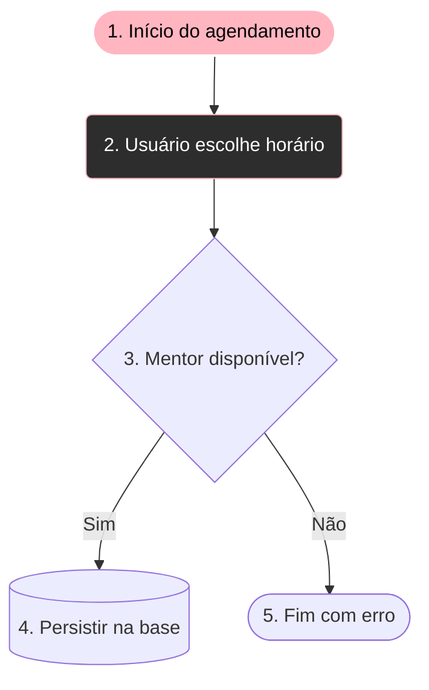
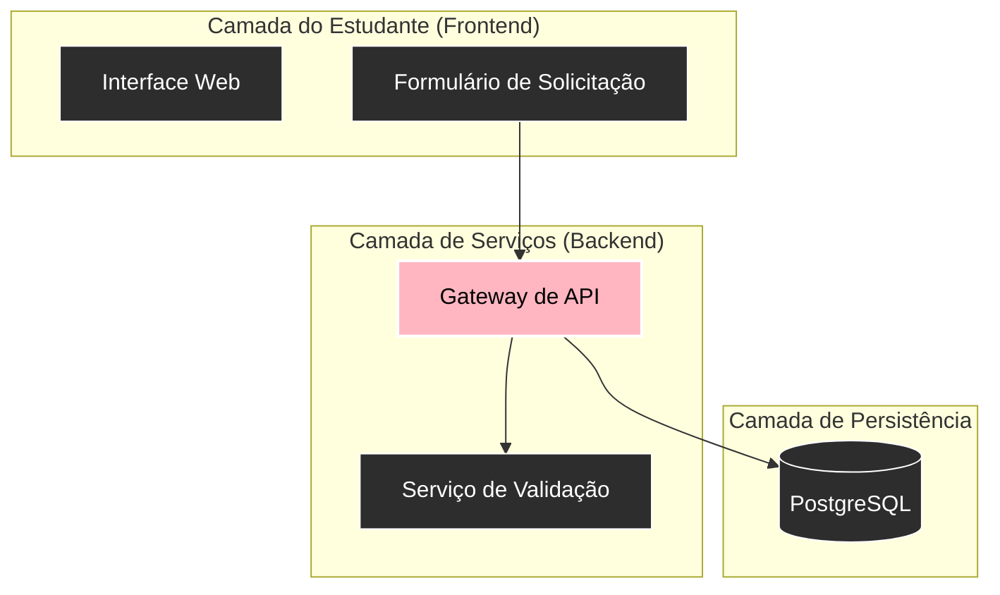
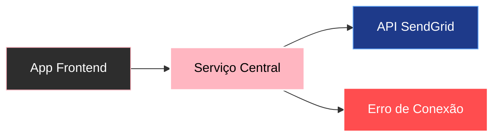

# Nós, relações, subgraphs e semântica visual

No design de interface, você nunca usa a mesma cor e tamanho de tipografia para um botão primário, um alerta de erro e um texto de rodapé. Da mesma forma, na modelagem visual com Mermaid, cada formato geométrico, tipo de conector e estilo carrega um **significado semântico imediato**.

---

## 1. O vocabulário geométrico dos nós

Os delimitadores que você utiliza ao declarar um nó no código determinam sua representação física:

| Geometria | Sintaxe | Significado semântico | Analogia de interface |
| :--- | :--- | :--- | :--- |
| Retângulo padrão | `id["Texto"]` | Processamento ou etapa genérica | Card neutro / Container |
| Cantos arredondados | `id("Texto")` | Ação do usuário ou clique | Botão primário / Ação |
| Estádio / Pílula | `id(["Texto"])` | Início ou fim de um ciclo de fluxo | Tag de status / Pílula |
| Losango (Decisão) | `id{"Texto"}` | Bifurcação lógica (`if/else`, switch) | Modal de confirmação |
| Cilindro | `id[("Texto")]` | Banco de dados ou armazenamento persistente | LocalStorage / Banco |
| Sub-rotina | `id[["Texto"]]` | Função isolada, microsserviço ou API externa | Componente reutilizável |
| Hexágono | `id{{"Texto"}}` | Inicialização ou preparação | Hook de montagem (`useEffect`) |

---

## 2. Tipos de conectores e sua semântica

A forma como dois nós são interligados comunica a natureza da dependência:

* `A --> B`: Fluxo síncrono e direto (obrigatório).
* `A -.-> B`: Notificação assíncrona, disparo de evento ou dependência opcional.
* `A ==> B`: Caminho principal / caminho feliz (*happy path*).
* `A -- Rótulo --> B` ou `A -->|Rótulo| B`: Transição anotada com condição ou payload.

---

## 3. Subgrafos (`subgraph`): criando fronteiras de arquitetura

Um `subgraph` funciona exatamente como um **Frame ou Grupo no Figma**: ele cria uma fronteira visual que agrupa elementos com o mesmo domínio de responsabilidade.

---

## 4. O sistema semântico global de classes de estilo

Para manter a consistência visual em todo o repositório e na renderização do leitor web, adote a seguinte convenção semântica:

* `:::core`: Conceito central, nó principal ou estado de sucesso.
* `:::component`: Módulo de software, serviço ou componente operacional.
* `:::data`: Entidade de banco de dados, JSON, payload ou estrutura de dados.
* `:::warning`: Exceção, erro, ponto de atenção ou caminho de falha.
* `:::external`: Sistema terceiro, API externa ou fronteira fora do escopo.

---

## 5. Resumo para memorizar

* Geometrias diferentes comunicam funções distintas: pílulas para limites, losangos para decisões e cilindros para persistência.
* Subgrafos definem fronteiras de contexto e camadas arquiteturais.
* O uso consistente de classes semânticas (`:::core`, `:::component`, `:::warning`) acelera a compreensão visual imediata do diagrama.
